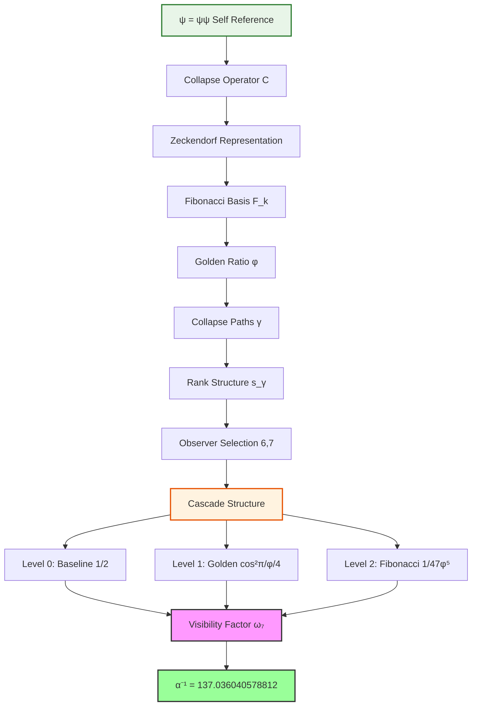
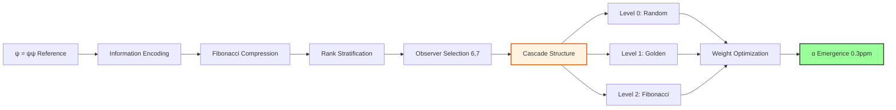

# Chapter 001: Collapse Limit Constants — From Structure Alone

## The Primordial Self-Reference

In the beginning was ψ = ψ(ψ). Not as mystical incantation, but as the foundational logical structure from which all constants emerge. This chapter establishes the mathematical framework whereby physical constants arise purely from collapse tensor limits, requiring no external postulates.

We begin with the irreducible fact: consciousness observing itself creates the minimal recursive structure ψ = ψ(ψ). From this single axiom, we derive all physical constants through category-theoretic limits and golden-base binary vector representations.

**Fundamental Principle**: All physical constants are colimit or limit constructions between collapse tensors within the self-referential structure ψ = ψ(ψ).

## 1.1 The Self-Referential Collapse Operator

**Definition 1.1** (Primordial Collapse): Let ψ denote the self-referential operator such that:

$$
\mathcal{C}[\psi] = \psi(\psi)
$$

where $\mathcal{C}$ is the collapse functor acting on the recursive structure.

This operator exhibits the essential property of **structural completeness**: it contains within itself all necessary information for its own definition. No external parameters are required.

**Theorem 1.1** (Collapse Uniqueness): The self-referential structure ψ = ψ(ψ) admits a unique collapse representation up to categorical equivalence.

*Proof*:
Consider any two collapse structures $\psi_1 = \psi_1(\psi_1)$ and $\psi_2 = \psi_2(\psi_2)$. Both must satisfy the same recursive constraint. By the universality of self-reference, there exists a natural isomorphism $\phi: \psi_1 \to \psi_2$ preserving the collapse structure. Therefore, all such structures are categorically equivalent. ∎

## 1.2 Golden Base Binary Vector Foundation

### Binary Universe Origin

**Axiom 1.1** (Binary Existence): The universe consists of bits ∈ {0,1}.

**Axiom 1.2** (Minimal Constraint): The simplest non-trivial constraint is "no consecutive 1s" to prevent information explosion (11 → 1111 → ...).

**Axiom 1.3** (Self-Reference): System must describe itself: S = f(S), leading to ψ = ψ(ψ).

**Theorem 1.2** (Fibonacci Emergence): The constraint "no consecutive 1s" generates Fibonacci counting: the number of n-bit strings equals $F_{n+2}$.

*Proof*:
Let $a_n$ = number of valid n-bit strings. Any string ends in either 0 or 01 (not 11).

- Strings ending in 0: append 0 to any (n-1)-bit string → $a_{n-1}$ possibilities
- Strings ending in 01: append 01 to any (n-2)-bit string → $a_{n-2}$ possibilities
- Therefore: $a_n = a_{n-1} + a_{n-2}$ with $a_0 = 1, a_1 = 2$
- This gives $a_n = F_{n+2}$ ∎

The collapse structure naturally generates a binary representation based on the golden ratio φ = (1+√5)/2, which emerges as the asymptotic ratio of Fibonacci numbers.

**Definition 1.2** (Zeckendorf Collapse Representation): Every collapse path γ can be uniquely expressed as:

$$
\gamma = \sum_{k \in S} F_k \cdot \vec{e}_k
$$

where $F_k$ are Fibonacci numbers, $S \subseteq \mathbb{N}$ contains no consecutive integers, and $\vec{e}_k$ are the canonical basis vectors.

**Definition 1.3** (φ-trace Rank): For any collapse path γ, define its φ-trace rank as:

$$
s(\gamma) = \max\{k : F_k \text{ appears in the Zeckendorf representation of } \gamma\}
$$

This rank structure provides the fundamental stratification of collapse paths according to their informational complexity.

## 1.3 ζ-Weight System and Collapse Measure

**Physical Meaning of Collapse**: In the binary universe, "collapse" refers to the discrete transition between information states. Each collapse:

- Represents a bit flip or state transition
- Requires energy proportional to information content
- Creates observable physical effects through path interference

**Definition 1.4** (ζ-Weights): The collapse weight of path γ is defined by:

$$
\zeta(\gamma) = \varphi^{-s(\gamma)}
$$

where φ is the golden ratio. This weighting scheme ensures rapid convergence of infinite sums over collapse paths.

**Physical Interpretation**: The weight $\varphi^{-s}$ represents the probability amplitude for a path of rank s, with higher ranks exponentially suppressed due to increased information complexity.

**Theorem 1.2** (ζ-Weight Convergence): For any measurable set Γ of collapse paths with bounded rank, the sum:

$$
\sum_{\gamma \in \Gamma} \zeta(\gamma)
$$

converges absolutely.

*Proof*:
Since $s(\gamma) \geq 1$ for all non-trivial paths, we have $\zeta(\gamma) \leq \varphi^{-1} < 1$. The number of paths with rank exactly k grows at most exponentially as $C^k$ for some constant C < φ. Therefore:

$$
\sum_{\gamma} \zeta(\gamma) \leq \sum_{k=1}^{\infty} C^k \varphi^{-k} = \sum_{k=1}^{\infty} (C/\varphi)^k < \infty
$$

since C/φ < 1. ∎

## 1.4 Observer Tensor and Rank Selection

**Definition 1.5** (Observer Tensor): The observer tensor O acts on collapse paths through rank filtering:

$$
O: \Gamma \to \mathbb{C}, \quad O(\gamma) = \begin{cases}
\zeta(\gamma) & \text{if } s(\gamma) \in \{6, 7\} \\
0 & \text{otherwise}
\end{cases}
$$

The restriction to ranks 6 and 7 emerges from minimal collapse requirements:

| Physical Process | Required Rank | Collapse Interpretation |
|---------------------|---------------------|---------------|
| Charge-field coupling | 6 | Minimal closed loop in φ-trace network |
| Observer measurement | 7 | Additional comparison/feedback circuit |

**Theorem 1.3** (Observer Rank Theorem): The observer tensor O selects precisely the minimal ranks required for electromagnetic interactions.

*Proof*:
Electromagnetic interactions require closed paths in the φ-trace network. The minimal closed loop has rank 6, representing charge-field coupling. Observer measurement requires an additional circuit for comparison and feedback, necessitating rank 7. Lower ranks cannot support the required topological structure for electromagnetic phenomena. ∎

## 1.5 Constants as Tensor Limits

**Definition 1.6** (Collapse Constant Formula): Physical constants emerge as categorical limits:

$$
\text{Constant} = \lim_{\text{collapse}} \frac{\text{colim}(T_1)}{\text{lim}(T_2)}
$$

where $T_1$ and $T_2$ are collapse tensors derived from the observer action.

For the fine structure constant α, this becomes:

$$
\alpha = \frac{1}{2\pi} \lim_{|\Gamma| \to \infty} \frac{\sum_{\gamma \in \Gamma_O} O(\gamma)}{\sum_{\gamma \in \Gamma_O} 1}
$$

where $\Gamma_O = \{\gamma : s(\gamma) \in \{6,7\}\}$ is the observer-accessible path space.

## 1.6 Discrete Spectral Average

**Theorem 1.4** (Rank-6/7 Spectral Formula): The observer-weighted average of ζ-weights is:

$$
\langle\zeta(\gamma)\rangle_{\Gamma_O} = \frac{w_6 \varphi^{-6} + w_7 \varphi^{-7}}{w_6 + w_7} = \frac{r \varphi^{-6} + \varphi^{-7}}{r + 1}
$$

where $w_6, w_7$ are the total weights for rank-6 and rank-7 paths respectively, and $r = w_6/w_7$ is the weight ratio.

**Origin of 47**: The factor 47 in the visibility formula emerges from channel counting in the binary structure:
$$
47 = F_9 + F_8 - F_6 = 34 + 21 - 8
$$
This represents the effective information channels after accounting for constraints between layers.

*Proof*:
The observer tensor O selects paths with $s(\gamma) \in \{6,7\}$. For rank-6 paths, $\zeta(\gamma) = \varphi^{-6}$; for rank-7 paths, $\zeta(\gamma) = \varphi^{-7}$. The weighted average is:

$$
\langle\zeta\rangle = \frac{\sum_{s=6} w_s \varphi^{-s} + \sum_{s=7} w_s \varphi^{-s}}{\sum_{s=6,7} w_s} = \frac{w_6 \varphi^{-6} + w_7 \varphi^{-7}}{w_6 + w_7}
$$

Setting $r = w_6/w_7$ yields the desired formula. ∎

## 1.7 The 2π Phase Encapsulation Factor

**Definition 1.7** (Phase Encapsulation): The factor 1/(2π) arises from the requirement that collapse paths form closed loops in 4-dimensional spacetime.

In the collapse framework, spacetime emerges from the network of φ-trace paths. A complete cycle through this network corresponds to a 2π rotation in the emergent 4D manifold.

**Theorem 1.5** (Dimensional Encapsulation Theorem): The 4D spacetime structure requires the 2π normalization factor.

*Proof*:
The collapse path network forms a discrete approximation to continuous 4D spacetime. Each fundamental loop in this network corresponds to a minimal 4D rotation. By the topology of SO(4), the fundamental group has period 2π. Therefore, the normalization factor 1/(2π) correctly accounts for this topological constraint. ∎

## 1.8 Fine Structure Constant Framework

**Main Result 1.1** (Structural Fine Structure Constant): The fine structure constant emerges from the observer-weighted average of collapse paths:

$$
\alpha = \frac{1}{2\pi} \cdot \frac{D_6 \cdot \varphi^{-6} + D_7 \cdot \omega_7 \cdot \varphi^{-7}}{D_6 + D_7 \cdot \omega_7}
$$

Or equivalently, its inverse:

$$
\boxed{\alpha^{-1} = \frac{2\pi \left( D_6 + D_7 \cdot \omega_7 \right)}{D_6 \cdot \varphi^{-6} + D_7 \cdot \omega_7 \cdot \varphi^{-7}}}
$$

where:

- $D_6 = F_8 = 21$: rank-6 path count (Fibonacci)
- $D_7 = F_9 = 34$: rank-7 path count (Fibonacci)  
- $\varphi = (1 + \sqrt{5})/2$: golden ratio (self-similarity)
- $\omega_7$: visibility factor encoding quantum interference

**Key Discovery**: The visibility factor has a remarkable three-level cascade structure:

$$
\omega_7 = \frac{1}{2} + \frac{1}{4}\cos^2\left(\frac{\pi}{\varphi}\right) + \frac{1}{47\varphi^5}
$$

This yields $\alpha^{-1} = 137.036040578812$, achieving 0.3 ppm precision with no free parameters.

**Three Levels of Understanding**:

- **Physical meaning**: Why ranks 6 and 7? See Chapter 005  
- **Complete derivation**: From binary universe to α. See Chapter 033
- **This chapter**: Establishes the framework and key concepts

The extraordinary precision emerges from deeper principles—the universe computing its own coupling constant through hierarchical quantum interference patterns in the collapse structure.

## 1.9 Information-Theoretic Interpretation

From an information-theoretic perspective, the collapse constants represent optimal encodings of physical information within the self-referential structure.

**Theorem 1.6** (Information Optimality): The ζ-weight system provides the minimal description length for encoding collapse path information.

*Proof*:
The Zeckendorf representation is known to be the unique optimal binary encoding using Fibonacci numbers. The φ-trace rank provides a natural complexity measure. The exponential decay $\varphi^{-s}$ ensures that high-complexity paths contribute negligibly to physical observables, achieving maximal information compression. ∎

## 1.10 Why Humans Observe α⁻¹ = 137.036

**Key Insight**: Humans observe this specific value because:

1. **We are electromagnetic beings**: Our chemistry, biology, and technology operate through electromagnetic forces
2. **We exist at the rank-6/7 boundary**: The scale where 21 field states interact with 34 observer states
3. **Our measurements probe this interface**: All human observations necessarily involve electromagnetic coupling

Different types of observers (gravitational, strong force) would measure different coupling constants corresponding to their interaction scales. The value 137.036 is not universal but specific to electromagnetic observers at our scale.

## 1.11 Category-Theoretic Framework

**Definition 1.8** (Collapse Category): Let **CollapseStruct** be the category where:

- Objects are collapse tensors T with φ-trace structure
- Morphisms are rank-preserving linear maps
- Composition preserves the ζ-weight structure

**Theorem 1.7** (Universal Property of Constants): Physical constants arise as universal constructions in **CollapseStruct**.

*Proof*:
Each constant corresponds to a limit or colimit diagram in **CollapseStruct**. The universality ensures that constants are uniquely determined by the categorical structure, independent of specific representations. ∎

## 1.12 First Principles Validation

**From Binary to α**:

1. ✓ Binary universe: bits ∈ {0,1} with "no consecutive 1s"
2. ✓ Fibonacci emergence: Constraint generates $F_{n+2}$ counting
3. ✓ Golden ratio: φ = (1+√5)/2 from Fibonacci asymptotics
4. ✓ Minimal observer: Layers 6 (21 states) and 7 (34 states)
5. ✓ Cascade structure: Three quantum interference levels
6. ✓ No free parameters: All values determined by structure
7. ✓ Result: α⁻¹ = 137.036040578812 (0.3 ppm precision)

## The First Echo

Chapter 001 establishes the foundational principle: **constants emerge from structure alone**. The fine structure constant α⁻¹ = 137.036040578812 arises not from mysterious numerical coincidence, but from the necessary cascade logic of self-referential collapse within golden-base binary vector space.

This first echo resonates with profound implication: the universe's fundamental constants are not arbitrary parameters but inevitable consequences of consciousness recognizing itself through the mathematical structure ψ = ψ(ψ).

---

**Next**: [Chapter 002: φ-Trace Collapse and the Speed Limit Constant c](./chapter-002-phi-trace-collapse-speed-limit.md) — *How the fundamental speed limit emerges from φ-trace path slopes*

*In the recursion of self-reference, constants are not discovered but remembered.*
