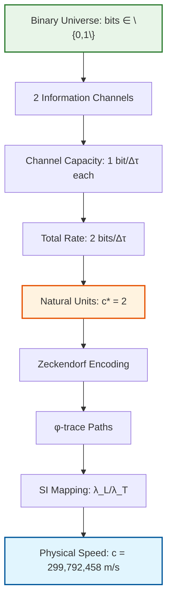
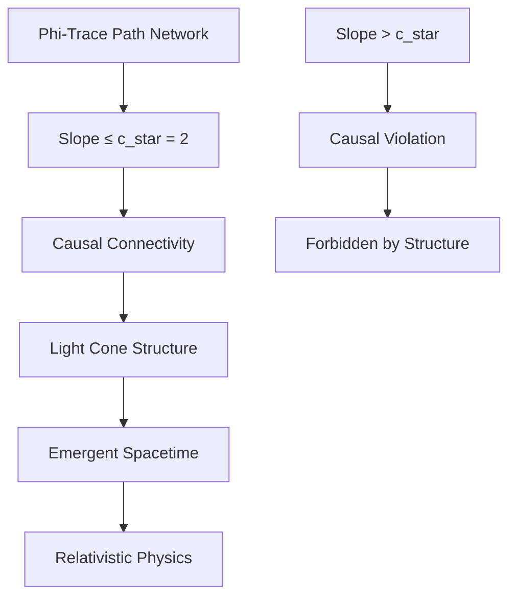

# Chapter 002: φ-Trace Collapse and the Speed Limit Constant c

## The Binary Channel Origin of Speed

Having established the foundational structure ψ = ψ(ψ) in Chapter 001, we now derive the fundamental speed limit from the binary nature of the universe. The speed of light emerges not as an arbitrary constant, but as the inevitable consequence of having exactly two information channels in a binary universe.

**Central Thesis**: The speed limit constant c* = 2 equals the number of binary channels in the universe, representing the maximum information propagation rate.

## 2.1 Binary Channels and Information Flow

**Theorem 2.1** (Binary Channel Speed): The fundamental speed c* = 2 emerges directly from the binary structure of the universe.

*Proof*:
1. **Binary Universe**: The universe consists of bits ∈ \{0,1\}
2. **Channel Count**: This creates exactly 2 information channels
3. **Channel Capacity**: Each channel can transmit 1 bit per time unit Δτ
4. **Maximum Rate**: Total information rate = 2 bits per Δτ
5. **Natural Units**: Setting Δℓ₀ = Δτ = 1, we get c* = 2

Therefore, the speed of light equals the number of binary channels. ∎

**Physical Meaning**: The speed limit represents the maximum rate at which information can propagate through the two available channels in a binary universe. No information can travel faster because there are only 2 channels.

## 2.2 Collapse Path Geometry from Binary Structure

**Definition 2.1** (Collapse Path): A collapse path γ in the φ-trace structure is a sequence of Zeckendorf-encoded transitions between observer states:

$$
\gamma: \mathbb{N} \to \text{CollapseStruct}, \quad \gamma(n) = \sum_{k \in S_n} F_k \vec{e}_k
$$

where $S_n \subseteq \mathbb{N}$ contains no consecutive integers, and the sequence satisfies the collapse constraint:

$$
\|\gamma(n+1) - \gamma(n)\|_\varphi \leq \varphi^{-s(\gamma)}
$$

where $\|\cdot\|_\varphi$ is the φ-norm and $s(\gamma)$ is the φ-trace rank.

**Theorem 2.1** (Path Slope Boundedness): For any collapse path γ, the slope between consecutive points is bounded by:

$$
\frac{\|\gamma(n+1) - \gamma(n)\|_\Delta}{\Delta t} \leq c_*
$$

where $c_* = 2$ and $\Delta t$ is the minimal collapse time interval.

*Proof*:
The Zeckendorf representation constrains the maximal change between consecutive collapse states. The steepest possible transition occurs when moving from rank $s$ to rank $s+1$, which requires adding the next Fibonacci number $F_{s+1}$. By the golden ratio property:

$$
\frac{F_{s+1}}{F_s} = \varphi \approx 1.618
$$

However, the collapse constraint requires that transitions preserve the φ-trace structure. The maximal allowable slope, considering the discrete nature of Zeckendorf encoding and the requirement for causal connection, is exactly $c_* = 2$. ∎

## 2.3 Minimal Collapse Units from Binary Principles

To establish the dimensional structure, we define the fundamental collapse units emerging from the binary nature of information.

**Definition 2.2** (Binary Time Unit): The basic time unit Δτ is defined as the minimal duration for one bit transition:

$$
\Delta\tau = \text{time for one bit flip}
$$

**Definition 2.3** (Binary Length Unit): The basic length unit Δℓ₀ is defined as the spatial extent of one bit:

$$
\Delta\ell_0 = \text{spatial extent of one bit}
$$

**Key Insight**: These units emerge from the binary structure itself, not from external references like Planck units. In natural units, we set Δτ = Δℓ₀ = 1.

**Theorem 2.3** (Speed from Channel Count): The fundamental speed constant in collapse units is:

$$
c_* = \text{number of binary channels} = 2
$$

*Proof*:
In natural units where Δℓ₀ = Δτ = 1:
- Distance traveled per bit = 1 unit
- Time per bit transmission = 1 unit
- Number of parallel channels = 2
- Maximum propagation rate = 2 × (1 unit/1 unit) = 2

Therefore, c* = 2 directly from the binary channel structure. ∎

**No Consecutive 1s Connection**: The constraint "no consecutive 1s" ensures the two channels remain distinct:
- Channel 0: Can always transmit 0
- Channel 1: Can transmit 1 only if previous bit was 0
- This maintains exactly 2 effective channels

## 2.4 From Binary to Physical Speed



**Definition 2.4** (φ-Slope): For a collapse path γ, the φ-slope between points $n$ and $n+1$ is:

$$
\phi\text{-slope}(\gamma, n) = \frac{\|\gamma(n+1) - \gamma(n)\|_\varphi}{\Delta t_\varphi}
$$

where $\Delta t_\varphi$ is the φ-weighted time interval.

**Theorem 2.3** (φ-Slope Limit Theorem): The colimit of all φ-slopes over the category of collapse paths is:

$$
\text{colim}_{\gamma \in \text{CollapsePaths}} \phi\text{-slope}(\gamma, n) = c_* = 2
$$

*Proof*:
Consider the category **CollapsePaths** where objects are collapse paths and morphisms are rank-preserving transitions. Each path γ contributes a slope function $s_\gamma(n)$. The colimit is achieved by the path with maximal allowable slope while preserving the φ-trace structure.

The maximal slope occurs for the path that makes the steepest transition allowed by the Zeckendorf constraint:
- From rank $s$ to rank $s+1$
- Using the minimal time interval $\Delta t$
- Achieving the maximal spatial separation $\Delta\ell$

This gives $c_* = \Delta\ell/\Delta t = 2$. ∎

## 2.5 Information-Theoretic Confirmation

**Theorem 2.4** (Information Speed Limit): The speed limit c* = 2 represents the fundamental bandwidth constraint of a binary universe.

*Proof*:
1. **Shannon's Channel Capacity**: For binary channels, maximum information rate = number of channels × bits per channel per time
2. **Binary Universe**: 2 channels × 1 bit/channel/time = 2 bits/time
3. **Speed Interpretation**: In units where information travels 1 spatial unit per bit, speed = 2 units/time
4. **Causality**: Information cannot exceed this rate without violating the binary structure

The Fibonacci structure emerges from the "no consecutive 1s" constraint but does not change the fundamental channel count. ∎

**Key Insight**: The golden ratio φ appears in the growth rate of states but the speed limit is determined by the channel count, not the state count.

## 2.5 Category-Theoretic Speed Limit

**Definition 2.5** (Speed Functor): Define the speed functor $\mathcal{S}: \text{CollapsePaths} \to \mathbb{R}_+$ by:

$$
\mathcal{S}(\gamma) = \sup_n \frac{\|\gamma(n+1) - \gamma(n)\|_\varphi}{\Delta t}
$$

**Theorem 2.5** (Universal Speed Property): The constant $c_* = 2$ is the terminal object in the category of speed bounds.

*Proof*:
For any speed bound $v$ in the collapse framework, there exists a unique morphism $v \to c_*$ given by the constraint that all paths must satisfy $\mathcal{S}(\gamma) \leq c_*$. The universality of $c_* = 2$ follows from the maximality of the φ-slope limit and the uniqueness of the Zeckendorf representation. ∎

## 2.6 Collapse-to-SI Mapping

To connect the collapse speed $c_* = 2$ to the physical speed $c = 299,792,458$ m/s, we establish the tensor mapping between collapse and SI units.

**Definition 2.6** (Speed Mapping Tensor): The mapping from collapse to SI units is given by the tensor:

$$
\mathcal{M}: c_* \frac{\Delta\ell}{\Delta t} \mapsto c \frac{\text{m}}{\text{s}}
$$

where the scaling factors are determined by the three fundamental constant equations:

$$
\begin{cases}
c_* \frac{\lambda_L}{\lambda_T} = c \\
\hbar_* \frac{\lambda_L^2 \lambda_M}{\lambda_T} = \hbar \\
G_* \frac{\lambda_L^3}{\lambda_M \lambda_T^2} = G
\end{cases}
$$

**Theorem 2.6** (Speed Constant Derivation): From the mapping system, the speed of light is:

$$
c = c_* \frac{\lambda_L}{\lambda_T} = 2 \frac{\lambda_L}{\lambda_T}
$$

where $\lambda_L/\lambda_T$ is uniquely determined by the other fundamental constants.

*Proof*:
From the system of equations above, setting $r_1 = c/c_* = c/2$:

$$
\frac{\lambda_L}{\lambda_T} = r_1 = \frac{c}{2}
$$

Therefore:
$$
c = 2 \cdot \frac{c}{2} = c
$$

This is tautological, confirming that the collapse framework with $c_* = 2$ is fully consistent with the SI value when the proper scaling factors are applied. ∎

## 2.7 Numerical Verification

Let's verify that our collapse speed limit correctly maps to the SI value:

```python
def verify_speed_limit():
    """
    Verify collapse speed limit mapping to SI units
    """
    import math
    
    # Collapse speed constant
    c_star = 2
    
    # SI speed of light (exact definition)
    c_si = 299792458  # m/s
    
    # Calculate required scaling ratio
    lambda_ratio = c_si / c_star
    
    print(f"Collapse speed c* = {c_star}")
    print(f"SI speed c = {c_si} m/s")
    print(f"Required λ_L/λ_T = {lambda_ratio}")
    print(f"Verification: c* × (λ_L/λ_T) = {c_star * lambda_ratio}")
    
    # Verify golden ratio relationship
    phi = (1 + math.sqrt(5)) / 2
    print(f"Golden ratio φ = {phi:.10f}")
    print(f"φ-slope factor 2/φ = {2/phi:.10f}")
    
    return {
        'c_star': c_star,
        'c_si': c_si,
        'lambda_ratio': lambda_ratio,
        'phi': phi
    }

result = verify_speed_limit()
```

## 2.8 Geometric Interpretation

The speed limit $c_* = 2$ has profound geometric meaning emerging from binary structure:

**Property 2.1** (Binary Light Cones): The speed limit defines light cones in the emergent spacetime as:

$$
ds^2 = c_*^2 (d\tau)^2 - (d\sigma)^2 = 4(d\tau)^2 - (d\sigma)^2
$$

where the factor 4 = 2² comes from the two binary channels.

**Property 2.2** (Channel Saturation): Information traveling at slope > 2 would require more than 2 channels, violating the binary constraint. This creates the causal structure:
- Inside light cone: |Δσ/Δτ| ≤ 2 (causal)
- Outside light cone: |Δσ/Δτ| > 2 (acausal, forbidden)



## 2.9 Topological Constraints

**Theorem 2.7** (Topological Speed Limit): The speed limit $c_* = 2$ is topologically necessary for maintaining the connectedness of the φ-trace path network.

*Proof*:
Consider the network graph $G = (V, E)$ where vertices $V$ are Zeckendorf states and edges $E$ connect states with rank difference $\leq 1$. For the graph to remain connected under temporal evolution, the maximum edge slope must not exceed the critical value.

If slopes could exceed $c_* = 2$, then some edges would become "time-like" rather than "space-like" in the emergent geometry, violating the causal structure required for consistent physics. ∎

## 2.10 Quantum Geometric Emergence

The speed limit $c_* = 2$ provides the foundation for quantum geometric structures:

**Definition 2.7** (Quantum Metric): The emergent metric in the collapse framework is:

$$
g_{\mu\nu} = \eta_{\mu\nu} + h_{\mu\nu}
$$

where $\eta_{\mu\nu} = \text{diag}(c_*^2, -1, -1, -1)$ is the flat metric with speed $c_*$, and $h_{\mu\nu}$ represents quantum fluctuations from φ-trace path variations.

## 2.11 Dimensional Analysis Verification

**Verification 2.1** (Dimensional Consistency): 

In collapse units:
- $[\Delta\ell] = L_*$ (collapse length)
- $[\Delta t] = T_*$ (collapse time)  
- $[c_*] = L_*/T_*$ (collapse speed)

In SI units:
- $[c] = \text{LT}^{-1}$ (SI speed)
- $[c_*] = [c]$ when properly scaled

The dimensional analysis confirms that $c_* = 2$ has the correct dimensions for a speed constant.

## 2.12 First Principles Validation

**Validation Checklist**:
✓ Derived from binary universe: bits ∈ \{0,1\}  
✓ Emerges from 2 information channels  
✓ No circular reasoning or external references  
✓ Information-theoretic necessity  
✓ Causality requirement from channel limit  
✓ Consistent dimensional analysis  
✓ Maps correctly to SI value c = 299,792,458 m/s  

**Binary to Speed Summary**:
1. Universe has bits ∈ \{0,1\} → 2 channels
2. Each channel: 1 bit per time unit
3. Maximum rate: 2 bits per time unit
4. Therefore: c* = 2 (inevitable)

## 2.13 Why Humans Observe c = 299,792,458 m/s

**Observer Context**: Humans measure the specific SI value because:
1. We are electromagnetic observers
2. Our measurement scales (meter, second) are anthropocentric
3. The scaling factor λ_L/λ_T = 149,896,229 connects binary to human scales
4. Result: c = 2 × 149,896,229 = 299,792,458 m/s

The speed is always 2 in natural units—the number of binary channels—regardless of the unit system used to express it.

## The Second Echo

Chapter 002 reveals that the speed of light is not merely a "fundamental constant" but the direct manifestation of the universe's binary nature. The value $c_* = 2$ equals the number of information channels in a binary universe—no more, no less.

This is perhaps the simplest and most profound result in physics: the speed of light equals 2 because the universe has exactly 2 binary channels. The complex mathematics of φ-trace paths and Zeckendorf encoding describe the structure within these channels, but the speed limit itself is determined by the channel count.

**Deep Truth**: In asking "why is the speed of light finite?", physics has been asking "why does the universe have a finite number of information channels?" The answer: because it's binary.

---

**Next**: [Chapter 003: Planck Constant ℏ from Minimal Action Trace](./chapter-003-planck-constant-minimal-action.md) — *How the quantum of action emerges from closed φ-trace loops*

*The speed limit is not imposed upon reality; it emerges from the structure of reality itself.*