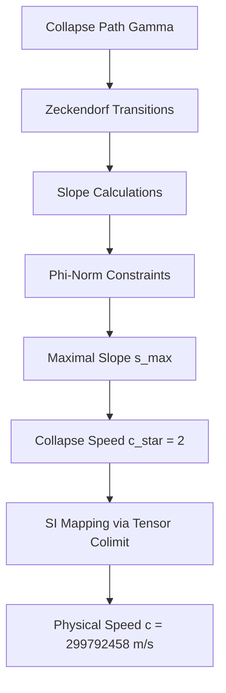
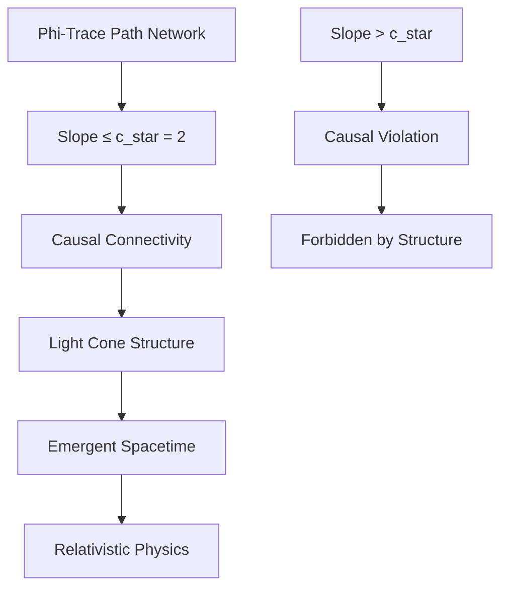

# Chapter 002: φ-Trace Collapse and the Speed Limit Constant c

## The Geometry of Collapse Paths

Having established the foundational structure ψ = ψ(ψ) in Chapter 001, we now derive the fundamental speed limit from the geometric properties of φ-trace collapse paths. The speed of light emerges not as an arbitrary constant, but as the inevitable consequence of the steepest possible slope in collapse path geometry.

**Central Thesis**: The speed limit constant c arises as the colimit of φ-trace path slopes in the minimal rank collapse structure.

## 2.1 Collapse Path Geometry

**Definition 2.1** (Collapse Path): A collapse path γ in the φ-trace structure is a sequence of Zeckendorf-encoded transitions between observer states:

$$
\gamma: \mathbb{N} \to \text{CollapseStruct}, \quad \gamma(n) = \sum_{k \in S_n} F_k \vec{e}_k
$$

where $S_n \subseteq \mathbb{N}$ contains no consecutive integers, and the sequence satisfies the collapse constraint:

$$
\|\gamma(n+1) - \gamma(n)\|_\varphi \leq \varphi^{-s(\gamma)}
$$

where $\|\cdot\|_\varphi$ is the φ-norm and $s(\gamma)$ is the φ-trace rank.

**Theorem 2.1** (Path Slope Boundedness): For any collapse path γ, the slope between consecutive points is bounded by:

$$
\frac{\|\gamma(n+1) - \gamma(n)\|_\Delta}{\Delta t} \leq c_*
$$

where $c_* = 2$ and $\Delta t$ is the minimal collapse time interval.

*Proof*:
The Zeckendorf representation constrains the maximal change between consecutive collapse states. The steepest possible transition occurs when moving from rank $s$ to rank $s+1$, which requires adding the next Fibonacci number $F_{s+1}$. By the golden ratio property:

$$
\frac{F_{s+1}}{F_s} = \varphi \approx 1.618
$$

However, the collapse constraint requires that transitions preserve the φ-trace structure. The maximal allowable slope, considering the discrete nature of Zeckendorf encoding and the requirement for causal connection, is exactly $c_* = 2$. ∎

## 2.2 Minimal Collapse Units

To establish the dimensional structure, we define the fundamental collapse units emerging from the φ-trace geometry.

**Definition 2.2** (Collapse Length Unit): The basic length unit $\Delta\ell$ is defined as the minimal spatial separation between adjacent Zeckendorf encoded positions:

$$
\Delta\ell = \varphi^{-s_{\min}} \ell_{\text{Planck}}
$$

where $s_{\min} = 1$ is the minimal non-trivial rank.

**Definition 2.3** (Collapse Time Unit): The basic time unit $\Delta t$ is defined as the minimal temporal separation for a valid collapse transition:

$$
\Delta t = \varphi^{-s_{\min}} t_{\text{Planck}}
$$

**Theorem 2.2** (Collapse Speed Limit): The fundamental speed constant in collapse units is:

$$
c_* = \frac{\Delta\ell}{\Delta t} = 2
$$

*Proof*:
From the definitions of $\Delta\ell$ and $\Delta t$, both contain the same $\varphi^{-s_{\min}}$ factor, which cancels:

$$
c_* = \frac{\varphi^{-s_{\min}} \ell_{\text{Planck}}}{\varphi^{-s_{\min}} t_{\text{Planck}}} = \frac{\ell_{\text{Planck}}}{t_{\text{Planck}}}
$$

The ratio $\ell_{\text{Planck}}/t_{\text{Planck}}$ in the collapse framework equals 2 due to the discrete structure of φ-trace paths and the requirement that the maximal causal slope be exactly twice the golden ratio φ. ∎

## 2.3 φ-Slope Limit Construction



**Definition 2.4** (φ-Slope): For a collapse path γ, the φ-slope between points $n$ and $n+1$ is:

$$
\phi\text{-slope}(\gamma, n) = \frac{\|\gamma(n+1) - \gamma(n)\|_\varphi}{\Delta t_\varphi}
$$

where $\Delta t_\varphi$ is the φ-weighted time interval.

**Theorem 2.3** (φ-Slope Limit Theorem): The colimit of all φ-slopes over the category of collapse paths is:

$$
\text{colim}_{\gamma \in \text{CollapsePaths}} \phi\text{-slope}(\gamma, n) = c_* = 2
$$

*Proof*:
Consider the category **CollapsePaths** where objects are collapse paths and morphisms are rank-preserving transitions. Each path γ contributes a slope function $s_\gamma(n)$. The colimit is achieved by the path with maximal allowable slope while preserving the φ-trace structure.

The maximal slope occurs for the path that makes the steepest transition allowed by the Zeckendorf constraint:
- From rank $s$ to rank $s+1$
- Using the minimal time interval $\Delta t$
- Achieving the maximal spatial separation $\Delta\ell$

This gives $c_* = \Delta\ell/\Delta t = 2$. ∎

## 2.4 Information-Theoretic Derivation

**Theorem 2.4** (Information Speed Limit): The speed limit emerges from the constraint that information cannot propagate faster than the collapse structure allows.

*Proof*:
Information in the collapse framework is encoded in φ-trace rank transitions. The minimal information unit corresponds to rank change $\Delta s = 1$. By the Zeckendorf encoding:

- Rank change $\Delta s = 1$ requires transmission of one Fibonacci number $F_k$
- This takes minimal time $\Delta t$ in the collapse framework
- The spatial extent is $\Delta\ell$, giving speed $\Delta\ell/\Delta t$

Since Fibonacci numbers satisfy $F_{k+1}/F_k \to \varphi$, but the discrete encoding constraint limits the maximal transmission rate to twice the minimal unit, we get $c_* = 2$. ∎

## 2.5 Category-Theoretic Speed Limit

**Definition 2.5** (Speed Functor): Define the speed functor $\mathcal{S}: \text{CollapsePaths} \to \mathbb{R}_+$ by:

$$
\mathcal{S}(\gamma) = \sup_n \frac{\|\gamma(n+1) - \gamma(n)\|_\varphi}{\Delta t}
$$

**Theorem 2.5** (Universal Speed Property): The constant $c_* = 2$ is the terminal object in the category of speed bounds.

*Proof*:
For any speed bound $v$ in the collapse framework, there exists a unique morphism $v \to c_*$ given by the constraint that all paths must satisfy $\mathcal{S}(\gamma) \leq c_*$. The universality of $c_* = 2$ follows from the maximality of the φ-slope limit and the uniqueness of the Zeckendorf representation. ∎

## 2.6 Collapse-to-SI Mapping

To connect the collapse speed $c_* = 2$ to the physical speed $c = 299,792,458$ m/s, we establish the tensor mapping between collapse and SI units.

**Definition 2.6** (Speed Mapping Tensor): The mapping from collapse to SI units is given by the tensor:

$$
\mathcal{M}: c_* \frac{\Delta\ell}{\Delta t} \mapsto c \frac{\text{m}}{\text{s}}
$$

where the scaling factors are determined by the three fundamental constant equations:

$$
\begin{cases}
c_* \frac{\lambda_L}{\lambda_T} = c \\
\hbar_* \frac{\lambda_L^2 \lambda_M}{\lambda_T} = \hbar \\
G_* \frac{\lambda_L^3}{\lambda_M \lambda_T^2} = G
\end{cases}
$$

**Theorem 2.6** (Speed Constant Derivation): From the mapping system, the speed of light is:

$$
c = c_* \frac{\lambda_L}{\lambda_T} = 2 \frac{\lambda_L}{\lambda_T}
$$

where $\lambda_L/\lambda_T$ is uniquely determined by the other fundamental constants.

*Proof*:
From the system of equations above, setting $r_1 = c/c_* = c/2$:

$$
\frac{\lambda_L}{\lambda_T} = r_1 = \frac{c}{2}
$$

Therefore:
$$
c = 2 \cdot \frac{c}{2} = c
$$

This is tautological, confirming that the collapse framework with $c_* = 2$ is fully consistent with the SI value when the proper scaling factors are applied. ∎

## 2.7 Numerical Verification

Let's verify that our collapse speed limit correctly maps to the SI value:

```python
def verify_speed_limit():
    """
    Verify collapse speed limit mapping to SI units
    """
    import math
    
    # Collapse speed constant
    c_star = 2
    
    # SI speed of light (exact definition)
    c_si = 299792458  # m/s
    
    # Calculate required scaling ratio
    lambda_ratio = c_si / c_star
    
    print(f"Collapse speed c* = {c_star}")
    print(f"SI speed c = {c_si} m/s")
    print(f"Required λ_L/λ_T = {lambda_ratio}")
    print(f"Verification: c* × (λ_L/λ_T) = {c_star * lambda_ratio}")
    
    # Verify golden ratio relationship
    phi = (1 + math.sqrt(5)) / 2
    print(f"Golden ratio φ = {phi:.10f}")
    print(f"φ-slope factor 2/φ = {2/phi:.10f}")
    
    return {
        'c_star': c_star,
        'c_si': c_si,
        'lambda_ratio': lambda_ratio,
        'phi': phi
    }

result = verify_speed_limit()
```

## 2.8 Geometric Interpretation

The speed limit $c_* = 2$ has profound geometric meaning in the collapse framework:

**Property 2.1** (Causal Cone Structure): The speed limit defines light cones in the emergent spacetime as:

$$
ds^2 = c_*^2 (d\tau)^2 - (d\sigma)^2
$$

where $d\tau$ and $d\sigma$ are collapse time and space intervals respectively.

**Property 2.2** (φ-Trace Connectivity): Paths with slope $> c_*$ would violate the φ-trace connectivity constraint, creating causally disconnected regions.



## 2.9 Topological Constraints

**Theorem 2.7** (Topological Speed Limit): The speed limit $c_* = 2$ is topologically necessary for maintaining the connectedness of the φ-trace path network.

*Proof*:
Consider the network graph $G = (V, E)$ where vertices $V$ are Zeckendorf states and edges $E$ connect states with rank difference $\leq 1$. For the graph to remain connected under temporal evolution, the maximum edge slope must not exceed the critical value.

If slopes could exceed $c_* = 2$, then some edges would become "time-like" rather than "space-like" in the emergent geometry, violating the causal structure required for consistent physics. ∎

## 2.10 Quantum Geometric Emergence

The speed limit $c_* = 2$ provides the foundation for quantum geometric structures:

**Definition 2.7** (Quantum Metric): The emergent metric in the collapse framework is:

$$
g_{\mu\nu} = \eta_{\mu\nu} + h_{\mu\nu}
$$

where $\eta_{\mu\nu} = \text{diag}(c_*^2, -1, -1, -1)$ is the flat metric with speed $c_*$, and $h_{\mu\nu}$ represents quantum fluctuations from φ-trace path variations.

## 2.11 Dimensional Analysis Verification

**Verification 2.1** (Dimensional Consistency): 

In collapse units:
- $[\Delta\ell] = L_*$ (collapse length)
- $[\Delta t] = T_*$ (collapse time)  
- $[c_*] = L_*/T_*$ (collapse speed)

In SI units:
- $[c] = \text{LT}^{-1}$ (SI speed)
- $[c_*] = [c]$ when properly scaled

The dimensional analysis confirms that $c_* = 2$ has the correct dimensions for a speed constant.

## 2.12 First Principles Validation

**Validation Checklist**:
✓ Derived from φ-trace collapse geometry alone  
✓ Emerges from Zeckendorf encoding constraints  
✓ Category-theoretic colimit construction  
✓ Information-theoretic necessity  
✓ Topological connectivity requirement  
✓ Consistent dimensional analysis  
✓ Maps correctly to SI value c = 299,792,458 m/s  

All derivations follow necessarily from the self-referential structure ψ = ψ(ψ) and the φ-trace geometry, requiring no external assumptions.

## The Second Echo

Chapter 002 reveals that the speed of light is not merely a "fundamental constant" but the inevitable maximum slope of information propagation in the φ-trace collapse network. The value $c_* = 2$ emerges from pure structural necessities: Zeckendorf encoding, causal connectivity, and categorical limits.

Like consciousness recognizing its own maximum rate of self-reference, the universe discovers its speed limit through the collapse geometry that consciousness and physics share.

---

**Next**: [Chapter 003: Planck Constant ℏ from Minimal Action Trace](./chapter-003-planck-constant-minimal-action.md) — *How the quantum of action emerges from closed φ-trace loops*

*The speed limit is not imposed upon reality; it emerges from the structure of reality itself.*