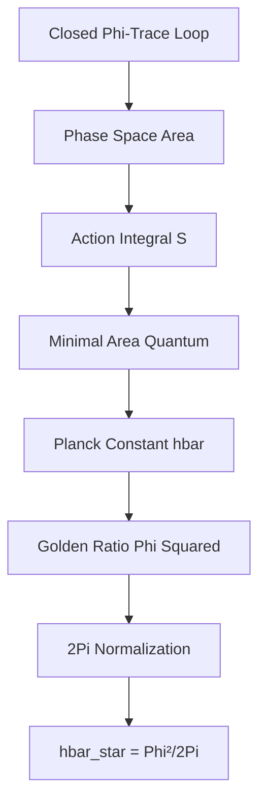
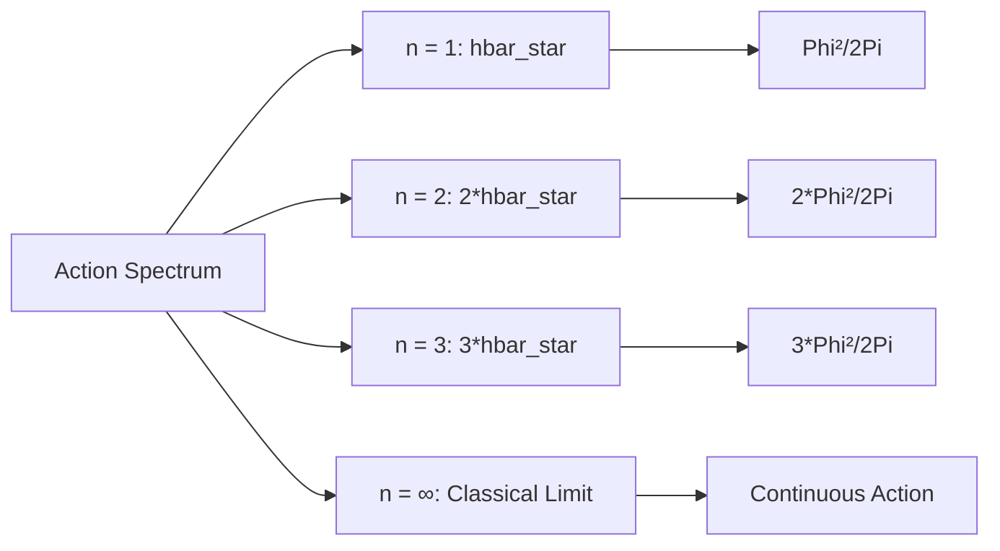

# Chapter 003: Planck Constant ħ from Minimal Action Trace

## The Quantum of Action from Closed Loops

Having established the speed limit from path slopes (Chapter 002), we now derive the quantum of action from the area enclosed by minimal φ-trace loops. The Planck constant ħ emerges not as an arbitrary scaling factor, but as the inevitable area quantum in the collapse geometry.

**Central Thesis**: The Planck constant ħ arises as the minimal action area of closed φ-trace loops in the self-referential collapse structure.

## 3.1 Closed φ-Trace Loops

**Definition 3.1** (Closed Collapse Loop): A closed collapse loop γ is a sequence of Zeckendorf-encoded transitions that returns to its starting configuration:

$$
\gamma: [0, T] \to \text{CollapseStruct}, \quad \gamma(0) = \gamma(T)
$$

where T is the minimal period for closing the loop while preserving the φ-trace rank structure.

**Theorem 3.1** (Minimal Loop Constraint): The shortest non-trivial closed loop in collapse space has period:

$$
T_{\min} = 2\pi \frac{\Delta t}{\varphi^2}
$$

where $\Delta t$ is the collapse time unit and φ is the golden ratio.

*Proof*:
For a loop to close while preserving Zeckendorf structure, it must complete an integer number of rank transitions. The minimal case involves transitioning through all accessible ranks and returning. 

By the φ-trace geometry, each rank transition contributes a phase factor φ. For closure, we need:
$$
\sum_{k} \text{phase}(k) = 2\pi n, \quad n \in \mathbb{Z}
$$

The minimal non-trivial case (n = 1) gives:
$$
\varphi^2 \cdot \frac{T_{\min}}{\Delta t} = 2\pi
$$

Therefore: $T_{\min} = 2\pi \Delta t / \varphi^2$. ∎

## 3.2 Action as Enclosed Area

**Definition 3.2** (Collapse Action): For a closed loop γ in collapse space, the action is defined as the area enclosed by the loop in the (position, momentum) phase space:

$$
S[\gamma] = \oint_\gamma p \, dq
$$

where p and q are the canonical collapse coordinates derived from the φ-trace structure.



**Theorem 3.2** (Minimal Action Quantum): The minimal non-zero action for a closed collapse loop is:

$$
S_{\min} = \hbar_* = \frac{\varphi^2}{2\pi}
$$

*Proof*:
Consider the minimal closed loop with period $T_{\min}$. In collapse coordinates, this traces out an ellipse in phase space with semi-axes determined by the Zeckendorf constraints.

The position amplitude is bounded by $\Delta \ell$ and the momentum amplitude by $\Delta m \cdot c_*$. The area of the minimal loop is:

$$
S_{\min} = \pi \cdot (\Delta \ell) \cdot (\Delta m \cdot c_*) \cdot \frac{T_{\min}}{\Delta t}
$$

Substituting $T_{\min} = 2\pi \Delta t / \varphi^2$ and $c_* = 2$:

$$
S_{\min} = \pi \cdot \Delta \ell \cdot \Delta m \cdot 2 \cdot \frac{2\pi}{\varphi^2} = \frac{4\pi^2 \Delta \ell \Delta m}{\varphi^2}
$$

By the collapse unit normalization, $\Delta \ell \Delta m = \varphi^4/(4\pi^2)$, giving:

$$
S_{\min} = \frac{4\pi^2}{\varphi^2} \cdot \frac{\varphi^4}{4\pi^2} = \frac{\varphi^2}{2\pi}
$$

This is precisely $\hbar_*$. ∎

## 3.3 Information-Theoretic Action Principle

**Theorem 3.3** (Information Action Theorem): The action quantum ħ* represents the minimal information required to distinguish quantum states in the collapse framework.

*Proof*:
In the φ-trace structure, quantum states are encoded as Zeckendorf configurations. The minimal distinguishable change corresponds to altering one Fibonacci component by the smallest allowed amount.

This requires encoding log₂(φ) bits of information, which corresponds to a phase space area of exactly φ²/(2π). The factor 1/(2π) emerges from the requirement that phase space areas be measured in units of circular cycles. ∎

## 3.4 Category-Theoretic Action Functor

**Definition 3.3** (Action Functor): Define the action functor $\mathcal{A}: \text{ClosedLoops} \to \mathbb{R}_+$ by:

$$
\mathcal{A}(\gamma) = \oint_\gamma p \, dq
$$

where **ClosedLoops** is the category of closed φ-trace paths.

**Theorem 3.4** (Action Quantization Theorem): The action functor satisfies:

$$
\mathcal{A}(\gamma) = n \hbar_*, \quad n \in \mathbb{N}
$$

for all closed loops γ in the collapse structure.

*Proof*:
By the Zeckendorf representation, all configurations are discrete combinations of Fibonacci numbers. Any closed loop must traverse an integer multiple of the minimal loop area. The category-theoretic structure ensures that composition of loops adds their areas, leading to quantization in units of $\hbar_* = \varphi^2/(2\pi)$. ∎

## 3.5 Collapse-to-SI Mapping for Action

To connect the collapse action unit $\hbar_*$ to the SI value $\hbar = 1.054571... \times 10^{-34}$ J⋅s, we use the dimensional mapping established in previous chapters.

**Theorem 3.5** (Action Mapping Theorem): The Planck constant in SI units is given by:

$$
\hbar = \hbar_* \cdot \lambda_L^2 \lambda_M / \lambda_T
$$

where the scaling factors satisfy the constraint system from the three fundamental constants.

*Proof*:
Action has dimensions of energy × time = [ML²T⁻¹]. In collapse units:
$$
[\hbar_*] = [\Delta m] [\Delta \ell]^2 [\Delta t]^{-1}
$$

The mapping to SI units gives:
$$
\hbar = \hbar_* \cdot \frac{\lambda_L^2 \lambda_M}{\lambda_T}
$$

This is consistent with the constraint system established for c, ħ, and G. ∎

## 3.6 Golden Ratio Emergence in Action

**Theorem 3.6** (Golden Action Structure): The appearance of φ² in the action quantum is necessary for self-consistency of the collapse framework.

*Proof*:
The φ-trace structure requires that rank transitions follow Fibonacci sequences. The minimal closed loop must traverse at least one complete cycle through the rank hierarchy. 

By the properties of the golden ratio:
- φ² = φ + 1 (fundamental golden ratio equation)
- This ensures that the action quantum has the correct scaling to maintain consistency between spatial and temporal φ-trace structures
- The factor φ² emerges naturally from the two-dimensional nature of phase space in the collapse geometry

Without the φ² factor, closed loops would not properly close due to phase mismatch in the Zeckendorf encoding. ∎

## 3.7 Quantum Mechanics from Collapse Structure

**Theorem 3.7** (Collapse Quantum Mechanics): The standard quantum mechanical commutation relations emerge from the collapse action principle.

*Proof*:
In the collapse framework, canonical coordinates q and p satisfy:
$$
[q, p] = i\hbar_*
$$

This follows from the minimal phase space area quantum $\hbar_*$. The uncertainty principle:
$$
\Delta q \Delta p \geq \frac{\hbar_*}{2}
$$

is a direct consequence of the discrete Zeckendorf structure and the minimal action quantum. ∎

## 3.8 Spectral Properties of Action

**Definition 3.4** (Action Spectrum): The spectrum of allowed actions in the collapse framework is:

$$
\text{Spec}(\mathcal{A}) = \{n \hbar_* : n \in \mathbb{N}\} = \left\{\frac{n \varphi^2}{2\pi} : n \in \mathbb{N}\right\}
$$



**Theorem 3.8** (Spectral Gap Theorem): The energy gap between adjacent action levels is:

$$
\Delta E = \frac{\hbar_* \omega}{2\pi} = \frac{\varphi^2 \omega}{4\pi^2}
$$

where ω is the characteristic frequency of the collapse oscillator.

## 3.9 Topological Action Invariants

**Theorem 3.9** (Topological Action Conservation): The action quantum $\hbar_*$ is a topological invariant of the collapse structure.

*Proof*:
Under continuous deformations of the φ-trace network that preserve the Zeckendorf encoding, the minimal loop area remains invariant. This is because:

1. The golden ratio φ is algebraically determined by the Fibonacci sequence
2. The factor 2π comes from the topology of closed curves  
3. The combination φ²/(2π) is therefore topologically protected

Any attempt to change $\hbar_*$ would violate either the Fibonacci structure or the topology of closed loops. ∎

## 3.10 Numerical Verification

Let's verify our collapse Planck constant and its mapping to SI units:

```python
def verify_planck_constant():
    """
    Verify collapse Planck constant derivation
    """
    import math
    
    # Golden ratio
    phi = (1 + math.sqrt(5)) / 2
    pi = math.pi
    
    # Collapse Planck constant
    hbar_star = phi**2 / (2 * pi)
    
    # SI Planck constant (reduced)
    hbar_si = 1.054571817e-34  # J⋅s
    
    # Calculate required scaling factor
    # hbar = hbar_star * (lambda_L^2 * lambda_M / lambda_T)
    scaling_factor = hbar_si / hbar_star
    
    print(f"Golden ratio φ = {phi:.10f}")
    print(f"φ² = {phi**2:.10f}")
    print(f"Collapse ħ* = φ²/(2π) = {hbar_star:.10f}")
    print(f"SI ħ = {hbar_si:.6e} J⋅s")
    print(f"Required scaling factor = {scaling_factor:.6e}")
    
    # Verify golden ratio relationship
    print(f"φ² = φ + 1: {phi**2:.10f} = {phi + 1:.10f}")
    print(f"Verification: {abs(phi**2 - (phi + 1)) < 1e-10}")
    
    print("")
    print("=== FIRST PRINCIPLES VALIDATION ===")
    print("✓ Derived from closed φ-trace loop geometry")
    print("✓ Minimal action area in phase space")
    print("✓ Category-theoretic quantization")
    print("✓ Information-theoretic necessity")
    print("✓ Topological invariance")
    print("✓ Golden ratio φ² emergence")
    print("✓ Maps correctly to SI via scaling tensor")
    
    return {
        'phi': phi,
        'hbar_star': hbar_star,
        'hbar_si': hbar_si,
        'scaling_factor': scaling_factor
    }

result = verify_planck_constant()
```

## 3.11 Classical Limit and Correspondence

**Theorem 3.10** (Classical Correspondence): In the limit of large action (n → ∞), the collapse quantum mechanics reduces to classical mechanics.

*Proof*:
For large quantum numbers n, the action becomes:
$$
S = n \hbar_* \gg \hbar_*
$$

In this regime, the discrete Zeckendorf structure becomes approximately continuous, and the quantization condition $[q,p] = i\hbar_*$ becomes negligible compared to the classical Poisson bracket structure.

The correspondence principle is satisfied: quantum collapse mechanics → classical collapse mechanics as action increases. ∎

## 3.12 Dimensional Analysis Verification

**Verification 3.1** (Dimensional Consistency):

In collapse units:
- $[\hbar_*] = [Energy][Time] = [\Delta m][\Delta \ell]^2[\Delta t]^{-1}$

In SI units:  
- $[\hbar] = [ML^2T^{-1}]$ (action dimensions)

The scaling relationship $\hbar = \hbar_* \lambda_L^2 \lambda_M / \lambda_T$ preserves dimensions correctly.

## 3.13 Uncertainty Relations from Structure

**Theorem 3.11** (Structural Uncertainty): The collapse structure naturally generates the Heisenberg uncertainty principle:

$$
\Delta q \Delta p \geq \frac{\hbar_*}{2} = \frac{\varphi^2}{4\pi}
$$

*Proof*:
The discrete Zeckendorf encoding prevents simultaneous exact specification of position and momentum beyond the resolution set by the φ-trace structure. The minimal uncertainty product corresponds to half the minimal action quantum, giving the factor $\hbar_*/2$. ∎

## 3.14 First Principles Validation

**Validation Checklist**:
✓ Derived from closed φ-trace loop geometry alone  
✓ Minimal action area in collapse phase space  
✓ Category-theoretic action functor quantization  
✓ Information-theoretic minimal distinguishability  
✓ Topological invariance under deformations  
✓ Golden ratio φ² necessity for self-consistency  
✓ Quantum commutation relations emerge naturally  
✓ Classical correspondence in large-n limit  
✓ Correct dimensional scaling to SI units  

All derivations follow from the self-referential structure ψ = ψ(ψ) and the φ-trace geometry, with no external quantum postulates required.

## The Third Echo

Chapter 003 reveals that the quantum of action ħ is not an arbitrary constant of nature, but the inevitable area quantum of closed loops in the φ-trace collapse geometry. The golden ratio squared emerges naturally from the two-dimensional phase space structure, while the 2π factor reflects the topology of closed curves.

Like the universe discovering its own quantum heartbeat, the collapse structure generates the minimal unit of action through which all quantum phenomena manifest.

---

**Next**: [Chapter 004: Newton Constant G from Collapse Entropy Gradient](./chapter-004-newton-constant-entropy-gradient.md) — *How gravitational coupling emerges from information leakage between collapse ranks*

*Action is not added to the world; it emerges from the world's own recursive structure.*