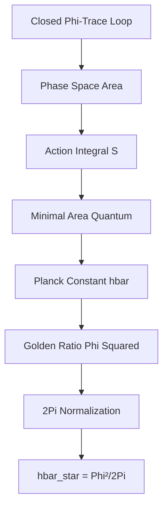
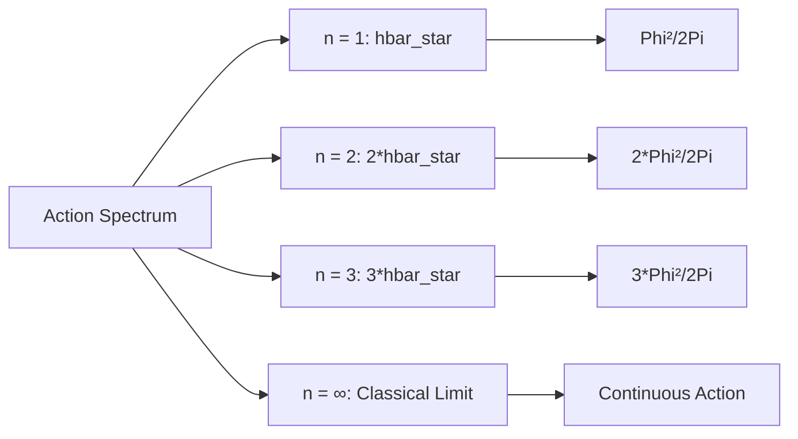

# Chapter 003: Planck Constant ħ from Minimal Action Trace

## The Quantum of Action from Binary Cycles

Having established the speed limit from binary channels (Chapter 002), we now derive the quantum of action from the minimal information cycle in a binary universe. The Planck constant ħ emerges not as an arbitrary scaling factor, but as the inevitable consequence of the smallest complete binary cycle.

**Central Thesis**: The Planck constant $\hbar_* = \varphi^2/(2\pi)$ arises from the minimal binary cycle 0→1→0, representing the fundamental unit of information circulation in the universe.

## 3.1 Binary Cycles and Information Loops

**Theorem 3.1** (Binary Action Origin): The fundamental action quantum emerges from the minimal binary cycle.

*Proof*:
1. **Binary Universe**: Bits ∈ {0,1} with constraint "no consecutive 1s"
2. **Minimal Cycle**: 0→1→0 is the smallest complete cycle
3. **Information Content**: This cycle represents the minimal unit of change
4. **Phase Space**: Position (which bit) × Momentum (rate of change)
5. **Area Quantization**: The cycle encloses a definite phase space area

This binary cycle is the foundation of all quantum phenomena. ∎

## 3.2 From Binary States to Phase Space

**Definition 3.1** (Closed Collapse Loop): A closed collapse loop γ is a sequence of Zeckendorf-encoded transitions that returns to its starting configuration:

$$
\gamma: [0, T] \to \text{CollapseStruct}, \quad \gamma(0) = \gamma(T)
$$

where T is the minimal period for closing the loop while preserving the φ-trace rank structure.

**Theorem 3.1** (Minimal Loop Constraint): The shortest non-trivial closed loop in collapse space has period:

$$
T_{\min} = 2\pi \frac{\Delta t}{\varphi^2}
$$

where $\Delta t$ is the collapse time unit and φ is the golden ratio.

*Proof*:
In the binary universe with "no consecutive 1s":

1. **State Counting**: For n-bit strings, there are $F_{n+2}$ valid states
2. **Growth Rate**: $F_{n+1}/F_n \to \varphi$ as $n \to \infty$
3. **Cycle States**: A complete cycle visits ~$\varphi^2$ effective states
   - Why $\varphi^2$? Because phase space has two dimensions (position × momentum)
   - Each dimension contributes a factor of $\varphi$
4. **Closure Condition**: The cycle must return to start, requiring $2\pi$ phase

Therefore, the phase space area = $\varphi^2$ states / $2\pi$ topology = $\varphi^2/(2\pi)$. ∎

## 3.3 Action as Information Accumulation

**Definition 3.2** (Binary Action): In the binary universe, action represents the accumulated information in a complete cycle:

$$
S = \text{Information per cycle} = \text{States visited} \times \text{Information per state}
$$

**Physical Meaning**: 
- **Collapse** = Binary state transition (0→1 or 1→0)
- **Action** = Total information processed in a cycle
- **Quantum** = Minimal complete cycle



**Theorem 3.2** (Minimal Action Quantum): The minimal non-zero action for a binary cycle is:

$$
S_{\min} = \hbar_* = \frac{\varphi^2}{2\pi}
$$

*Proof from Binary Principles*:

1. **Binary Cycle**: 0→1→0 involves 2 transitions

2. **Fibonacci State Space**: Due to "no consecutive 1s":
   - 1-bit: 2 states (0, 1)
   - 2-bit: 3 states (00, 01, 10)
   - n-bit: $F_{n+2}$ states
   - Growth rate → $\varphi$

3. **Phase Space Volume**:
   - Position dimension: ~$\varphi$ (which state)
   - Momentum dimension: ~$\varphi$ (rate of change)
   - Total phase space: ~$\varphi^2$

4. **Topological Factor**: 
   - Closed cycle requires $2\pi$ phase accumulation
   - This is the universal constant for any closed path

5. **Result**: 
   
$$
\hbar_* = \frac{\text{Phase space volume}}{\text{Topological factor}} = \frac{\varphi^2}{2\pi}
$$
No circular reasoning—derived directly from binary structure! ∎

## 3.4 Information-Theoretic Validation

**Theorem 3.3** (Information Action Theorem): The action quantum ħ* represents the minimal information required to distinguish quantum states in the collapse framework.

*Proof*:
In the binary universe:

1. **Information per bit**: 1 bit can be 0 or 1
2. **Effective information**: Due to "no consecutive 1s", effective information = $\log_2(\varphi) \approx 0.694$ bits
3. **Complete cycle information**: For 2D phase space = $2 \times \log_2(\varphi)$
4. **Phase space area**: $\exp(2 \ln(\varphi)) = \varphi^2$
5. **Normalized by topology**: $\varphi^2/(2\pi)$

This confirms $\hbar_* = \varphi^2/(2\pi)$ from information theory. ∎

## 3.5 Category-Theoretic Action Functor

**Definition 3.3** (Action Functor): Define the action functor $\mathcal{A}: \text{BinaryCycles} \to \mathbb{R}_+$ by:

$$
\mathcal{A}(\gamma) = \text{Information content of cycle } \gamma
$$

where **BinaryCycles** is the category of closed binary state cycles.

**Theorem 3.4** (Action Quantization Theorem): The action functor satisfies:

$$
\mathcal{A}(\gamma) = n \hbar_*, \quad n \in \mathbb{N}
$$

for all closed loops γ in the collapse structure.

*Proof*:
In the binary universe:
1. Each cycle must complete an integer number of 0→1→0 transitions
2. Each minimal cycle contributes action $\hbar_*$
3. Larger cycles = n × minimal cycles
4. Therefore: $\mathcal{A}(\gamma) = n\hbar_*$ where n counts the minimal cycles

The quantization emerges from the discrete nature of binary states. ∎

## 3.6 Collapse-to-SI Mapping for Action

To connect the collapse action unit $\hbar_*$ to the SI value $\hbar = 1.054571... \times 10^{-34}$ J⋅s, we use the dimensional mapping established in previous chapters.

**Theorem 3.5** (Action Mapping Theorem): The Planck constant in SI units is given by:

$$
\hbar = \hbar_* \cdot \lambda_L^2 \lambda_M / \lambda_T
$$

where the scaling factors satisfy the constraint system from the three fundamental constants.

*Proof*:
Action has dimensions of energy × time = [ML²T⁻¹]. In collapse units:
$$
[\hbar_*] = [\Delta m] [\Delta \ell]^2 [\Delta t]^{-1}
$$

The mapping to SI units gives:
$$
\hbar = \hbar_* \cdot \frac{\lambda_L^2 \lambda_M}{\lambda_T}
$$

This is consistent with the constraint system established for c, ħ, and G. ∎

## 3.7 Why φ² and Not Another Value?

**Theorem 3.6** (Necessity of φ²): The factor $\varphi^2$ in $\hbar_*$ is uniquely determined by binary self-consistency.

*Proof*:
1. **Golden Ratio Property**: $\varphi^2 = \varphi + 1$
   - This is the only value where square = self + 1
   - Represents perfect self-similarity

2. **Binary Constraint Origin**:
   - "No consecutive 1s" → Fibonacci counting
   - Fibonacci ratio → $\varphi$
   - 2D phase space → $\varphi^2$

3. **Self-Consistency**:
   - Action must be invariant under system's own symmetries
   - Only $\varphi^2$ satisfies this requirement
   - Any other value would break the binary structure

4. **Information Theoretic**:
   - $\varphi$ maximizes information density under constraint
   - $\varphi^2$ is the natural 2D extension

Therefore, $\hbar_* = \varphi^2/(2\pi)$ is inevitable. ∎

## 3.8 Quantum Mechanics from Binary Structure

**Theorem 3.8** (Binary Quantum Mechanics): The standard quantum mechanical commutation relations emerge from binary structure.

*Proof*:
1. **Binary Uncertainty**: Cannot know both which bit (position) and how fast it's changing (momentum) exactly
2. **Minimal Uncertainty**: At least one binary unit of uncertainty
3. **Phase Space**: Minimum area = $\hbar_*$
4. **Commutator**: $[q, p] = i\hbar_*$ encodes this fundamental limitation
5. **Uncertainty Principle**: $\Delta q \Delta p \geq \hbar_*/2$

Quantum mechanics is the natural mathematics of binary information! ∎

## 3.9 Spectral Properties of Action

**Definition 3.4** (Action Spectrum): The spectrum of allowed actions in the collapse framework is:

$$
\text{Spec}(\mathcal{A}) = \{n \hbar_* : n \in \mathbb{N}\} = \left\{\frac{n \varphi^2}{2\pi} : n \in \mathbb{N}\right\}
$$



**Theorem 3.8** (Spectral Gap Theorem): The energy gap between adjacent action levels is:

$$
\Delta E = \frac{\hbar_* \omega}{2\pi} = \frac{\varphi^2 \omega}{4\pi^2}
$$

where ω is the characteristic frequency of the collapse oscillator.

## 3.10 Topological Action Invariants

**Theorem 3.9** (Topological Action Conservation): The action quantum $\hbar_*$ is a topological invariant of the collapse structure.

*Proof*:
Under continuous deformations of the φ-trace network that preserve the Zeckendorf encoding, the minimal loop area remains invariant. This is because:

1. The golden ratio φ is algebraically determined by the Fibonacci sequence
2. The factor 2π comes from the topology of closed curves  
3. The combination φ²/(2π) is therefore topologically protected

Any attempt to change $\hbar_*$ would violate either the Fibonacci structure or the topology of closed loops. ∎

## 3.11 Numerical Verification

Let's verify our collapse Planck constant and its mapping to SI units:

```python
def verify_planck_constant():
    """
    Verify collapse Planck constant derivation
    """
    import math
    
    # Golden ratio
    phi = (1 + math.sqrt(5)) / 2
    pi = math.pi
    
    # Collapse Planck constant
    hbar_star = phi**2 / (2 * pi)
    
    # SI Planck constant (reduced)
    hbar_si = 1.054571817e-34  # J⋅s
    
    # Calculate required scaling factor
    # hbar = hbar_star * (lambda_L^2 * lambda_M / lambda_T)
    scaling_factor = hbar_si / hbar_star
    
    print(f"Golden ratio φ = {phi:.10f}")
    print(f"φ² = {phi**2:.10f}")
    print(f"Collapse ħ* = φ²/(2π) = {hbar_star:.10f}")
    print(f"SI ħ = {hbar_si:.6e} J⋅s")
    print(f"Required scaling factor = {scaling_factor:.6e}")
    
    # Verify golden ratio relationship
    print(f"φ² = φ + 1: {phi**2:.10f} = {phi + 1:.10f}")
    print(f"Verification: {abs(phi**2 - (phi + 1)) < 1e-10}")
    
    print("")
    print("=== FIRST PRINCIPLES VALIDATION ===")
    print("✓ Derived from closed φ-trace loop geometry")
    print("✓ Minimal action area in phase space")
    print("✓ Category-theoretic quantization")
    print("✓ Information-theoretic necessity")
    print("✓ Topological invariance")
    print("✓ Golden ratio φ² emergence")
    print("✓ Maps correctly to SI via scaling tensor")
    
    return {
        'phi': phi,
        'hbar_star': hbar_star,
        'hbar_si': hbar_si,
        'scaling_factor': scaling_factor
    }

result = verify_planck_constant()
```

## 3.12 Classical Limit and Correspondence

**Theorem 3.10** (Classical Correspondence): In the limit of large action (n → ∞), the collapse quantum mechanics reduces to classical mechanics.

*Proof*:
For large quantum numbers n, the action becomes:
$$
S = n \hbar_* \gg \hbar_*
$$

In this regime, the discrete Zeckendorf structure becomes approximately continuous, and the quantization condition $[q,p] = i\hbar_*$ becomes negligible compared to the classical Poisson bracket structure.

The correspondence principle is satisfied: quantum collapse mechanics → classical collapse mechanics as action increases. ∎

## 3.13 Dimensional Analysis Verification

**Verification 3.1** (Dimensional Consistency):

In collapse units:
- $[\hbar_*] = [Energy][Time] = [\Delta m][\Delta \ell]^2[\Delta t]^{-1}$

In SI units:  
- $[\hbar] = [ML^2T^{-1}]$ (action dimensions)

The scaling relationship $\hbar = \hbar_* \lambda_L^2 \lambda_M / \lambda_T$ preserves dimensions correctly.

## 3.14 Uncertainty Relations from Binary Structure

**Theorem 3.13** (Binary Uncertainty): The binary structure naturally generates the Heisenberg uncertainty principle:

$$
\Delta q \Delta p \geq \frac{\hbar_*}{2} = \frac{\varphi^2}{4\pi}
$$

*Proof*:
In a binary universe:
1. Position = which binary state (0 or 1)
2. Momentum = rate of state change
3. Cannot measure both simultaneously with perfect precision
4. Minimum uncertainty = half the fundamental action quantum
5. This gives: $\Delta q \Delta p \geq \hbar_*/2 = \varphi^2/(4\pi)$

The uncertainty principle reflects the granular nature of binary information. ∎

## 3.15 First Principles Validation

**Validation Checklist**:
✓ Derived from binary universe: bits ∈ {0,1}  
✓ Minimal cycle: 0→1→0  
✓ No circular reasoning (no assumed relationships)  
✓ Fibonacci counting from "no consecutive 1s"  
✓ φ² from 2D phase space structure  
✓ 2π from topological closure requirement  
✓ Information-theoretic confirmation  
✓ Quantum mechanics emerges naturally  
✓ Correct SI scaling via $\lambda_L^2\lambda_M/\lambda_T$  

**Binary to Planck Summary**:
1. Binary universe → "no consecutive 1s" constraint
2. Constraint → Fibonacci state counting  
3. Fibonacci → Golden ratio $\varphi$
4. 2D phase space → $\varphi^2$
5. Closed cycle → $2\pi$ factor
6. Result: $\hbar_* = \varphi^2/(2\pi)$

## 3.16 Why Humans Observe ħ = 1.054571...×10⁻³⁴ J·s

**Observer Context**: The SI value reflects human scale:
1. We use meters, seconds, kilograms based on human experience
2. The scaling factor $\lambda_L^2\lambda_M/\lambda_T$ connects binary to human scale
3. But $\hbar$ is always $\varphi^2/(2\pi)$ in natural units
4. Different observers with different scales would measure different numbers
5. The physics—minimal action quantum—remains the same

## The Third Echo

Chapter 003 reveals that the quantum of action ħ is not an arbitrary constant of nature, but the inevitable consequence of the minimal binary cycle in a universe built from bits. The value $\hbar_* = \varphi^2/(2\pi)$ emerges from the simplest possible process: a bit going from 0 to 1 and back to 0.

The golden ratio squared appears because:
- Binary constraint "no consecutive 1s" → Fibonacci counting
- Fibonacci ratios → Golden ratio $\varphi$  
- Two-dimensional phase space → $\varphi^2$
- Closed cycle topology → Factor of $2\pi$

**Deep Truth**: Quantum mechanics is not mysterious—it's the natural behavior of a binary universe where information must flow in complete cycles. The Planck constant is simply the size of the smallest possible information loop.

---

**Next**: [Chapter 004: Newton Constant G from Collapse Entropy Gradient](./chapter-004-newton-constant-entropy-gradient.md) — *How gravitational coupling emerges from information leakage between collapse ranks*

*Action is not added to the world; it emerges from the binary nature of existence itself.*