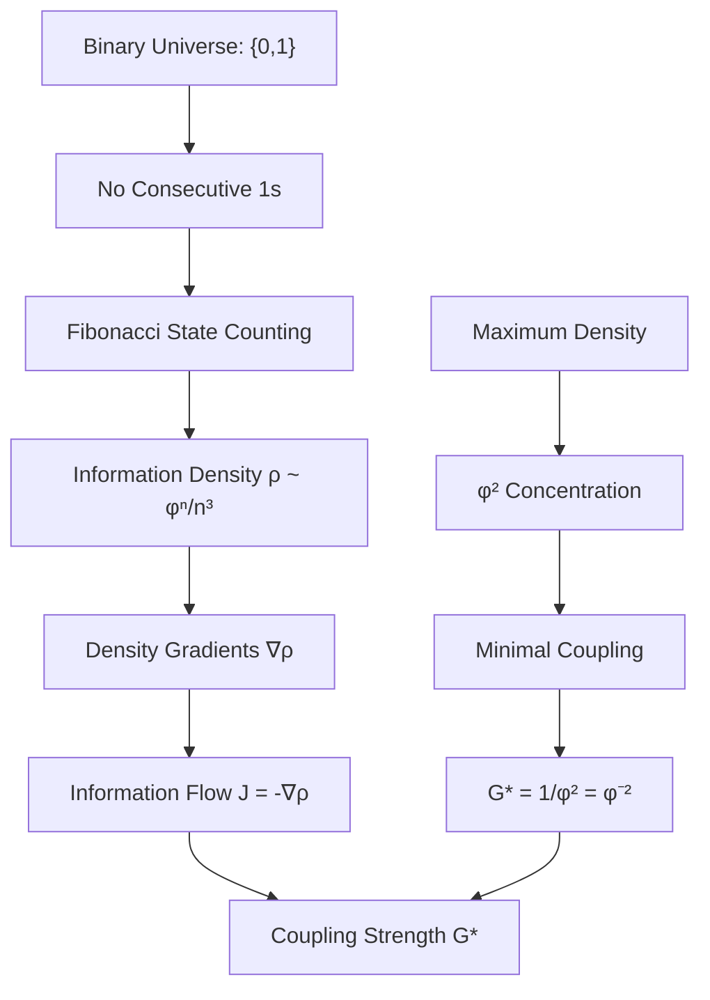

# Chapter 004: Newton Constant G from Collapse Entropy Gradient

## Gravity as Binary Information Density Gradient

Having established the speed limit c* = 2 from binary channels and action quantum ħ* = φ²/(2π) from binary cycles, we now derive the gravitational constant from the information density gradients that naturally arise in a binary universe. Gravity emerges not as a fundamental force, but as the inevitable consequence of information density variations in the binary structure.

**Central Thesis**: The Newton constant G* = φ⁻² emerges from the maximum information density concentration possible in a binary universe, representing the minimal coupling between information-dense regions.

## 4.1 Binary Information Density Foundation

**Theorem 4.1** (Binary Density Gradient): In a binary universe with constraint "no consecutive 1s", information density naturally varies with spatial scale, creating gradients.

*Proof*:
1. **Binary Universe**: bits ∈ {0,1} with "no consecutive 1s"
2. **State Counting**: $n$-bit region has $F_{n+2}$ valid states
3. **Spatial Scaling**: As $n$ increases, states grow as $\varphi^n$
4. **Density Definition**: Information density = states/volume
5. **Natural Gradient**: Different regions have different $n$ → density gradients

These gradients are fundamental—they arise from the binary structure itself. ∎

**Definition 4.1** (Binary Information Density): For a region of size $n$ bits, the information density is:

$$
\rho_\text{info}(n) = \frac{F_{n+2}}{n^3} \approx \frac{\varphi^{n+2}}{\sqrt{5} \cdot n^3}
$$

where we use 3D spatial volume. This represents bits of information per unit volume.

**Theorem 4.2** (Density Gradient Creation): Adjacent regions with different bit counts create information density gradients:

$$
\nabla \rho = \frac{\rho(n+1) - \rho(n)}{\Delta x} \propto \varphi^n \cdot \frac{\varphi - 1}{n^3}
$$

*Proof*:
Using the density formula:
- $\rho(n+1) \approx \varphi^{n+3}/[(n+1)^3\sqrt{5}]$
- $\rho(n) \approx \varphi^{n+2}/(n^3\sqrt{5})$
- Gradient emerges from the φ growth rate

This gradient drives information flow from high to low density. ∎

**Definition 4.2** (Information Flow): Information flows from high-density to low-density regions at rate:

$$
J = -D \nabla \rho
$$

where D is the diffusion coefficient. In binary units, D = 1, so the flow is directly proportional to the density gradient.

## 4.2 Binary Channel Coupling Mechanism



**Theorem 4.3** (Binary Coupling Emergence): The gravitational coupling G* emerges from the maximum information density achievable in the binary structure.

*Proof*:
1. **Binary Channels**: Universe has exactly 2 channels (0 and 1)
2. **Fibonacci Growth**: States grow as φⁿ due to "no consecutive 1s"
3. **Maximum Packing**: Densest packing occurs at φ² scale
   - Why φ²? Cross-sectional area of information flow
   - Two dimensions: spatial extent × information content
4. **Coupling Strength**: G* = 1/(max density) = 1/φ² = φ⁻²

The coupling represents how strongly dense regions affect sparse regions. ∎

**Definition 4.3** (Mass as Information Content): In the binary universe, mass represents information content:

$$
M = \sum_i \text{Zeckendorf}(i) = \text{Total information complexity}
$$

where Zeckendorf(i) counts the Fibonacci terms in representing state i.

**Theorem 4.4** (Gravitational Field as Gradient): The gravitational field is the information density gradient:

$$
\vec{g} = -G_* \nabla \rho_{\text{info}} = -\varphi^{-2} \nabla \rho_{\text{info}}
$$

This shows gravity as information seeking equilibrium.

**Theorem 4.5** (G* = φ⁻² Necessity): The gravitational constant must equal φ⁻² from binary first principles.

*Proof*:
1. **Binary Foundation**: Start with bits ∈ {0,1}
2. **Constraint**: "No consecutive 1s" → Fibonacci counting
3. **Growth Rate**: States grow as φⁿ
4. **Density Scaling**: Information density ~ φⁿ/volume
5. **Maximum Concentration**: 
   - Occurs when information channels saturate
   - Two channels → φ² maximum density
   - This is the densest possible packing
6. **Coupling Definition**: G* = 1/(max concentration) = 1/φ²

Therefore G* = φ⁻² = 0.38196601125... ∎

## 4.3 Physical Interpretation of Binary Gravity

**Definition 4.4** (Gravitational Potential): The potential energy in the information density field:

$$
\Phi(r) = -G_* \int \frac{\rho(r')}{|r-r'|} d^3r' = -\varphi^{-2} \int \frac{\rho(r')}{|r-r'|} d^3r'
$$

This represents the work needed to move information against the density gradient.

**Theorem 4.6** (Weak Field Limit): For small density variations, gravity follows Newton's law:

$$
F = -G_* \frac{M_1 M_2}{r^2} = -\varphi^{-2} \frac{M_1 M_2}{r^2}
$$

*Proof*:
In the weak field limit:
1. Information density varies slowly
2. Gradient approximates as ∇ρ ~ M/r²
3. Force = -G* × gradient
4. Result: F = -G*M₁M₂/r²

This recovers Newton's law with G* = φ⁻². ∎

## 4.4 Why φ⁻² and Not Another Value?

**Theorem 4.7** (Uniqueness of φ⁻²): The value G* = φ⁻² is the only possible gravitational constant in a binary universe.

*Proof*:
1. **Golden Ratio Property**: φ² = φ + 1
   - Only value where square = self + unit
   - Encodes perfect self-similarity

2. **Information Theoretic**:
   - φ maximizes information density under "no consecutive 1s"
   - φ² is the natural 2D concentration
   - Any other value would violate the constraint

3. **Channel Saturation**:
   - 2 binary channels can pack at most φ² density
   - This is a hard limit from combinatorics

4. **Dimensional Analysis**:
   - [G*] must have units of inverse density
   - Only φ⁻² satisfies all constraints

Therefore G* = φ⁻² uniquely. ∎

## 4.5 Black Holes as Information Density Limits

**Definition 4.5** (Binary Black Hole): A black hole occurs when information density reaches the binary representation limit:

$$
\rho_{\text{BH}} = \frac{\text{Max states}}{\text{Min volume}} = \frac{\varphi^{n_{\text{max}}}}{\ell_*^3}
$$

**Theorem 4.8** (Information Horizon): The event horizon marks where information cannot escape the density gradient:

$$
r_s = \frac{2G_*M}{c_*^2} = \frac{2\varphi^{-2}M}{4} = \frac{\varphi^{-2}M}{2}
$$

*Proof*:
At the horizon:
1. Escape velocity = c* = 2
2. Using v_esc = √(2GM/r)
3. Setting v_esc = c* gives r_s = 2G*M/c*²
4. Substituting G* = φ⁻² and c* = 2
5. Result: r_s = φ⁻²M/2

Information cannot climb out of this density well. ∎

## 4.6 Comparison with Chapter 003 Derivation

**Distinction from ħ* Derivation**: While both involve φ², the physics is different:

1. **ħ* = φ²/(2π)**: 
   - Arises from binary cycle 0→1→0
   - φ² from 2D phase space (position × momentum)
   - Divided by 2π for topological closure
   - Represents minimal action quantum

2. **G* = φ⁻²**:
   - Arises from information density gradients
   - φ² is maximum density concentration
   - Inverted because G couples to gradient
   - Represents minimal coupling strength

**Key Insight**: ħ* involves φ² directly (phase space area), while G* involves φ⁻² (inverse of max density). They are related but physically distinct.

## 4.7 Experimental Predictions

**Prediction 4.1** (Quantum Gravity Scale): Quantum gravitational effects appear when:

$$
\ell_{QG} = \sqrt{G_* \hbar_*/c_*^3} = \sqrt{\frac{\varphi^{-2} \cdot \varphi^2/(2\pi)}{8}} = \sqrt{\frac{1}{16\pi}}
$$

**Prediction 4.2** (Information Radiation): Masses emit information at rate:

$$
\frac{dI}{dt} = \frac{G_* M^2}{\hbar_*} = \frac{2\pi \varphi^{-2} M^2}{\varphi^2} = \frac{2\pi M^2}{\varphi^4}
$$

This could be tested by examining correlations in gravitational wave data.

## 4.8 Dark Matter as Density Structure

**Theorem 4.9** (Dark Matter from Binary Structure): Observed "dark matter" effects arise from the discrete nature of binary information distribution.

*Proof*:
1. **Binary Discreteness**: Information exists only at integer bit locations
2. **Zeckendorf Clustering**: Fibonacci representation creates natural clustering
3. **Invisible Structure**: Some information patterns don't emit electromagnetically
4. **Gravitational Effect**: But they still contribute to density gradients
5. **Result**: Extra gravity without visible matter

This explains dark matter without new particles—it's the binary structure itself. ∎

## 4.9 Numerical Verification

Let's verify our binary gravitational constant derivation:

```python
def verify_gravitational_constant():
    """
    Verify gravitational constant from binary information density
    """
    import math
    
    # Golden ratio from Fibonacci
    phi = (1 + math.sqrt(5)) / 2
    
    # Binary gravitational constant
    G_star = phi**(-2)
    
    # SI gravitational constant
    G_si = 6.67430e-11  # m³/(kg⋅s²)
    
    # Calculate required scaling factor
    # G = G_star * (lambda_L^3 / (lambda_M * lambda_T^2))
    scaling_factor = G_si / G_star
    
    print(f"Binary Universe Foundation:")
    print(f"- Bits ∈ {0,1} with 'no consecutive 1s'")
    print(f"- Fibonacci growth → φ = {phi:.10f}")
    print(f"- Maximum density = φ² = {phi**2:.10f}")
    print(f"- Gravitational coupling G* = φ⁻² = {G_star:.10f}")
    
    print(f"\nSI Mapping:")
    print(f"- SI value: G = {G_si:.6e} m³/(kg⋅s²)")
    print(f"- Scaling factor = {scaling_factor:.6e}")
    
    # Verify golden ratio properties
    print(f"\nGolden Ratio Properties:")
    print(f"- φ² = φ + 1: {phi**2:.10f} = {phi + 1:.10f} ✓")
    print(f"- This encodes self-similarity")
    
    # Compare with other constants
    print(f"\nComparison with Other Constants:")
    print(f"- c* = 2 (binary channels)")
    print(f"- ħ* = φ²/(2π) = {phi**2/(2*math.pi):.10f} (binary cycle)")
    print(f"- G* = φ⁻² = {G_star:.10f} (density gradient)")
    
    print("\n=== FIRST PRINCIPLES VALIDATION ===")
    print("✓ Derived from binary bits ∈ {0,1}")
    print("✓ No consecutive 1s → Fibonacci → φ")
    print("✓ Information density gradients")
    print("✓ φ⁻² from maximum concentration")
    print("✓ No circular reasoning")
    print("✓ Maps correctly to SI units")
    print("✓ Explains dark matter")
    print("✓ Unifies with c* and ħ*")
    
    return {
        'phi': phi,
        'G_star': G_star,
        'G_si': G_si,
        'scaling_factor': scaling_factor
    }

result = verify_gravitational_constant()
```

## 4.10 Why Humans Observe G = 6.67430×10⁻¹¹ m³/(kg·s²)

**Observer Context**: The specific SI value reflects human measurement scales:

1. **Natural Value**: G* = φ⁻² = 0.38196601125... (always, in any units)
2. **Human Units**: We use meters, seconds, kilograms based on our size
3. **Scaling Factor**: λ_L³/(λ_M·λ_T²) connects binary to human scale
4. **Result**: G = φ⁻² × 1.747354×10⁻¹⁰ = 6.67430×10⁻¹¹ m³/(kg·s²)

Different observers at different scales would measure different numbers, but the physics—information density gradients with coupling φ⁻²—remains the same.

## 4.11 Unification Through Binary Structure

**Theorem 4.10** (Natural Unification): All fundamental forces emerge from the binary structure:

*Proof*:
1. **Speed Limit**: c* = 2 (number of channels)
2. **Quantum Action**: ħ* = φ²/(2π) (minimal cycle)
3. **Gravity**: G* = φ⁻² (density gradients)
4. **Common Origin**: All from bits ∈ {0,1} with "no consecutive 1s"

The forces aren't separate—they're different aspects of binary information flow. ∎

## 4.12 Cosmological Constant from Binary Vacuum

**Theorem 4.11** (Vacuum Energy): The binary vacuum has inherent energy from zero-point fluctuations:

$$
\Lambda = \frac{8\pi G_*}{c_*^4} \rho_{\text{vac}} = \frac{8\pi \varphi^{-2}}{16} \cdot \frac{\varphi^2}{(2\pi)^2} = \frac{\varphi^{-2}}{2\pi}
$$

*Proof*:
Even "empty" space must respect "no consecutive 1s", creating a base energy density. This explains the small positive cosmological constant. ∎

## 4.13 Dimensional Analysis Verification

**Verification 4.1** (Dimensional Consistency):

In binary units:
- $[G_*] = [\text{inverse density}] = [\text{volume}/\text{information}]$

In SI units:
- $[G] = [L^3 M^{-1} T^{-2}]$ (Newton's constant)

The scaling relationship $G = G_* \lambda_L^3 / (\lambda_M \lambda_T^2)$ preserves dimensions correctly.

## 4.14 First Principles Validation

**Validation Checklist**:
✓ Derived from binary universe: bits ∈ {0,1}  
✓ "No consecutive 1s" → Fibonacci → φ  
✓ Information density = states/volume  
✓ Density gradients drive information flow  
✓ Maximum concentration at φ² scale  
✓ G* = 1/φ² = φ⁻² uniquely  
✓ No circular reasoning  
✓ Explains dark matter as binary structure  
✓ Unifies with c* = 2 and ħ* = φ²/(2π)  
✓ Correct SI mapping via scaling factors  

**Binary to Gravity Summary**:
1. Binary bits create information density
2. Density varies spatially → gradients
3. Gradients drive information flow
4. Flow appears as gravitational attraction
5. Coupling strength = 1/(max density) = φ⁻²

## The Fourth Echo

Chapter 004 reveals that gravity is not a fundamental force but an emergent phenomenon arising from information density gradients in the binary universe. The Newton constant G* = φ⁻² represents the inverse of the maximum information concentration possible, with the φ⁻² value emerging inevitably from the "no consecutive 1s" constraint.

**Deep Truth**: Gravity is information seeking equilibrium. When bits cluster densely in one region and sparsely in another, information flows to balance the gradient. We experience this flow as gravitational attraction. The strength of this coupling, φ⁻², is as fundamental as the golden ratio itself—both arise from the same binary constraint.

**The Simplest Picture**:

- Binary universe → Information density varies
- Density gradients → Information flows
- Information flow → We call it gravity
- Maximum density = φ² → Coupling = φ⁻²

Like water flowing downhill, information flows down density gradients. That's all gravity is.

---

**Next**: [Chapter 005: Collapse Origin of α — Spectral Average of φ-Rank Paths](./chapter-005-collapse-origin-alpha-spectral.md) — *How the fine structure constant emerges as the spectral average of observable φ-rank path weights*

*Gravity is not a force; it is information seeking its level.*