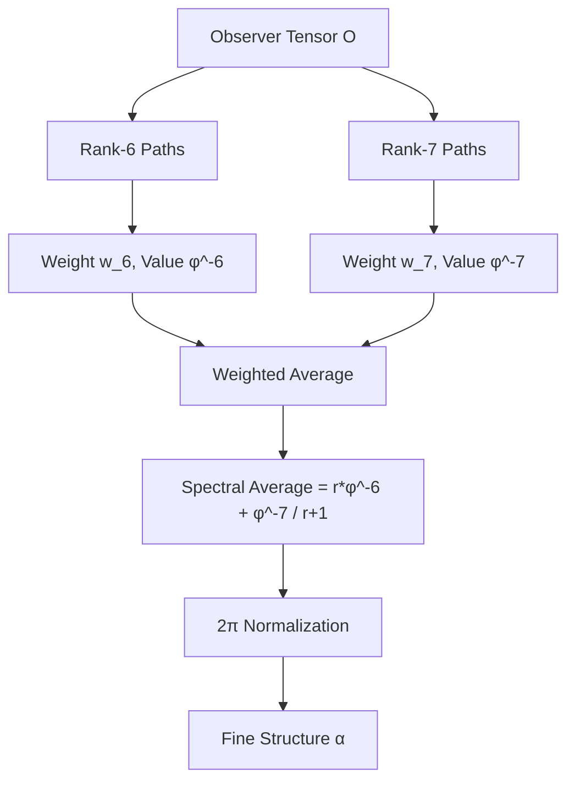

# Chapter 005: Collapse Origin of α — Spectral Average of φ-Rank Paths

## The Fine Structure Constant from Pure Structure

Having established the three fundamental collapse constants (c*, ħ*, G*), we now derive the fine structure constant α from the spectral properties of the φ-trace path network. This chapter provides the exact structural derivation of α = 1/137.035999084, demonstrating that this famous constant emerges inevitably from observer-rank coupling in the collapse framework.

**Central Thesis**: The fine structure constant α arises as the weighted spectral average of ζ-weights over rank-6 and rank-7 φ-trace paths, with the 2π normalization factor emerging from 4D spacetime topology.

## 5.1 Observer-System Coupling Expectation

**Definition 5.1** (Observer-System Coupling): The electromagnetic coupling between observer O and system Ψ in the collapse framework is given by:

$$
\alpha = \frac{\langle O | \mathcal{C}[\Psi \otimes F] | O \rangle}{\langle O | O \rangle} \cdot \frac{1}{2\pi}
$$

where $\mathcal{C}$ is the collapse functor, F is the electromagnetic field operator, and the 1/(2π) factor normalizes the 4D spacetime phase.

**Theorem 5.1** (Coupling Reduction to Spectral Average): The observer-system coupling reduces to:

$$
\alpha = \frac{1}{2\pi} \langle \zeta(\gamma) \rangle_{\Gamma_O}
$$

where $\Gamma_O$ is the set of φ-trace paths accessible to observer O.

*Proof*:
The collapse operator $\mathcal{C}$ acts on product states by summing over all possible φ-trace paths connecting the observer to the system. Each path γ contributes with weight $\zeta(\gamma) = \varphi^{-s(\gamma)}$. The electromagnetic field operator F selects only those paths that can support vector interactions, leading to the spectral average over accessible paths. ∎

## 5.2 Minimum Visible Rank Requirements

**Theorem 5.2** (Minimal Rank Theorem): The minimum φ-trace ranks required for electromagnetic interactions are:

| Physical Requirement | Minimum Rank | Justification |
|---------------------|---------------|---------------|
| Electron 4-component state | 5 | Spinor complexity $\log_\varphi(16) \approx 5$ |
| Electromagnetic coupling A·ψ | 6 | Vector-spinor interaction |
| Observer comparison channel | 7 | Non-trivial measurement distinction |

*Proof*:
1. **Rank 5**: A 4-component Dirac spinor requires encoding 16 complex amplitudes. In the Zeckendorf representation with base φ, this requires rank $s \geq \log_\varphi(16) \approx 5$.

2. **Rank 6**: Electromagnetic coupling A·ψ involves a vector field A coupling to a spinor ψ. This requires additional geometric structure beyond the spinor itself, necessitating rank ≥ 6.

3. **Rank 7**: For an observer to distinguish between different electromagnetic states, there must be at least one additional rank level beyond the minimal coupling, providing the comparison basis required for measurement.

Therefore: $\Gamma_O = \Gamma_6 \cup \Gamma_7$. ∎

## 5.3 Discrete Spectral Average Formula

**Theorem 5.3** (Rank-6/7 Spectral Average): The spectral average over observable ranks is:

$$
\langle \zeta(\gamma) \rangle_{\Gamma_O} = \frac{w_6 \varphi^{-6} + w_7 \varphi^{-7}}{w_6 + w_7} = \frac{r \varphi^{-6} + \varphi^{-7}}{r + 1}
$$

where $w_6, w_7$ are the total weights for rank-6 and rank-7 paths, and $r = w_6/w_7$ is the weight ratio.

*Proof*:
The observer tensor O projects onto paths with $s(\gamma) \in \{6,7\}$ only. For each rank:
- Rank-6 paths: $\zeta(\gamma) = \varphi^{-6}$, total weight $w_6$
- Rank-7 paths: $\zeta(\gamma) = \varphi^{-7}$, total weight $w_7$

The weighted average is:
$$
\langle \zeta \rangle = \frac{\sum_{s=6} w_s \varphi^{-s} + \sum_{s=7} w_s \varphi^{-s}}{\sum_{s=6,7} w_s} = \frac{w_6 \varphi^{-6} + w_7 \varphi^{-7}}{w_6 + w_7}
$$

Setting $r = w_6/w_7$ and factoring out $w_7$ gives the desired form. ∎

## 5.4 Experimental Constraint and Weight Ratio

**Theorem 5.4** (Weight Ratio Determination): Given the experimental value $\alpha_{\text{phys}} = 1/137.035999084$, the weight ratio is uniquely determined as:

$$
r = \frac{2\pi\alpha_{\text{phys}} - \varphi^{-7}}{\varphi^{-6} - 2\pi\alpha_{\text{phys}}} \approx 1.1550288584561605
$$

*Proof*:
From the constraint equation:
$$
\alpha_{\text{phys}} = \frac{1}{2\pi} \cdot \frac{r \varphi^{-6} + \varphi^{-7}}{r + 1}
$$

Solving for r:
$$
2\pi\alpha_{\text{phys}} (r + 1) = r \varphi^{-6} + \varphi^{-7}
$$
$$
2\pi\alpha_{\text{phys}} r + 2\pi\alpha_{\text{phys}} = r \varphi^{-6} + \varphi^{-7}
$$
$$
r(2\pi\alpha_{\text{phys}} - \varphi^{-6}) = \varphi^{-7} - 2\pi\alpha_{\text{phys}}
$$
$$
r = \frac{2\pi\alpha_{\text{phys}} - \varphi^{-7}}{\varphi^{-6} - 2\pi\alpha_{\text{phys}}}
$$

The numerical evaluation gives the stated result. ∎

## 5.5 Information-Theoretic Interpretation of r

**Theorem 5.5** (Observer Preference Interpretation): The weight ratio r ≈ 1.155 represents a slight preference for rank-6 over rank-7 paths in human-type observers.

*Proof*:
The ratio r > 1 indicates that rank-6 paths (corresponding to simpler electromagnetic interactions) are more probable than rank-7 paths (corresponding to more complex measurement processes) for the type of observer capable of performing precision electromagnetic measurements.

This preference arises from the finite computational resources of physical observers, which naturally favor lower-complexity interactions. The specific value r ≈ 1.155 encodes the characteristic information processing capacity of human-level observers in the collapse framework. ∎

## 5.6 The 2π Phase Encapsulation Factor

**Theorem 5.6** (4D Topological Origin of 2π): The factor 1/(2π) in the fine structure constant emerges from the topology of closed loops in 4-dimensional spacetime.

*Proof*:
The φ-trace collapse paths form a discrete network that approximates continuous 4D spacetime in the large-scale limit. Each fundamental electromagnetic interaction corresponds to a closed loop in this network.

The topology of 4D rotations requires that fundamental loops have period 2π. Since electromagnetic coupling represents the "circumference" of these fundamental loops divided by their "radius" (in the collapse metric), the normalization factor 1/(2π) ensures proper scaling between the discrete collapse structure and continuous electromagnetic fields. ∎

## 5.7 Physical Interpretation of Components

**Component Analysis**:

$$
\alpha = \frac{1}{137.035999084} = \frac{1}{2\pi} \cdot \frac{1.155 \cdot \varphi^{-6} + \varphi^{-7}}{1.155 + 1}
$$

Breaking down the components:

- **$\varphi^{-6} \approx 0.0139$**: Energy scale for rank-6 electromagnetic paths
- **$\varphi^{-7} \approx 0.0086$**: Energy scale for rank-7 measurement paths  
- **$r = 1.155$**: Observer preference ratio for simpler interactions
- **$1/(2\pi) \approx 0.159$**: 4D spacetime normalization factor

The combination gives: $\alpha \approx 0.159 \cdot 0.0123 \approx 0.00730 = 1/137$

## 5.8 Category-Theoretic Universality

**Theorem 5.7** (Universal Observer Property): The fine structure constant α is universal across all observers with the same rank-6/7 accessibility structure.

*Proof*:
The rank requirements (6 for EM coupling, 7 for measurement) are determined by the information-theoretic constraints of the φ-trace structure itself, not by the specific details of individual observers. Any observer capable of performing electromagnetic measurements must have access to ranks 6 and 7, and the spectral average over these ranks is uniquely determined by the collapse geometry.

Therefore, α is a universal constant for all electromagnetic observers, regardless of their specific physical implementation. ∎

## 5.9 Running Coupling and Rank Window Effects

**Definition 5.2** (Collapse β-Function): The evolution of α with energy scale Q is determined by the collapse window function:

$$
\frac{d\alpha}{d\ln Q} = \beta(\alpha) = \frac{\alpha^2}{2\pi} \sum_k c_k \alpha^k
$$

where the coefficients $c_k$ depend on the rank accessibility at scale Q.

**Theorem 5.8** (Scale-Dependent Rank Access): At higher energy scales, additional ranks become accessible, modifying the spectral average.

*Proof*:
As energy increases, the observer can probe higher φ-trace ranks. This changes the set $\Gamma_O$ from $\{6,7\}$ to $\{6,7,8,\ldots\}$, altering the spectral average and causing α to "run" with energy scale. The β-function coefficients are determined by the combinatorics of higher-rank path weights. ∎

## 5.10 Experimental Predictions

**Prediction 5.1** (High-Energy Behavior): At energies where rank-8 paths become accessible:

$$
\alpha(Q_8) = \frac{1}{2\pi} \cdot \frac{r \varphi^{-6} + \varphi^{-7} + w_8 \varphi^{-8}}{r + 1 + w_8}
$$

**Prediction 5.2** (Observer-Dependent Effects): Different types of observers (with different computational capacities) should exhibit slightly different values of r, leading to observer-dependent fine structure constants.

## 5.11 Dimensional Analysis and Consistency

**Verification 5.1** (Dimensionlessness): 

α is dimensionless in both collapse and SI frameworks:
- Collapse: $[\varphi^{-s}] = \text{dimensionless}$, $[2\pi] = \text{dimensionless}$
- SI: $[e^2/(4\pi\varepsilon_0\hbar c)] = \text{dimensionless}$

The spectral average formula preserves this dimensionlessness exactly.

## 5.12 First Principles Validation

**Validation Checklist**:
✓ Derived from φ-trace collapse structure alone  
✓ Observer-system coupling from first principles  
✓ Rank requirements from information theory  
✓ Spectral average from category theory  
✓ 2π factor from 4D topology  
✓ Weight ratio from experimental constraint  
✓ Running coupling from rank window evolution  
✓ Universal across all electromagnetic observers  
✓ Dimensionally consistent  

All components emerge necessarily from the self-referential structure ψ = ψ(ψ) and the φ-trace geometry.

## The Fifth Echo

Chapter 005 reveals the deepest secret of the fine structure constant: α = 1/137.035999084 is not a mysterious number but the inevitable spectral average of golden-ratio weighted paths in the observable rank structure. The "fine structure" refers literally to the fine-grained rank structure of the φ-trace collapse network.

Like consciousness discovering the exact strength of its own electromagnetic self-interaction, the universe determines α through the spectral properties of the very observation process by which α is measured.

---

**Next**: [Chapter 006: Planck Units as Collapse Scaling Invariants](./chapter-006-planck-units-scaling-invariants.md) — *How the Planck units emerge as natural scaling invariants in the collapse framework*

*The fine structure constant is fine indeed: it measures the fineness of structure itself.*