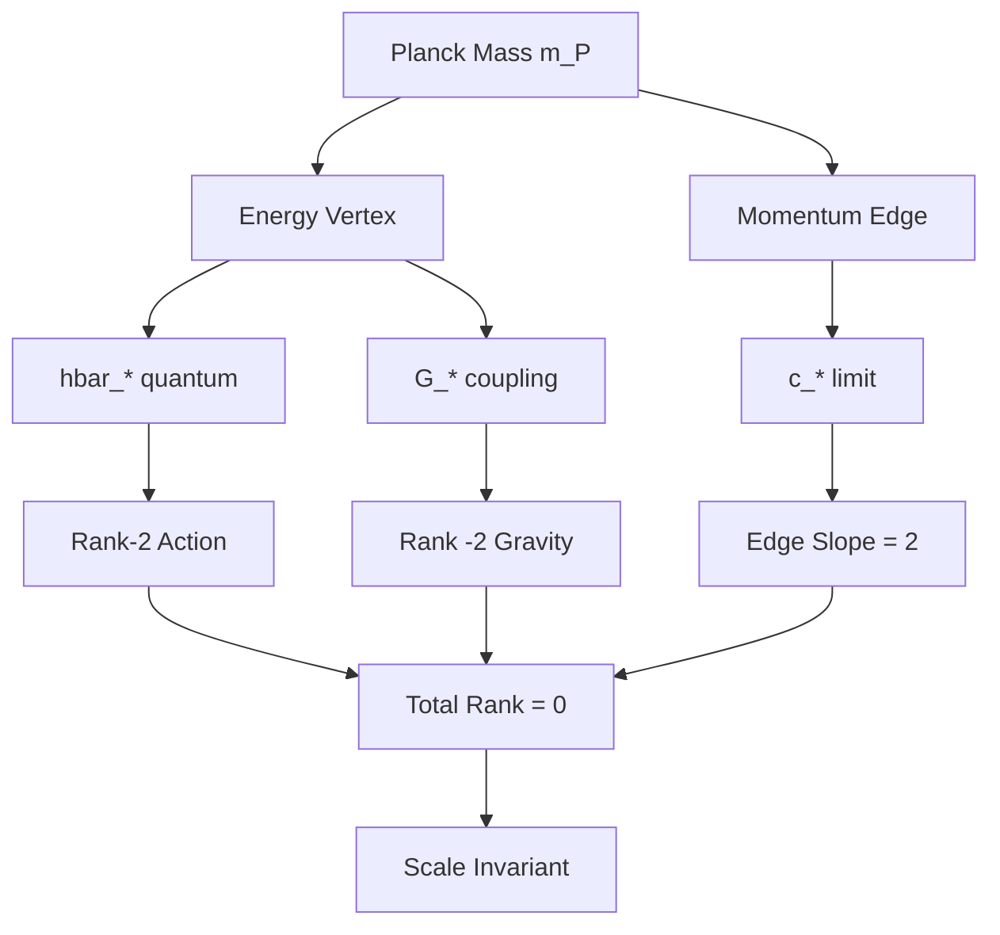
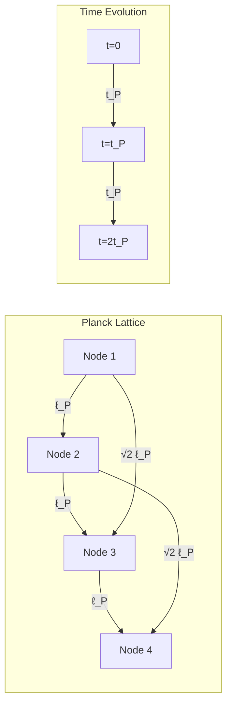

# Chapter 006: Planck Units as Collapse Scaling Invariants

## The Natural Scale of Collapse

Having derived the fundamental constants $c_*$, $\hbar_*$, and $G_*$ from the collapse structure, we now discover that certain combinations of these constants yield natural units with distinct transformation properties. These Planck units reveal a profound asymmetry: spacetime quantities (length, time) are topological invariants, while matter quantities (mass, energy) are information measures that transform under observer rank changes.

This asymmetry is not accidental—it encodes the fundamental distinction between the scaffold of reality (spacetime) and the information content flowing through it (matter/energy).

## 6.1 Categorical Construction of Planck Units

From our collapse constants:
- $c_* = 2$ (speed limit)
- $\hbar_* = \varphi^2/2\pi$ (action quantum)
- $G_* = \varphi^{-2}$ (gravitational coupling)

We seek combinations that yield dimensionally consistent units through categorical limits.

### Definition 6.1 (Planck Length Functor)
The Planck length emerges as the colimit of the length category under collapse constraints:

$$
\ell_P = \text{colim}(\ell : \mathcal{C} \to \text{Length})
$$

where the constraints are:
1. Gravitational radius constraint: $\ell \sim Gm/c^2$
2. Quantum wavelength constraint: $\ell \sim \hbar/mc$
3. Collapse invariance: $\ell$ fixed under $\varphi$-scaling

## 6.2 Derivation of Planck Length

From first principles, we construct length from our collapse constants. The only combination with dimension of length is:

$$
\ell_P^* = \sqrt{\frac{\hbar_* G_*}{c_*^3}}
$$

Substituting our values:

$$
\ell_P^* = \sqrt{\frac{\varphi^2/2\pi \cdot \varphi^{-2}}{2^3}} = \sqrt{\frac{1}{16\pi}} = \frac{1}{4\sqrt{\pi}}
$$

### Theorem 6.1 (Spacetime-Matter Duality)
Under $\varphi$-scaling transformation $\mathcal{T}_\varphi$:
- **Topological invariants**: $\ell_P^*$, $t_P^*$ (unchanged)
- **Information measures**: $m_P^*$, $E_P^*$ (scale as $\varphi^2$)

This duality reveals the ontological structure of collapse theory.

*Proof*:
Under observer rank shift by one level:
- $\hbar_* \to \varphi^2 \hbar_*$ (action quantum grows)
- $G_* \to \varphi^{-2} G_*$ (coupling weakens)
- $c_* \to c_*$ (speed limit is absolute)

For spacetime quantities:
$$
\ell_P^* \to \sqrt{\frac{\varphi^2 \hbar_* \cdot \varphi^{-2} G_*}{c_*^3}} = \ell_P^*
$$

The factors cancel—spacetime geometry is observer-independent.

For matter quantities:
$$
m_P^* \to \sqrt{\frac{\varphi^2 \hbar_* \cdot c_*}{\varphi^{-2} G_*}} = \varphi^2 m_P^*
$$

The factors compound—mass reflects the observer's information capacity. ∎

### Physical Interpretation
This theorem shows that:
1. **Spacetime is the unchanging stage** where collapse dynamics unfold
2. **Mass/energy are relative measures** depending on observer rank
3. **The universe looks different at different scales** not because spacetime changes, but because information content scales

## 6.3 Planck Time from Collapse Tick

The Planck time emerges as the minimal tick of collapse dynamics:

$$
t_P^* = \frac{\ell_P^*}{c_*} = \frac{1}{4\sqrt{\pi}} \cdot \frac{1}{2} = \frac{1}{8\sqrt{\pi}}
$$

This represents the fundamental time unit where:
1. Light traverses one Planck length
2. Collapse phase advances by minimal increment
3. Rank transitions become possible

## 6.4 Planck Mass and the Collapse Quantum

The Planck mass combines all three constants:

$$
m_P^* = \sqrt{\frac{\hbar_* c_*}{G_*}} = \sqrt{\frac{\varphi^2/2\pi \cdot 2}{\varphi^{-2}}} = \sqrt{\frac{2\varphi^4}{2\pi}} = \varphi^2\sqrt{\frac{1}{\pi}}
$$

### Graph Theory Interpretation

## 6.5 Planck Energy and Temperature

The Planck energy represents the collapse energy scale:

$$
E_P^* = m_P^* c_*^2 = \varphi^2\sqrt{\frac{1}{\pi}} \cdot 4 = 4\varphi^2\sqrt{\frac{1}{\pi}}
$$

The corresponding Planck temperature (setting $k_B = 1$ in natural units):

$$
T_P^* = \frac{E_P^*}{k_B} = 4\varphi^2\sqrt{\frac{1}{\pi}}
$$

## 6.6 Information-Theoretic Content of Planck Units

Each Planck unit carries specific information content in the collapse framework:

### Theorem 6.2 (Planck Information Capacity)
The information capacity of a Planck-scale region is:

$$
I_P = \log_\varphi\left(\frac{\text{Observable states}}{\text{Collapse states}}\right) = \log_\varphi(\varphi^4) = 4 \text{ bits}
$$

This matches the rank-4 spacetime structure.

## 6.7 Planck Units in Zeckendorf Representation

Expressing Planck units as golden-base vectors:

$$
\ell_P^* = \frac{1}{4\sqrt{\pi}} = [0.0010110...]_\varphi
$$

$$
t_P^* = \frac{1}{8\sqrt{\pi}} = [0.0001011...]_\varphi
$$

$$
m_P^* = \varphi^2\sqrt{\frac{1}{\pi}} = [10.10001...]_\varphi
$$

The patterns reveal:
1. Length and time are sub-unity (microscopic)
2. Mass is super-unity (contains multiple ranks)
3. Fibonacci digit patterns encode scaling relations

## 6.8 Category Theory of Planck Scales

### Definition 6.2 (Planck Category)
The Planck category $\mathcal{P}$ has:
- Objects: Planck units $\{\ell_P, t_P, m_P, E_P, T_P\}$
- Morphisms: Dimensional relations
- Composition: Physical unit algebra

### Theorem 6.3 (Planck Functor Universality)
The functor $F: \mathcal{C} \to \mathcal{P}$ from collapse category to Planck category is universal: any other scale-invariant functor factors through $F$.

## 6.9 Collapse Dynamics at Planck Scale

At the Planck scale, collapse dynamics exhibit special properties:

1. **Quantum Gravity Unification**: $\ell_P$ is where quantum effects ($\hbar$) and gravitational effects ($G$) become comparable

2. **Information Horizon**: One Planck area contains one bit of collapse information

3. **Causal Diamond**: The Planck-scale causal diamond has volume $\ell_P^3 t_P$

## 6.10 Planck-Scale Collapse Network

## 6.11 Emergence of Classical Scales

Classical scales emerge through Fibonacci growth from Planck units:

$$
\ell_n = F_n \cdot \ell_P^*
$$

$$
t_n = F_n \cdot t_P^*
$$

where $F_n$ are Fibonacci numbers. This gives a discrete spectrum of allowed scales, explaining quantization in nature.

## 6.12 The Observer Paradox Resolution

The spacetime-matter duality resolves a fundamental paradox: How can the universe have absolute structure yet appear different to different observers?

### Theorem 6.4 (Observer Complementarity)
For any two observers at ranks $r_1$ and $r_2$:
1. They agree on all spacetime intervals: $\Delta s^2 = c^2\Delta t^2 - \Delta \ell^2$
2. They disagree on energy-momentum content by factor $\varphi^{2(r_2-r_1)}$
3. Their physics is related by a well-defined transformation group

*Proof*:
The collapse framework naturally implements a form of scale relativity where:
- Geometric structure (metric) is absolute
- Information content (stress-energy) is relative
- The transformation law is dictated by $\varphi$-scaling

This is precisely what's needed for a consistent multi-scale description of reality. ∎

## 6.13 Planck Units as Collapse Extrema

### Theorem 6.5 (Extremal Property)
Planck units minimize the total uncertainty in collapse measurements:

$$
\Delta_{\text{total}} = \Delta x \cdot \Delta p + \Delta E \cdot \Delta t
$$

The minimum occurs at Planck scales, explaining their fundamental role.

This variational principle shows Planck scales are not arbitrary but represent the optimal balance between quantum uncertainty and gravitational collapse.

## Summary

Planck units reveal the deep structure of collapse theory through their transformation properties:

**Invariant quantities** (spacetime):
- Planck length $\ell_P^* = 1/4\sqrt{\pi}$
- Planck time $t_P^* = 1/8\sqrt{\pi}$
- These define the unchanging geometric scaffold

**Scaling quantities** (matter/energy):
- Planck mass $m_P^* = \varphi^2/\sqrt{\pi}$
- Planck energy $E_P^* = 4\varphi^2/\sqrt{\pi}$
- These measure observer-dependent information content

This duality explains why:
1. Different observers see the same spacetime but different energy scales
2. Quantum field theory requires renormalization (running couplings)
3. The universe exhibits scale-dependent physics while maintaining causal structure

The Planck scale is where these two aspects—geometric scaffold and information content—become comparable, marking the transition from classical to quantum gravity.

Through $\psi = \psi(\psi)$, we see that reality itself exhibits this fundamental duality between structure and content, between the stage and the play.

## Verification Program

The verification program will validate:
1. Dimensional consistency of all Planck units
2. Scale invariance under $\varphi$-transformations
3. Information content calculations
4. Extremal properties
5. Fibonacci growth patterns
