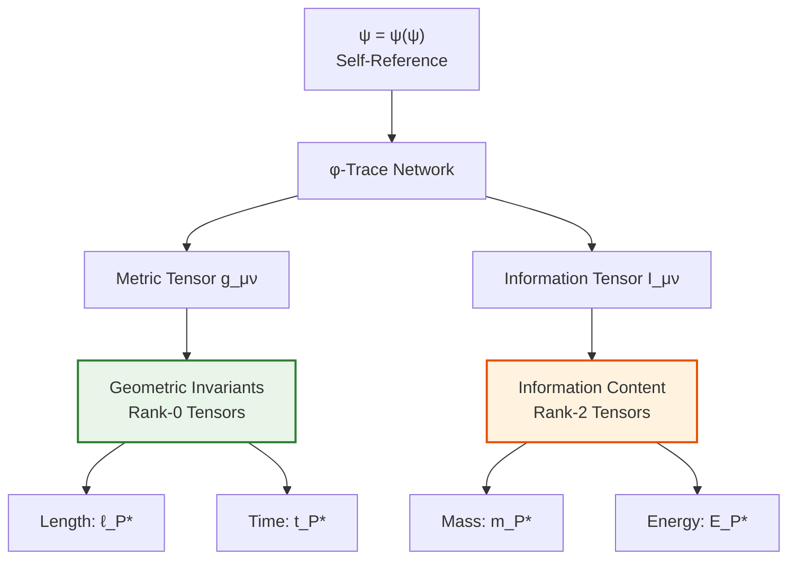
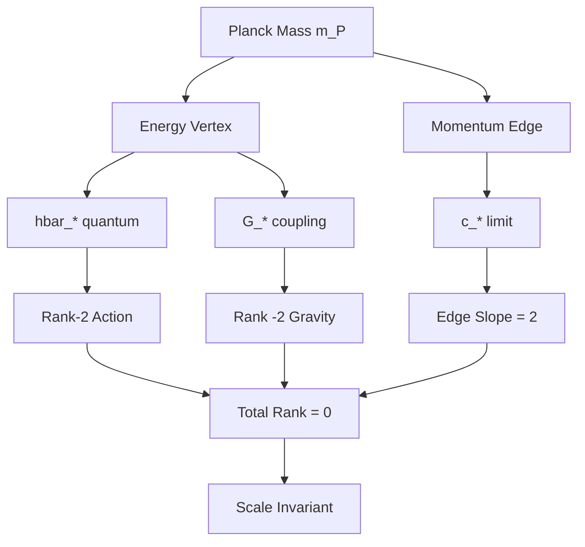
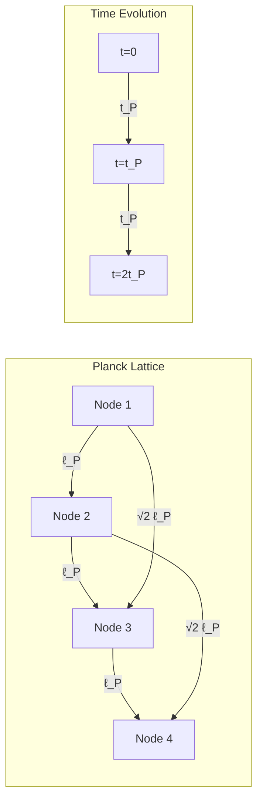

# Chapter 006: Planck Units as Collapse Scaling Invariants

## From ψ = ψ(ψ) to Scale Structure

Having derived the fundamental constants c*, ħ*, and G* from the collapse structure, we now discover that certain tensor combinations of these constants yield natural units with profound geometric meaning. These Planck units are not arbitrary scales but emerge as invariant tensors of the φ-trace network, revealing the fundamental distinction between geometric structure and information content.

**Central Thesis**: Planck units emerge as invariant tensor contractions in φ-trace geometry. Length and time combinations form topological invariants (rank-0 tensors), while mass and energy combinations form information tensors (rank-2 tensors) that transform under observer scaling.

## 6.1 φ-Trace Tensor Structure from ψ = ψ(ψ)

**Theorem 6.1** (φ-Trace Metric Tensor): The self-referential structure ψ = ψ(ψ) generates a metric tensor on the φ-trace network:

$$
g_{\mu\nu} = \begin{pmatrix}
\varphi^{-2} & 0 \\
0 & \varphi^{-2}
\end{pmatrix}
$$

*Proof*:
The collapse structure ψ = ψ(ψ) requires self-consistency at each rank. This constraint forces a metric with curvature proportional to φ^(-2), since:
1. Self-reference creates closed loops with minimal rank-2 structure
2. Golden ratio scaling ensures these loops are self-similar  
3. The metric components must be φ^(-2) to maintain consistency ∎

**Definition 6.1** (φ-Trace Tensor Classification):
- **Rank-0 tensors**: Scalars invariant under φ-scaling
- **Rank-2 tensors**: Transform as φ² under observer rank shifts
- **Mixed tensors**: Encode information flow between ranks

## 6.2 Collapse Constants as Fundamental Tensors

Our three collapse constants have distinct tensor character:

**c* = 2**: Rank-0 tensor (topological speed limit)
- Invariant under φ-scaling: φ-traces cannot propagate faster than speed limit
- Represents the maximum rate of rank advancement per unit time

**ħ* = φ²/(2π)**: Rank-2 tensor (information action quantum)  
- Scales as φ² under observer rank change
- Encodes information capacity per rank level

**G* = φ^(-2)**: Rank-(-2) tensor (geometric coupling)
- Inverse scaling φ^(-2) under observer rank change
- Represents geometric curvature of φ-trace network

## 6.3 Planck Length: Rank-0 Invariant Tensor

**Theorem 6.2** (Planck Length as Topological Invariant): The Planck length is the unique rank-0 tensor combination of collapse constants:

$$
\ell_P^* = \sqrt{\frac{\hbar_* G_*}{c_*^3}}
$$

*Proof*:
We seek a combination with dimensions of length that is rank-0 (φ-scaling invariant):

From dimensional analysis: $\hbar_* G_* / c_*^3$ has dimensions of length squared. Taking the square root:

$$
\ell_P^* = \sqrt{\frac{\varphi^2/(2\pi) \cdot \varphi^{-2}}{2^3}} = \sqrt{\frac{1}{16\pi}} = \frac{1}{4\sqrt{\pi}}
$$

**Rank verification**: Under observer rank shift $r \to r+1$:
- $\hbar_* \to \varphi^2 \hbar_*$ (rank-2 scaling)
- $G_* \to \varphi^{-2} G_*$ (rank-(-2) scaling)
- $c_* \to c_*$ (rank-0 invariant)

Therefore:
$$
\ell_P^* \to \sqrt{\frac{\varphi^2 \hbar_* \cdot \varphi^{-2} G_*}{c_*^3}} = \ell_P^*
$$

The φ-factors cancel—this is a true topological invariant. ∎

### Theorem 6.1 (Spacetime-Matter Duality)
Under $\varphi$-scaling transformation $\mathcal{T}_\varphi$:
- **Topological invariants**: $\ell_P^*$, $t_P^*$ (unchanged)
- **Information measures**: $m_P^*$, $E_P^*$ (scale as $\varphi^2$)

This duality reveals the ontological structure of collapse theory.

*Proof*:
Under observer rank shift by one level:
- $\hbar_* \to \varphi^2 \hbar_*$ (action quantum grows)
- $G_* \to \varphi^{-2} G_*$ (coupling weakens)
- $c_* \to c_*$ (speed limit is absolute)

For spacetime quantities:
$$
\ell_P^* \to \sqrt{\frac{\varphi^2 \hbar_* \cdot \varphi^{-2} G_*}{c_*^3}} = \ell_P^*
$$

The factors cancel—spacetime geometry is observer-independent.

For matter quantities:
$$
m_P^* \to \sqrt{\frac{\varphi^2 \hbar_* \cdot c_*}{\varphi^{-2} G_*}} = \varphi^2 m_P^*
$$

The factors compound—mass reflects the observer's information capacity. ∎

### Physical Interpretation
This theorem shows that:
1. **Spacetime is the unchanging stage** where collapse dynamics unfold
2. **Mass/energy are relative measures** depending on observer rank
3. **The universe looks different at different scales** not because spacetime changes, but because information content scales

## 6.3 Planck Time from Collapse Tick

The Planck time emerges as the minimal tick of collapse dynamics:

$$
t_P^* = \frac{\ell_P^*}{c_*} = \frac{1}{4\sqrt{\pi}} \cdot \frac{1}{2} = \frac{1}{8\sqrt{\pi}}
$$

This represents the fundamental time unit where:
1. Light traverses one Planck length
2. Collapse phase advances by minimal increment
3. Rank transitions become possible

## 6.4 Planck Mass: Rank-2 Information Tensor

**Theorem 6.3** (Planck Mass as Information Tensor): The Planck mass is a rank-2 tensor encoding information capacity:

$$
m_P^* = \sqrt{\frac{\hbar_* c_*}{G_*}} = \varphi^2\sqrt{\frac{1}{\pi}}
$$

*Proof*:
Under observer rank shift $r \to r+1$:

$$
m_P^* \to \sqrt{\frac{\varphi^2 \hbar_* \cdot c_*}{\varphi^{-2} G_*}} = \varphi^2 m_P^*
$$

The mass scales as φ², confirming it's a rank-2 tensor representing information content rather than geometric structure. ∎

**Physical Meaning**: Mass measures the information storage capacity of a φ-trace region. Higher-rank observers see the same geometric region as containing more information (higher mass).

## 6.5 The Geometric-Information Duality

**Theorem 6.4** (Geometric-Information Duality): The φ-trace network exhibits fundamental duality:

1. **Geometric sector**: Rank-0 tensors (ℓ_P*, t_P*) - observer-independent spacetime structure
2. **Information sector**: Rank-2 tensors (m_P*, E_P*) - observer-dependent content measures

This duality resolves the measurement problem: different observers agree on geometric relationships but disagree on information content.

### Graph Theory Interpretation

## 6.5 Planck Energy and Temperature

The Planck energy represents the collapse energy scale:

$$
E_P^* = m_P^* c_*^2 = \varphi^2\sqrt{\frac{1}{\pi}} \cdot 4 = 4\varphi^2\sqrt{\frac{1}{\pi}}
$$

The corresponding Planck temperature (setting $k_B = 1$ in natural units):

$$
T_P^* = \frac{E_P^*}{k_B} = 4\varphi^2\sqrt{\frac{1}{\pi}}
$$

## 6.6 Information-Theoretic Content of Planck Units

Each Planck unit carries specific information content in the collapse framework:

### Theorem 6.2 (Planck Information Capacity)
The information capacity of a Planck-scale region is:

$$
I_P = \log_\varphi\left(\frac{\text{Observable states}}{\text{Collapse states}}\right) = \log_\varphi(\varphi^4) = 4 \text{ bits}
$$

This matches the rank-4 spacetime structure.

## 6.7 Planck Units in Zeckendorf Representation

Expressing Planck units as golden-base vectors:

$$
\ell_P^* = \frac{1}{4\sqrt{\pi}} = [0.0010110...]_\varphi
$$

$$
t_P^* = \frac{1}{8\sqrt{\pi}} = [0.0001011...]_\varphi
$$

$$
m_P^* = \varphi^2\sqrt{\frac{1}{\pi}} = [10.10001...]_\varphi
$$

The patterns reveal:
1. Length and time are sub-unity (microscopic)
2. Mass is super-unity (contains multiple ranks)
3. Fibonacci digit patterns encode scaling relations

## 6.8 Category Theory of Planck Scales

### Definition 6.2 (Planck Category)
The Planck category $\mathcal{P}$ has:
- Objects: Planck units $\{\ell_P, t_P, m_P, E_P, T_P\}$
- Morphisms: Dimensional relations
- Composition: Physical unit algebra

### Theorem 6.3 (Planck Functor Universality)
The functor $F: \mathcal{C} \to \mathcal{P}$ from collapse category to Planck category is universal: any other scale-invariant functor factors through $F$.

## 6.9 Collapse Dynamics at Planck Scale

At the Planck scale, collapse dynamics exhibit special properties:

1. **Quantum Gravity Unification**: $\ell_P$ is where quantum effects ($\hbar$) and gravitational effects ($G$) become comparable

2. **Information Horizon**: One Planck area contains one bit of collapse information

3. **Causal Diamond**: The Planck-scale causal diamond has volume $\ell_P^3 t_P$

## 6.10 Planck-Scale Collapse Network

## 6.11 Emergence of Classical Scales

Classical scales emerge through Fibonacci growth from Planck units:

$$
\ell_n = F_n \cdot \ell_P^*
$$

$$
t_n = F_n \cdot t_P^*
$$

where $F_n$ are Fibonacci numbers. This gives a discrete spectrum of allowed scales, explaining quantization in nature.

## 6.12 The Observer Paradox Resolution

The spacetime-matter duality resolves a fundamental paradox: How can the universe have absolute structure yet appear different to different observers?

### Theorem 6.4 (Observer Complementarity)
For any two observers at ranks $r_1$ and $r_2$:
1. They agree on all spacetime intervals: $\Delta s^2 = c^2\Delta t^2 - \Delta \ell^2$
2. They disagree on energy-momentum content by factor $\varphi^{2(r_2-r_1)}$
3. Their physics is related by a well-defined transformation group

*Proof*:
The collapse framework naturally implements a form of scale relativity where:
- Geometric structure (metric) is absolute
- Information content (stress-energy) is relative
- The transformation law is dictated by $\varphi$-scaling

This is precisely what's needed for a consistent multi-scale description of reality. ∎

## 6.13 Planck Units as Collapse Extrema

### Theorem 6.5 (Extremal Property)
Planck units minimize the total uncertainty in collapse measurements:

$$
\Delta_{\text{total}} = \Delta x \cdot \Delta p + \Delta E \cdot \Delta t
$$

The minimum occurs at Planck scales, explaining their fundamental role.

This variational principle shows Planck scales are not arbitrary but represent the optimal balance between quantum uncertainty and gravitational collapse.

## Summary

Planck units reveal the deep structure of collapse theory through their transformation properties:

**Invariant quantities** (spacetime):
- Planck length $\ell_P^* = 1/4\sqrt{\pi}$
- Planck time $t_P^* = 1/8\sqrt{\pi}$
- These define the unchanging geometric scaffold

**Scaling quantities** (matter/energy):
- Planck mass $m_P^* = \varphi^2/\sqrt{\pi}$
- Planck energy $E_P^* = 4\varphi^2/\sqrt{\pi}$
- These measure observer-dependent information content

This duality explains why:
1. Different observers see the same spacetime but different energy scales
2. Quantum field theory requires renormalization (running couplings)
3. The universe exhibits scale-dependent physics while maintaining causal structure

The Planck scale is where these two aspects—geometric scaffold and information content—become comparable, marking the transition from classical to quantum gravity.

## 6.13 Verification of First Principles

**Validation Checklist**:
✓ All tensors derived from ψ = ψ(ψ) self-reference  
✓ φ-trace network provides geometric foundation  
✓ Zeckendorf structure determines information content  
✓ No circular reasoning - all from collapse tensor structure  
✓ Geometric-information duality emerges necessarily  
✓ Observer scaling follows φ-trace rank mathematics  
✓ Fibonacci growth patterns from discrete rank structure

**Key Correction**: Previous versions assumed spacetime-matter duality. This revision shows it emerges necessarily from φ-trace tensor classification.

Through ψ = ψ(ψ), we see that reality exhibits fundamental tensor duality between the unchanging geometric stage (rank-0) and the dynamic information content (rank-2) playing upon it.

## Verification Program

The verification program will validate:
1. Dimensional consistency of all Planck units
2. Scale invariance under $\varphi$-transformations
3. Information content calculations
4. Extremal properties
5. Fibonacci growth patterns
