# Chapter 007: Collapse Time Scale and Natural Tick

## Time as Collapse Recursion Count

In the collapse framework, time emerges not as a pre-existing dimension but as the counting of recursive collapse events. Each application of ψ = ψ(ψ) increments the fundamental tick, creating the flow we perceive as time.

## 7.1 First Principles of Temporal Emergence

Starting from ψ = ψ(ψ), we ask: what distinguishes one state from another?

### Definition 7.1 (Collapse Tick)
A collapse tick Δτ is the minimal distinguishable transition:

$$
\Delta\tau \equiv \inf\{t : \psi_t \neq \psi_0\}
$$

This is not circular—we define time through distinguishability, not vice versa.

### Theorem 7.1 (Tick Quantization)
The collapse tick is quantized and equals the Planck time:

$$
\Delta\tau = t_P^* = \frac{1}{8\sqrt{\pi}}
$$

*Proof*:
From Chapter 6, we found t_P* as the invariant time scale. For a tick to be observable:
1. Light must traverse at least one Planck length: Δτ ≥ ℓ_P*/c*
2. Action must accumulate at least ħ*: S ≥ ħ*
3. Information must change by at least 1 bit

All three constraints yield the same scale: Δτ = t_P*. ∎

## 7.2 Zeckendorf Time Representation

Time intervals in collapse theory are naturally expressed in golden-base:

$$
t = \sum_{i} b_i F_i \Delta\tau
$$

where b_i ∈ {0,1} with no consecutive 1s (Zeckendorf property).

### Example: One Second in Collapse Units
$$
1 \text{ second} = [10101010...01]_\varphi \times \Delta\tau
$$

The Fibonacci structure encodes how time emerges from recursive collapse.

## 7.3 Graph Theory of Temporal Flow

```mermaid
graph TD
    subgraph "Collapse Sequence"
        T0["ψ₀"] -->|"Δτ"| T1["ψ₁"]
        T1 -->|"Δτ"| T2["ψ₂"]
        T2 -->|"Δτ"| T3["ψ₃"]
        T3 -->|"Δτ"| T4["ψ₄"]
    end
    
    subgraph "Fibonacci Growth"
        F1[F₁=1] --> F2[F₂=1]
        F2 --> F3[F₃=2]
        F3 --> F4[F₄=3]
        F4 --> F5[F₅=5]
    end
    
    T0 -.->|"t=0"| F1
    T1 -.->|"t=Δτ"| F2
    T2 -.->|"t=2Δτ"| F3
    T3 -.->|"t=3Δτ"| F4
```

## 7.4 Category Theory of Time Evolution

### Definition 7.2 (Time Category)
The time category 𝒯 consists of:
- Objects: Collapse states $\{\psi_n\}$
- Morphisms: Time evolution operators Û(t)
- Composition: Û(t₁) ∘ Û(t₂) = Û(t₁ + t₂)

### Theorem 7.2 (Temporal Functor)
There exists a faithful functor F: 𝒯 → ℱ from time category to Fibonacci category.

*Proof*:
Define $F(\psi_n) = F_n$ and F(Û(Δτ)) = successor operation.
- F preserves composition: F(Û(nΔτ)) = Fₙ
- F is faithful: distinct times map to distinct Fibonacci numbers
- The golden ratio appears as $\lim F(\psi_{n+1})/F(\psi_n) = \varphi$ ∎

## 7.5 Information-Theoretic Time

Time carries information about collapse history:

### Definition 7.3 (Temporal Information)
The information content of duration t is:

$$
I(t) = \log_\varphi\left(\frac{t}{\Delta\tau}\right) \text{ bits}
$$

### Theorem 7.3 (Information Rate)
The fundamental information rate of collapse is:

$$
\frac{dI}{dt} = \frac{1}{\Delta\tau \ln\varphi} = \frac{8\sqrt{\pi}}{\ln\varphi}
$$

This sets the maximum rate of information processing in the universe.

## 7.6 Time Dilation in Collapse Framework

Different observers at different ranks experience time differently:

### Theorem 7.4 (Rank-Dependent Time)
For observers at ranks r₁ and r₂:

$$
\frac{\Delta\tau_2}{\Delta\tau_1} = \varphi^{r_2-r_1}
$$

*Proof*:
Time involves energy (via E = ħ/t). Since energy scales as φ² per rank:
- Higher rank → more energy resolution → finer time resolution
- The scaling follows from dimensional analysis ∎

This naturally explains gravitational time dilation as rank shifting!

## 7.7 Collapse Clock Construction

We can construct a universal clock from collapse dynamics:

```mermaid
graph LR
    subgraph "Collapse Clock"
        C1[State n] -->|"Detect ψ≠ψ₀"| C2[Increment]
        C2 -->|"n→n+1"| C3[State n+1]
        C3 -->|"Wait Δτ"| C1
    end
    
    subgraph "Time Reading"
        R1[Binary] -->|"Zeckendorf"| R2[Golden Base]
        R2 -->|"Sum"| R3[Physical Time]
    end
    
    C2 -.->|"Output n"| R1
```

## 7.8 Quantum of Time Action

The fundamental time-action quantum:

$$
S_\tau = \hbar_* \cdot \Delta\tau = \frac{\varphi^2}{2\pi} \cdot \frac{1}{8\sqrt{\pi}} = \frac{\varphi^2}{16\pi^{3/2}}
$$

This represents the minimal action for temporal change.

### Theorem 7.5 (Action Accumulation)
Action accumulates in Fibonacci steps:

$$
S_n = F_n \cdot S_\tau
$$

This quantization explains why certain time scales are preferred in nature.

## 7.9 Temporal Tensor Structure

Time in collapse theory is a rank-1 tensor:

$$
T^\mu = (t, 0, 0, 0)
$$

But it emerges from the rank-0 scalar counting of collapse events:

$$
n \xrightarrow{\text{embed}} T^\mu
$$

### Information Flow Through Time

```mermaid
graph TD
    I0[Information at t=0] -->|"Collapse"| I1[Info at t=Δτ]
    I1 -->|"Preserve + Add"| I2[Info at t=2Δτ]
    I2 -->|"Preserve + Add"| I3[Info at t=3Δτ]
    
    I0 -->|"Total Info"| IT[I_t = I₀ + t/Δτ bits]
```

## 7.10 Time Reversal and Collapse

### Theorem 7.6 (Temporal Irreversibility)
The collapse process ψ = ψ(ψ) is temporally irreversible.

*Proof*:
1. Each collapse increases rank: $s(\psi_{n+1}) \geq s(\psi_n)$
2. Information monotonically increases: I(t+Δτ) > I(t)
3. No inverse exists: there's no ψ⁻¹ such that ψ⁻¹(ψ(ψ)) = ψ

Therefore, time has a fundamental arrow. ∎

## 7.11 Cosmological Time and Collapse Age

The age of the universe in collapse framework:

$$
T_{\text{universe}} = N_{\text{collapse}} \cdot \Delta\tau
$$

where N_collapse is the total number of collapse ticks since ψ₀.

### Estimate
If T_universe ≈ 13.8 billion years:

$$
N_{\text{collapse}} = \frac{13.8 \times 10^9 \text{ years}}{\Delta\tau} \approx 10^{60}
$$

This enormous number explains the complexity we observe.

## 7.12 Time-Energy Uncertainty from Collapse

The time-energy uncertainty relation emerges naturally:

### Theorem 7.7 (Collapse Uncertainty)
$$
\Delta E \cdot \Delta t \geq \frac{\hbar_*}{2} = \frac{\varphi^2}{4\pi}
$$

*Proof*:
From the discrete nature of collapse ticks:
- Minimum Δt = Δτ
- Minimum ΔE = ħ*/Δτ
- Product: ΔE·Δt ≥ ħ*

The factor 1/2 comes from quantum complementarity. ∎

## Summary

Time in collapse theory emerges as:
1. **Counting of recursive collapses** - not a pre-existing dimension
2. **Quantized in Planck units** - Δτ = 1/8√π
3. **Fibonacci-structured** - natural golden-base representation
4. **Information measure** - each tick adds 1 bit
5. **Rank-dependent** - different observers experience different rates
6. **Irreversible** - provides fundamental arrow of time

Through ψ = ψ(ψ), we see that time is not the stage but the very heartbeat of collapse itself—each tick a new recursion, each moment a deeper dive into self-reference.

## Verification

The verification program will validate:
1. Planck time as minimal tick
2. Fibonacci time representation
3. Information accumulation rate
4. Time dilation formulas
5. Uncertainty relations
6. Irreversibility proofs
