```mermaid
graph TD
    subgraph "Collapse Sequence"
        T0["ψ₀"] -->|"Δτ"| T1["ψ₁"]
        T1 -->|"Δτ"| T2["ψ₂"]
        T2 -->|"Δτ"| T3["ψ₃"]
        T3 -->|"Δτ"| T4["ψ₄"]
    end
    
    subgraph "Fibonacci Growth"
        F1[F₁=1] --> F2[F₂=1]
        F2 --> F3[F₃=2]
        F3 --> F4[F₄=3]
        F4 --> F5[F₅=5]
    end
    
    T0 -.->|"t=0"| F1
    T1 -.->|"t=Δτ"| F2
    T2 -.->|"t=2Δτ"| F3
    T3 -.->|"t=3Δτ"| F4
```

# Chapter 007: Collapse Time Scale and Natural Tick

## Time as Binary State Transitions

In the binary universe where bits ∈ \{0,1\} with constraint "no consecutive 1s", time emerges not as a pre-existing dimension but as the counting of state transitions. Each transition 0→1 or 1→0 represents a fundamental collapse event, and the accumulation of these transitions generates the temporal flow we perceive.

**Central Thesis**: Time is the measure of binary state transitions in the φ-trace network. Each temporal tick Δτ represents the minimal duration for one bit to change state while respecting the "no consecutive 1s" constraint, creating the natural rhythm of collapse dynamics.

## 7.0 Binary Foundation of Temporal Emergence

**Theorem 7.0** (Binary Time Origin): Time emerges from the fundamental constraint of binary state transitions in a universe with "no consecutive 1s".

*Proof*:
1. **Binary Universe**: All states represented as bit strings with bits ∈ \{0,1\}
2. **Constraint**: No consecutive 1s allowed → valid sequences follow Fibonacci counting
3. **State Transition**: Changing any bit requires a fundamental duration
4. **Minimal Tick**: The time for one binary transition defines Δτ
5. **Accumulation**: Total time = number of transitions × Δτ

Time is literally the counting of how many bits have flipped. ∎

## 7.1 φ-Trace Rank Sequence from Binary Transitions

**Theorem 7.1** (Rank Advancement from Binary Operations): Each self-referential application ψ = ψ(ψ) corresponds to a specific pattern of binary state transitions that increases the system's rank.

*Proof*:
1. **Initial binary state**: ψ₀ = [0]_binary with rank r₀ = 0
2. **First transition**: ψ₁ = ψ(ψ₀) flips bit → [1]_binary, rank r₁ = 1
3. **Constraint enforcement**: Next valid state is [10]_binary (no consecutive 1s)
4. **Rank growth**: r_n = number of bits needed to represent state
5. **Fibonacci emergence**: Valid states at rank $n$ = $F_{n+2}$

The rank sequence follows Fibonacci growth due to the binary constraint. ∎

**Definition 7.1** (Binary Transition Time): The time required for one binary state transition is the fundamental temporal quantum:

$$
\Delta\tau_{\text{binary}} = \frac{\text{Energy to flip one bit}}{\text{Power available from binary channels}}
$$

Since the universe has exactly 2 channels (0 and 1), and energy flows at rate c* = 2, the minimal transition time is constrained by binary physics.

## 7.2 Temporal Tick from Binary Constraints

**Theorem 7.2** (Fundamental Temporal Tick): The collapse temporal tick emerges from the minimal time required for a binary state transition that respects the "no consecutive 1s" constraint:

$$
\Delta\tau = t_P^* = \frac{1}{8\sqrt{\pi}}
$$

*Proof*:
1. **Binary Transition Energy**: Flipping one bit requires energy E = ħ*/Δτ
2. **Channel Constraint**: Binary universe has exactly c* = 2 channels
3. **Spatial Propagation**: Information spreads at most ℓ = c* · Δτ per tick
4. **Consistency Requirement**: ℓ must equal the minimal information distance ℓ_P*

From the constraint ℓ_P* = c* · Δτ:
$$
\Delta\tau = \frac{\ell_P^*}{c_*} = \frac{1/(4\sqrt{\pi})}{2} = \frac{1}{8\sqrt{\pi}}
$$

This shows the Planck time emerges from binary transition constraints, not arbitrary choice. ∎

**Physical Picture**: Each tick Δτ is the time for one bit to flip from 0→1 or 1→0 while maintaining global consistency with the "no consecutive 1s" rule. The universe's clock ticks with each binary transition.

## 7.3 Binary Time Representation and Zeckendorf Structure

**Theorem 7.3** (Binary Time Encoding): Time intervals naturally encode as Zeckendorf representations due to the binary constraint:

$$
t = \sum_{i} b_i F_i \Delta\tau
$$

where b_i ∈ \{0,1\} with no consecutive 1s.

*Proof*:
1. **Binary States**: Each moment has a unique binary configuration
2. **Valid Sequences**: "No consecutive 1s" → Zeckendorf representation
3. **Time Measurement**: Count valid transitions from initial to final state
4. **Fibonacci Weighting**: F_i counts paths of length i

Time literally counts the binary edit distance between states. ∎

### Example: One Second in Binary Time
$$
1 \text{ second} = [10101010...01]_\varphi \times \Delta\tau
$$

This pattern shows ~10^{43} binary transitions occur in one second - each a collapse event.

## 7.4 Graph Theory of Binary Temporal Flow

## 7.5 Category Theory of Binary Time Evolution

### Definition 7.2 (Time Category)
The time category 𝒯 consists of:
- Objects: Collapse states $\{\psi_n\}$
- Morphisms: Time evolution operators Û(t)
- Composition: Û(t₁) ∘ Û(t₂) = Û(t₁ + t₂)

### Theorem 7.2 (Temporal Functor)
There exists a faithful functor F: 𝒯 → ℱ from time category to Fibonacci category.

*Proof*:
Define $F(\psi_n) = F_n$ and F(Û(Δτ)) = successor operation.
- F preserves composition: F(Û(nΔτ)) = Fₙ
- F is faithful: distinct times map to distinct Fibonacci numbers
- The golden ratio appears as $\lim F(\psi_{n+1})/F(\psi_n) = \varphi$ ∎

## 7.6 Information-Theoretic Time from Binary Accumulation

Time carries information about collapse history:

### Definition 7.3 (Temporal Information)
The information content of duration t is:

$$
I(t) = \log_\varphi\left(\frac{t}{\Delta\tau}\right) \text{ bits}
$$

### Theorem 7.3 (Information Rate)
The fundamental information rate of collapse is:

$$
\frac{dI}{dt} = \frac{1}{\Delta\tau \ln\varphi} = \frac{8\sqrt{\pi}}{\ln\varphi}
$$

This sets the maximum rate of information processing in the universe.

## 7.7 Observer-Dependent Time from Binary Processing Capacity

**Theorem 7.4** (Binary Processing and Temporal Resolution): Observers at different ranks have different binary processing capacities, leading to relative time dilation.

*Proof*:
1. **Binary Channels**: Observer at rank r can process φ^r binary channels in parallel
2. **Transition Rate**: Can execute φ^r transitions per fundamental tick
3. **Effective Time**: Δτ_effective = Δτ_fundamental / φ^r
4. **Relative Rates**: 
   
$$
\frac{\Delta\tau_{r_2}}{\Delta\tau_{r_1}} = \frac{\varphi^{r_1}}{\varphi^{r_2}} = \varphi^{-(r_2-r_1)}
$$
Higher-rank observers process more binary transitions per tick, experiencing faster subjective time. ∎

**Binary Interpretation**: An observer at rank 6 processes φ^6 ≈ 18 times more binary operations per tick than a rank-0 observer. This explains why complex systems (high rank) age faster - they complete more binary state transitions per cosmic tick.

**Connection to Gravity**: Regions of high information density (many bits per volume) have higher effective rank, processing time faster. This is the binary origin of gravitational time dilation.

## 7.8 Binary Collapse Clock Construction

We can construct a universal clock from collapse dynamics:

```mermaid
graph LR
    subgraph "Collapse Clock"
        C1[State $n$] -->|"Detect ψ≠ψ₀"| C2[Increment]
        C2 -->|"$n→n+1$"| C3[State $n+1$]
        C3 -->|"Wait Δτ"| C1
    end
    
    subgraph "Time Reading"
        R1[Binary] -->|"Zeckendorf"| R2[Golden Base]
        R2 -->|"Sum"| R3[Physical Time]
    end
    
    C2 -.->|"Output $n$"| R1
```

## 7.9 Quantum of Time Action from Binary Transitions

The fundamental time-action quantum:

$$
S_\tau = \hbar_* \cdot \Delta\tau = \frac{\varphi^2}{2\pi} \cdot \frac{1}{8\sqrt{\pi}} = \frac{\varphi^2}{16\pi^{3/2}}
$$

This represents the minimal action for temporal change.

### Theorem 7.5 (Action Accumulation)
Action accumulates in Fibonacci steps:

$$
S_n = F_n \cdot S_\tau
$$

This quantization explains why certain time scales are preferred in nature.

## 7.10 Temporal Tensor Structure in Binary Framework

Time in collapse theory is a rank-1 tensor:

$$
T^\mu = (t, 0, 0, 0)
$$

But it emerges from the rank-0 scalar counting of collapse events:

$$
n \xrightarrow{\text{embed}} T^\mu
$$

### Information Flow Through Time

```mermaid
graph TD
    I0[Information at t=0] -->|"Collapse"| I1[Info at t=Δτ]
    I1 -->|"Preserve + Add"| I2[Info at t=2Δτ]
    I2 -->|"Preserve + Add"| I3[Info at t=3Δτ]
    
    I0 -->|"Total Info"| IT[I_t = I₀ + t/Δτ bits]
```

## 7.11 Time Reversal and Binary Irreversibility

**Theorem 7.6** (Temporal Arrow from Binary Constraints): The arrow of time emerges from the irreversibility of binary transitions under the "no consecutive 1s" constraint.

*Proof*:
1. **Forward Transitions**: Many valid paths from state A to state B
   - Example: [1010] → [10010] (insert 0)
   - Example: [1010] → [10100] (append 0)
   
2. **Reverse Ambiguity**: Cannot uniquely reverse transitions
   - From [10010], which bit was inserted?
   - Information about path is lost
   
3. **Entropy Increase**: Number of valid states grows as $F_{n+2}$
   - Forward: unique destination
   - Backward: multiple origins
   
4. **Zeckendorf Uniqueness**: Each state has unique representation
   - But transition paths are not unique
   - Path information accumulates irreversibly

The binary constraint creates a one-way street for information flow. ∎

**Physical Picture**: Like typing on a keyboard - you can see the final text but cannot deduce the exact sequence of keystrokes. Each binary transition adds information that cannot be uncommitted.

## 7.12 Cosmological Time as Total Binary Transitions

**Theorem 7.8** (Universe Age as Cumulative Rank): The age of the universe equals the total φ-trace rank accumulated since the initial state ψ₀.

$$
T_{\text{universe}} = \sum_{n=0}^{N} \Delta\tau_n = N_{\text{total}} \cdot \Delta\tau
$$

where $N_{\text{total}}$ is the cumulative rank advancement count.

*Proof*:
From the rank advancement necessity (Theorem 7.1), each ψ = ψ(ψ) application requires exactly one temporal tick Δτ. The universe's age is therefore the count of all such applications since the primordial state. ∎

### First Principles Calculation
If the observable universe age T_universe ≈ 13.8 billion years:

$$
N_{\text{total}} = \frac{T_{\text{universe}}}{\Delta\tau} = \frac{13.8 \times 10^9 \text{ years}}{\frac{1}{8\sqrt{\pi}} \text{ Planck times}} \approx 8.1 \times 10^{60}
$$

**Profound Insight**: This enormous Fibonacci-like number represents the total information content accumulated through cosmic φ-trace evolution. The complexity we observe emerges from this cumulative rank structure.

## 7.13 Time-Energy Uncertainty from Binary Measurement Limits

**Theorem 7.9** (Binary Measurement Uncertainty): The time-energy uncertainty relation emerges from the impossibility of simultaneously measuring bit state and transition rate.

$$
\Delta E \cdot \Delta t \geq \frac{\hbar_*}{2} = \frac{\varphi^2}{4\pi}
$$

*Proof*:
1. **Binary State Measurement**: To know bit value requires "freezing" the state
   - Measurement time: Δt ≥ Δτ (one tick minimum)
   
2. **Transition Rate Measurement**: To measure energy requires observing transitions
   - Need multiple flips: cannot freeze state
   - Energy resolution: ΔE = ħ*/Δt
   
3. **Complementarity**: Cannot simultaneously:
   - Know exact bit configuration (requires frozen state)
   - Know transition rate (requires changing state)
   
4. **Minimum Product**: From binary constraints:
   
$$
\Delta E \cdot \Delta t \geq \hbar_*/2 = \varphi^2/(4\pi)
$$
The uncertainty is not ignorance but a fundamental limit of binary measurement. ∎

**Binary Picture**: Like trying to photograph a spinning coin - freeze it to see heads/tails (position) or let it blur to measure spin rate (momentum), but never both precisely.

## Summary

Time in the binary collapse framework emerges as:

1. **Binary State Transitions** - Time = counting bit flips in a universe with "no consecutive 1s"
2. **Fundamental Tick** - Δτ = 1/8√π is the duration of one binary transition
3. **Zeckendorf Structure** - Time intervals naturally express as Fibonacci sums
4. **Information Accumulation** - Each tick adds exactly 1 bit of cosmic information  
5. **Rank-Dependent Processing** - Higher ranks process more binary channels in parallel
6. **Intrinsic Irreversibility** - The "no consecutive 1s" constraint creates temporal arrow
7. **Measurement Complementarity** - Cannot know both bit state and transition rate precisely

**The Deepest Truth**: Time is not a dimension we move through, but the accumulation of binary state changes in the cosmic bit string. Each moment is literally a new bit pattern, each tick a transition that cannot be undone. The universe computes itself forward one bit flip at a time, and we call this computation "time."

Through ψ = ψ(ψ), implemented as binary state transitions, we discover that time is the universe counting its own heartbeat in binary.

## 7.14 First Principles Validation

**Validation Checklist**:
✓ Time emerges from binary state transitions, not pre-existing dimension  
✓ Constraint "no consecutive 1s" → Fibonacci time structure  
✓ Minimal tick Δτ = time for one bit flip = 1/8√π  
✓ Higher ranks process more parallel binary channels  
✓ Time arrow from irreversible information accumulation  
✓ Uncertainty from binary measurement complementarity  
✓ All physics follows from bits ∈ \{0,1\}  

**Key Insight**: We don't move through time; time is the universe counting its binary transitions. Each tick is a bit flip, each moment a new pattern, each second ~10^43 collapse events. The cosmos computes itself into existence one binary operation at a time.

## Verification Program

The verification program will validate:
1. Binary transition time = Planck time
2. Zeckendorf representation of durations  
3. Binary information accumulation rate
4. Rank-dependent time dilation from parallel processing
5. Uncertainty relations from measurement limits
6. Irreversibility from "no consecutive 1s" constraint
7. Cosmological age as total bit flips
