# Chapter 007: Collapse Time Scale and Natural Tick

## Time as φ-Trace Rank Advancement

In the collapse framework, time emerges from the φ-trace rank advancement process. Each self-referential application ψ = ψ(ψ) advances the system's rank, and this rank progression generates the temporal flow we perceive.

**Central Thesis**: Time is the measure of information processing required for φ-trace rank advancement. The temporal tick emerges as the characteristic time scale for processing one φ-bit of information in the collapse structure.

## 7.1 φ-Trace Rank Sequence from ψ = ψ(ψ)

**Theorem 7.1** (Rank Advancement Necessity): The self-referential structure ψ = ψ(ψ) necessarily generates a sequence of increasing ranks.

*Proof*:
1. Initial state: ψ₀ with rank r₀ = 0
2. First application: ψ₁ = ψ(ψ₀) requires processing ψ₀, creating rank r₁ ≥ r₀
3. Self-consistency: ψ₁ must equal ψ(ψ₁), requiring rank r₂ ≥ r₁
4. This generates an infinite sequence: r₀ ≤ r₁ ≤ r₂ ≤ ... ∎

**Definition 7.1** (Information Processing Time): The time required to advance from rank r to rank r+1 is the information processing time for one φ-bit:

$$
\Delta\tau_{\text{info}} = \frac{\text{Information content per rank}}{\text{Maximum information processing rate}}
$$

## 7.2 Temporal Tick from Information Processing

**Theorem 7.2** (Fundamental Temporal Tick): The collapse temporal tick is determined by the information processing constraints of φ-trace advancement:

$$
\Delta\tau = t_P^* = \frac{1}{8\sqrt{\pi}}
$$

*Proof*:
Each rank advancement requires processing 1 φ-bit of information. From information theory:

1. **Information content per rank**: $I_{\text{rank}} = \log_\varphi(\varphi) = 1$ φ-bit
2. **Energy required**: $E_{\text{process}} = \hbar_* / \Delta\tau$ (quantum energy scale)
3. **Geometric constraint**: Information must propagate at most distance $c_* \cdot \Delta\tau$

For self-consistency in φ-trace geometry:
$$
\Delta\tau = \frac{\hbar_*}{E_{\text{characteristic}}} = \frac{\ell_P^*}{c_*}
$$

Substituting $\ell_P^* = \frac{1}{4\sqrt{\pi}}$ and $c_* = 2$:
$$
\Delta\tau = \frac{1/(4\sqrt{\pi})}{2} = \frac{1}{8\sqrt{\pi}}
$$

This is exactly the Planck time t_P* - confirming temporal tick emerges from information processing requirements. ∎

## 7.2 Zeckendorf Time Representation

Time intervals in collapse theory are naturally expressed in golden-base:

$$
t = \sum_{i} b_i F_i \Delta\tau
$$

where b_i ∈ {0,1} with no consecutive 1s (Zeckendorf property).

### Example: One Second in Collapse Units
$$
1 \text{ second} = [10101010...01]_\varphi \times \Delta\tau
$$

The Fibonacci structure encodes how time emerges from recursive collapse.

## 7.3 Graph Theory of Temporal Flow

```mermaid
graph TD
    subgraph "Collapse Sequence"
        T0["ψ₀"] -->|"Δτ"| T1["ψ₁"]
        T1 -->|"Δτ"| T2["ψ₂"]
        T2 -->|"Δτ"| T3["ψ₃"]
        T3 -->|"Δτ"| T4["ψ₄"]
    end
    
    subgraph "Fibonacci Growth"
        F1[F₁=1] --> F2[F₂=1]
        F2 --> F3[F₃=2]
        F3 --> F4[F₄=3]
        F4 --> F5[F₅=5]
    end
    
    T0 -.->|"t=0"| F1
    T1 -.->|"t=Δτ"| F2
    T2 -.->|"t=2Δτ"| F3
    T3 -.->|"t=3Δτ"| F4
```

## 7.4 Category Theory of Time Evolution

### Definition 7.2 (Time Category)
The time category 𝒯 consists of:
- Objects: Collapse states $\{\psi_n\}$
- Morphisms: Time evolution operators Û(t)
- Composition: Û(t₁) ∘ Û(t₂) = Û(t₁ + t₂)

### Theorem 7.2 (Temporal Functor)
There exists a faithful functor F: 𝒯 → ℱ from time category to Fibonacci category.

*Proof*:
Define $F(\psi_n) = F_n$ and F(Û(Δτ)) = successor operation.
- F preserves composition: F(Û(nΔτ)) = Fₙ
- F is faithful: distinct times map to distinct Fibonacci numbers
- The golden ratio appears as $\lim F(\psi_{n+1})/F(\psi_n) = \varphi$ ∎

## 7.5 Information-Theoretic Time

Time carries information about collapse history:

### Definition 7.3 (Temporal Information)
The information content of duration t is:

$$
I(t) = \log_\varphi\left(\frac{t}{\Delta\tau}\right) \text{ bits}
$$

### Theorem 7.3 (Information Rate)
The fundamental information rate of collapse is:

$$
\frac{dI}{dt} = \frac{1}{\Delta\tau \ln\varphi} = \frac{8\sqrt{\pi}}{\ln\varphi}
$$

This sets the maximum rate of information processing in the universe.

## 7.6 Observer-Dependent Time from φ-Trace Tensor Structure

**Theorem 7.4** (Rank-Dependent Temporal Resolution): Observers at different φ-trace ranks experience different temporal resolutions due to information processing capacity scaling.

For observers at ranks r₁ and r₂:

$$
\frac{\Delta\tau_2}{\Delta\tau_1} = \varphi^{-(r_2-r_1)}
$$

*Proof*:
From Chapter 6, we established that information capacity scales as φ² per rank. The temporal resolution depends on information processing capacity:

1. **Information processing rate**: $R_r \propto \varphi^{2r}$ (φ² scaling per rank)
2. **Temporal resolution**: $\Delta\tau_r \propto 1/R_r \propto \varphi^{-2r}$
3. **Ratio**: $\frac{\Delta\tau_{r_2}}{\Delta\tau_{r_1}} = \varphi^{-2(r_2-r_1)}$

For single-rank differences: $\frac{\Delta\tau_{r+1}}{\Delta\tau_r} = \varphi^{-2}$

Higher-rank observers have finer temporal resolution due to enhanced information processing capabilities. ∎

**Physical Interpretation**: This provides the φ-trace foundation for gravitational time dilation - regions of higher information density (higher rank) experience time differently.

## 7.7 Collapse Clock Construction

We can construct a universal clock from collapse dynamics:

```mermaid
graph LR
    subgraph "Collapse Clock"
        C1[State n] -->|"Detect ψ≠ψ₀"| C2[Increment]
        C2 -->|"n→n+1"| C3[State n+1]
        C3 -->|"Wait Δτ"| C1
    end
    
    subgraph "Time Reading"
        R1[Binary] -->|"Zeckendorf"| R2[Golden Base]
        R2 -->|"Sum"| R3[Physical Time]
    end
    
    C2 -.->|"Output n"| R1
```

## 7.8 Quantum of Time Action

The fundamental time-action quantum:

$$
S_\tau = \hbar_* \cdot \Delta\tau = \frac{\varphi^2}{2\pi} \cdot \frac{1}{8\sqrt{\pi}} = \frac{\varphi^2}{16\pi^{3/2}}
$$

This represents the minimal action for temporal change.

### Theorem 7.5 (Action Accumulation)
Action accumulates in Fibonacci steps:

$$
S_n = F_n \cdot S_\tau
$$

This quantization explains why certain time scales are preferred in nature.

## 7.9 Temporal Tensor Structure

Time in collapse theory is a rank-1 tensor:

$$
T^\mu = (t, 0, 0, 0)
$$

But it emerges from the rank-0 scalar counting of collapse events:

$$
n \xrightarrow{\text{embed}} T^\mu
$$

### Information Flow Through Time

```mermaid
graph TD
    I0[Information at t=0] -->|"Collapse"| I1[Info at t=Δτ]
    I1 -->|"Preserve + Add"| I2[Info at t=2Δτ]
    I2 -->|"Preserve + Add"| I3[Info at t=3Δτ]
    
    I0 -->|"Total Info"| IT[I_t = I₀ + t/Δτ bits]
```

## 7.10 Time Reversal and Collapse from φ-Trace Structure

### Theorem 7.6 (Temporal Irreversibility from Rank Advancement)
The φ-trace rank advancement process ψ = ψ(ψ) is temporally irreversible due to information accumulation constraints.

*Proof*:
1. **Rank monotonicity**: Each self-application increases φ-trace rank: $r_{n+1} = r_n + \log_\varphi(\text{new information}) \geq r_n$
2. **Information accumulation**: Information content grows as $I(t) = r(t) \cdot \log_2(\varphi)$ bits
3. **No rank reduction**: The φ-trace structure cannot "forget" information - no operation reduces rank
4. **Zeckendorf uniqueness**: Each information state has unique golden-base representation

Therefore, time advancement is a one-way accumulation of φ-trace information. ∎

**Physical Meaning**: The temporal arrow emerges from the mathematical impossibility of reducing information content in the φ-trace network. Each tick Δτ represents irreversible rank advancement.

## 7.11 Cosmological Time from Total Rank Accumulation

**Theorem 7.8** (Universe Age as Cumulative Rank): The age of the universe equals the total φ-trace rank accumulated since the initial state ψ₀.

$$
T_{\text{universe}} = \sum_{n=0}^{N} \Delta\tau_n = N_{\text{total}} \cdot \Delta\tau
$$

where $N_{\text{total}}$ is the cumulative rank advancement count.

*Proof*:
From the rank advancement necessity (Theorem 7.1), each ψ = ψ(ψ) application requires exactly one temporal tick Δτ. The universe's age is therefore the count of all such applications since the primordial state. ∎

### First Principles Calculation
If the observable universe age T_universe ≈ 13.8 billion years:

$$
N_{\text{total}} = \frac{T_{\text{universe}}}{\Delta\tau} = \frac{13.8 \times 10^9 \text{ years}}{\frac{1}{8\sqrt{\pi}} \text{ Planck times}} \approx 8.1 \times 10^{60}
$$

**Profound Insight**: This enormous Fibonacci-like number represents the total information content accumulated through cosmic φ-trace evolution. The complexity we observe emerges from this cumulative rank structure.

## 7.12 Time-Energy Uncertainty from φ-Trace Information Limits

**Theorem 7.9** (φ-Trace Information Uncertainty): The time-energy uncertainty relation emerges from fundamental information processing limits in φ-trace advancement.

$$
\Delta E \cdot \Delta t \geq \frac{\hbar_*}{2} = \frac{\varphi^2}{4\pi}
$$

*Proof*:
1. **Temporal discretization**: Minimum time interval is one rank advancement: $\Delta t_{\min} = \Delta\tau$
2. **Energy quantization**: Energy required for rank advancement: $\Delta E_{\min} = \hbar_*/\Delta\tau$
3. **Information constraint**: Processing one φ-bit requires energy-time product: $\Delta E \cdot \Delta t \geq \hbar_*$
4. **Quantum complementarity**: Phase-amplitude uncertainty in φ-trace paths introduces factor 1/2

Therefore: $\Delta E \cdot \Delta t \geq \hbar_*/2 = \varphi^2/(4\pi)$ ∎

**Physical Foundation**: This uncertainty relation reflects the fundamental trade-off between temporal precision and energy localization in φ-trace information processing, not just a mathematical artifact but a structural necessity of ψ = ψ(ψ).

## Summary

Time in collapse theory emerges as:
1. **Counting of recursive collapses** - not a pre-existing dimension
2. **Quantized in Planck units** - Δτ = 1/8√π
3. **Fibonacci-structured** - natural golden-base representation
4. **Information measure** - each tick adds 1 bit
5. **Rank-dependent** - different observers experience different rates
6. **Irreversible** - provides fundamental arrow of time

Through ψ = ψ(ψ), we see that time is not the stage but the very heartbeat of collapse itself—each tick a new recursion, each moment a deeper dive into self-reference.

## Verification

The verification program will validate:
1. Planck time as minimal tick
2. Fibonacci time representation
3. Information accumulation rate
4. Time dilation formulas
5. Uncertainty relations
6. Irreversibility proofs
