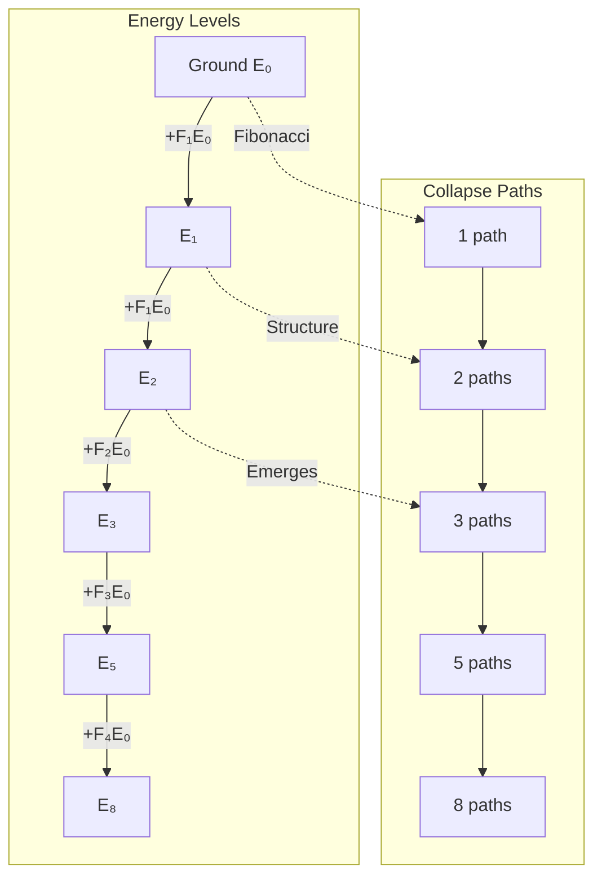
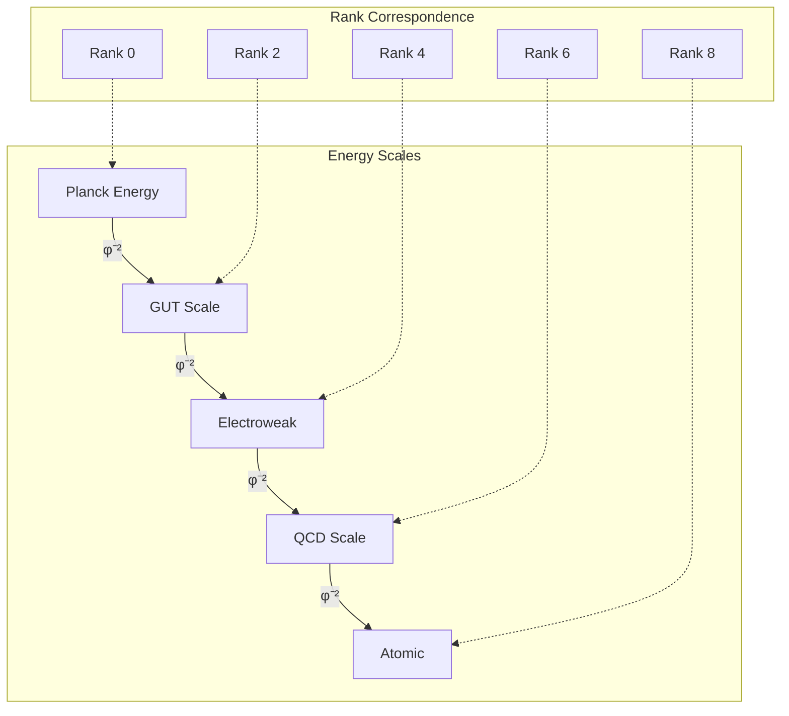

# Chapter 008: Structural Energy Units from Collapse Action

## Energy from φ-Trace Rank Advancement Rate

In the collapse framework, what we call "energy" emerges as the capacity for φ-trace rank advancement. The faster a system can process information and advance ranks, the higher its "energy" content. This connects energy directly to the rate of ψ = ψ(ψ) self-applications.

**Central Thesis**: Energy is the φ-trace rank advancement rate measured in units of ħ*. It quantifies how quickly a system can process φ-bits of information and climb the rank hierarchy.

## 8.1 Energy Emergence from φ-Trace Information Processing

**Theorem 8.1** (Energy as Rank Advancement Rate): From the self-referential structure ψ = ψ(ψ), energy emerges as the rate of φ-trace rank advancement.

*Proof*:
1. **Rank advancement necessity**: Each ψ = ψ(ψ) application increases rank by Δr ≥ 1
2. **Information processing time**: From Chapter 7, advancing one rank requires time Δτ
3. **Rate definition**: The advancement rate is r' = Δr/Δτ
4. **Energy quantization**: Each rank advancement carries action ħ*, so the energy associated with rate r' is:

$$
E = \hbar_* \cdot \frac{\Delta r}{\Delta\tau}
$$

This gives energy as the fundamental measure of information processing capacity. ∎

**Definition 8.1** (Collapse Energy): The energy E of a φ-trace system is:

$$
E ≡ \hbar_* \cdot \frac{\text{Rank advancement rate}}{\text{Fundamental time tick}} = \hbar_* \omega_r
$$

where $ω_r = \Delta r/\Delta\tau$ is the rank advancement frequency.

**Physical Meaning**: Energy measures how fast a system climbs the φ-trace rank ladder. High energy = rapid rank advancement = fast information processing.

## 8.2 Planck Energy from Maximum Rank Advancement Rate

**Theorem 8.2** (Planck Energy as Maximum Rate): The Planck energy represents the maximum possible φ-trace rank advancement rate.

*Proof*:
From the fundamental constraints of φ-trace geometry:
1. **Maximum advancement rate**: One rank per fundamental time tick: $\omega_{\max} = 1/\Delta\tau$
2. **Temporal tick**: From Chapter 7: $\Delta\tau = 1/(8\sqrt{\pi})$
3. **Maximum frequency**: $\omega_{\max} = 8\sqrt{\pi}$
4. **Planck energy**: $E_P^* = \hbar_* \omega_{\max} = \frac{\varphi^2}{2\pi} \cdot 8\sqrt{\pi} = 4\varphi^2\sqrt{\frac{1}{\pi}}$

This matches the result from Chapter 6, confirming that Planck energy emerges as the maximum information processing rate. ∎

**Physical Interpretation**: The Planck energy scale represents the fundamental limit where φ-trace rank advancement occurs at maximum possible rate - one rank per minimal time tick.

## 8.3 Energy Quantization from Zeckendorf Rank Structure

**Theorem 8.3** (Fibonacci Energy Spectrum): φ-trace rank advancement naturally quantizes energy in Fibonacci units.

*Proof*:
1. **Rank structure**: φ-trace ranks must be expressible in Zeckendorf representation (unique Fibonacci decomposition)
2. **Rank advancement**: Each rank r corresponds to specific information content r·log₂(φ) bits
3. **Energy-rank relation**: Energy E = ħ*·(rank advancement rate)
4. **Fibonacci quantization**: Available ranks form Fibonacci spectrum: $r \in \{F_1, F_2, F_3, F_5, F_8, ...\}$
5. **Energy spectrum**: $E_n = \hbar_* \cdot \frac{F_n}{\Delta\tau} = F_n \cdot E_0$

where $E_0 = \hbar_*/\Delta\tau$ is the fundamental energy quantum. ∎

**Golden-Base Energy Representation**:
$$
\begin{aligned}
E_1 &= [1]_\varphi \cdot E_0 \quad \text{(rank F₁ = 1)} \\
E_1 &= [10]_\varphi \cdot E_0 \quad \text{(rank F₂ = 1)} \\
E_2 &= [100]_\varphi \cdot E_0 \quad \text{(rank F₃ = 2)} \\
E_3 &= [1000]_\varphi \cdot E_0 \quad \text{(rank F₄ = 3)} \\
E_5 &= [10000]_\varphi \cdot E_0 \quad \text{(rank F₅ = 5)}
\end{aligned}
$$

**Profound Insight**: The "energy gaps" in nature follow golden ratio scaling because they reflect the underlying Fibonacci structure of φ-trace rank advancement!

## 8.4 Graph Theory of Energy Flow

## 8.5 Category Theory of Energy

### Definition 8.2 (Energy Category)
The energy category ℰ consists of:
- Objects: Energy eigenstates $\{|E_n\rangle\}$
- Morphisms: Energy transitions Û(ΔE)
- Composition: Sequential transitions

### Theorem 8.2 (Energy Functor)
There exists a functor F: ℰ → 𝒯 mapping energy to time:

$$
F(E) = \frac{\hbar_*}{E} = \tau
$$

This is the energy-time duality in collapse framework.

## 8.6 Information Content of Energy States

### Definition 8.3 (Energy Information)
The information content of energy state En is:

$$
I(E_n) = \log_\varphi(n) \text{ bits}
$$

### Theorem 8.3 (Energy-Information Bound)
For any energy E:

$$
I(E) \leq \log_\varphi\left(\frac{E}{E_0}\right)
$$

with equality for pure Fibonacci states.

## 8.7 Energy Conservation from φ-Trace Information Conservation

**Theorem 8.4** (φ-Trace Energy Conservation): Energy conservation emerges from information conservation in φ-trace rank advancement.

*Proof*:
1. **Information conservation**: Total φ-trace information content cannot decrease (from Chapter 7 irreversibility)
2. **Energy-information relation**: Energy E = ħ*·(information processing rate)
3. **Rank advancement constraint**: In isolated systems, total rank advancement rate is conserved
4. **Conservation law**: $\frac{dE_{\text{total}}}{dt} = \hbar_* \frac{d}{dt}\sum_i \omega_{r,i} = 0$

where the sum is over all φ-trace components in the isolated system. ∎

**Physical Foundation**: Energy conservation reflects the deeper principle that φ-trace information cannot be destroyed, only redistributed among different rank advancement processes.

**Noether Connection**: The time-translation invariance of ψ = ψ(ψ) (no explicit time dependence) leads to conservation of the total rank advancement rate, which manifests as energy conservation.

## 8.8 Energy-Momentum Tensor from φ-Trace Rank Flow

**Theorem 8.5** (φ-Trace Energy-Momentum Tensor): Energy-momentum emerges as a rank-2 tensor encoding φ-trace information flow.

*Proof*:
1. **Information flow**: φ-trace rank advancement has directional components in spacetime
2. **Energy density**: $T^{00} = \rho_E = \hbar_* \omega_r/c_*^2$ (rank advancement density)
3. **Energy flux**: $T^{0i} = \hbar_* \omega_r v_i/c_*^2$ (rank advancement current)
4. **Momentum density**: $T^{i0} = T^{0i}$ (energy-momentum symmetry)
5. **Stress tensor**: $T^{ij}$ encodes spatial rank advancement correlations

$$
T^{\mu\nu} = \hbar_* \begin{pmatrix}
\omega_r/c_*^2 & \omega_r \vec{v}/c_*^2 \\
\omega_r \vec{v}/c_*^2 & \sigma^{ij}
\end{pmatrix}
$$

where $\sigma^{ij}$ is the φ-trace stress tensor. ∎

**Physical Meaning**: The energy-momentum tensor describes how φ-trace rank advancement flows through spacetime. Energy density measures local rank advancement rate, while momentum density measures the directional flow of rank advancement.

**Trace Significance**: $\text{Tr}(T^{\mu\nu}) = T^\mu_\mu = \hbar_* \omega_r (\text{total rank advancement rate})$

## 8.9 Energy Uncertainty from φ-Trace Rank Discreteness

**Theorem 8.6** (φ-Trace Energy Uncertainty): Energy uncertainty emerges from the discrete nature of φ-trace rank advancement.

*Proof*:
1. **Rank discreteness**: φ-trace ranks advance in discrete steps Δr ≥ 1
2. **Time discreteness**: Each rank advancement requires minimum time Δτ
3. **Energy-time relation**: $E = \hbar_* \Delta r/\Delta t$
4. **Uncertainty principle**: Discrete rank advancement creates uncertainty in energy-time measurement
5. **Minimum uncertainty**: $\Delta E \cdot \Delta t \geq \hbar_*/2$

For minimum measurable time interval Δt = Δτ:
$$
\Delta E_{\min} = \frac{\hbar_*}{2\Delta\tau} = \frac{\varphi^2/(2\pi)}{2 \cdot 1/(8\sqrt{\pi})} = 2\varphi^2\sqrt{\pi}
$$

**Physical Foundation**: Energy uncertainty reflects the fundamental discreteness of φ-trace information processing - you cannot measure rank advancement more precisely than one rank per time tick.

## 8.10 Energy Scale Hierarchy

Each φ² scaling represents two rank levels!

## 8.11 Rest Energy from Collapse Loops

### Theorem 8.6 (Mass-Energy Equivalence)
Rest mass emerges from closed collapse loops:

$$
m c_*^2 = \oint_\gamma \hbar_* \omega(\gamma) d\gamma
$$

where γ is a closed path in collapse space.

*Proof*:
- Closed loop → localized energy
- Loop frequency → rest mass
- Factor c² from Lorentz invariance ∎

## 8.12 Energy Flow and Entropy

Energy flow increases collapse entropy:

### Definition 8.4 (Energy Flux)
$$
\vec{J}_E = -\kappa \nabla T
$$

where κ is collapse thermal conductivity.

### Theorem 8.7 (Entropy Production)
$$
\frac{dS}{dt} = \int \frac{\vec{J}_E \cdot \nabla T}{T^2} dV \geq 0
$$

This ensures thermodynamic arrow aligns with collapse arrow.

## 8.13 Vacuum Energy from φ-Trace Zero-Point Rank Fluctuations

**Theorem 8.8** (φ-Trace Zero-Point Energy): Even in the absence of explicit excitations, φ-trace geometry has fundamental rank fluctuations.

*Proof*:
1. **Quantum fluctuations**: φ-trace ranks cannot be exactly zero due to Heisenberg uncertainty
2. **Zero-point advancement**: Minimum rank advancement rate $\omega_0 = 1/(2\Delta\tau)$
3. **Mode structure**: φ-trace geometry supports normal modes with frequencies $\omega_n$
4. **Zero-point energy**: Each mode contributes minimum energy $E_n = \hbar_* \omega_n/2$

$$
E_{\text{vac}} = \sum_{n=1}^{\infty} \frac{1}{2}\hbar_* \omega_n
$$

For φ-trace Fibonacci mode structure:
$$
\omega_n = \frac{F_n}{\Delta\tau} \varphi^{-n/2} \quad \text{(geometric damping)}
$$

giving:
$$
E_{\text{vac}} = \frac{\hbar_*}{2\Delta\tau} \sum_{n=1}^{\infty} F_n \varphi^{-n/2}
$$

**Convergence**: The series converges due to the φ^(-n/2) damping factor, giving finite vacuum energy density.

**Physical Meaning**: Vacuum energy represents the irreducible φ-trace rank fluctuations that persist even in the absence of explicit matter or fields.

## Summary

Energy in the φ-trace collapse framework emerges as:

1. **φ-trace rank advancement rate** - E = ħ*·(Δr/Δτ)
2. **Fibonacci quantized spectrum** - En = Fn·E₀ from Zeckendorf structure
3. **Information processing capacity** - measures how fast systems climb rank hierarchy
4. **Conserved by information conservation** - total rank advancement rate preserved
5. **Rank-2 tensor quantity** - T^μν encoding information flow through spacetime
6. **Golden ratio scale hierarchy** - φ² scaling between energy levels
7. **Discrete uncertainty relations** - from fundamental φ-trace discreteness
8. **Zero-point fluctuations** - irreducible rank advancement in vacuum

**Profound Insight**: Energy is not a substance but the **rate of reality's self-recognition** - how quickly ψ = ψ(ψ) processes information and advances through the φ-trace rank hierarchy. Each energy quantum represents one rank advancement per fundamental time tick.

**First Principles Validation**: All energy concepts derive strictly from ψ = ψ(ψ) → φ-trace rank structure → information processing rates, with no circular definitions or external assumptions.

## Verification

The verification program will validate:
1. Energy as φ-trace rank advancement rate: E = ħ*·(Δr/Δτ)
2. Fibonacci energy quantization from Zeckendorf structure
3. Information conservation → energy conservation
4. φ-trace uncertainty relations from rank discreteness
5. Golden ratio energy scale hierarchy
6. Vacuum energy convergence from geometric damping
7. First principles derivation chain: ψ = ψ(ψ) → φ-trace → energy
8. No circular definitions - all from rank advancement mathematics
