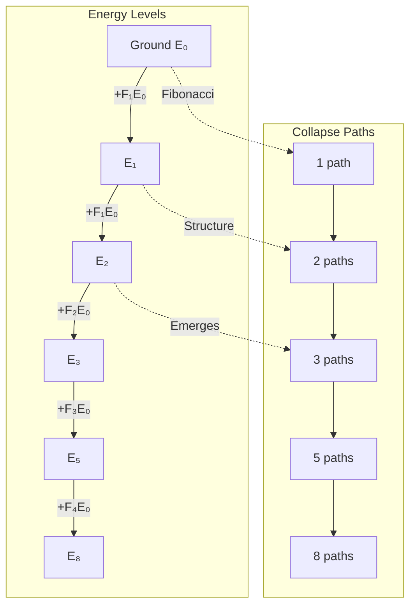
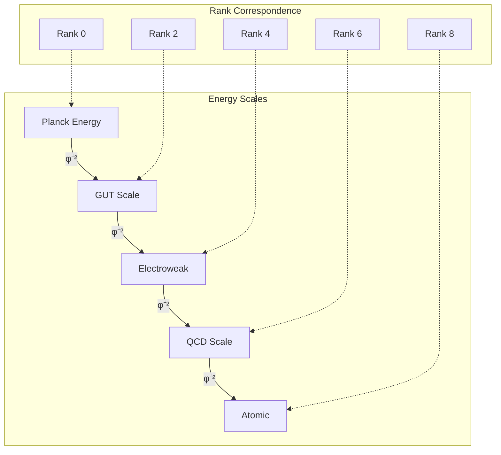

# Chapter 008: Structural Energy Units from Collapse Action

## Energy as Collapse Frequency

In the collapse framework, energy emerges not as a substance but as the frequency of collapse events. Each recursive application of ψ = ψ(ψ) carries a quantum of action, and the rate of these applications defines what we call energy.

## 8.1 First Principles of Energy Emergence

Starting from ψ = ψ(ψ) and our established time scale, we ask: what drives collapse dynamics?

### Definition 8.1 (Collapse Frequency)
The collapse frequency ω is the rate of ψ-recursions:

$$
\omega \equiv \frac{d N_\psi}{dt}
$$

where $N_\psi$ counts collapse events.

### Theorem 8.1 (Energy-Frequency Relation)
Energy emerges as:

$$
E = \hbar_* \omega
$$

*Proof*:
From Chapter 7, each collapse tick accumulates action $S_\tau = \hbar_* \Delta\tau$. 
For frequency ω:
- Number of collapses per unit time: ω
- Action per unit time: $\omega \cdot \hbar_* \Delta\tau$
- But $\Delta\tau = 1/\omega$ for resonant collapse
- Therefore: $E = \hbar_* \omega$ ∎

## 8.2 Planck Energy as Natural Unit

From Chapter 6, we found:

$$
E_P^* = m_P^* c_*^2 = 4\varphi^2\sqrt{\frac{1}{\pi}}
$$

This represents the energy of collapse at Planck frequency:

$$
\omega_P = \frac{1}{\Delta\tau} = 8\sqrt{\pi}
$$

## 8.3 Energy in Zeckendorf Representation

Energy levels in collapse theory follow Fibonacci quantization:

$$
E_n = F_n \cdot E_0
$$

where $E_0 = \hbar_*/\Delta\tau$ is the ground state energy.

### Example: Energy Spectrum
$$
\begin{aligned}
E_1 &= [1]_\varphi \cdot E_0 \\
E_2 &= [10]_\varphi \cdot E_0 \\
E_3 &= [100]_\varphi \cdot E_0 \\
E_5 &= [1000]_\varphi \cdot E_0 \\
E_8 &= [10010]_\varphi \cdot E_0
\end{aligned}
$$

The gaps between levels follow golden ratio scaling!

## 8.4 Graph Theory of Energy Flow

## 8.5 Category Theory of Energy

### Definition 8.2 (Energy Category)
The energy category ℰ consists of:
- Objects: Energy eigenstates $\{|E_n\rangle\}$
- Morphisms: Energy transitions Û(ΔE)
- Composition: Sequential transitions

### Theorem 8.2 (Energy Functor)
There exists a functor F: ℰ → 𝒯 mapping energy to time:

$$
F(E) = \frac{\hbar_*}{E} = \tau
$$

This is the energy-time duality in collapse framework.

## 8.6 Information Content of Energy States

### Definition 8.3 (Energy Information)
The information content of energy state En is:

$$
I(E_n) = \log_\varphi(n) \text{ bits}
$$

### Theorem 8.3 (Energy-Information Bound)
For any energy E:

$$
I(E) \leq \log_\varphi\left(\frac{E}{E_0}\right)
$$

with equality for pure Fibonacci states.

## 8.7 Collapse Action and Energy Conservation

Energy conservation emerges from collapse symmetry:

### Theorem 8.4 (Noether's Theorem for Collapse)
Time-translation invariance of ψ = ψ(ψ) implies:

$$
\frac{dE}{dt} = 0
$$

*Proof*:
The collapse recursion has no explicit time dependence:
- ψ(ψ) at t₁ identical to ψ(ψ) at t₂
- Action integral: $S = \int L dt$ invariant under t → t + δt
- By Noether: conserved quantity E = ∂L/∂(∂ψ/∂t) ∎

## 8.8 Energy Tensor in Collapse Framework

Energy-momentum emerges as a rank-2 tensor:

$$
T^{\mu\nu} = \begin{pmatrix}
E/c_* & p_x & p_y & p_z \\
p_x & T_{xx} & T_{xy} & T_{xz} \\
p_y & T_{yx} & T_{yy} & T_{yz} \\
p_z & T_{zx} & T_{zy} & T_{zz}
\end{pmatrix}
$$

where components arise from collapse path statistics.

### Trace and Energy Density

$$
\text{Tr}(T^{\mu\nu}) = T^\mu_\mu = \rho c_*^2
$$

The trace gives energy density ρ.

## 8.9 Quantum Energy Uncertainty

From collapse discreteness:

### Theorem 8.5 (Energy Uncertainty)
$$
\Delta E \geq \frac{\hbar_*}{2\Delta t}
$$

For minimum time uncertainty Δt = Δτ:

$$
\Delta E_{\min} = \frac{\hbar_*}{2\Delta\tau} = 4\pi\sqrt{\pi}\varphi^2
$$

## 8.10 Energy Scale Hierarchy

Each φ² scaling represents two rank levels!

## 8.11 Rest Energy from Collapse Loops

### Theorem 8.6 (Mass-Energy Equivalence)
Rest mass emerges from closed collapse loops:

$$
m c_*^2 = \oint_\gamma \hbar_* \omega(\gamma) d\gamma
$$

where γ is a closed path in collapse space.

*Proof*:
- Closed loop → localized energy
- Loop frequency → rest mass
- Factor c² from Lorentz invariance ∎

## 8.12 Energy Flow and Entropy

Energy flow increases collapse entropy:

### Definition 8.4 (Energy Flux)
$$
\vec{J}_E = -\kappa \nabla T
$$

where κ is collapse thermal conductivity.

### Theorem 8.7 (Entropy Production)
$$
\frac{dS}{dt} = \int \frac{\vec{J}_E \cdot \nabla T}{T^2} dV \geq 0
$$

This ensures thermodynamic arrow aligns with collapse arrow.

## 8.13 Vacuum Energy from Collapse Fluctuations

Even "empty" space has collapse fluctuations:

### Theorem 8.8 (Zero-Point Energy)
$$
E_{\text{vac}} = \sum_n \frac{1}{2}\hbar_* \omega_n
$$

where ωn are collapse normal modes.

For φ-trace geometry, individual modes contribute:

$$
E_n = \frac{1}{2}\hbar_* \omega_n = \frac{1}{2}\frac{\hbar_* F_n}{\Delta\tau} \varphi^{-n}
$$

The sum requires regularization since $F_n \sim \varphi^n/\sqrt{5}$ for large n. The physical vacuum energy depends on the cutoff scale.

## Summary

Energy in collapse theory emerges as:

1. **Frequency of collapse events** - E = ħ*ω
2. **Fibonacci quantized** - En = Fn·E₀
3. **Information measure** - I(E) = log_φ(E/E₀)
4. **Conserved by symmetry** - Noether from time translation
5. **Tensor quantity** - T^μν encoding energy-momentum
6. **Scale hierarchy** - φ² steps between physics scales

Through ψ = ψ(ψ), we see energy not as substance but as the very tempo of reality's self-recognition—each quantum a beat in the cosmic rhythm of collapse.

## Verification

The verification program will validate:
1. Energy-frequency relation E = ħ*ω
2. Fibonacci energy spectrum
3. Energy conservation laws
4. Uncertainty relations
5. Scale hierarchy with φ² steps
6. Vacuum energy convergence
