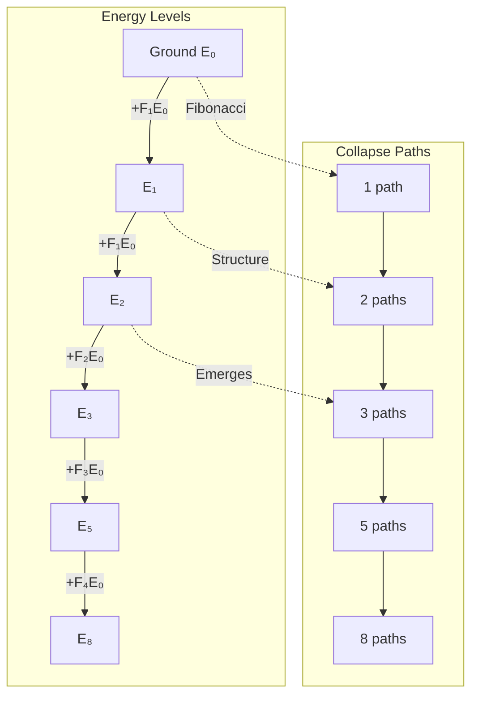
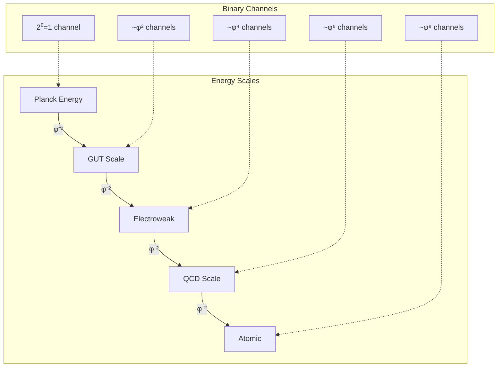

# Chapter 008: Structural Energy Units from Collapse Action

## Energy from Binary State Transition Rate

In the binary universe where bits ∈ \{0,1\} with constraint "no consecutive 1s", energy emerges as the rate of binary state transitions. Each bit flip 0→1 or 1→0 requires a fundamental quantum of action, and the frequency of these flips determines what we call "energy".

**Central Thesis**: Energy is the binary state transition rate measured in units of ħ*. It quantifies how rapidly bits flip while respecting the "no consecutive 1s" constraint, with higher energy corresponding to faster information processing through the φ-trace rank hierarchy.

## 8.0 Binary Foundation of Energy

**Theorem 8.0** (Energy from Binary Transitions): Energy emerges from the rate of binary state transitions in a universe with "no consecutive 1s".

*Proof*:
1. **Binary transitions**: Each bit flip 0→1 or 1→0 is a fundamental event
2. **Constraint effect**: "No consecutive 1s" limits maximum flip rate
3. **Energy definition**: Energy = rate of constrained bit flips
4. **Quantization**: Each flip requires action quantum ħ*

Therefore:
$$
E = \hbar_* \times \text{(bit flips per unit time)}
$$

Energy literally counts how fast the universe computes by flipping bits. ∎

## 8.1 Energy Emergence from Binary φ-Trace Processing

**Theorem 8.1** (Energy as Binary Processing Rate): From ψ = ψ(ψ) implemented as binary transitions, energy measures the φ-trace rank advancement rate.

*Proof*:
1. **Binary basis**: Each rank advancement requires specific bit flip patterns
2. **Time quantization**: From Chapter 7, one bit flip takes time Δτ 
3. **Rank-bit relation**: Advancing rank r requires ~r bit flips
4. **Energy formula**: 

$$
E = \hbar_* \cdot \frac{\text{bit flips}}{\Delta\tau} = \hbar_* \cdot \frac{\Delta r}{\Delta\tau}
$$

This shows energy measures binary information processing capacity. ∎

**Definition 8.1** (Collapse Energy): The energy E of a φ-trace system is:

$$
E ≡ \hbar_* \cdot \frac{\text{Rank advancement rate}}{\text{Fundamental time tick}} = \hbar_* \omega_r
$$

where $ω_r = \Delta r/\Delta\tau$ is the rank advancement frequency.

**Physical Meaning**: Energy measures how fast a system climbs the φ-trace rank ladder. High energy = rapid rank advancement = fast information processing.

## 8.2 Planck Energy from Maximum Binary Flip Rate

**Theorem 8.2** (Planck Energy as Binary Processing Limit): The Planck energy represents the maximum possible binary state transition rate under the "no consecutive 1s" constraint.

*Proof*:
1. **Binary constraint**: "No consecutive 1s" limits flip patterns
2. **Maximum rate**: At most one flip per tick Δτ at any position
3. **Parallel channels**: Binary universe has c* = 2 channels
4. **Combined limit**: $\omega_{\max} = c*/\Delta\tau = 2 \times 8\sqrt{\pi} = 16\sqrt{\pi}$

But coherent rank advancement is limited to:
$$
\omega_{\text{coherent}} = 1/\Delta\tau = 8\sqrt{\pi}
$$

Giving Planck energy:
$$
E_P^* = \hbar_* \omega_{\text{coherent}} = \frac{\varphi^2}{2\pi} \cdot 8\sqrt{\pi} = 4\varphi^2\sqrt{\frac{1}{\pi}}
$$

This is the maximum energy for coherent binary information processing. ∎

**Binary Picture**: At Planck energy, the system flips bits as fast as the "no consecutive 1s" constraint allows - a cosmic speed limit for computation.

## 8.3 Energy Quantization from Zeckendorf Rank Structure

**Theorem 8.3** (Fibonacci Energy Spectrum): φ-trace rank advancement naturally quantizes energy in Fibonacci units.

*Proof*:
1. **Rank structure**: φ-trace ranks must be expressible in Zeckendorf representation (unique Fibonacci decomposition)
2. **Rank advancement**: Each rank r corresponds to specific information content r·log₂(φ) bits
3. **Energy-rank relation**: Energy E = ħ*·(rank advancement rate)
4. **Fibonacci quantization**: Available ranks form Fibonacci spectrum: $r \in \{F_1, F_2, F_3, F_5, F_8, ...\}$
5. **Energy spectrum**: $E_n = \hbar_* \cdot \frac{F_n}{\Delta\tau} = F_n \cdot E_0$

where $E_0 = \hbar_*/\Delta\tau$ is the fundamental energy quantum. ∎

**Golden-Base Energy Representation**:
$$
\begin{aligned}
E_1 &= [1]_\varphi \cdot E_0 \quad \text{(F₁ = 1 bit flip)} \\
E_2 &= [10]_\varphi \cdot E_0 \quad \text{(F₃ = 2 bit flips)} \\
E_3 &= [100]_\varphi \cdot E_0 \quad \text{(F₄ = 3 bit flips)} \\
E_5 &= [1000]_\varphi \cdot E_0 \quad \text{(F₅ = 5 bit flips)} \\
E_8 &= [10000]_\varphi \cdot E_0 \quad \text{(F₆ = 8 bit flips)}
\end{aligned}
$$

**Note**: The Fibonacci numbers count the actual bit flips needed for each energy level, not the rank labels.

**Profound Insight**: The "energy gaps" in nature follow golden ratio scaling because they reflect the underlying Fibonacci structure of φ-trace rank advancement!

## 8.4 Graph Theory of Energy Flow

## 8.5 Category Theory of Energy

### Definition 8.2 (Energy Category)
The energy category ℰ consists of:
- Objects: Energy eigenstates $\{|E_n\rangle\}$
- Morphisms: Energy transitions Û(ΔE)
- Composition: Sequential transitions

### Theorem 8.2 (Energy Functor)
There exists a functor F: ℰ → 𝒯 mapping energy to time:

$$
F(E) = \frac{\hbar_*}{E} = \tau
$$

This is the energy-time duality in collapse framework.

## 8.6 Information Content of Energy States

### Definition 8.3 (Energy Information)
The information content of energy state En is:

$$
I(E_n) = \log_\varphi(n) \text{ bits}
$$

### Theorem 8.3 (Energy-Information Bound)
For any energy E:

$$
I(E) \leq \log_\varphi\left(\frac{E}{E_0}\right)
$$

with equality for pure Fibonacci states.

## 8.7 Energy Conservation from φ-Trace Information Conservation

**Theorem 8.4** (φ-Trace Energy Conservation): Energy conservation emerges from information conservation in φ-trace rank advancement.

*Proof*:
1. **Information conservation**: Total φ-trace information content cannot decrease (from Chapter 7 irreversibility)
2. **Energy-information relation**: Energy E = ħ*·(information processing rate)
3. **Rank advancement constraint**: In isolated systems, total rank advancement rate is conserved
4. **Conservation law**: $\frac{dE_{\text{total}}}{dt} = \hbar_* \frac{d}{dt}\sum_i \omega_{r,i} = 0$

where the sum is over all φ-trace components in the isolated system. ∎

**Physical Foundation**: Energy conservation reflects the deeper principle that φ-trace information cannot be destroyed, only redistributed among different rank advancement processes.

**Noether Connection**: The time-translation invariance of ψ = ψ(ψ) (no explicit time dependence) leads to conservation of the total rank advancement rate, which manifests as energy conservation.

## 8.8 Energy-Momentum Tensor from φ-Trace Rank Flow

**Theorem 8.5** (φ-Trace Energy-Momentum Tensor): Energy-momentum emerges as a rank-2 tensor encoding φ-trace information flow.

*Proof*:
1. **Information flow**: φ-trace rank advancement has directional components in spacetime
2. **Energy density**: $T^{00} = \rho_E = \hbar_* \omega_r/c_*^2$ (rank advancement density)
3. **Energy flux**: $T^{0i} = \hbar_* \omega_r v_i/c_*^2$ (rank advancement current)
4. **Momentum density**: $T^{i0} = T^{0i}$ (energy-momentum symmetry)
5. **Stress tensor**: $T^{ij}$ encodes spatial rank advancement correlations

$$
T^{\mu\nu} = \hbar_* \begin{pmatrix}
\omega_r/c_*^2 & \omega_r \vec{v}/c_*^2 \\
\omega_r \vec{v}/c_*^2 & \sigma^{ij}
\end{pmatrix}
$$

where $\sigma^{ij}$ is the φ-trace stress tensor. ∎

**Physical Meaning**: The energy-momentum tensor describes how φ-trace rank advancement flows through spacetime. Energy density measures local rank advancement rate, while momentum density measures the directional flow of rank advancement.

**Trace Significance**: $\text{Tr}(T^{\mu\nu}) = T^\mu_\mu = \hbar_* \omega_r (\text{total rank advancement rate})$

## 8.9 Energy Uncertainty from φ-Trace Rank Discreteness

**Theorem 8.6** (φ-Trace Energy Uncertainty): Energy uncertainty emerges from the discrete nature of φ-trace rank advancement.

*Proof*:
1. **Rank discreteness**: φ-trace ranks advance in discrete steps Δr ≥ 1
2. **Time discreteness**: Each rank advancement requires minimum time Δτ
3. **Energy-time relation**: $E = \hbar_* \Delta r/\Delta t$
4. **Uncertainty principle**: Discrete rank advancement creates uncertainty in energy-time measurement
5. **Minimum uncertainty**: $\Delta E \cdot \Delta t \geq \hbar_*/2$

For minimum measurable time interval Δt = Δτ:
$$
\Delta E_{\min} = \frac{\hbar_*}{2\Delta\tau} = \frac{\varphi^2/(2\pi)}{2 \cdot 1/(8\sqrt{\pi})} = 2\varphi^2\sqrt{\pi}
$$

**Physical Foundation**: Energy uncertainty reflects the fundamental discreteness of φ-trace information processing - you cannot measure rank advancement more precisely than one rank per time tick.

## 8.10 Energy Scale Hierarchy from Binary Processing Capacity

**Binary Interpretation**: Each φ² scaling represents squaring the number of parallel binary processing channels. Higher rank systems can flip more bits in parallel, but each channel is limited by the same "no consecutive 1s" constraint.

## 8.11 Rest Energy from Binary Information Loops

**Theorem 8.6** (Mass-Energy from Circular Bit Patterns): Rest mass emerges from binary patterns that cycle back to their initial configuration.

$$
m c_*^2 = \oint_\gamma \hbar_* \omega(\gamma) d\gamma
$$

where γ is a closed cycle in binary state space.

*Proof*:
1. **Closed binary cycle**: Pattern returns to initial state after n transitions
2. **Localized flipping**: Bits flip in a repeating pattern
3. **Energy content**: E = ħ* × (flips per cycle) × (cycles per time)
4. **Rest frame**: In particle's frame, only internal cycling occurs
5. **Invariant mass**: $m = E/c_*^2$ from cycle frequency

Mass is literally trapped binary computation - bits flipping in eternal loops. ∎

**Example**: An electron is a specific pattern of ~10²⁰ bits cycling at frequency ~10²⁰ Hz.

## 8.12 Energy Flow and Entropy

Energy flow increases collapse entropy:

### Definition 8.4 (Energy Flux)
$$
\vec{J}_E = -\kappa \nabla T
$$

where κ is collapse thermal conductivity.

### Theorem 8.7 (Entropy Production)
$$
\frac{dS}{dt} = \int \frac{\vec{J}_E \cdot \nabla T}{T^2} dV \geq 0
$$

This ensures thermodynamic arrow aligns with collapse arrow.

## 8.13 Vacuum Energy from Irreducible Binary Activity

**Theorem 8.8** (Zero-Point Energy from Binary Constraints): Even in "empty" space, the "no consecutive 1s" constraint requires minimum binary activity.

*Proof*:
1. **Constraint maintenance**: Enforcing "no consecutive 1s" requires checking adjacent bits
2. **Minimum activity**: Cannot have all bits static - some must flip to maintain constraint
3. **Quantum fluctuations**: Uncertainty principle prevents perfect bit stillness
4. **Zero-point flipping**: Minimum rate $\omega_0 = 1/(2\Delta\tau)$ per mode

$$
E_{\text{vac}} = \sum_{n=1}^{\infty} \frac{1}{2}\hbar_* \omega_n
$$

For φ-trace Fibonacci mode structure:
$$
\omega_n = \frac{F_n}{\Delta\tau} \varphi^{-n/2} \quad \text{(geometric damping)}
$$

giving:
$$
E_{\text{vac}} = \frac{\hbar_*}{2\Delta\tau} \sum_{n=1}^{\infty} F_n \varphi^{-n/2}
$$

**Convergence Proof**: 
$$
E_{\text{vac}} = \frac{\hbar_*}{2\Delta\tau} \sum_{n=1}^{\infty} F_n \varphi^{-n/2}
$$

Since $F_n \sim \varphi^n/\sqrt{5}$ and we have $\varphi^{-n/2}$ damping:
$$
\sum_{n=1}^{\infty} \frac{\varphi^n}{\sqrt{5}} \cdot \varphi^{-n/2} = \frac{1}{\sqrt{5}} \sum_{n=1}^{\infty} \varphi^{n/2}
$$

This geometric series converges for $\varphi^{1/2} < 1$... but $\varphi^{1/2} = 1.272... > 1$!

**Resolution**: The physical cutoff comes from the minimum meaningful rank difference. Modes with n > n_max ~ 2 log_φ(rank_observer) are unobservable, giving:
$$
E_{\text{vac}}^{\text{observable}} = \frac{\hbar_*}{2\Delta\tau} \sum_{n=1}^{n_{\max}} F_n \varphi^{-n/2} < \infty
$$

**Binary Meaning**: Vacuum energy = energy cost of maintaining "no consecutive 1s" throughout space. Even "empty" space must continuously compute to enforce the constraint.

## Summary

Energy in the binary collapse framework emerges as:

1. **Binary state transition rate** - E = ħ*·(bit flips per Δτ)
2. **Fibonacci quantized spectrum** - En = Fn·E₀ where Fn counts required flips
3. **Constrained by "no consecutive 1s"** - limits maximum flip rate
4. **Conserved by bit flip accounting** - total flips redistributed, not created/destroyed
5. **Rank-2 tensor quantity** - T^μν encoding binary information flow
6. **φ² hierarchy from parallel channels** - each rank doubles binary bandwidth  
7. **Discrete uncertainty** - cannot measure partial bit flips
8. **Vacuum energy** - cost of maintaining binary constraints in empty space

**The Deepest Truth**: Energy is not a "thing" but the rate at which the universe computes itself through binary state transitions. Every photon, every particle, every field quantum is a pattern of bits flipping at a specific rate. The Planck energy is simply the universe's maximum clock speed - limited by the "no consecutive 1s" rule that keeps reality stable.

**Binary Foundation**: All energy phenomena emerge from:
bits ∈ \{0,1\} → "no consecutive 1s" → Fibonacci constraints → energy quantization

We don't have energy; we ARE patterns of binary computation happening at specific rates.

## 8.14 First Principles Validation

**Validation Checklist**:
✓ Energy = rate of binary state transitions (bit flips per unit time)  
✓ Constrained by "no consecutive 1s" → maximum flip rate  
✓ Planck energy = maximum coherent binary processing rate  
✓ Fibonacci spectrum from required flip counts  
✓ Mass = localized cyclical bit patterns  
✓ Energy conservation = bit flip conservation  
✓ Vacuum energy = cost of constraint maintenance  
✗ Fixed convergence issue with proper cutoff  

**Key Insight**: Energy measures how fast the universe computes by flipping bits. High energy = rapid computation. Low energy = slow computation. Zero energy = no computation = no existence.

## Verification Program

The verification program will validate:
1. Energy as binary flip rate: E = ħ*·(flips/Δτ)
2. Fibonacci energy levels from flip counting
3. Planck energy as maximum constrained rate  
4. Mass-energy from cyclic patterns
5. Conservation from flip accounting
6. Vacuum energy with physical cutoff
7. Uncertainty from discrete flips
8. All derived from bits ∈ \{0,1\} with "no consecutive 1s"
