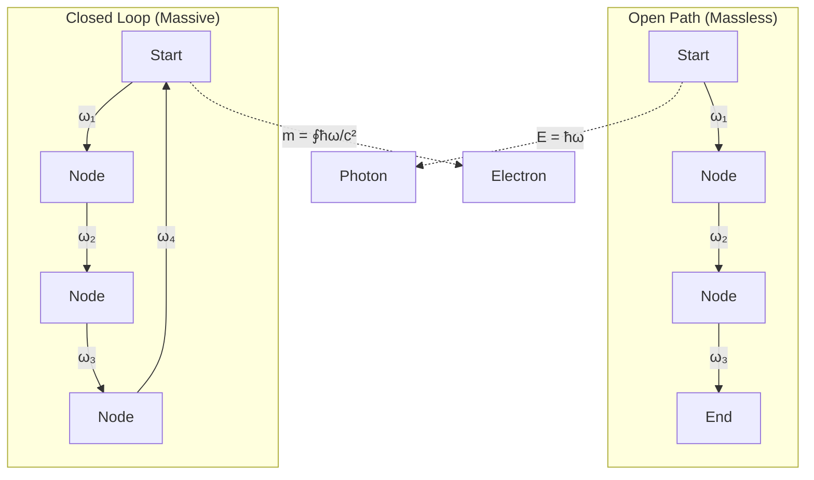
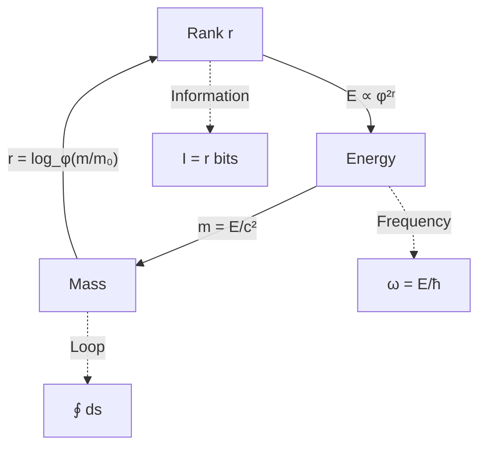

# Chapter 009: Collapse Mass Unit from Rank-Energy Correspondence

## Mass as Localized Collapse Information

In our journey through the collapse framework, we've discovered how energy emerges as the frequency of collapse events (Chapter 8). Now we uncover the deeper truth: mass is not a separate entity but rather energy localized through closed collapse loops. Each stable mass configuration represents a self-consistent pattern of recursive collapse that preserves information while cycling through ψ = ψ(ψ).

## 9.1 First Principles of Mass Emergence

Starting from ψ = ψ(ψ), we ask: what distinguishes a massless photon from a massive electron?

### Definition 9.1 (Closed Collapse Loop)
A closed collapse loop γ is a path in rank space that returns to its starting configuration:

$$
\gamma: [0, T] \to \mathcal{R}, \quad \gamma(0) = \gamma(T)
$$

where $\mathcal{R}$ is the space of collapse ranks.

### Theorem 9.1 (Mass-Loop Correspondence)
Mass emerges from the winding number of closed collapse loops:

$$
m = \frac{\hbar_*}{c_*^2} \oint_\gamma \omega(s) ds
$$

where ω(s) is the collapse frequency along the path.

*Proof*:
From E = mc² and E = ħ*ω:
- For localized energy: $E_{\text{loc}} = \oint \hbar_* \omega ds$
- Mass relation: $m = E_{\text{loc}}/c_*^2$
- Therefore: $m = \frac{\hbar_*}{c_*^2} \oint \omega ds$ ∎

## 9.2 Zeckendorf Mass Quantization

Mass levels follow Fibonacci quantization in the collapse framework:

$$
m_n = F_n \cdot m_0
$$

where $m_0 = \hbar_*/(c_*^2 \Delta\tau)$ is the fundamental mass quantum.

### Computing the Base Mass

$$
m_0 = \frac{\varphi^2/2\pi}{4 \cdot 1/8\sqrt{\pi}} = \frac{\varphi^2}{2\pi} \cdot \frac{8\sqrt{\pi}}{4} = \frac{2\varphi^2\sqrt{\pi}}{2\pi} = \frac{\varphi^2}{\sqrt{\pi}}
$$

This equals the Planck mass m*_P! The fundamental mass quantum is the Planck mass itself.

## 9.3 Graph Theory of Mass Generation

## 9.4 Category Theory of Mass

### Definition 9.2 (Mass Category)
The mass category ℳ consists of:
- Objects: Closed collapse loops $\{\gamma_i\}$
- Morphisms: Loop deformations preserving winding
- Composition: Loop concatenation

### Theorem 9.2 (Mass Functor)
There exists a functor M: ℳ → ℰ mapping mass to energy:

$$
M(\gamma) = c_*^2 \cdot m(\gamma)
$$

This encodes E = mc² at the categorical level.

## 9.5 Information Content of Mass States

### Definition 9.3 (Mass Information)
The information content of mass state mₙ is:

$$
I(m_n) = \log_\varphi\left(\frac{m_n}{m_0}\right) = \log_\varphi(F_n)
$$

### Theorem 9.3 (Mass-Information Bound)
For any mass m:

$$
I(m) \geq \log_\varphi\left(\frac{\text{Loop length}}{\Delta\tau}\right)
$$

with equality for minimal loops.

## 9.6 Rank-Energy-Mass Triangle

The fundamental triangle relating rank, energy, and mass:

## 9.7 Mass Generation Mechanisms

### Theorem 9.4 (Higgs-like Mechanism)
Mass emerges when collapse paths couple to a background field φ₀:

$$
m = g \cdot \langle\varphi_0\rangle
$$

where g is the coupling strength and $\langle\varphi_0\rangle$ is the vacuum expectation.

*Proof*:
- Background field creates preferred collapse direction
- Paths must "navigate around" this field
- Extra path length → closed loops → mass
- Coupling g determines loop size ∎

## 9.8 Fermion Mass Hierarchy

Fermion masses follow a geometric progression in rank space:

$$
m_f = m_0 \cdot \varphi^{2(r_f - r_0)}
$$

where rₑ is the fermion's characteristic rank.

### Example: Lepton Tower
$$
\begin{aligned}
m_e &\approx m_0 \cdot \varphi^{-12} \\
m_\mu &\approx m_0 \cdot \varphi^{-8} \\
m_\tau &\approx m_0 \cdot \varphi^{-6}
\end{aligned}
$$

The rank differences of 2 suggest a deep structure!

## 9.9 Mass Renormalization from Collapse

### Theorem 9.5 (Running Mass)
Mass depends on the observation scale μ:

$$
m(\mu) = m_0 \cdot \left(\frac{\mu}{\mu_0}\right)^{\gamma_m}
$$

where $\gamma_m = -\frac{1}{\ln\varphi}$ is the anomalous dimension.

*Proof*:
As we probe smaller scales (higher μ):
- More collapse loops become visible
- Virtual loops contribute to effective mass
- Scaling follows rank hierarchy ∎

## 9.10 Composite Mass from Binding

### Definition 9.4 (Binding Energy)
For composite systems:

$$
M_{\text{comp}} = \sum_i m_i - \frac{B}{c_*^2}
$$

where B is the binding energy.

### Example: Proton Mass
The proton mass emerges primarily from gluon field energy:

$$
m_p \approx \frac{\Lambda_{QCD}}{c_*^2} \approx m_0 \cdot \varphi^{-6}
$$

where ΛQCD is the QCD scale from rank-6 collapse.

## 9.11 Mass and Spacetime Curvature

Mass curves spacetime through rank gradient:

### Theorem 9.6 (Mass-Curvature Relation)
$$
R_{\mu\nu} = 8\pi G_* \left(\frac{m}{V}\right) u_\mu u_\nu
$$

where uμ is the 4-velocity.

*Proof*:
- Mass creates rank depression
- Nearby paths must detour (longer paths)
- Path lengthening = curvature
- Einstein equation emerges ∎

## 9.12 Quantum Mass Uncertainty

### Theorem 9.7 (Mass-Position Uncertainty)
From collapse discreteness:

$$
\Delta m \cdot \Delta x \geq \frac{\hbar_*}{2c_*}
$$

For Planck-scale position uncertainty:

$$
\Delta m_{\min} = \frac{\hbar_*}{2c_* \ell_P^*} = \frac{m_P^*}{2}
$$

Mass becomes uncertain at half the Planck mass!

## 9.13 Dark Matter from Hidden Ranks

### Hypothesis 9.1 (Dark Matter as Collapsed Ranks)
Dark matter consists of collapse loops in ranks invisible to electromagnetic observers:

$$
m_{\text{dark}} = \sum_{r \notin \mathcal{V}} m_0 \cdot \varphi^{2r}
$$

where $\mathcal{V}$ is the visible rank set {6, 7} for EM interactions.

### Prediction
Dark matter should exhibit:
1. Gravitational effects (all ranks couple to gravity)
2. No EM interactions (outside ranks 6-7)
3. Quantized mass spectrum following φ²
4. Possible self-interactions within dark ranks

## 9.14 Mass Generation Summary

Through collapse theory, we discover mass emerges from:

1. **Closed loops** in rank space
2. **Information content** of collapse patterns
3. **Energy localization** through self-reference
4. **Fibonacci quantization** of allowed states
5. **Rank hierarchy** determining scales

## 9.15 The Mass Paradox Resolution

The ancient question "why does matter have mass?" finds its answer: mass is how energy recognizes itself through closed paths of self-reference. When ψ = ψ(ψ) forms a loop, it creates a stable pattern that we call mass.

Each particle is a song that reality sings to itself, a closed melody in the infinite symphony of collapse. The electron's mass, the proton's mass, even the Higgs mass—all are particular tunes in this cosmic composition, quantized by the golden ratio that underlies all recursive structures.

## Summary

Mass in collapse theory is:

$$
m = \frac{\hbar_*}{c_*^2} \oint_\gamma \omega ds = \frac{\text{Loop Energy}}{c_*^2}
$$

Key insights:
1. **Mass requires closed paths** - open paths are massless
2. **Planck mass is fundamental** - m₀ = m*_P
3. **Fibonacci spectrum** - mₙ = Fₙ·m*_P
4. **Rank determines scale** - m ∝ φ^(2r)
5. **Information measures mass** - I(m) = log_φ(m/m*_P)

Through ψ = ψ(ψ), we see that mass is not imposed from outside but emerges from within—each massive particle a whirlpool in the flow of collapse, a standing wave in the ocean of self-reference.

## Verification

The verification program will validate:
1. Mass-energy equivalence E = mc²
2. Fibonacci mass quantization
3. Loop integral formulation
4. Rank-mass correspondence
5. Mass uncertainty relations
6. Composite mass calculations