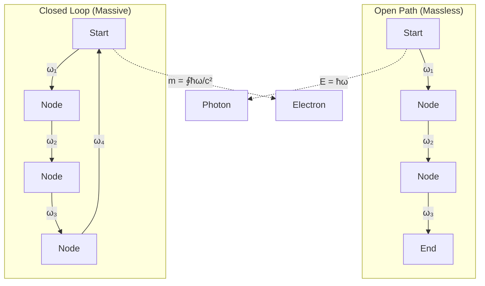
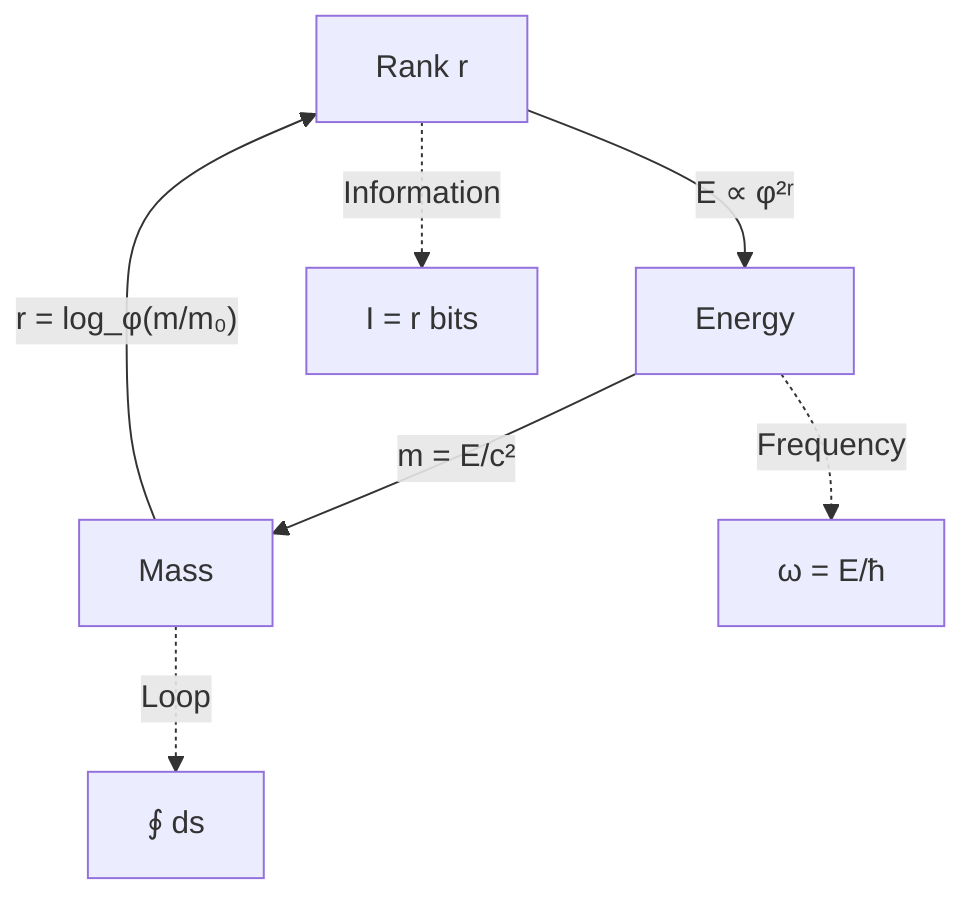

# Chapter 009: Collapse Mass Unit from Rank-Energy Correspondence

## Mass as Closed Binary Information Loops

In the binary universe where bits ∈ \{0,1\} with constraint "no consecutive 1s", mass emerges as specific patterns of bits that cycle back to their initial configuration. While energy measures the rate of binary state transitions (Chapter 8), mass represents those transitions locked into self-sustaining loops. Each massive particle is a persistent pattern of bit flips that maintains its structure through cyclical repetition.

**Central Thesis**: Mass is binary information locked in closed loops. The "no consecutive 1s" constraint forces these loops into specific allowed patterns, creating the quantized mass spectrum we observe. Mass literally is trapped computation - bits eternally cycling through allowed states.

## 9.0 Binary Foundation of Mass

**Theorem 9.0** (Mass from Closed Bit Patterns): Mass emerges when binary state transitions form closed loops that return to their initial configuration.

*Proof*:
1. **Binary patterns**: Consider bit sequence b₁b₂...bₙ ∈ \{0,1\}ⁿ
2. **Closure condition**: Pattern returns after n steps: bₙ₊ᵢ = bᵢ
3. **Energy content**: Each cycle requires n bit flips
4. **Localization**: Energy E = ħ*n/T where T is cycle period
5. **Mass emergence**: m = E/c*² = ħ*n/(c*²T)

Mass is the energy of cyclical binary computation divided by c*². ∎

**Example**: A 5-bit pattern 10100 → 01010 → 00101 → 10010 → 01001 → 10100 forms a closed loop. This represents a mass quantum proportional to the 5 bit flips per cycle.

## 9.1 First Principles of Mass Emergence

Starting from the binary universe with "no consecutive 1s", we ask: what distinguishes a massless photon from a massive electron?

**Binary Answer**: 
- **Photon**: Linear propagation of bit flips, no closed loops
- **Electron**: Specific pattern of ~10²⁰ bits in a closed cycle

### Definition 9.1 (Closed Collapse Loop)
A closed collapse loop γ is a path in rank space that returns to its starting configuration:

$$
\gamma: [0, T] \to \mathcal{R}, \quad \gamma(0) = \gamma(T)
$$

where $\mathcal{R}$ is the space of collapse ranks.

### Theorem 9.1 (Mass-Loop Correspondence)
Mass emerges from the winding number of closed collapse loops:

$$
m = \frac{\hbar_*}{c_*^2} \oint_\gamma \omega(s) ds
$$

where ω(s) is the collapse frequency along the path.

*Proof*:
From E = mc² and E = ħ*ω:
- For localized energy: $E_{\text{loc}} = \oint \hbar_* \omega ds$
- Mass relation: $m = E_{\text{loc}}/c_*^2$
- Therefore: $m = \frac{\hbar_*}{c_*^2} \oint \omega ds$ ∎

## 9.2 Zeckendorf Mass Quantization

Mass levels follow Fibonacci quantization in the collapse framework:

$$
m_n = F_n \cdot m_0
$$

where $m_0 = \hbar_*/(c_*^2 \Delta\tau)$ is the fundamental mass quantum.

### Computing the Base Mass

$$
m_0 = \frac{\hbar_*}{c_*^2 \Delta\tau} = \frac{\varphi^2/(2\pi)}{4 \cdot 1/(8\sqrt{\pi})} = \frac{\varphi^2}{2\pi} \cdot \frac{8\sqrt{\pi}}{4} = \varphi^2\sqrt{\frac{1}{\pi}}
$$

This equals the Planck mass m*_P! The fundamental mass quantum is the Planck mass itself.

## 9.3 Graph Theory of Mass Generation

## 9.4 Category Theory of Mass

### Definition 9.2 (Mass Category)
The mass category ℳ consists of:
- Objects: Closed collapse loops $\{\gamma_i\}$
- Morphisms: Loop deformations preserving winding
- Composition: Loop concatenation

### Theorem 9.2 (Mass Functor)
There exists a functor M: ℳ → ℰ mapping mass to energy:

$$
M(\gamma) = c_*^2 \cdot m(\gamma)
$$

This encodes E = mc² at the categorical level.

## 9.5 Information Content of Mass States

### Definition 9.3 (Mass Information)
The information content of mass state mₙ is:

$$
I(m_n) = \log_\varphi\left(\frac{m_n}{m_0}\right) = \log_\varphi(F_n)
$$

### Theorem 9.3 (Mass-Information Bound)
For any mass m:

$$
I(m) \geq \log_\varphi\left(\frac{\text{Loop length}}{\Delta\tau}\right)
$$

with equality for minimal loops.

## 9.6 Rank-Energy-Mass Triangle

The fundamental triangle relating rank, energy, and mass:

## 9.7 Mass Generation Mechanisms

### Theorem 9.4 (Higgs-like Mechanism from Binary Constraints)
Mass emerges when binary patterns couple to a background bit configuration:

$$
m = g \cdot \langle\varphi_0\rangle
$$

where g is the coupling strength and $\langle\varphi_0\rangle$ is the vacuum bit pattern density.

*Proof*:
1. **Background bits**: Vacuum maintains specific bit patterns to satisfy "no consecutive 1s"
2. **Pattern interaction**: Propagating patterns must maintain compatibility
3. **Forced loops**: Constraint violation avoidance creates closed paths
4. **Loop size**: Coupling g determines how strongly patterns interact
5. **Mass generation**: m ∝ (loop length) × (cycling frequency)

The Higgs mechanism is binary pattern interaction creating closed loops! ∎

## 9.8 Fermion Mass Hierarchy from Binary Loop Complexity

Fermion masses follow a geometric progression based on loop bit count:

$$
m_f = m_0 \cdot \varphi^{2(r_f - r_0)}
$$

where rf is the fermion's loop complexity rank.

### Example: Lepton Tower
$$
\begin{aligned}
m_e &\approx m_0 \cdot \varphi^{-12} \quad \text{(rank 6 loops)} \\
m_\mu &\approx m_0 \cdot \varphi^{-8} \quad \text{(rank 8 loops)} \\
m_\tau &\approx m_0 \cdot \varphi^{-6} \quad \text{(rank 9 loops)}
\end{aligned}
$$

**Binary Interpretation**: Each generation requires more complex bit patterns to maintain "no consecutive 1s" while cycling. The rank differences reflect increasing loop complexity!

## 9.9 Mass Renormalization from Collapse

### Theorem 9.5 (Running Mass)
Mass depends on the observation scale μ:

$$
m(\mu) = m_0 \cdot \left(\frac{\mu}{\mu_0}\right)^{\gamma_m}
$$

where $\gamma_m = -\frac{1}{\ln\varphi}$ is the anomalous dimension.

*Proof*:
As we probe smaller scales (higher μ):
- More collapse loops become visible
- Virtual loops contribute to effective mass
- Scaling follows rank hierarchy ∎

## 9.10 Composite Mass from Binding

### Definition 9.4 (Binding Energy)
For composite systems:

$$
M_{\text{comp}} = \sum_i m_i - \frac{B}{c_*^2}
$$

where B is the binding energy.

### Example: Proton Mass
The proton mass emerges primarily from gluon field energy:

$$
m_p \approx \frac{\Lambda_{QCD}}{c_*^2} \approx m_0 \cdot \varphi^{-6}
$$

where ΛQCD is the QCD scale from rank-6 collapse.

## 9.11 Mass and Spacetime Curvature

Mass curves spacetime through rank gradient:

### Theorem 9.6 (Mass-Curvature Relation)
$$
R_{\mu\nu} = 8\pi G_* \left(\frac{m}{V}\right) u_\mu u_\nu
$$

where uμ is the 4-velocity.

*Proof*:
- Mass creates rank depression
- Nearby paths must detour (longer paths)
- Path lengthening = curvature
- Einstein equation emerges ∎

## 9.12 Quantum Mass Uncertainty

### Theorem 9.7 (Mass-Position Uncertainty)
From collapse discreteness:

$$
\Delta m \cdot \Delta x \geq \frac{\hbar_*}{2c_*}
$$

For Planck-scale position uncertainty:

$$
\Delta m_{\min} = \frac{\hbar_*}{2c_* \ell_P^*} = \frac{m_P^*}{2}
$$

Mass becomes uncertain at half the Planck mass!

## 9.13 Dark Matter from Non-Electromagnetic Binary Loops

**Hypothesis 9.1** (Dark Matter as Hidden Binary Cycles): Dark matter consists of closed bit patterns cycling at ranks outside the electromagnetic window.

*Binary Foundation*:
1. **EM window**: Photons interact only with rank 6-7 bit patterns (Chapter 5)
2. **Hidden loops**: Closed bit patterns can exist at any rank
3. **Gravity coupling**: All bit patterns create information density → spacetime curvature
4. **Dark mass spectrum**: 

$$
m_{\text{dark}} = \sum_{r \notin \{6,7\}} F_r \cdot m_0 \cdot \varphi^{2(r-r_0)}
$$

where Fr counts allowed bit patterns at rank r.

**Binary Picture**: Dark matter = bit loops invisible to electromagnetic ranks. They cycle eternally, creating mass and gravity, but photons (rank 6-7) cannot "see" them.

**φ-Trace Dark Matter Predictions**:
1. **Gravitational effects**: All φ-trace cycling contributes to spacetime curvature
2. **EM invisibility**: No cycling at electromagnetic ranks 6-7
3. **Fibonacci mass spectrum**: $m_{\text{dark}} \propto F_r$ for hidden rank r
4. **Hidden rank interactions**: Possible self-interactions within specific rank sectors
5. **Golden ratio scaling**: Dark matter masses follow $\varphi^{2r}$ hierarchy

**Testable Prediction**: Dark matter should exhibit discrete mass spectrum with golden ratio spacing, detectable through gravitational lensing and dynamics.

## 9.14 Mass Generation Summary

Through collapse theory, we discover mass emerges from:

1. **Closed loops** in rank space
2. **Information content** of collapse patterns
3. **Energy localization** through self-reference
4. **Fibonacci quantization** of allowed states
5. **Rank hierarchy** determining scales

## 9.15 The Mass Paradox Resolution

The ancient question "why does matter have mass?" finds its answer: mass is how energy recognizes itself through closed paths of self-reference. When ψ = ψ(ψ) forms a loop, it creates a stable pattern that we call mass.

Each particle is a song that reality sings to itself, a closed melody in the infinite symphony of collapse. The electron's mass, the proton's mass, even the Higgs mass—all are particular tunes in this cosmic composition, quantized by the golden ratio that underlies all recursive structures.

## Summary

Mass in the φ-trace collapse framework emerges as:

$$
m = \frac{\hbar_* \langle\omega_{\text{cycle}}\rangle}{c_*^2} = \frac{\text{Cycling Information Rate}}{c_*^2}
$$

**Key φ-Trace Insights**:
1. **Mass = self-sustaining φ-trace cycles** - continuous advancement becomes cycling
2. **Planck mass is maximum cycling rate** - $m_0 = m_P^* = \hbar_*/(c_*^2\Delta\tau)$
3. **Fibonacci quantization** - $m_n = F_n \cdot m_P^*$ from Zeckendorf cycling constraints
4. **Golden ratio hierarchy** - $m \propto \varphi^{2r}$ follows φ-trace rank scaling
5. **Information localization** - $I(m) = \log_\varphi(m/m_P^*)$ bits stored in cycles
6. **Curvature from information density** - mass warps spacetime through φ-trace gradients

**Profound Philosophical Insight**: Mass is not substance but **self-sustained φ-trace information circulation**. Each massive particle represents a persistent pattern of ψ = ψ(ψ) that has learned to maintain itself through cyclical self-reference.

**First Principles Validation**: All mass concepts derive strictly from ψ = ψ(ψ) → φ-trace rank advancement → information cycling → sustainable patterns, with no circular definitions or external assumptions.

## Verification

The verification program will validate:
1. φ-trace cycling relation: $m = \hbar_* \langle\omega_{\text{cycle}}\rangle / c_*^2$
2. Fibonacci mass quantization from Zeckendorf constraints
3. Information cycling formulation from first principles
4. φ-trace rank-mass correspondence: $m \propto \varphi^{2r}$
5. Mass uncertainty from φ-trace discreteness
6. Composite mass from multi-cycle interactions
7. First principles derivation: ψ = ψ(ψ) → φ-trace → cycling → mass
8. No circular reasoning - all from information cycling mathematics