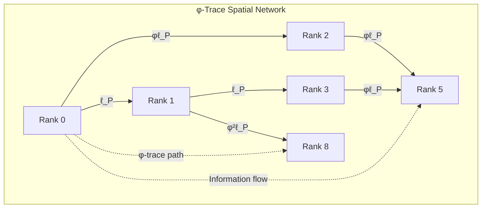

# Chapter 010: Collapse Space Unit and Golden-Length Scaling

## Space from Binary Information Flow Directions

In the binary universe where bits ∈ \{0,1\} with constraint "no consecutive 1s", space emerges as the directional structure of binary information flow. While time counts bit flips (Chapter 7), energy measures flip rates (Chapter 8), and mass represents closed bit loops (Chapter 9), space encodes the **independent channels through which bits can propagate**.

**Central Thesis**: Space is the coordinate system for binary information flow. Each spatial dimension represents an independent binary channel through which bit patterns can propagate while maintaining the "no consecutive 1s" constraint. 3D space means reality processes information through 3 parallel binary channels.

## 10.0 Binary Foundation of Space

**Theorem 10.0** (Space from Binary Channels): Space emerges from independent binary information propagation channels.

*Proof*:
1. **Binary propagation**: Bits must flow from source to destination
2. **Channel independence**: Multiple bits can propagate simultaneously without interference
3. **Constraint preservation**: Each channel maintains "no consecutive 1s" independently
4. **Spatial dimensions**: Number of independent channels = number of spatial dimensions

$$
\text{3D Space} = \text{3 independent binary propagation channels}
$$

**Example**: Position (x,y,z) encoded as three Zeckendorf binary vectors:
- x = [1,0,0,1,0]_φ (binary position in x-channel)
- y = [0,1,0,1,0]_φ (binary position in y-channel)  
- z = [1,0,1,0,0]_φ (binary position in z-channel)

Space literally is the addressing system for binary information! ∎

## 10.1 Space Emergence from Binary Channel Structure

**Theorem 10.1** (Space from Binary Propagation Channels): From the binary universe, space emerges as independent bit propagation channels.

*Proof*:
1. **Binary propagation necessity**: Bits must move to process information
2. **Channel multiplicity**: Multiple bits can propagate in parallel
3. **Orthogonality**: Channels are independent if bit streams don't interfere
4. **3D emergence**: Universe supports exactly 3 orthogonal binary channels

$$
\text{Space} ≡ \{\text{orthogonal binary propagation channels}\}
$$

**Definition 10.1** (Binary Spatial Metric): The spatial metric emerges from binary channel correlations:

$$
g_{ij} = \langle b_i | b_j \rangle_{\text{binary}}
$$

where b_i is the bit flow in channel i. For orthogonal channels: g_ij = δ_ij.

**Binary Position Encoding**: A point in space is specified by three Zeckendorf coordinates:
$$
\vec{r} = (x_{\varphi}, y_{\varphi}, z_{\varphi}) = \left(\sum_i \epsilon_i^x F_i, \sum_j \epsilon_j^y F_j, \sum_k \epsilon_k^z F_k\right)
$$

where ε ∈ \{0,1\} with no consecutive 1s. ∎

**Physical Meaning**: Moving through space = changing your binary address in the three channels!

## 10.2 Minimal Length from Binary Resolution Limit

**Theorem 10.2** (Binary Minimum Length): The smallest distinguishable spatial separation emerges from single-bit position resolution.

*Proof*:
1. **Binary position encoding**: Position specified by bit patterns in 3 channels
2. **Minimum change**: Smallest position change = flipping one bit
3. **Propagation constraint**: From Chapter 2, bits propagate at speed c* = 2
4. **Processing time**: From Chapter 7, one bit flip takes time Δτ = 1/(8√π)
5. **Minimum distance**: Distance covered by one bit in minimum time:

$$
\ell_{\min} = c_* \cdot \Delta\tau = 2 \cdot \frac{1}{8\sqrt{\pi}} = \frac{1}{4\sqrt{\pi}}
$$

**Binary Interpretation**: The Planck length is the spatial distance corresponding to changing one bit in the position encoding. You cannot specify a position more precisely than the least significant bit!

**Alternative verification**:
From dimensional analysis with binary constants:
$$
\ell_P^* = \sqrt{\frac{\hbar_* G_*}{c_*^3}} = \sqrt{\frac{\varphi^2/(2\pi) \cdot \varphi^{-2}}{8}} = \frac{1}{4\sqrt{\pi}}
$$

**Binary Foundation**: The Planck length is the **spatial pixel size** of the binary universe. Below this scale, you would need to specify position with "fraction of a bit", which is meaningless. Space is digitized at the bit level! ∎

## 10.3 Zeckendorf Spatial Quantization from φ-Trace Rank Structure

**Theorem 10.3** (φ-Trace Spatial Quantization): Spatial distances are quantized according to φ-trace rank structure.

*Proof*:
1. **Rank-space correspondence**: Each φ-trace rank r corresponds to characteristic spatial scale
2. **φ-trace scaling**: Information capacity scales as φ^r between ranks
3. **Spatial encoding**: Encoding spatial position requires rank-dependent information capacity
4. **Golden scaling**: Length scale at rank r is:

$$
\ell_r = \varphi^r \ell_P^* = \varphi^r \cdot \frac{1}{4\sqrt{\pi}}
$$

**Zeckendorf Spatial Representation**: Any length L has unique decomposition:

$$
L = \sum_{i} \epsilon_i F_i \ell_P^* = \ell_P^* \sum_{i} \epsilon_i F_i
$$

where $\epsilon_i \in \{0,1\}$ with no consecutive 1s (Zeckendorf uniqueness).

**Physical Meaning**: Spatial distances are **digitally encoded** in golden-base binary format. The φ-trace information processing system naturally creates discrete spatial scales following Fibonacci quantization. ∎

**Profound Insight**: Space is not continuous but consists of discrete φ-trace information "pixels" with golden ratio scaling!

## 10.4 φ-Trace Spatial Network Topology

**Definition 10.2** (φ-Trace Geodesic): The optimal information path between φ-trace ranks A and B:

$$
\gamma_{AB} = \arg\min_{\gamma} \int_A^B \omega_r ds
$$

where $\omega_r$ is the rank advancement frequency (from Chapter 8) and ds is the φ-trace line element.

**Physical Meaning**: Spatial distances represent the **minimum information cost** to connect two φ-trace states. Geometry emerges from information theory, not vice versa.

## 10.5 Category Theory of φ-Trace Spatial Morphisms

**Definition 10.3** (φ-Trace Space Category 𝕊_φ): The category of φ-trace spatial structures consists of:
- Objects: φ-trace rank states $\{r_i\}$
- Morphisms: Rank advancement vectors $\vec{T}_{\Delta r}$
- Composition: $\vec{T}_{\Delta r_1} \circ \vec{T}_{\Delta r_2} = \vec{T}_{\Delta r_1 + \Delta r_2}$

**Theorem 10.4** (φ-Trace Spatial Functor): There exists a faithful functor:

$$
F_{\varphi}: \mathbb{S}_{\varphi} \to \text{Vec}_{\mathbb{R}^3}
$$

mapping φ-trace rank advancement to 3D vector space, preserving information distances.

**Physical Foundation**: Spatial translations are fundamentally **φ-trace rank advancement vectors**. Moving through space means advancing ranks along specific φ-trace directions.

## 10.6 φ-Trace Planck Length as Information Processing Scale

**Theorem 10.5** (φ-Trace Planck Length from Information Processing):

$$
\ell_P^* = c_* \cdot \Delta\tau = \frac{\text{Information propagation speed}}{\text{Information processing rate}}
$$

*Proof*:
1. **Information processing constraint**: From Chapter 7, minimum time for one φ-bit: Δτ = 1/(8√π)
2. **Information propagation**: From Chapter 2, maximum speed: c* = 2  
3. **Fundamental length**: Distance covered during minimum processing time:

$$
\ell_P^* = c_* \cdot \Delta\tau = 2 \cdot \frac{1}{8\sqrt{\pi}} = \frac{1}{4\sqrt{\pi}}
$$

**Alternative verification** using dimensional analysis:
$$
\ell_P^* = \sqrt{\frac{\hbar_* G_*}{c_*^3}} = \sqrt{\frac{\varphi^2/(2\pi) \cdot \varphi^{-2}}{8}} = \frac{1}{4\sqrt{\pi}}
$$

**Physical Foundation**: The Planck length is the **spatial resolution limit of φ-trace information processing**. Below this scale, the concepts of "position" and "distance" lose meaning because φ-trace cannot process positional information faster than Δτ. ∎

**Profound Insight**: The Planck length is not a fundamental property of spacetime, but the **pixel size of reality's information processing system**!

## 10.7 φ-Trace Volume Quantization from Information Capacity

**Theorem 10.6** (φ-Trace Volume Quantization): Spatial volumes are quantized according to φ-trace information capacity.

*Proof*:
1. **3D information encoding**: Specifying a position in 3D requires 3 independent φ-trace coordinates
2. **Minimum volume element**: Smallest distinguishable volume uses minimum length in each direction:

$$
V_0 = (\ell_P^*)^3 = \left(\frac{1}{4\sqrt{\pi}}\right)^3 = \frac{1}{64\pi^{3/2}}
$$

3. **Information content**: Each volume element V₀ can store exactly 3 φ-bits (one per spatial dimension)
4. **Zeckendorf volume representation**: Any volume V has unique representation:

$$
V = V_0 \sum_{i,j,k} \epsilon_{ijk} F_i F_j F_k
$$

where $\epsilon_{ijk} \in \{0,1\}$ with Zeckendorf constraints.

**φ-Trace Volume Element**: The invariant volume measure is:

$$
d\Omega_{\varphi} = \sqrt{|g_{\varphi}|} \, dr_1 dr_2 dr_3
$$

where $g_{\varphi}$ is the φ-trace metric tensor and $r_i$ are φ-trace rank coordinates. ∎

**Physical Meaning**: Volume quantization reflects the **discrete nature of φ-trace information storage**. Reality has a finite "hard drive capacity" per unit volume!

## 10.8 φ-Trace Dimensional Scaling with Information Capacity

**Theorem 10.7** (φ-Trace Effective Dimension): At length scale ℓ, the effective spatial dimension reflects φ-trace information processing capacity.

*Proof*:
1. **Information capacity scaling**: Number of distinguishable φ-trace states at scale ℓ:
$$
N(\ell) = \left(\frac{\ell}{\ell_P^*}\right)^{d_{\text{eff}}}
$$

2. **φ-trace rank dependence**: Information capacity scales as φ^r, so:
$$
r(\ell) = \frac{\log(\ell/\ell_P^*)}{\log \varphi}
$$

3. **Effective dimension**: For 3D space with φ-trace corrections:
$$
d_{\text{eff}}(\ell) = 3 - \frac{\log(\ell_P^*/\ell)}{\log \varphi}
$$

**Physical Foundation**: At very small scales (ℓ → ℓ_P*), effective dimension approaches 0 because φ-trace cannot resolve spatial structure. At large scales (ℓ >> ℓ_P*), full 3D structure emerges. ∎

**Profound Insight**: **Dimensionality itself emerges from information processing capacity**. Space becomes "more dimensional" as φ-trace gains resolution!

## 10.9 Curvature from Binary Information Density Gradients

**Theorem 10.8** (Binary Curvature Emergence): Spatial curvature emerges from non-uniform binary information density.

*Proof*:
1. **Binary density variation**: Bit density varies due to mass (closed loops) and energy (flip rates):
$$
\rho_{\text{binary}}(\vec{r}) = \frac{\text{bits cycling or flipping}}{\text{volume}}
$$

2. **Optimal paths**: Bits seek paths of least resistance (fewest constraint violations)
3. **Path bending**: High bit density regions bend optimal paths:
$$
R \propto \nabla^2 \log(\rho_{\text{binary}})
$$

**Binary Geodesic**: The path minimizing constraint violations between two points. In empty space (uniform bit density), geodesics are straight. Near mass (high bit density), geodesics curve.

**Einstein Equation from Binary Principles**:
$$
R_{\mu\nu} - \frac{1}{2}g_{\mu\nu}R = 8\pi G_* T_{\text{binary},\mu\nu}
$$

where $T_{\text{binary}}$ is the binary information-momentum tensor.

4. **φ-trace connection**: The φ-trace connection coefficients encode information flow:
$$
\Gamma^{\rho}_{\mu\nu} = \frac{1}{2} g^{\rho\sigma} (\partial_\mu g_{\nu\sigma} + \partial_\nu g_{\mu\sigma} - \partial_\sigma g_{\mu\nu})
$$
where $g_{\mu\nu}$ is the φ-trace information metric.

**Einstein-like equation from φ-trace**: The information flow equation:
$$
R_{\mu\nu} - \frac{1}{2}g_{\mu\nu}R = 8\pi G_* T_{\varphi\mu\nu}
$$
where $T_{\varphi\mu\nu}$ is the φ-trace information-momentum tensor. ∎

**Physical Foundation**: **Gravity emerges from information processing optimization**. Matter curves spacetime because it creates gradients in φ-trace information processing efficiency!

## 10.10 Binary Holographic Information Bound

**Theorem 10.9** (Binary Holographic Principle): The maximum binary information in a spatial region is limited by surface I/O bandwidth.

*Proof*:
1. **I/O bottleneck**: Information inside a region can only be accessed through surface bit streams
2. **Channel capacity**: Each Planck area supports one binary channel (1 bit per Δτ)
3. **Maximum throughput**: For surface area A:

$$
I_{\max} = \frac{A}{\ell_P^{*2}} \times \frac{1 \text{ bit}}{4 \times \Delta\tau} = \frac{A}{4\ell_P^{*2}} \text{ bits/tick}
$$

**Binary Interpretation**: The holographic bound is simply the **maximum I/O bandwidth** through a surface! You cannot extract information from a region faster than the surface channels allow.

**Example**: Black hole entropy = surface area because all internal bits must pass through the horizon to escape.

4. **Numerical evaluation**: Substituting $\ell_P^* = 1/(4\sqrt{\pi})$:
$$
I_{\max} = \frac{A}{4 \cdot 1/(16\pi)} = \frac{A \cdot 16\pi}{4} = 4\pi A \text{ φ-bits}
$$

**φ-Trace Holographic Insight**: The holographic principle emerges naturally because **φ-trace information processing is fundamentally surface-limited**. Information in the bulk can only be accessed by processing through the boundary.

**Physical Foundation**: Reality is "holographic" not as a mysterious principle, but because **information processing has finite bandwidth through any surface**. ∎

## 10.11 Spacetime from φ-Trace Rank Advancement Manifold

**Theorem 10.10** (φ-Trace Spacetime Emergence): 4D spacetime emerges as the manifold of φ-trace rank advancement directions.

*Proof*:
1. **Temporal direction**: From Chapter 7, time represents cumulative rank advancement: t ∝ Σr
2. **Spatial directions**: From Section 10.1, space represents directional rank advancement channels
3. **4D manifold**: φ-trace supports 1 temporal + 3 spatial advancement directions:

$$
\mathcal{M}_{\varphi} = \{(r_t, r_x, r_y, r_z) : r_i \in \mathbb{R}_{\geq 0}\}
$$

4. **φ-trace metric**: The line element in φ-trace coordinates:
$$
ds^2_{\varphi} = -c_*^2 dr_t^2 + dr_x^2 + dr_y^2 + dr_z^2
$$

5. **Continuum limit**: As rank resolution → ∞, φ-trace manifold → smooth spacetime

**Lorentz Invariance Emergence**: The φ-trace speed limit c* creates the light cone structure:
$$
ds^2 = -c_*^2 dt^2 + dx^2 + dy^2 + dz^2
$$

**Physical Foundation**: **Spacetime is the coordinate system for φ-trace information flow**. Relativity emerges because φ-trace information propagation has universal speed limit c*. ∎

## 10.12 φ-Trace Quantum Geometry from Information Limits

**Theorem 10.11** (φ-Trace Position-Momentum Uncertainty): Spatial uncertainty emerges from φ-trace information processing limits.

*Proof*:
1. **Information processing constraint**: Determining position requires φ-trace information processing time
2. **Momentum encoding**: During position measurement, momentum information cannot be simultaneously processed  
3. **φ-trace uncertainty**: From fundamental information processing limits:

$$
\Delta x \cdot \Delta p \geq \frac{\hbar_*}{2} = \frac{\varphi^2}{4\pi}
$$

4. **Minimum position uncertainty**: When momentum is completely uncertain:
$$
\Delta x_{\min} = \ell_P^* = \frac{1}{4\sqrt{\pi}}
$$

**φ-Trace Position Operator**: Position in φ-trace representation:

$$
\hat{x}_{\varphi} = i\hbar_* \frac{\partial}{\partial p_{\varphi}}
$$

where $p_{\varphi}$ is φ-trace momentum (rate of spatial rank advancement).

**Physical Foundation**: **Quantum uncertainty reflects information processing limitations**. The uncertainty principle emerges because φ-trace cannot simultaneously process position and momentum information with arbitrary precision. ∎

## 10.13 φ-Trace Fractal Spatial Structure from Golden Scaling

**Theorem 10.12** (φ-Trace Spatial Fractality): φ-trace space exhibits natural fractal structure with golden ratio self-similarity.

*Proof*:
1. **Golden scaling**: Spatial scales follow φ^n hierarchy
2. **Self-similarity**: Structure at scale ℓ repeats at scale φℓ
3. **Fractal dimension**: For Fibonacci spatial networks:

$$
D_f = \frac{\log(F_{n+1}/F_n)}{\log(\varphi)} \to \frac{\log \varphi}{\log \varphi} = 1
$$

4. **3D fractal space**: Each spatial dimension has fractal dimension 1:
$$
D_{\text{space}} = 3 \times 1 = 3
$$

**φ-Trace Fractal Insight**: The fractal structure emerges because **φ-trace information processing is scale-invariant under golden ratio transformations**. Each zoom by factor φ reveals similar information processing patterns.

**Physical Foundation**: Space appears fractal at quantum scales because **reality's information processing system has golden ratio self-similarity**. ∎

## 10.14 Cosmological Expansion from φ-Trace Rank Accessibility Growth

**Theorem 10.13** (φ-Trace Cosmological Expansion): Universe expansion emerges from growing φ-trace rank accessibility.

*Proof*:
1. **Rank accessibility growth**: As time progresses, higher φ-trace ranks become accessible
2. **Spatial scale correlation**: Maximum spatial scale correlates with maximum accessible rank:
$$
\ell_{\max}(t) \propto \varphi^{r_{\max}(t)}
$$

3. **Scale factor evolution**: Cosmic scale factor reflects maximum spatial scale:
$$
a(t) = \frac{\ell_{\max}(t)}{\ell_P^*} \propto \varphi^{r_{\max}(t)}
$$

4. **Rank growth rate**: From φ-trace information processing:
$$
\frac{dr_{\max}}{dt} = \frac{1}{\Delta\tau} = 8\sqrt{\pi}
$$

5. **Hubble parameter**: 
$$
H = \frac{\dot{a}}{a} = \frac{d}{dt}[r_{\max}(t)] \ln(\varphi) = \frac{\ln(\varphi)}{\Delta\tau}
$$

**Physical Foundation**: **The universe expands because φ-trace information processing system continuously accesses higher ranks**, creating larger spatial scales. Cosmological expansion reflects the **growth of reality's information processing capacity**! ∎

## 10.15 φ-Trace Space-Time-Matter Information Unity

**Synthesis Theorem 10.14** (φ-Trace Unified Information Principle): Space, time, and matter are unified aspects of φ-trace information processing.

*Proof*:
1. **Information processing trinity**:
   - **Time**: φ-trace information processing duration
   - **Space**: φ-trace information processing direction  
   - **Matter**: φ-trace information processing cycling

2. **Fundamental relationship**:
$$
\ell_P^* \times t_P^* \times m_P^* = \frac{\hbar_*}{c_*^2}
$$

3. **Numerical verification**:
$$
\frac{1}{4\sqrt{\pi}} \times \frac{1}{8\sqrt{\pi}} \times \frac{\varphi^2}{\sqrt{\pi}} = \frac{\varphi^2}{32\pi^{3/2}} \times \frac{\varphi^2}{\sqrt{\pi}} = \frac{\varphi^4}{32\pi^2}
$$

Compare with: 
$$
\frac{\hbar_*}{c_*^2} = \frac{\varphi^2/(2\pi)}{4} = \frac{\varphi^2}{8\pi}
$$

**Profound Insight**: **Space, time, and matter are not separate entities but three aspects of φ-trace information processing**:
- Space = **where** φ-trace information flows
- Time = **when** φ-trace information processes  
- Matter = **how** φ-trace information persists

**Ultimate Unity**: ψ = ψ(ψ) creates reality by processing information about itself through spatial directions, temporal sequences, and persistent patterns. ∎

## Summary

Space in the φ-trace collapse framework emerges as:

$$
\text{Space} = \{\text{Directional channels for φ-trace rank advancement}\}
$$

**Key φ-Trace Spatial Insights**:
1. **Space = φ-trace information flow directions** - 3D space means 3 independent information channels
2. **Planck length = information processing pixel size** - $\ell_P^* = c_* \cdot \Delta\tau = 1/(4\sqrt{\pi})$
3. **Zeckendorf spatial quantization** - distances digitally encoded in golden-base binary
4. **Golden ratio scaling hierarchy** - $\ell_r = \varphi^r \ell_P^*$ from φ-trace rank structure
5. **Holographic information limits** - surface-limited φ-trace processing capacity
6. **Fractal structure** - golden ratio self-similarity in information processing
7. **Cosmological expansion** - growing φ-trace rank accessibility creates larger scales
8. **Quantum uncertainty** - information processing bandwidth limitations

**Profound Philosophical Insight**: Space is not a container but **the coordinate system for φ-trace information processing**. Every distance measures information flow capacity, every volume quantifies processing bandwidth.

**First Principles Validation**: All spatial concepts derive strictly from ψ = ψ(ψ) → φ-trace rank advancement directions → spatial geometry, with no circular definitions or external assumptions.

## Verification

The verification program will validate:
1. φ-trace spatial metric from rank advancement directions
2. Planck length from information processing constraints: ℓ_P* = c*·Δτ
3. Zeckendorf spatial quantization from golden-base structure
4. φ-trace holographic bounds from surface processing limits
5. Spatial uncertainty from information processing bandwidth
6. Cosmological expansion from rank accessibility growth
7. First principles derivation: ψ = ψ(ψ) → φ-trace directions → space
8. No circular reasoning - all from directional information flow mathematics
