# Chapter 010: Collapse Space Unit and Golden-Length Scaling

## Space from φ-Trace Rank Advancement Directions

Having established time, energy, and mass from φ-trace information processing, we now derive space as the directional structure of rank advancement paths. In ψ = ψ(ψ), space emerges not as a pre-existing container but as the φ-trace tensor geometry that encodes **which directions rank advancement can occur**.

**Central Thesis**: Space is the φ-trace tensor manifold encoding directional rank advancement. Each spatial dimension represents an independent direction of φ-trace information flow.

## 10.1 Space Emergence from φ-Trace Rank Advancement Directions

**Theorem 10.1** (Space from Rank Advancement Directions): From ψ = ψ(ψ), space emerges as the directional structure of φ-trace rank advancement.

*Proof*:
1. **Rank advancement necessity**: Each ψ = ψ(ψ) application increases rank: r → r + Δr
2. **Direction independence**: Rank advancement can occur along multiple independent directions
3. **φ-trace tensor structure**: Information flow requires tensor indices to track directions
4. **Spatial dimensions**: Each independent rank advancement direction becomes a spatial dimension

$$
\text{Space} ≡ \{\text{directions of φ-trace rank advancement}\}
$$

**Definition 10.1** (φ-Trace Spatial Metric): The spatial metric emerges from φ-trace tensor correlations:

$$
g_{ij} = \langle \partial_i r | \partial_j r \rangle_{\varphi}
$$

where r is the φ-trace rank field and ⟨⟩_φ denotes φ-trace ensemble averaging. ∎

**Physical Meaning**: Space dimensions are simply **independent channels for φ-trace information flow**. 3D space means φ-trace information can flow in three independent directions simultaneously.

## 10.2 Minimal Length from φ-Trace Information Processing Constraints

**Theorem 10.2** (φ-Trace Minimum Length): The smallest distinguishable spatial separation emerges from fundamental φ-trace processing constraints.

*Proof*:
1. **Information processing constraint**: From Chapter 8, one φ-bit requires time Δτ to process
2. **Spatial information encoding**: Distinguishing spatial positions requires encoding position information
3. **φ-trace velocity limit**: From Chapter 2, maximum information propagation speed is c* = 2
4. **Minimum spatial resolution**: Distance that φ-trace information can traverse in minimum time:

$$
\ell_{\min} = c_* \cdot \Delta\tau = 2 \cdot \frac{1}{8\sqrt{\pi}} = \frac{1}{4\sqrt{\pi}}
$$

**Alternative derivation from φ-trace action**:
From dimensional analysis of collapse constants:
$$
\ell_P^* = \sqrt{\frac{\hbar_* G_*}{c_*^3}} = \sqrt{\frac{\varphi^2/(2\pi) \cdot \varphi^{-2}}{8}} = \frac{1}{4\sqrt{\pi}}
$$

**Physical Foundation**: The Planck length represents the spatial scale where φ-trace information processing becomes fundamentally discrete. Below this scale, spatial position loses meaning because φ-trace cannot process position information faster than Δτ. ∎

## 10.3 Zeckendorf Spatial Quantization from φ-Trace Rank Structure

**Theorem 10.3** (φ-Trace Spatial Quantization): Spatial distances are quantized according to φ-trace rank structure.

*Proof*:
1. **Rank-space correspondence**: Each φ-trace rank r corresponds to characteristic spatial scale
2. **φ-trace scaling**: Information capacity scales as φ^r between ranks
3. **Spatial encoding**: Encoding spatial position requires rank-dependent information capacity
4. **Golden scaling**: Length scale at rank r is:

$$
\ell_r = \varphi^r \ell_P^* = \varphi^r \cdot \frac{1}{4\sqrt{\pi}}
$$

**Zeckendorf Spatial Representation**: Any length L has unique decomposition:

$$
L = \sum_{i} \epsilon_i F_i \ell_P^* = \ell_P^* \sum_{i} \epsilon_i F_i
$$

where $\epsilon_i \in \{0,1\}$ with no consecutive 1s (Zeckendorf uniqueness).

**Physical Meaning**: Spatial distances are **digitally encoded** in golden-base binary format. The φ-trace information processing system naturally creates discrete spatial scales following Fibonacci quantization. ∎

**Profound Insight**: Space is not continuous but consists of discrete φ-trace information "pixels" with golden ratio scaling!

## 10.4 φ-Trace Spatial Network Topology

```mermaid
graph TD
    subgraph "φ-Trace Spatial Network"
        R0[Rank 0] -->|"ℓ_P"| R1[Rank 1]
        R0 -->|"φℓ_P"| R2[Rank 2]
        R1 -->|"ℓ_P"| R3[Rank 3]
        R2 -->|"φℓ_P"| R5[Rank 5]
        R3 -->|"φℓ_P"| R5
        R1 -->|"φ²ℓ_P"| R8[Rank 8]
    end
    
    R0 -.->|"φ-trace path"| R8
    R0 -.->|"Information flow"| R5
```

**Definition 10.2** (φ-Trace Geodesic): The optimal information path between φ-trace ranks A and B:

$$
\gamma_{AB} = \arg\min_{\gamma} \int_A^B \omega_r ds
$$

where $\omega_r$ is the rank advancement frequency (from Chapter 8) and ds is the φ-trace line element.

**Physical Meaning**: Spatial distances represent the **minimum information cost** to connect two φ-trace states. Geometry emerges from information theory, not vice versa.

## 10.5 Category Theory of φ-Trace Spatial Morphisms

**Definition 10.3** (φ-Trace Space Category 𝕊_φ): The category of φ-trace spatial structures consists of:
- Objects: φ-trace rank states $\{r_i\}$
- Morphisms: Rank advancement vectors $\vec{T}_{\Delta r}$
- Composition: $\vec{T}_{\Delta r_1} \circ \vec{T}_{\Delta r_2} = \vec{T}_{\Delta r_1 + \Delta r_2}$

**Theorem 10.4** (φ-Trace Spatial Functor): There exists a faithful functor:

$$
F_{\varphi}: \mathbb{S}_{\varphi} \to \text{Vec}_{\mathbb{R}^3}
$$

mapping φ-trace rank advancement to 3D vector space, preserving information distances.

**Physical Foundation**: Spatial translations are fundamentally **φ-trace rank advancement vectors**. Moving through space means advancing ranks along specific φ-trace directions.

## 10.6 φ-Trace Planck Length as Information Processing Scale

**Theorem 10.5** (φ-Trace Planck Length from Information Processing):

$$
\ell_P^* = c_* \cdot \Delta\tau = \frac{\text{Information propagation speed}}{\text{Information processing rate}}
$$

*Proof*:
1. **Information processing constraint**: From Chapter 7, minimum time for one φ-bit: Δτ = 1/(8√π)
2. **Information propagation**: From Chapter 2, maximum speed: c* = 2  
3. **Fundamental length**: Distance covered during minimum processing time:

$$
\ell_P^* = c_* \cdot \Delta\tau = 2 \cdot \frac{1}{8\sqrt{\pi}} = \frac{1}{4\sqrt{\pi}}
$$

**Alternative verification** using dimensional analysis:
$$
\ell_P^* = \sqrt{\frac{\hbar_* G_*}{c_*^3}} = \sqrt{\frac{\varphi^2/(2\pi) \cdot \varphi^{-2}}{8}} = \frac{1}{4\sqrt{\pi}}
$$

**Physical Foundation**: The Planck length is the **spatial resolution limit of φ-trace information processing**. Below this scale, the concepts of "position" and "distance" lose meaning because φ-trace cannot process positional information faster than Δτ. ∎

**Profound Insight**: The Planck length is not a fundamental property of spacetime, but the **pixel size of reality's information processing system**!

## 10.7 φ-Trace Volume Quantization from Information Capacity

**Theorem 10.6** (φ-Trace Volume Quantization): Spatial volumes are quantized according to φ-trace information capacity.

*Proof*:
1. **3D information encoding**: Specifying a position in 3D requires 3 independent φ-trace coordinates
2. **Minimum volume element**: Smallest distinguishable volume uses minimum length in each direction:

$$
V_0 = (\ell_P^*)^3 = \left(\frac{1}{4\sqrt{\pi}}\right)^3 = \frac{1}{64\pi^{3/2}}
$$

3. **Information content**: Each volume element V₀ can store exactly 3 φ-bits (one per spatial dimension)
4. **Zeckendorf volume representation**: Any volume V has unique representation:

$$
V = V_0 \sum_{i,j,k} \epsilon_{ijk} F_i F_j F_k
$$

where $\epsilon_{ijk} \in \{0,1\}$ with Zeckendorf constraints.

**φ-Trace Volume Element**: The invariant volume measure is:

$$
d\Omega_{\varphi} = \sqrt{|g_{\varphi}|} \, dr_1 dr_2 dr_3
$$

where $g_{\varphi}$ is the φ-trace metric tensor and $r_i$ are φ-trace rank coordinates. ∎

**Physical Meaning**: Volume quantization reflects the **discrete nature of φ-trace information storage**. Reality has a finite "hard drive capacity" per unit volume!

## 10.8 φ-Trace Dimensional Scaling with Information Capacity

**Theorem 10.7** (φ-Trace Effective Dimension): At length scale ℓ, the effective spatial dimension reflects φ-trace information processing capacity.

*Proof*:
1. **Information capacity scaling**: Number of distinguishable φ-trace states at scale ℓ:
$$
N(\ell) = \left(\frac{\ell}{\ell_P^*}\right)^{d_{\text{eff}}}
$$

2. **φ-trace rank dependence**: Information capacity scales as φ^r, so:
$$
r(\ell) = \frac{\log(\ell/\ell_P^*)}{\log \varphi}
$$

3. **Effective dimension**: For 3D space with φ-trace corrections:
$$
d_{\text{eff}}(\ell) = 3 - \frac{\log(\ell_P^*/\ell)}{\log \varphi}
$$

**Physical Foundation**: At very small scales (ℓ → ℓ_P*), effective dimension approaches 0 because φ-trace cannot resolve spatial structure. At large scales (ℓ >> ℓ_P*), full 3D structure emerges. ∎

**Profound Insight**: **Dimensionality itself emerges from information processing capacity**. Space becomes "more dimensional" as φ-trace gains resolution!

## 10.9 Curvature from φ-Trace Information Density Gradients

**Theorem 10.8** (φ-Trace Curvature Emergence): Spatial curvature emerges from gradients in φ-trace information density.

*Proof*:
1. **Information density**: φ-trace information density ρ_φ varies with rank:
$$
\rho_{\varphi}(r) = \frac{\text{φ-bits}}{\text{volume}} \propto \varphi^r
$$

2. **Geodesic deviation**: φ-trace information flows toward regions of optimal processing capacity
3. **Effective curvature**: Information gradient creates effective spatial curvature:
$$
R_{\varphi} \propto \nabla^2 \log(\rho_{\varphi})
$$

4. **φ-trace connection**: The φ-trace connection coefficients encode information flow:
$$
\Gamma^{\rho}_{\mu\nu} = \frac{1}{2} g^{\rho\sigma} (\partial_\mu g_{\nu\sigma} + \partial_\nu g_{\mu\sigma} - \partial_\sigma g_{\mu\nu})
$$
where $g_{\mu\nu}$ is the φ-trace information metric.

**Einstein-like equation from φ-trace**: The information flow equation:
$$
R_{\mu\nu} - \frac{1}{2}g_{\mu\nu}R = 8\pi G_* T_{\varphi\mu\nu}
$$
where $T_{\varphi\mu\nu}$ is the φ-trace information-momentum tensor. ∎

**Physical Foundation**: **Gravity emerges from information processing optimization**. Matter curves spacetime because it creates gradients in φ-trace information processing efficiency!

## 10.10 φ-Trace Holographic Information Bound

**Theorem 10.9** (φ-Trace Holographic Principle): The maximum φ-trace information in a spatial region is limited by its boundary area.

*Proof*:
1. **Surface information encoding**: φ-trace information can only be accessed through the boundary surface
2. **φ-bit density**: Each Planck area can process exactly 1/4 φ-bit per fundamental time tick
3. **Maximum information**: For region with boundary area A:

$$
I_{\max} = \frac{A}{4\ell_P^{*2}} \text{ φ-bits}
$$

4. **Numerical evaluation**: Substituting $\ell_P^* = 1/(4\sqrt{\pi})$:
$$
I_{\max} = \frac{A}{4 \cdot 1/(16\pi)} = \frac{A \cdot 16\pi}{4} = 4\pi A \text{ φ-bits}
$$

**φ-Trace Holographic Insight**: The holographic principle emerges naturally because **φ-trace information processing is fundamentally surface-limited**. Information in the bulk can only be accessed by processing through the boundary.

**Physical Foundation**: Reality is "holographic" not as a mysterious principle, but because **information processing has finite bandwidth through any surface**. ∎

## 10.11 Spacetime from φ-Trace Rank Advancement Manifold

**Theorem 10.10** (φ-Trace Spacetime Emergence): 4D spacetime emerges as the manifold of φ-trace rank advancement directions.

*Proof*:
1. **Temporal direction**: From Chapter 7, time represents cumulative rank advancement: t ∝ Σr
2. **Spatial directions**: From Section 10.1, space represents directional rank advancement channels
3. **4D manifold**: φ-trace supports 1 temporal + 3 spatial advancement directions:

$$
\mathcal{M}_{\varphi} = \{(r_t, r_x, r_y, r_z) : r_i \in \mathbb{R}_{\geq 0}\}
$$

4. **φ-trace metric**: The line element in φ-trace coordinates:
$$
ds^2_{\varphi} = -c_*^2 dr_t^2 + dr_x^2 + dr_y^2 + dr_z^2
$$

5. **Continuum limit**: As rank resolution → ∞, φ-trace manifold → smooth spacetime

**Lorentz Invariance Emergence**: The φ-trace speed limit c* creates the light cone structure:
$$
ds^2 = -c_*^2 dt^2 + dx^2 + dy^2 + dz^2
$$

**Physical Foundation**: **Spacetime is the coordinate system for φ-trace information flow**. Relativity emerges because φ-trace information propagation has universal speed limit c*. ∎

## 10.12 φ-Trace Quantum Geometry from Information Limits

**Theorem 10.11** (φ-Trace Position-Momentum Uncertainty): Spatial uncertainty emerges from φ-trace information processing limits.

*Proof*:
1. **Information processing constraint**: Determining position requires φ-trace information processing time
2. **Momentum encoding**: During position measurement, momentum information cannot be simultaneously processed  
3. **φ-trace uncertainty**: From fundamental information processing limits:

$$
\Delta x \cdot \Delta p \geq \frac{\hbar_*}{2} = \frac{\varphi^2}{4\pi}
$$

4. **Minimum position uncertainty**: When momentum is completely uncertain:
$$
\Delta x_{\min} = \ell_P^* = \frac{1}{4\sqrt{\pi}}
$$

**φ-Trace Position Operator**: Position in φ-trace representation:

$$
\hat{x}_{\varphi} = i\hbar_* \frac{\partial}{\partial p_{\varphi}}
$$

where $p_{\varphi}$ is φ-trace momentum (rate of spatial rank advancement).

**Physical Foundation**: **Quantum uncertainty reflects information processing limitations**. The uncertainty principle emerges because φ-trace cannot simultaneously process position and momentum information with arbitrary precision. ∎

## 10.13 φ-Trace Fractal Spatial Structure from Golden Scaling

**Theorem 10.12** (φ-Trace Spatial Fractality): φ-trace space exhibits natural fractal structure with golden ratio self-similarity.

*Proof*:
1. **Golden scaling**: Spatial scales follow φ^n hierarchy
2. **Self-similarity**: Structure at scale ℓ repeats at scale φℓ
3. **Fractal dimension**: For Fibonacci spatial networks:

$$
D_f = \frac{\log(F_{n+1}/F_n)}{\log(\varphi)} \to \frac{\log \varphi}{\log \varphi} = 1
$$

4. **3D fractal space**: Each spatial dimension has fractal dimension 1:
$$
D_{\text{space}} = 3 \times 1 = 3
$$

**φ-Trace Fractal Insight**: The fractal structure emerges because **φ-trace information processing is scale-invariant under golden ratio transformations**. Each zoom by factor φ reveals similar information processing patterns.

**Physical Foundation**: Space appears fractal at quantum scales because **reality's information processing system has golden ratio self-similarity**. ∎

## 10.14 Cosmological Expansion from φ-Trace Rank Accessibility Growth

**Theorem 10.13** (φ-Trace Cosmological Expansion): Universe expansion emerges from growing φ-trace rank accessibility.

*Proof*:
1. **Rank accessibility growth**: As time progresses, higher φ-trace ranks become accessible
2. **Spatial scale correlation**: Maximum spatial scale correlates with maximum accessible rank:
$$
\ell_{\max}(t) \propto \varphi^{r_{\max}(t)}
$$

3. **Scale factor evolution**: Cosmic scale factor reflects maximum spatial scale:
$$
a(t) = \frac{\ell_{\max}(t)}{\ell_P^*} \propto \varphi^{r_{\max}(t)}
$$

4. **Rank growth rate**: From φ-trace information processing:
$$
\frac{dr_{\max}}{dt} = \frac{1}{\Delta\tau} = 8\sqrt{\pi}
$$

5. **Hubble parameter**: 
$$
H = \frac{\dot{a}}{a} = \frac{d}{dt}[r_{\max}(t)] \ln(\varphi) = \frac{\ln(\varphi)}{\Delta\tau}
$$

**Physical Foundation**: **The universe expands because φ-trace information processing system continuously accesses higher ranks**, creating larger spatial scales. Cosmological expansion reflects the **growth of reality's information processing capacity**! ∎

## 10.15 φ-Trace Space-Time-Matter Information Unity

**Synthesis Theorem 10.14** (φ-Trace Unified Information Principle): Space, time, and matter are unified aspects of φ-trace information processing.

*Proof*:
1. **Information processing trinity**:
   - **Time**: φ-trace information processing duration
   - **Space**: φ-trace information processing direction  
   - **Matter**: φ-trace information processing cycling

2. **Fundamental relationship**:
$$
\ell_P^* \times t_P^* \times m_P^* = \frac{\hbar_*}{c_*^2}
$$

3. **Numerical verification**:
$$
\frac{1}{4\sqrt{\pi}} \times \frac{1}{8\sqrt{\pi}} \times \frac{\varphi^2}{\sqrt{\pi}} = \frac{\varphi^2}{32\pi^{3/2}} \times \frac{\varphi^2}{\sqrt{\pi}} = \frac{\varphi^4}{32\pi^2}
$$

Compare with: 
$$
\frac{\hbar_*}{c_*^2} = \frac{\varphi^2/(2\pi)}{4} = \frac{\varphi^2}{8\pi}
$$

**Profound Insight**: **Space, time, and matter are not separate entities but three aspects of φ-trace information processing**:
- Space = **where** φ-trace information flows
- Time = **when** φ-trace information processes  
- Matter = **how** φ-trace information persists

**Ultimate Unity**: ψ = ψ(ψ) creates reality by processing information about itself through spatial directions, temporal sequences, and persistent patterns. ∎

## Summary

Space in the φ-trace collapse framework emerges as:

$$
\text{Space} = \{\text{Directional channels for φ-trace rank advancement}\}
$$

**Key φ-Trace Spatial Insights**:
1. **Space = φ-trace information flow directions** - 3D space means 3 independent information channels
2. **Planck length = information processing pixel size** - $\ell_P^* = c_* \cdot \Delta\tau = 1/(4\sqrt{\pi})$
3. **Zeckendorf spatial quantization** - distances digitally encoded in golden-base binary
4. **Golden ratio scaling hierarchy** - $\ell_r = \varphi^r \ell_P^*$ from φ-trace rank structure
5. **Holographic information limits** - surface-limited φ-trace processing capacity
6. **Fractal structure** - golden ratio self-similarity in information processing
7. **Cosmological expansion** - growing φ-trace rank accessibility creates larger scales
8. **Quantum uncertainty** - information processing bandwidth limitations

**Profound Philosophical Insight**: Space is not a container but **the coordinate system for φ-trace information processing**. Every distance measures information flow capacity, every volume quantifies processing bandwidth.

**First Principles Validation**: All spatial concepts derive strictly from ψ = ψ(ψ) → φ-trace rank advancement directions → spatial geometry, with no circular definitions or external assumptions.

## Verification

The verification program will validate:
1. φ-trace spatial metric from rank advancement directions
2. Planck length from information processing constraints: ℓ_P* = c*·Δτ
3. Zeckendorf spatial quantization from golden-base structure
4. φ-trace holographic bounds from surface processing limits
5. Spatial uncertainty from information processing bandwidth
6. Cosmological expansion from rank accessibility growth
7. First principles derivation: ψ = ψ(ψ) → φ-trace directions → space
8. No circular reasoning - all from directional information flow mathematics
