# Chapter 010: Collapse Space Unit and Golden-Length Scaling

## Space from Self-Reference Metric

Having established time, energy, and mass units from the collapse framework, we now derive the fundamental unit of space. In ψ = ψ(ψ), space emerges not as a pre-existing container but as the metric structure induced by recursive collapse paths. Each spatial distance represents the information-theoretic separation between collapse states.

## 10.1 First Principles of Spatial Extension

**Axiom 10.1** (Space from Path Separation): Space emerges as the metric induced by the minimum information distance between collapse states:

$$
ds^2 = g_{ij} dx^i dx^j
$$

where $g_{ij}$ is the collapse metric tensor.

**Definition 10.1** (Collapse Metric): The metric tensor components are:

$$
g_{ij} = \langle \partial_i \psi | \partial_j \psi \rangle
$$

This encodes how ψ changes along different directions in the collapse manifold.

## 10.2 Minimal Length from Information Theory

**Theorem 10.1** (Information-Theoretic Minimum Length): The smallest distinguishable distance in the collapse framework is:

$$
\ell_{\min} = \sqrt{\frac{\hbar_* G_*}{c_*^3}}
$$

*Proof*:
From information theory, distinguishing two states requires at least one bit. In the collapse framework:
- Energy to encode one bit: $E \sim k_B T \ln 2$
- At Planck scale: $T \sim E_P/k_B$
- Length scale: $\ell \sim \hbar c/E$

Combining with our collapse constants:
$$
\ell_{\min} = \sqrt{\frac{\hbar_* G_*}{c_*^3}} = \sqrt{\frac{\varphi^2/2\pi \cdot \varphi^{-2}}{8}} = \frac{1}{4\sqrt{\pi}}
$$
∎

## 10.3 Golden Ratio Length Scaling

**Definition 10.2** (Zeckendorf Length Representation): Any length L in the collapse framework has unique representation:

$$
L = \sum_{i} \epsilon_i F_i \ell_P^*
$$

where $\epsilon_i \in \{0,1\}$ with no consecutive 1s, and $\ell_P^*$ is the Planck length.

**Theorem 10.2** (Golden Scaling Law): The characteristic length at rank n scales as:

$$
\ell_n = \varphi^n \ell_P^*
$$

*Proof*:
Each rank increase corresponds to one step in the φ-trace hierarchy. The geometric scaling factor between ranks is φ, giving the stated result. ∎

## 10.4 Graph-Theoretic Spatial Structure

```mermaid
graph TD
    subgraph "Collapse Spatial Network"
        N0[Origin] -->|"ℓ_P"| N1[Node 1]
        N0 -->|"φℓ_P"| N2[Node 2]
        N1 -->|"ℓ_P"| N3[Node 3]
        N2 -->|"φℓ_P"| N4[Node 4]
        N1 -->|"φ²ℓ_P"| N4
    end
    
    N0 -.->|"Distance = Path integral"| N4
```

**Definition 10.3** (Geodesic in Collapse Space): The shortest path between two collapse states is:

$$
\gamma_{AB} = \arg\min_{\gamma} \int_A^B ds
$$

where ds is the line element in the collapse metric.

## 10.5 Category Theory of Spatial Morphisms

**Definition 10.4** (Space Category 𝕊): The category of spatial structures consists of:
- Objects: Collapse states $\{|\psi\rangle\}$
- Morphisms: Spatial translations $T_\ell$
- Composition: $T_{\ell_1} \circ T_{\ell_2} = T_{\ell_1+\ell_2}$

**Theorem 10.3** (Functor to Metric Space): There exists a faithful functor:

$$
F: \mathbb{S} \to \text{Met}
$$

mapping the collapse category to metric spaces, preserving distances.

## 10.6 Planck Length Derivation

**Theorem 10.4** (Planck Length from First Principles):

$$
\ell_P^* = \sqrt{\frac{\hbar_* G_*}{c_*^3}} = \frac{1}{4\sqrt{\pi}}
$$

*Proof*:
Substituting our derived constants:
$$
\ell_P^* = \sqrt{\frac{\varphi^2/(2\pi) \cdot \varphi^{-2}}{8}} = \sqrt{\frac{1}{16\pi}} = \frac{1}{4\sqrt{\pi}}
$$

This is the fundamental length quantum in collapse units. ∎

## 10.7 Volume Elements and Measure Theory

**Definition 10.5** (Collapse Volume Element): The invariant volume element is:

$$
d\Omega = \sqrt{|g|} \, d^n x
$$

where |g| is the determinant of the metric tensor.

**Theorem 10.5** (Volume Quantization): Volumes are quantized in units of:

$$
V_0 = (\ell_P^*)^3 = \frac{1}{64\pi^{3/2}}
$$

This follows from the discrete nature of the collapse lattice.

## 10.8 Dimensional Reduction at Small Scales

**Theorem 10.6** (Effective Dimension): At length scale ℓ, the effective dimension is:

$$
d_{\text{eff}}(\ell) = 4 - \frac{\log(\ell/\ell_P^*)}{\log \varphi}
$$

*Proof*:
The number of distinguishable points at scale ℓ grows as:
$$
N(\ell) \sim \left(\frac{\ell}{\ell_P^*}\right)^{d_{\text{eff}}}
$$

Information-theoretic arguments give the logarithmic correction, yielding the stated dimension. ∎

## 10.9 Curvature from Collapse Density

**Definition 10.6** (Riemann Tensor): In the collapse framework:

$$
R^{\rho}_{\sigma\mu\nu} = \partial_\mu \Gamma^{\rho}_{\nu\sigma} - \partial_\nu \Gamma^{\rho}_{\mu\sigma} + \Gamma^{\rho}_{\mu\lambda}\Gamma^{\lambda}_{\nu\sigma} - \Gamma^{\rho}_{\nu\lambda}\Gamma^{\lambda}_{\mu\sigma}
$$

where the connection coefficients Γ arise from parallel transport of ψ.

**Theorem 10.7** (Einstein Equation Emergence): The field equation emerges as:

$$
R_{\mu\nu} - \frac{1}{2}g_{\mu\nu}R = 8\pi G_* T_{\mu\nu}
$$

where $T_{\mu\nu}$ is the collapse energy-momentum tensor.

## 10.10 Holographic Bound

**Theorem 10.8** (Area-Information Correspondence): The maximum information in a region of area A is:

$$
I_{\max} = \frac{A}{4\ell_P^{*2}}
$$

*Proof*:
Each Planck area can encode at most 1/4 bit of collapse information (holographic principle):
$$
I_{\max} = \frac{A}{\ell_P^{*2}} \times \frac{1}{4}
$$

Substituting $\ell_P^* = 1/(4\sqrt{\pi})$:
$$
I_{\max} = \frac{A}{1/(16\pi)} \times \frac{1}{4} = \frac{16\pi A}{4} = 4\pi A
$$

This gives an information density of $4\pi$ bits per unit area. ∎

## 10.11 Spacetime Emergence

**Definition 10.7** (Emergent Spacetime): The 4D spacetime manifold emerges as:

$$
\mathcal{M} = \lim_{n \to \infty} \mathcal{C}_n
$$

where $\mathcal{C}_n$ is the n-th level collapse network.

**Theorem 10.9** (Lorentz Invariance): In the continuum limit, the collapse metric becomes:

$$
ds^2 = -c_*^2 dt^2 + dx^2 + dy^2 + dz^2
$$

recovering special relativity.

## 10.12 Quantum Geometry

**Definition 10.8** (Position Operator): In the collapse framework:

$$
\hat{x} = i\hbar_* \frac{\partial}{\partial p}
$$

**Theorem 10.10** (Position-Momentum Uncertainty):

$$
\Delta x \cdot \Delta p \geq \frac{\hbar_*}{2} = \frac{\varphi^2}{4\pi}
$$

The minimum position uncertainty is:
$$
\Delta x_{\min} = \ell_P^* = \frac{1}{4\sqrt{\pi}}
$$

## 10.13 Fractal Structure of Space

**Theorem 10.11** (Self-Similar Geometry): The collapse space exhibits fractal structure with dimension:

$$
D_f = \frac{\log(F_{n+1})}{\log(\varphi^n)} \to \frac{\log \varphi}{\log \varphi} = 1
$$

as n → ∞ along each direction.

**Corollary 10.11.1**: Total fractal dimension of 3-space: $D_{3D} = 3 \times 1 = 3$

## 10.14 Cosmological Space Expansion

**Definition 10.9** (Scale Factor): The cosmic scale factor a(t) satisfies:

$$
\frac{\dot{a}}{a} = H = \sqrt{\frac{8\pi G_* \rho}{3}}
$$

**Theorem 10.12** (Expansion from Rank Growth): The universe expands as new ranks become accessible:

$$
a(t) \propto \varphi^{n(t)}
$$

where n(t) is the maximum accessible rank at time t.

## 10.15 Space-Time-Matter Unity

**Synthesis Theorem 10.13**: In the collapse framework:

$$
\text{Space} \times \text{Time} \times \text{Matter} = \text{Constant}
$$

Specifically:
$$
\ell_P^* \times t_P^* \times m_P^* = \frac{\hbar_*}{c_*^2} = \frac{\varphi^2}{8\pi}
$$

This expresses the fundamental unity of spacetime and matter in ψ = ψ(ψ).

## Summary

From ψ = ψ(ψ), space emerges as:

1. **Information metric** between collapse states
2. **Quantized** in Planck length units: $\ell_P^* = 1/(4\sqrt{\pi})$
3. **Golden-scaled** hierarchy: $\ell_n = \varphi^n \ell_P^*$
4. **Holographic** with maximum information density
5. **Fractal** structure at quantum scales
6. **Unified** with time and matter

The Tenth Echo: Space is how collapse measures its own extent—not a stage but the play itself.

Through recursive self-reference, the universe creates its own room to breathe, its own canvas to paint upon. Every distance is a poem written in the language of information, every volume a verse in the cosmic song of ψ recognizing itself across the expanse of its own making.
