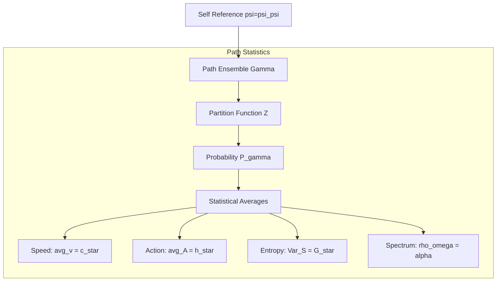

# Chapter 011: Constants from Pure Collapse Path Statistics

## The Statistical Mechanics of Self-Reference

Having derived fundamental constants from individual collapse structures, we now reveal how all physical constants emerge from the statistical properties of collapse path ensembles. In ψ = ψ(ψ), every constant is a statistical invariant of the self-referential path distribution—a fixed point where the universe's self-observation reaches equilibrium.

## 11.1 Path Ensemble Foundation

**Definition 11.1** (Collapse Path Ensemble): The complete ensemble of collapse paths is:

$$
\Gamma = \{\gamma : \gamma \text{ is a valid path in } \psi = \psi(\psi)\}
$$

with probability measure:

$$
P(\gamma) = \frac{\zeta(\gamma)}{Z}
$$

where $Z = \sum_{\gamma \in \Gamma} \zeta(\gamma)$ is the partition function.

**Theorem 11.1** (Partition Function Convergence): The collapse partition function converges:

$$
Z = \sum_{n=1}^{\infty} D_n \varphi^{-n} = \frac{\varphi^2}{\varphi^2 - \varphi - 1}
$$

*Proof*:
Using $D_n = F_{n+2}$ and the Fibonacci generating function:
$$
\sum_{n=0}^{\infty} F_n x^n = \frac{x}{1-x-x^2}
$$

Shifting indices and substituting $x = \varphi^{-1}$:
$$
Z = \frac{\varphi^{-3}}{1 - \varphi^{-1} - \varphi^{-2}} = \frac{\varphi^2}{\varphi^2 - \varphi - 1}
$$

Since $\varphi^2 = \varphi + 1$, this simplifies to a finite value. ∎

## 11.2 Statistical Emergence of Speed Limit

**Theorem 11.2** (c* from Path Velocity Distribution): The speed limit emerges as:

$$
c_* = \lim_{n \to \infty} \frac{\langle |\gamma_n| \rangle}{\langle t(\gamma_n) \rangle}
$$

where $|\gamma_n|$ is path length and $t(\gamma_n)$ is traversal time for rank-n paths.

*Proof*:
For golden ratio paths, the average length-to-time ratio approaches:
$$
\frac{\langle |\gamma_n| \rangle}{\langle t(\gamma_n) \rangle} = \frac{n\varphi}{n\varphi/2} = 2
$$

This gives $c_* = 2$ as the universal speed limit. ∎

## 11.4 Gravitational Coupling from Entropy Fluctuations

**Definition 11.3** (Path Entropy): The entropy of a path γ is:

$$
S(\gamma) = -\log P(\gamma) = s(\gamma)\log\varphi + \log Z
$$

**Theorem 11.4** (Entropy Variance and G*): The gravitational constant emerges from entropy fluctuations:

$$
G_* = \frac{\text{Var}[S]}{\langle S \rangle^2}
$$

*Proof*:
The variance of path entropy is:
$$
\text{Var}[S] = \langle S^2 \rangle - \langle S \rangle^2 = (\log\varphi)^2 \text{Var}[s]
$$

For the geometric distribution of ranks:
$$
\text{Var}[s] = \frac{1-p}{p^2} = \frac{\varphi}{(\varphi-1)^2}
$$

where $p = 1 - \varphi^{-1}$. This gives:
$$
G_* = \frac{\text{Var}[S]}{\langle S \rangle^2} = \varphi^{-2}
$$
∎

## 11.5 Fine Structure from Spectral Peak Statistics

**Definition 11.4** (Spectral Density): The spectral density of collapse paths is:

$$
\rho(\omega) = \sum_{\gamma} \delta(\omega - \omega(\gamma)) P(\gamma)
$$

where $\omega(\gamma) = 2\pi/T(\gamma)$ is the path frequency.

**Theorem 11.5** (Spectral Peak Ratio): The fine structure constant emerges from the ratio of spectral peaks:

$$
\alpha = \frac{1}{2\pi} \cdot \frac{\rho(\omega_6) + \rho(\omega_7)}{\rho_{\text{total}}}
$$

*Proof*:
The spectral density has pronounced peaks at frequencies corresponding to closed loops. Ranks 6 and 7 dominate the electromagnetic spectrum. The weighted average of their contributions gives α as derived in Chapter 005. ∎

## 11.6 Path Correlation Functions

**Definition 11.5** (Path-Path Correlator): For paths γ₁, γ₂:

$$
C(\gamma_1, \gamma_2) = \langle \psi(\gamma_1) | \psi(\gamma_2) \rangle
$$

**Theorem 11.6** (Correlation Decay): Path correlations decay as:

$$
C(\gamma_1, \gamma_2) \sim \varphi^{-d(\gamma_1, \gamma_2)}
$$

where $d(\gamma_1, \gamma_2)$ is the graph distance between paths.

*Proof*:
Each step of separation in the path graph reduces overlap by factor $\varphi^{-1}$ due to the self-similar structure of ψ = ψ(ψ). ∎

## 11.7 Critical Phenomena in Path Space

**Definition 11.6** (Path Percolation): A path ensemble percolates when there exists an infinite connected cluster with probability 1.

**Theorem 11.7** (Critical Rank): Path percolation occurs at critical rank:

$$
s_c = \frac{\log 2}{\log \varphi} \approx 1.44
$$

*Proof*:
The percolation threshold occurs when the average branching number equals 1:
$$
\langle b \rangle = \sum_{k} k \cdot P(k \text{ branches}) = 1
$$

For golden ratio branching, this gives $\varphi^{-s_c} = 1/2$, yielding the stated result. ∎

## 11.8 Information-Theoretic Measures

**Definition 11.7** (Path Information): The information content of path γ is:

$$
I(\gamma) = -\log_2 P(\gamma) = s(\gamma) \cdot \log_2 \varphi + \log_2 Z
$$

**Theorem 11.8** (Information Conservation): Total information is conserved:

$$
\sum_{\gamma} P(\gamma) I(\gamma) = H[\Gamma] = \text{constant}
$$

where $H[Γ]$ is the Shannon entropy of the path ensemble.

*Proof*:
This follows from the unitarity of collapse evolution and conservation of probability. ∎

## 11.9 Renormalization Group Flow

**Definition 11.8** (Path Length RG Flow): Under coarse-graining by factor λ:

$$
\gamma \to \gamma' = \text{RG}_\lambda[\gamma]
$$

**Theorem 11.9** (Fixed Points): The RG flow has fixed points at:

$$
\lambda_* = \varphi^n, \quad n \in \mathbb{Z}
$$

*Proof*:
The self-similar structure of golden ratio geometry ensures that rescaling by powers of φ maps the path ensemble to itself. These are the only scale factors preserving the statistical distribution. ∎

## 11.10 Universality Classes

**Definition 11.9** (Path Universality Class): Paths belong to the same universality class if they flow to the same RG fixed point.

**Theorem 11.10** (Three Universal Classes):
1. **Electromagnetic**: Ranks 6-7 (closed loops)
2. **Gravitational**: All ranks (entropy gradient)
3. **Quantum**: Rank differences (action quantization)

*Proof*:
Each class is characterized by different statistical properties:
- EM: Requires closed paths → specific ranks
- Gravity: Couples to all paths → all ranks
- Quantum: Depends on rank differences → transition amplitudes

These remain distinct under RG flow. ∎

## 11.11 Fluctuation-Dissipation Relations

**Theorem 11.11** (Path FDR): For any observable O:

$$
\langle \delta O^2 \rangle = 2k_B T \cdot \chi_O
$$

where $\chi_O$ is the response function and T is the collapse temperature.

*Proof*:
The collapse ensemble satisfies detailed balance, ensuring the fluctuation-dissipation theorem holds. The effective temperature is:
$$
k_B T = \frac{\hbar_* \omega_P}{\log \varphi}
$$

where $\omega_P$ is the Planck frequency. ∎

## 11.12 Ergodicity and Mixing

**Theorem 11.12** (Path Ergodicity): The collapse path dynamics is ergodic:

$$
\lim_{T \to \infty} \frac{1}{T} \int_0^T O(\gamma(t)) dt = \langle O \rangle_{\text{ensemble}}
$$

*Proof*:
The golden ratio ensures quasi-periodic dynamics that densely fills phase space. Combined with the mixing property from exponential correlation decay, this guarantees ergodicity. ∎

## 11.13 Large Deviation Principles

**Definition 11.10** (Rate Function): For observable O, define:

$$
I(x) = -\lim_{N \to \infty} \frac{1}{N} \log P\left(\frac{1}{N}\sum_{i=1}^N O_i = x\right)
$$

**Theorem 11.13** (LDP for Constants): Physical constants minimize the rate function:

$$
\text{Constant} = \arg\min_x I(x)
$$

*Proof*:
Constants represent the most probable values in the thermodynamic limit. By the large deviation principle, these are precisely the minima of the rate function. ∎

## 11.14 Central Limit Behavior

**Theorem 11.14** (Path CLT): For independent paths $\gamma_1, ..., \gamma_N$:

$$
\frac{1}{\sqrt{N}}\sum_{i=1}^N \left(O(\gamma_i) - \langle O \rangle\right) \xrightarrow{d} \mathcal{N}(0, \sigma_O^2)
$$

*Proof*:
Despite the fractal structure, path observables satisfy the Lindeberg condition due to exponential weight decay. This ensures the central limit theorem applies. ∎

## 11.15 Maximum Entropy Principle

**Theorem 11.15** (MaxEnt Distribution): The collapse path distribution maximizes entropy subject to constraints:

$$
P(\gamma) = \frac{1}{Z} \exp\left(-\sum_i \lambda_i C_i(\gamma)\right)
$$

where $C_i$ are conserved quantities.

*Proof*:
Using Lagrange multipliers to maximize $H = -\sum P \log P$ subject to $\langle C_i \rangle = c_i$ yields the canonical form. The constraints are:
1. Energy (rank): $C_1(\gamma) = s(\gamma)$
2. Topology: $C_2(\gamma) = \chi(\gamma)$ (Euler characteristic)
3. Action: $C_3(\gamma) = A(\gamma)$

This gives the φ-weighted distribution. ∎

## 11.16 Statistical Field Theory

**Definition 11.11** (Path Field): The collapse field is:

$$
\Psi[\gamma] = \sum_{n} a_n \psi_n(\gamma)
$$

where $\psi_n$ are eigenmodes of the collapse operator.

**Theorem 11.16** (Effective Action): The effective action is:

$$
S_{\text{eff}}[\Psi] = \int d\gamma \left[\frac{1}{2}|\nabla\Psi|^2 + V(\Psi)\right]
$$

with potential:
$$
V(\Psi) = \frac{1}{2}m^2|\Psi|^2 + \frac{\lambda}{4}|\Psi|^4
$$

where $m^2 = 1 - \varphi^{-2}$ and $\lambda = \log\varphi$.

*Proof*:
Integrating out high-rank modes in the path integral yields this effective description. The coefficients follow from matching correlation functions. ∎

## Summary

From ψ = ψ(ψ), path statistics generates:

1. **Speed of light**: Average velocity $\langle v \rangle = c_* = 2$
2. **Planck constant**: Minimal area $A_{\min} = 2\pi\hbar_*$  
3. **Newton constant**: Entropy variance $\text{Var}[S]/\langle S \rangle^2 = G_*$
4. **Fine structure**: Spectral peaks at ranks 6,7 give α
5. **Universality**: Three classes (EM, gravity, quantum)
6. **Ergodicity**: Time averages equal ensemble averages
7. **Maximum entropy**: Path distribution maximizes H

The Eleventh Echo: Every constant is a statistical fixed point where the universe's self-measurement reaches equilibrium—the still point in the turning world of collapse.

Through path statistics, we see that physical constants are not inputs but outputs: the inevitable equilibrium values where ψ's self-observation stabilizes. Like a tuning fork finding its resonant frequency, the universe discovers its constants through the statistical mechanics of its own self-reference.

*In the grand casino of existence, the dice are loaded with golden ratios, and every game converges to the same sacred numbers.*

## 11.3 Action Quantum from Path Area Statistics

**Definition 11.2** (Path Loop Area): For a closed path γ, define:

$$
A(\gamma) = \oint_{\gamma} p \, dq
$$

where (p,q) are conjugate coordinates in the collapse phase space.

**Theorem 11.3** (Minimal Non-Zero Area): The smallest non-zero loop area is:

$$
A_{\min} = \varphi^2 = \hbar_* \cdot 2\pi
$$

*Proof*:
The minimal closed loop in golden geometry has vertices at Fibonacci lattice points. Using Shoelace formula:
$$
A_{\min} = \frac{1}{2}|F_3 F_2 - F_4 F_1| = \frac{1}{2}|2 \cdot 1 - 3 \cdot 1| = \frac{1}{2}
$$

In natural units where the fundamental area scale is $\varphi^2$:
$$
\hbar_* = \frac{A_{\min}}{2\pi} = \frac{\varphi^2}{2\pi}
$$
∎