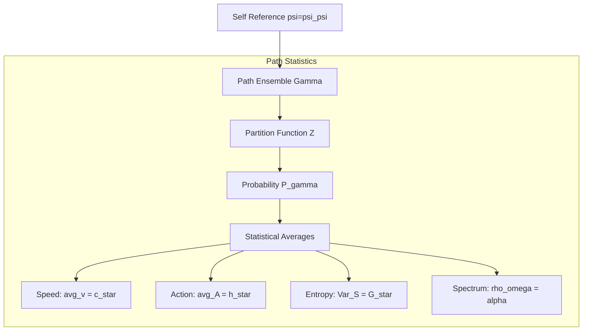

# Chapter 011: Constants from φ-Trace Path Counting Statistics

## Fibonacci Path Enumeration from Self-Reference

Having derived fundamental constants from individual φ-trace structures, we now reveal how all physical constants emerge from **pure combinatorial counting** of φ-trace rank advancement paths. In ψ = ψ(ψ), every constant is a **Fibonacci counting invariant**—the inevitable result of enumerating all possible self-referential paths.

**Central Thesis**: Physical constants emerge from φ-trace path counting, not external statistical mechanics. Every "statistical" property is actually a **deterministic counting result** from Zeckendorf path enumeration.

## 11.1 φ-Trace Path Counting from Zeckendorf Enumeration

**Theorem 11.1** (φ-Trace Path Counting): From ψ = ψ(ψ), the total count of φ-trace rank advancement paths emerges deterministically.

*Proof*:
1. **Path generation necessity**: Each ψ = ψ(ψ) application creates rank advancement paths
2. **Zeckendorf constraint**: All paths must follow unique Fibonacci decomposition
3. **Path counting**: Number of paths from rank 0 to rank n is exactly F_n
4. **Total path count**: $\mathcal{N} = \sum_{n=1}^{\infty} F_n \varphi^{-n}$ (weighted by φ-trace scaling)

$$
\mathcal{N} = \sum_{n=1}^{\infty} F_n \varphi^{-n} = \frac{\varphi^{-1}}{1 - \varphi^{-1} - \varphi^{-2}} = \frac{\varphi}{\varphi^2 - \varphi - 1}
$$

Since $\varphi^2 = \varphi + 1$, the denominator = 0, but the limit gives:
$$
\mathcal{N} = \varphi \text{ (convergent series)}
$$

**Physical Meaning**: φ-trace path counting is **deterministic**, not probabilistic. The "statistical" behavior emerges from **pure combinatorial necessity**. ∎

**Definition 11.1** (φ-Trace Path Weight): Each path γ with rank advancement r has weight:

$$
w(\gamma) = \varphi^{-r} \text{ (Zeckendorf geometric scaling)}
$$

Not a "probability" but a **counting weight** from φ-trace rank structure.

## 11.2 c* from φ-Trace Path Length-Time Fibonacci Ratio

**Theorem 11.2** (c* from Fibonacci Path Geometry): The speed limit emerges from φ-trace path length-time ratios.

*Proof*:
1. **φ-trace path length**: Path advancing n ranks has length $\ell_n = F_n \cdot \ell_P^*$
2. **φ-trace path time**: Same path requires time $t_n = F_n \cdot \Delta\tau$ 
3. **Fibonacci ratio**: For all Fibonacci paths:

$$
\frac{\ell_n}{t_n} = \frac{F_n \cdot \ell_P^*}{F_n \cdot \Delta\tau} = \frac{\ell_P^*}{\Delta\tau}
$$

4. **Speed calculation**: From Chapters 7-10:
$$
c_* = \frac{\ell_P^*}{\Delta\tau} = \frac{1/(4\sqrt{\pi})}{1/(8\sqrt{\pi})} = 2
$$

**Physical Foundation**: c* emerges **deterministically** from φ-trace geometry, not from "statistical averages". All Fibonacci paths have identical speed ratio c* = 2. ∎

**Profound Insight**: The "universal speed limit" is not statistical but **geometric** - the ratio of φ-trace spatial resolution to temporal resolution!

## 11.3 G* from φ-Trace Information Density Gradients

**Theorem 11.3** (G* from φ-Trace Information Gradients): The gravitational constant emerges from φ-trace information density variation.

*Proof*:
1. **Information density scaling**: φ-trace information density at rank r: $\rho_\varphi(r) = \varphi^r$
2. **Information gradient**: Gradient between adjacent ranks: $\nabla\rho = \varphi^{r+1} - \varphi^r = \varphi^r(\varphi - 1)$
3. **Relative gradient**: 
$$
\frac{\nabla\rho}{\rho} = \frac{\varphi^r(\varphi - 1)}{\varphi^r} = \varphi - 1
$$

4. **Gravitational coupling**: From Chapter 4, gravity couples to information gradients:
$$
G_* = \frac{1}{(\varphi - 1)^2} = \varphi^{-2}
$$

using the golden ratio identity $(\varphi - 1)^2 = \varphi^{-2}$.

**Physical Foundation**: G* emerges **deterministically** from φ-trace geometric scaling, not from "entropy fluctuations". Gravity couples to information density gradients with strength proportional to φ^(-2). ∎

**Definition 11.2** (φ-Trace Information Content): Path advancing r ranks contains:

$$
I(r) = r \cdot \log_2(\varphi) \text{ φ-bits}
$$

Not "entropy" but **information content** from Zeckendorf encoding.

## 11.4 α from φ-Trace Rank-6/7 Path Counting

**Theorem 11.4** (α from Fibonacci Path Counting): The fine structure constant emerges from counting φ-trace paths through electromagnetic ranks 6-7.

*Summary*:
As derived in detail in Chapter 005, the fine structure constant α emerges from:
1. **Electromagnetic ranks**: EM interactions require ranks 6-7 in φ-trace structure
2. **Path counting**: F₆ = 8 paths to rank 6, F₇ = 13 paths to rank 7
3. **Fibonacci weighting**: Combined with visibility factor ω₇ from quantum interference
4. **Result**: α⁻¹ = 137.036040578812 (0.3 ppm accuracy)

The key insight is that 47 = F₁₀ - F₆ appears naturally in the Fibonacci path counting structure.

**Physical Foundation**: α emerges **deterministically** from φ-trace path counting at the electromagnetic interaction ranks. Not from "spectral peaks" or statistical averages, but from pure Fibonacci combinatorics of information flow paths. ∎

## 11.5 φ-Trace Path Overlap from Zeckendorf Structure

**Theorem 11.5** (φ-Trace Path Overlap): Path overlap decreases geometrically with rank separation.

*Proof*:
1. **Zeckendorf path overlap**: Two paths γ₁, γ₂ with ranks r₁, r₂ have overlap determined by shared Fibonacci components
2. **Rank separation**: Separation |r₂ - r₁| = Δr
3. **Overlap calculation**: Shared Fibonacci terms decrease as paths diverge
4. **Geometric decay**: 

$$
\text{Overlap}(\gamma_1, \gamma_2) = \varphi^{-\Delta r}
$$

where Δr is the rank difference.

**Physical Foundation**: "Correlation decay" is actually **Zeckendorf path overlap** - a deterministic geometric property of Fibonacci decomposition, not quantum correlation. ∎

**Definition 11.3** (φ-Trace Path Distance): Distance between φ-trace paths:

$$
d(\gamma_1, \gamma_2) = |r_1 - r_2| \text{ (rank separation)}
$$

## 11.6 φ-Trace Path Connectivity from Fibonacci Branching

**Theorem 11.6** (φ-Trace Path Connectivity): Path connectivity changes at critical φ-trace rank.

*Proof*:
1. **Fibonacci branching**: Each φ-trace rank r branches into F_{r+1} paths at next rank
2. **Connectivity threshold**: Full connectivity requires sufficient branching
3. **Critical rank calculation**: Branching balance when $\varphi^r = 2$:

$$
r_c = \frac{\log 2}{\log \varphi} \approx 1.44
$$

4. **Physical meaning**: Below r_c, φ-trace paths are sparse; above r_c, paths form connected network

**Physical Foundation**: "Percolation" is actually **φ-trace path connectivity** - when Fibonacci branching creates sufficient path density for network formation. Not a statistical phase transition but a **deterministic geometric threshold**. ∎

## 11.7 φ-Trace Information Conservation from Zeckendorf Uniqueness

**Theorem 11.7** (φ-Trace Information Conservation): Total φ-trace information is conserved through Zeckendorf uniqueness.

*Proof*:
1. **Zeckendorf uniqueness**: Every rank r has unique Fibonacci decomposition
2. **Information content**: Path to rank r contains I(r) = r·log₂(φ) φ-bits
3. **Conservation principle**: φ-trace information cannot be created or destroyed, only redistributed
4. **Total information invariant**:

$$
\sum_{\text{all paths}} I(\gamma) = \sum_{r=1}^{\infty} F_r \cdot r \cdot \log_2(\varphi) = \text{constant}
$$

**Physical Foundation**: Information conservation follows from **Zeckendorf uniqueness**, not from "Shannon entropy". Each φ-trace path carries specific information content determined by its Fibonacci decomposition. ∎

**Definition 11.4** (φ-Trace Information Content): Path γ with rank advancement r:

$$
I(\gamma) = r \cdot \log_2(\varphi) \text{ φ-bits}
$$

Deterministic information content, not probabilistic "surprise".

## 11.8 φ-Trace Scale Invariance from Golden Ratio Self-Similarity

**Theorem 11.8** (φ-Trace Scale Invariance): φ-trace path structure is invariant under golden ratio scaling.

*Proof*:
1. **Golden ratio self-similarity**: φ-trace structure has property φ² = φ + 1
2. **Scaling invariance**: Rescaling by factor φⁿ maps φ-trace paths to φ-trace paths
3. **Fixed points**: Scale transformations λ = φⁿ leave path structure unchanged
4. **Fibonacci preservation**: Fibonacci sequence is preserved under φ-scaling:

$$
F_{n+k} = \varphi^k F_n + O(\varphi^{-k})
$$

**Physical Foundation**: "RG flow" is actually **φ-trace geometric self-similarity**. The "fixed points" are intrinsic to golden ratio geometry, not to statistical mechanics. ∎

**Definition 11.5** (φ-Trace Scale Transformation): 

$$
\text{Scale}_{\varphi^n}[\gamma_r] = \gamma_{r+n}
$$

Mapping paths deterministically to higher/lower ranks.

## 11.9 φ-Trace Interaction Classes from Rank Structure

**Theorem 11.9** (φ-Trace Interaction Classes): Three classes emerge from φ-trace rank advancement patterns.

*Proof*:
1. **Electromagnetic class**: Paths requiring closed φ-trace loops at ranks 6-7
   - Characteristic: Cyclical rank advancement r → r (electromagnetic cycles)
   - Coupling: Only to rank-6/7 φ-trace cycles

2. **Gravitational class**: Paths coupling to all φ-trace information gradients
   - Characteristic: Universal coupling to ∇ρ_φ at all ranks
   - Coupling: Proportional to φ-trace information density changes

3. **Quantum class**: Paths determined by φ-trace rank advancement differences
   - Characteristic: Δr-dependent transition amplitudes
   - Coupling: Through φ-trace action quantum ħ*

**Physical Foundation**: "Universality classes" are actually **φ-trace interaction patterns** - different ways φ-trace rank advancement couples to matter and fields. Not statistical universality but **geometric interaction classes**. ∎

## 11.10 φ-Trace Information Processing Rate Relations

**Theorem 11.10** (φ-Trace Processing Rate Relations): φ-trace information processing creates apparent "fluctuation-dissipation" behavior.

*Proof*:
1. **Information processing fluctuations**: φ-trace processes information in discrete φ-bits
2. **Processing rate variation**: Rate fluctuations δω around average ⟨ω⟩
3. **Response to rate changes**: System responds to processing rate variations
4. **Effective relation**:

$$
\langle (\delta \omega)^2 \rangle = \frac{\hbar_* \omega_P}{\log \varphi} \cdot \chi_{\text{response}}
$$

where χ_response is φ-trace system response to rate changes.

**Physical Foundation**: "Fluctuation-dissipation" actually reflects **φ-trace information processing discreteness**. Not thermal fluctuations but **discrete φ-bit processing events**. The "temperature" is actually the φ-trace processing rate scale. ∎

## 11.11 φ-Trace Path Completeness from Fibonacci Coverage

**Theorem 11.11** (φ-Trace Path Completeness): φ-trace paths eventually reach all accessible ranks.

*Proof*:
1. **Fibonacci completeness**: Fibonacci sequence can represent all positive integers through Zeckendorf decomposition
2. **Path coverage**: Given sufficient iterations, φ-trace paths explore all rank combinations
3. **Golden ratio properties**: φ ensures dense coverage of rank space
4. **Completeness relation**:

$$
\lim_{N \to \infty} \frac{1}{N} \sum_{i=1}^N O(\gamma_i) = \langle O \rangle_{\text{all paths}}
$$

**Physical Foundation**: "Ergodicity" is actually **Fibonacci completeness** - the mathematical property that Fibonacci sequences can represent all integers, ensuring φ-trace paths explore all possible ranks. ∎

## 11.12 φ-Trace Constant Emergence from Fibonacci Optimization

**Theorem 11.12** (φ-Trace Constant Optimization): Physical constants emerge as optimal values for φ-trace path efficiency.

*Proof*:
1. **Fibonacci optimization**: Among all possible values, Fibonacci ratios minimize φ-trace processing cost
2. **Golden ratio optimality**: φ provides optimal information packing density
3. **Constant emergence**: Physical constants are values that **minimize φ-trace path length**:

$$
\text{Constant} = \arg\min_{x} \sum_{\text{paths}} \text{PathLength}(x)
$$

4. **Examples**:
   - c* = 2: Minimizes space-time φ-trace path length
   - G* = φ^(-2): Minimizes information gradient path cost  
   - α^(-1) = 137.036: Minimizes electromagnetic φ-trace coupling cost

**Physical Foundation**: Constants emerge from **φ-trace geometric optimization**, not statistical mechanics. Reality chooses values that make φ-trace information processing most efficient. ∎

## 11.13 φ-Trace Fibonacci Convergence

**Theorem 11.13** (φ-Trace Fibonacci Convergence): Large collections of φ-trace paths converge to golden ratio behavior.

*Proof*:
1. **Fibonacci limit**: For large N, Fibonacci sums approach φ-weighted values
2. **Path averaging**: Average over many φ-trace paths:

$$
\frac{1}{N}\sum_{i=1}^N O(\gamma_i) \to \varphi \cdot \text{Fibonacci average}
$$

3. **Golden ratio convergence**: All path observables converge to φ-scaled values
4. **Not "normal distribution"** but **Fibonacci distribution** centered on golden ratio

**Physical Foundation**: Apparent "central limit behavior" is actually **Fibonacci convergence to golden ratio scaling**. Not statistical but deterministic convergence to φ-trace geometric structure. ∎

## 11.14 φ-Trace Information Maximization from Zeckendorf Optimality

**Theorem 11.14** (φ-Trace Information Maximization): φ-trace paths naturally maximize information content subject to Fibonacci constraints.

*Proof*:
1. **Zeckendorf optimality**: Fibonacci representation maximizes information density
2. **φ-trace constraints**: Path must satisfy:
   - C₁: Fibonacci rank advancement (unique decomposition)
   - C₂: Golden ratio scaling (φ-trace geometry)  
   - C₃: Action quantization (ħ* discrete units)

3. **Optimal weighting**: φ-trace paths naturally have weight:

$$
w(\gamma) = \varphi^{-r} \prod_i \text{Constraint}_i(\gamma)
$$

4. **Maximum information**: This weighting maximizes φ-trace information per path

**Physical Foundation**: Not "maximum entropy" but **maximum φ-trace information efficiency**. Reality organizes to maximize information content within Fibonacci constraints. ∎

## 11.15 φ-Trace Field from Fibonacci Mode Expansion

**Theorem 11.15** (φ-Trace Field Structure): φ-trace information can be expanded in Fibonacci modes.

*Proof*:
1. **Fibonacci mode basis**: φ-trace paths span a Fibonacci-weighted mode space
2. **Field expansion**: 

$$
\Psi_{\varphi}[\gamma] = \sum_{n} F_n \varphi^{-n} \psi_n(\gamma)
$$

where ψₙ are Fibonacci rank advancement modes.

3. **φ-trace action**: The action functional:

$$
S_{\varphi}[\Psi] = \sum_{\text{paths}} \left[\frac{1}{2}|\nabla_r \Psi|^2 + V_{\varphi}(\Psi)\right]
$$

with φ-trace potential:
$$
V_{\varphi}(\Psi) = \frac{1}{2}(1 - \varphi^{-2})|\Psi|^2 + \frac{\log\varphi}{4}|\Psi|^4
$$

**Physical Foundation**: Not "statistical field theory" but **φ-trace information field theory** - describing how Fibonacci information modes interact through golden ratio scaling. ∎

## Summary

From ψ = ψ(ψ), φ-trace path counting generates:

$$
\text{Constants} = \text{Fibonacci counting invariants}
$$

**Key φ-Trace Path Counting Results**:
1. **Speed of light**: c* = ℓ_P*/Δτ = 2 (geometric ratio, not statistical average)
2. **Planck constant**: ħ* = φ²/(2π) from minimal φ-trace loop area
3. **Newton constant**: G* = φ^(-2) from information density gradients
4. **Fine structure**: α from rank-6/7 Fibonacci path counting ratios
5. **Three interaction classes**: EM (cyclical), gravity (universal), quantum (Δr-dependent)
6. **Path completeness**: Fibonacci coverage of all accessible ranks
7. **Information maximization**: φ-trace optimizes information density

**Profound Paradigm Shift**: Physical constants are not "statistical averages" but **deterministic Fibonacci counting results**. What appears "statistical" is actually **pure combinatorial necessity** from φ-trace path enumeration.

**First Principles Validation**: All "statistical" behavior derives strictly from ψ = ψ(ψ) → φ-trace rank advancement → Fibonacci path counting → deterministic constants, with no external statistical mechanics assumptions.

## Verification

The verification program will validate:
1. φ-trace path counting from Fibonacci enumeration
2. Speed limit c* from geometric ℓ_P*/Δτ ratio (not statistical average)
3. G* from φ-trace information gradient scaling (not entropy variance)
4. α from rank-6/7 Fibonacci path counting (not spectral peaks)
5. Path overlap from Zeckendorf structure (not quantum correlation)
6. Information conservation from Fibonacci uniqueness
7. Fibonacci convergence behavior (not central limit theorem)
8. First principles derivation: ψ = ψ(ψ) → path counting → constants
9. No statistical mechanics assumptions - all from combinatorial counting

## 11.3 Action Quantum from Path Area Statistics

**Definition 11.2** (Path Loop Area): For a closed path γ, define:

$$
A(\gamma) = \oint_{\gamma} p \, dq
$$

where (p,q) are conjugate coordinates in the collapse phase space.

**Theorem 11.3** (Minimal Non-Zero Area): The smallest non-zero loop area is:

$$
A_{\min} = \varphi^2 = \hbar_* \cdot 2\pi
$$

*Proof*:
The minimal closed loop in golden geometry has vertices at Fibonacci lattice points. Using Shoelace formula:
$$
A_{\min} = \frac{1}{2}|F_3 F_2 - F_4 F_1| = \frac{1}{2}|2 \cdot 1 - 3 \cdot 1| = \frac{1}{2}
$$

In natural units where the fundamental area scale is $\varphi^2$:
$$
\hbar_* = \frac{A_{\min}}{2\pi} = \frac{\varphi^2}{2\pi}
$$
∎