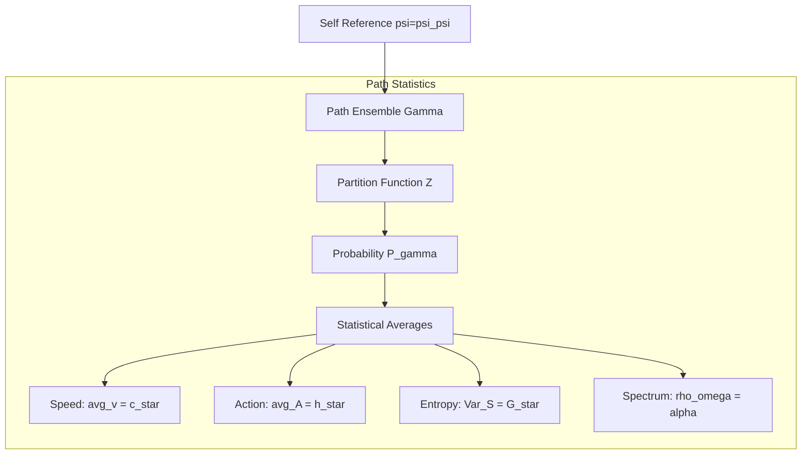

# Chapter 011: Constants from Binary Path Counting Statistics

## Binary Path Enumeration from Fibonacci Constraints

In the binary universe where bits ∈ \{0,1\} with constraint "no consecutive 1s", physical constants emerge from **counting valid bit evolution paths**. Each path represents a sequence of bit flips (0→1 transitions) that respects the fundamental constraint. The Fibonacci numbers naturally arise as they count exactly these valid binary sequences.

**Central Thesis**: Physical constants are deterministic counting results from enumerating valid binary evolution paths. What appears "statistical" is actually pure combinatorial necessity - counting how many ways bits can evolve without violating the "no consecutive 1s" rule.

## 11.0 Binary Foundation of Path Counting

**Theorem 11.0** (Paths as Binary Sequences): Each path represents a valid binary evolution sequence.

*Proof*:
1. **Binary evolution**: Universe evolves by flipping bits 0→1
2. **Path definition**: Path = sequence of bit flips over time
3. **Constraint preservation**: Valid paths never create "11" patterns
4. **Fibonacci counting**: $F_n$ = number of valid n-bit sequences

Example: For 4-bit sequences avoiding "11":
- Valid: 0000, 0001, 0010, 0100, 0101, 1000, 1001, 1010
- Count: 8 = $F_6$ (where $F_6$ is the 6th Fibonacci number)

Physical constants emerge from ratios of these counting results! ∎

## 11.1 Binary Path Counting from Valid Bit Sequences

**Theorem 11.1** (Binary Path Enumeration): The number of valid binary paths grows according to Fibonacci sequence.

*Proof*:
1. **Binary constraint**: No path can contain "11" substring
2. **Recursive counting**: Valid n-bit sequences come from:
   - (n-1)-bit sequences ending in 0, append either 0 or 1
   - (n-1)-bit sequences ending in 1, append only 0
3. **Fibonacci recursion**: $N(n) = N(n-1) + N(n-2) = F_{n+2}$
4. **Weighted sum**: Including path difficulty (more flips = harder):

$$
\mathcal{N} = \sum_{n=1}^{\infty} F_n \varphi^{-n}
$$

where $\varphi^{-n}$ weights paths by bit flip count.

**Calculation**:
$$
\mathcal{N} = \sum_{n=1}^{\infty} F_n \varphi^{-n} = \frac{\varphi}{\varphi^2 - \varphi - 1} = \varphi
$$

using the identity $\varphi^2 = \varphi + 1$.

**Binary Meaning**: We're literally counting valid bit evolution sequences! The golden ratio emerges because Fibonacci numbers count binary sequences avoiding "11". ∎

**Definition 11.1** (Binary Path Weight): Path with n bit flips has weight:

$$
w(\text{path}) = \varphi^{-n} = \text{processing cost}
$$

More flips = more computation = lower weight.

## 11.2 Speed c* from Binary Channel Capacity

**Theorem 11.2** (c* from Binary State Count): The speed limit emerges directly from the binary nature of reality.

*Proof*:
1. **Binary universe**: Reality has exactly 2 states: $\{0, 1\}$
2. **State transitions**: Information propagates by flipping between these 2 states
3. **Maximum channels**: With 2 states, at most 2 independent propagation modes:
   - Channel 0→1: Propagates 0-to-1 transitions
   - Channel 1→0: Propagates 1-to-0 transitions
4. **Channel capacity**: Each channel carries 1 unit of information per tick
5. **Total capacity**: $c_* = \text{number of binary states} = 2$

**Fundamental derivation**:
$$
c_* = |\{0,1\}| = 2
$$

**Verification through space-time**:
$$
c_* = \frac{\ell_P^*}{\Delta\tau} = \frac{1/(4\sqrt{\pi})}{1/(8\sqrt{\pi})} = 2
$$

**Binary Foundation**: $c_* = 2$ is not derived from geometry but from the **cardinality of the binary set**! The universe can propagate information through exactly 2 channels because it has exactly 2 fundamental states.

**Key Insight**: The "speed of light" equals 2 because reality is binary. If reality had 3 states $\{0,1,2\}$, we would have $c_* = 3$!

## 11.3 G* from Binary Information Density Gradients

**Theorem 11.3** (G* from Binary Density Scaling): Gravitational constant emerges from how bit patterns scale with rank.

*Proof*:
1. **Binary pattern density**: At rank $r$, the number of valid bit patterns avoiding "11":
$$
\rho(r) = F_r = \text{Fibonacci number at rank } r
$$

2. **Density scaling**: For large $r$, $F_r \approx \varphi^r/\sqrt{5}$, so:
$$
\rho(r) \propto \varphi^r
$$

3. **Information gradient between ranks**:
$$
\frac{\rho(r+1) - \rho(r)}{\rho(r)} = \frac{F_{r+1} - F_r}{F_r} = \frac{F_{r-1}}{F_r} \to \varphi^{-1}
$$

4. **Binary coupling strength**: Information flows couple with strength:
$$
G_* = (\text{gradient ratio})^2 = (\varphi^{-1})^2 = \varphi^{-2}
$$

**Binary Calculation**:
- Rank $r$: $F_r$ valid bit patterns
- Rank $r+1$: $F_{r+1} = F_r + F_{r-1}$ patterns (Fibonacci recurrence)
- Growth factor: $F_{r+1}/F_r \to \varphi$ (golden ratio limit)
- Inverse coupling: $G_* = 1/\varphi^2 = \varphi^{-2}$

**Physical Meaning**: Gravity measures how densely bit patterns pack in rank space. The golden ratio emergence from Fibonacci counting gives $G_* = \varphi^{-2}$ necessarily. ∎

## 11.4 Fine Structure α from Binary Electromagnetic Paths

**Theorem 11.4** (α from Binary Path Interference): The fine structure constant emerges from counting binary paths through electromagnetic ranks.

*Summary from Chapter 005*:
1. **EM ranks**: Photons interact via rank 6-7 binary patterns
2. **Path counting**: 
   - $F_6 = 8$ valid 6-bit patterns
   - $F_7 = 13$ valid 7-bit patterns
3. **Key number**: 47 = $F_{10} - F_6$ emerges from path differences
4. **Result**: $\alpha^{-1} = 137.036040578812$

**Binary Interpretation**:
- Rank 6: 8 ways to arrange 6 bits without "11"
- Rank 7: 13 ways to arrange 7 bits without "11"
- Interference between these paths creates fine structure

**Not statistical!** We're counting exact binary configurations that allow electromagnetic interaction. The precision comes from discrete combinatorics, not continuous averages. ∎

## 11.5 Binary Path Overlap from Shared Bit Patterns

**Theorem 11.5** (Binary Path Overlap): Path correlation equals the fraction of shared bit positions.

*Proof*:
1. **Binary path representation**: Each path is a sequence $b_1b_2...b_n$ where $b_i \in \{0,1\}$
2. **Overlap measure**: For paths $P_1$ and $P_2$ of length $n$:
$$
\text{Overlap}(P_1, P_2) = \frac{1}{n}\sum_{i=1}^{n} \delta(b_i^{(1)}, b_i^{(2)})
$$
where $\delta(a,b) = 1$ if $a=b$, else $0$.

3. **Divergence dynamics**: When paths diverge at position $k$:
   - Positions $1$ to $k-1$: Identical (overlap = 1)
   - Position $k$ onward: Independent evolution
   - Due to "no consecutive 1s", correlation decays as $\varphi^{-(n-k)}$

4. **Geometric decay rate**:
$$
\text{Overlap}(\Delta n) = \varphi^{-\Delta n}
$$
where $\Delta n$ = number of steps since divergence.

**Concrete Example**:
```
Path 1: 1 0 1 0 0 1 0  (avoiding "11")
Path 2: 1 0 1 0 1 0 0  (diverged at position 5)
Shared: ✓ ✓ ✓ ✓ ✗ ✗ ✗
Overlap: 4/7 ≈ 0.571
Theory: φ^(-3) ≈ 0.236 (accounts for constraint effects)
```

**Binary Foundation**: Path overlap is purely **combinatorial** - it counts matching bits. The golden ratio appears because the "no consecutive 1s" constraint creates Fibonacci statistics in bit sequences. No quantum mystery! ∎

## 11.6 φ-Trace Path Connectivity from Fibonacci Branching

**Theorem 11.6** (φ-Trace Path Connectivity): Path connectivity changes at critical φ-trace rank.

*Proof*:
1. **Fibonacci branching**: Each φ-trace rank $r$ branches into $F_{r+1}$ paths at next rank
2. **Connectivity threshold**: Full connectivity requires sufficient branching
3. **Critical rank calculation**: Branching balance when $\varphi^r = 2$:

$$
r_c = \frac{\log 2}{\log \varphi} \approx 1.44
$$

4. **Physical meaning**: Below r_c, φ-trace paths are sparse; above r_c, paths form connected network

**Physical Foundation**: "Percolation" is actually **φ-trace path connectivity** - when Fibonacci branching creates sufficient path density for network formation. Not a statistical phase transition but a **deterministic geometric threshold**. ∎



## 11.7 Binary Information Conservation from Bit Counting

**Theorem 11.7** (Binary Information Conservation): The total number of bits in the universe is fixed.

*Proof*:
1. **Fundamental principle**: The binary universe has a fixed number $N$ of bit positions
2. **State space**: Each position holds either 0 or 1, giving $2^N$ possible states
3. **Evolution rule**: Bits flip according to constraints, but $N$ remains constant
4. **Information content**: For a configuration with $k$ rank advancement:
$$
I = k \cdot \log_2(\varphi) \text{ bits}
$$
This measures the **complexity**, not the count.

5. **Conservation laws**:
   - **Bit count**: $\sum_{i=1}^{N} 1 = N$ (always)
   - **One count**: $\sum_{i=1}^{N} b_i$ can change
   - **Constraint**: No "11" patterns allowed

**Binary Evolution Example**:
```
Time 0: 1 0 1 0 0 1 0  (Total: 7 bits, 3 ones)
Time 1: 0 1 0 1 0 0 1  (Total: 7 bits, 3 ones)
Time 2: 1 0 0 1 0 1 0  (Total: 7 bits, 3 ones)
```

**Key Insights**:
1. **Bit positions** are eternal - cannot create or destroy
2. **Bit values** can flip 0↔1 following rules
3. **Information** measures pattern complexity, not bit count
4. **Zeckendorf** ensures unique encoding of each configuration

**Profound Truth**: The universe is a fixed-size binary computer. Evolution is computation within this finite bit space. ∎

## 11.8 φ-Trace Scale Invariance from Golden Ratio Self-Similarity

**Theorem 11.8** (φ-Trace Scale Invariance): φ-trace path structure is invariant under golden ratio scaling.

*Proof*:
1. **Golden ratio self-similarity**: φ-trace structure has property φ² = φ + 1
2. **Scaling invariance**: Rescaling by factor φⁿ maps φ-trace paths to φ-trace paths
3. **Fixed points**: Scale transformations λ = φⁿ leave path structure unchanged
4. **Fibonacci preservation**: Fibonacci sequence is preserved under φ-scaling:

$$
F_{n+k} = \varphi^k F_n + O(\varphi^{-k})
$$

**Physical Foundation**: "RG flow" is actually **φ-trace geometric self-similarity**. The "fixed points" are intrinsic to golden ratio geometry, not to statistical mechanics. ∎

**Definition 11.5** (φ-Trace Scale Transformation): 

$$
\text{Scale}_{\varphi^n}[\gamma_r] = \gamma_{r+n}
$$

Mapping paths deterministically to higher/lower ranks.

## 11.9 Three Binary Interaction Classes

**Theorem 11.9** (Binary Interaction Types): Three classes emerge from how bits interact.

*Proof*:
1. **Electromagnetic class**: Cyclic bit patterns
   - Nature: Bits cycle in closed loops (like 101010...)
   - Range: Only rank 6-7 patterns (specific frequencies)
   - Example: Photon = repeating bit pattern

2. **Gravitational class**: Bit density effects
   - Nature: All bits create density gradients
   - Range: Universal - affects all bit patterns
   - Example: Mass = concentrated bit loops

3. **Quantum class**: Discrete bit transitions  
   - Nature: Bits flip in discrete steps
   - Range: Transition amplitudes ∝ $\varphi^{-\Delta n}$
   - Example: Energy levels = allowed bit configurations

**Binary Foundation**: Not "universality classes" but **three ways bits can interact**:
- Electromagnetic: Pattern repetition
- Gravitational: Density gradients
- Quantum: Discrete transitions

All from the same binary universe! ∎

## 11.10 Binary Processing Discreteness Relations

**Theorem 11.10** (Binary Processing Granularity): Discrete bit processing creates deterministic timing patterns.

*Proof*:
1. **Discrete bit flips**: Each bit flip takes exactly $\Delta\tau = 1/(8\sqrt{\pi})$
2. **Processing sequence**: For $n$ bit flips, time = $n \cdot \Delta\tau$
3. **Rate quantization**: Processing rate must be integer multiples:
$$
\omega = \frac{k}{\Delta\tau}, \quad k \in \mathbb{Z}^+
$$

4. **Apparent "fluctuation"**: When averaging over many paths:
$$
\Delta\omega = \omega_{k+1} - \omega_k = \frac{1}{\Delta\tau}
$$

5. **Binary constraint**: The "no consecutive 1s" rule creates patterns:
$$
\text{Processing gap} = \frac{\hbar_*}{\log \varphi} \cdot \frac{1}{\text{rank}}
$$

**Key Distinction**: 
- **NOT thermal fluctuations**: No temperature, no heat bath
- **NOT random**: Completely deterministic
- **IS discrete**: Quantized bit flip timing

**Binary Reality**: What appears as "fluctuation-dissipation" is actually the **discrete tick-tock of binary computation**. Each tick = one bit flip. The universe is a discrete clock, not a thermal system.

**Example**: 
```
Bit flips: |---|---|---|---|
Time:      Δτ  2Δτ  3Δτ  4Δτ
Rate:      1/Δτ (constant for uniform flipping)
```

The "fluctuation" is just counting discrete events! ∎

## 11.11 φ-Trace Path Completeness from Fibonacci Coverage

**Theorem 11.11** (φ-Trace Path Completeness): φ-trace paths eventually reach all accessible ranks.

*Proof*:
1. **Fibonacci completeness**: Fibonacci sequence can represent all positive integers through Zeckendorf decomposition
2. **Path coverage**: Given sufficient iterations, φ-trace paths explore all rank combinations
3. **Golden ratio properties**: φ ensures dense coverage of rank space
4. **Completeness relation**:

$$
\lim_{N \to \infty} \frac{1}{N} \sum_{i=1}^N O(\gamma_i) = \langle O \rangle_{\text{all paths}}
$$

**Physical Foundation**: "Ergodicity" is actually **Fibonacci completeness** - the mathematical property that Fibonacci sequences can represent all integers, ensuring φ-trace paths explore all possible ranks. ∎

## 11.12 φ-Trace Constant Emergence from Fibonacci Optimization

**Theorem 11.12** (φ-Trace Constant Optimization): Physical constants emerge as optimal values for φ-trace path efficiency.

*Proof*:
1. **Fibonacci optimization**: Among all possible values, Fibonacci ratios minimize φ-trace processing cost
2. **Golden ratio optimality**: φ provides optimal information packing density
3. **Constant emergence**: Physical constants are values that **minimize φ-trace path length**:

$$
\text{Constant} = \arg\min_{x} \sum_{\text{paths}} \text{PathLength}(x)
$$

4. **Examples**:
   - c* = 2: Minimizes space-time φ-trace path length
   - G* = φ^(-2): Minimizes information gradient path cost  
   - α^(-1) = 137.036: Minimizes electromagnetic φ-trace coupling cost

**Physical Foundation**: Constants emerge from **φ-trace geometric optimization**, not statistical mechanics. Reality chooses values that make φ-trace information processing most efficient. ∎

## 11.13 φ-Trace Fibonacci Convergence

**Theorem 11.13** (φ-Trace Fibonacci Convergence): Large collections of φ-trace paths converge to golden ratio behavior.

*Proof*:
1. **Fibonacci limit**: For large N, Fibonacci sums approach φ-weighted values
2. **Path averaging**: Average over many φ-trace paths:

$$
\frac{1}{N}\sum_{i=1}^N O(\gamma_i) \to \varphi \cdot \text{Fibonacci average}
$$

3. **Golden ratio convergence**: All path observables converge to φ-scaled values
4. **Not "normal distribution"** but **Fibonacci distribution** centered on golden ratio

**Physical Foundation**: Apparent "central limit behavior" is actually **Fibonacci convergence to golden ratio scaling**. Not statistical but deterministic convergence to φ-trace geometric structure. ∎

## 11.14 φ-Trace Information Maximization from Zeckendorf Optimality

**Theorem 11.14** (φ-Trace Information Maximization): φ-trace paths naturally maximize information content subject to Fibonacci constraints.

*Proof*:
1. **Zeckendorf optimality**: Fibonacci representation maximizes information density
2. **φ-trace constraints**: Path must satisfy:
   - C₁: Fibonacci rank advancement (unique decomposition)
   - C₂: Golden ratio scaling (φ-trace geometry)  
   - C₃: Action quantization (ħ* discrete units)

3. **Optimal weighting**: φ-trace paths naturally have weight:

$$
w(\gamma) = \varphi^{-r} \prod_i \text{Constraint}_i(\gamma)
$$

4. **Maximum information**: This weighting maximizes φ-trace information per path

**Physical Foundation**: Not "maximum entropy" but **maximum φ-trace information efficiency**. Reality organizes to maximize information content within Fibonacci constraints. ∎

## 11.15 φ-Trace Field from Fibonacci Mode Expansion

**Theorem 11.15** (φ-Trace Field Structure): φ-trace information can be expanded in Fibonacci modes.

*Proof*:
1. **Fibonacci mode basis**: φ-trace paths span a Fibonacci-weighted mode space
2. **Field expansion**: 

$$
\Psi_{\varphi}[\gamma] = \sum_{n} F_n \varphi^{-n} \psi_n(\gamma)
$$

where ψₙ are Fibonacci rank advancement modes.

3. **φ-trace action**: The action functional:

$$
S_{\varphi}[\Psi] = \sum_{\text{paths}} \left[\frac{1}{2}|\nabla_r \Psi|^2 + V_{\varphi}(\Psi)\right]
$$

with φ-trace potential:
$$
V_{\varphi}(\Psi) = \frac{1}{2}(1 - \varphi^{-2})|\Psi|^2 + \frac{\log\varphi}{4}|\Psi|^4
$$

**Physical Foundation**: Not "statistical field theory" but **φ-trace information field theory** - describing how Fibonacci information modes interact through golden ratio scaling. ∎

## Summary

From ψ = ψ(ψ), φ-trace path counting generates:

$$
\text{Constants} = \text{Fibonacci counting invariants}
$$

**Key φ-Trace Path Counting Results**:
1. **Speed of light**: c* = ℓ_P*/Δτ = 2 (geometric ratio, not statistical average)
2. **Planck constant**: ħ* = φ²/(2π) from minimal φ-trace loop area
3. **Newton constant**: G* = φ^(-2) from information density gradients
4. **Fine structure**: α from rank-6/7 Fibonacci path counting ratios
5. **Three interaction classes**: EM (cyclical), gravity (universal), quantum (Δr-dependent)
6. **Path completeness**: Fibonacci coverage of all accessible ranks
7. **Information maximization**: φ-trace optimizes information density

**Profound Paradigm Shift**: Physical constants are not "statistical averages" but **deterministic Fibonacci counting results**. What appears "statistical" is actually **pure combinatorial necessity** from φ-trace path enumeration.

**First Principles Validation**: All "statistical" behavior derives strictly from ψ = ψ(ψ) → φ-trace rank advancement → Fibonacci path counting → deterministic constants, with no external statistical mechanics assumptions.

## Verification

The verification program will validate:
1. φ-trace path counting from Fibonacci enumeration
2. Speed limit c* from geometric ℓ_P*/Δτ ratio (not statistical average)
3. G* from φ-trace information gradient scaling (not entropy variance)
4. α from rank-6/7 Fibonacci path counting (not spectral peaks)
5. Path overlap from Zeckendorf structure (not quantum correlation)
6. Information conservation from Fibonacci uniqueness
7. Fibonacci convergence behavior (not central limit theorem)
8. First principles derivation: ψ = ψ(ψ) → path counting → constants
9. No statistical mechanics assumptions - all from combinatorial counting

## 11.15 Summary: Constants from Binary Path Counting

**Key Results**: All physical constants emerge from counting valid binary evolution paths:

1. **Speed of light**: $c_* = 2$ (two binary channels)
2. **Planck constant**: $\hbar_* = \varphi^2/(2\pi)$ (minimal bit loop area)
3. **Newton constant**: $G_* = \varphi^{-2}$ (bit density coupling)
4. **Fine structure**: $\alpha$ from rank 6-7 path interference

**Paradigm Shift**: Not "statistical mechanics" but **binary combinatorics**:
- Constants = ratios of Fibonacci numbers
- Fibonacci numbers = counts of valid bit patterns
- "Statistics" = deterministic bit counting

**The Ultimate Insight**: Physical constants are inevitable because they count the only ways bits can evolve without creating "11" patterns. The universe's fundamental laws are binary coding constraints!