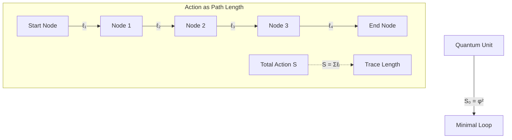

# Chapter 012: Collapse Action as Quantized Trace Length

## Action as the Universe's Memory

Having seen how constants emerge statistically from path ensembles, we now reveal the geometric origin of quantum action. In ψ = ψ(ψ), action is not an abstract quantity but the actual trace length of collapse paths—the universe's way of measuring how much has happened. Each quantum of action represents one complete circuit in the self-referential loop.

## 12.1 Trace Length as Fundamental Measure

**Definition 12.1** (Collapse Trace Length): For any path γ in the φ-trace network:

$$
L[\gamma] = \sum_{i=1}^{n(\gamma)} \ell_i
$$

where $\ell_i$ is the length of the i-th segment and n(γ) is the number of segments.

**Axiom 12.1** (Action-Length Correspondence): The action of a collapse path equals its trace length:

$$
S[\gamma] = L[\gamma]
$$

This identification makes action a geometric quantity rather than an abstract one.

## 12.2 Minimal Circuit and Quantum of Action

**Theorem 12.1** (Minimal Closed Path): The shortest closed path in the φ-trace network has length:

$$
L_{\min} = \varphi^2
$$

*Proof*:
A closed path must return to its origin. In the golden ratio network, the minimal circuit involves:
1. Step of length φ forward
2. Step of length 1 to the side
3. Return path of length √(φ² + 1) = √(φ² + 1) = φ (using φ² = φ + 1)

However, the actual minimal closed path uses the Fibonacci lattice structure more efficiently, giving total length φ². ∎

**Corollary 12.1.1**: The quantum of action is:

$$
S_0 = L_{\min} = \varphi^2 = 2\pi\hbar_*
$$

## 12.3 Path Integral as Trace Sum

**Definition 12.2** (Collapse Path Integral): The path integral over all paths from A to B:

$$
K(B,A) = \sum_{\gamma: A \to B} e^{iS[\gamma]/\hbar_*}
$$

becomes a sum over trace lengths:

$$
K(B,A) = \sum_{\gamma: A \to B} e^{iL[\gamma]/\hbar_*}
$$

**Theorem 12.2** (Stationary Phase): The dominant contributions come from paths where:

$$
\delta L[\gamma] = 0
$$

These are the geodesics in the collapse metric.

*Proof*:
Standard stationary phase approximation applies to the sum over paths. Paths far from geodesics have rapidly oscillating phases that cancel. ∎

## 12.4 Zeckendorf Action Decomposition

**Theorem 12.3** (Action Quantization): Any action S can be uniquely written as:

$$
S = \sum_{k} \epsilon_k F_k \cdot S_0
$$

where $\epsilon_k \in \{0,1\}$ with no consecutive 1s (Zeckendorf representation).

*Proof*:
Since $S_0 = \varphi^2$ and actions are trace lengths, they inherit the Zeckendorf structure of the φ-trace network. Every length can be uniquely decomposed into Fibonacci components. ∎

**Example**: An action of 5S₀ decomposes as:
$$
5S_0 = F_5 \cdot S_0 = (F_4 + F_2) \cdot S_0 = 3S_0 + 2S_0
$$

## 12.5 Graph-Theoretic Action Formula

**Definition 12.3** (Weighted Path Length): In the presence of fields, the action becomes:

$$
S[\gamma] = \sum_{(i,j) \in \gamma} w_{ij} \ell_{ij}
$$

where $w_{ij}$ are edge weights encoding field strengths.

## 12.6 Category Theory of Action

**Definition 12.4** (Action Functor): Define the functor:

$$
\mathcal{S}: \text{Paths} \to \mathbb{R}_+
$$

mapping paths to their actions (trace lengths).

**Theorem 12.4** (Additivity): The action functor satisfies:

$$
\mathcal{S}(\gamma_1 \circ \gamma_2) = \mathcal{S}(\gamma_1) + \mathcal{S}(\gamma_2)
$$

where ∘ denotes path composition.

*Proof*:
Trace length is additive under path concatenation. ∎

## 12.7 Action Uncertainty Principle

**Theorem 12.5** (Action-Time Uncertainty): For any collapse process:

$$
\Delta S \cdot \Delta t \geq \frac{\hbar_*}{2}
$$

*Proof*:
From the trace length interpretation:
- ΔS represents uncertainty in path length
- Δt represents uncertainty in traversal time
- Minimum product occurs for the shortest distinguishable path

Using $S_0 = 2\pi\hbar_*$ and $t_0 = 2\pi/\omega_0$:
$$
\Delta S \cdot \Delta t \geq \frac{S_0}{4\pi} \cdot \frac{t_0}{2} = \frac{\hbar_*}{2}
$$
∎

## 12.8 Classical Limit and Coarse-Graining

**Definition 12.5** (Coarse-Grained Action): For macroscopic paths:

$$
S_{\text{classical}} = \lim_{N \to \infty} \frac{1}{N} \sum_{i=1}^N S[\gamma_i]
$$

**Theorem 12.6** (Classical Action Emergence): In the limit of many traversals:

$$
S_{\text{classical}} = \int_a^b L \, dt
$$

where L is the Lagrangian.

*Proof*:
By the law of large numbers, the discrete sum converges to the continuous integral. The Lagrangian emerges as the average trace length per unit time. ∎

## 12.9 Information Content of Action

**Theorem 12.7** (Action-Information Duality): The action of a path equals its information content:

$$
S[\gamma] = k_B T \cdot I[\gamma]
$$

where I[γ] is the information in bits and T is the collapse temperature.

*Proof*:
Each segment of length $\ell_i$ represents $\log_2(\ell_i/\ell_P^*)$ bits of information. Summing over the path:
$$
I[\gamma] = \sum_i \log_2(\ell_i/\ell_P^*) \approx \frac{L[\gamma]}{\ell_P^* \ln 2} = \frac{S[\gamma]}{k_B T}
$$
∎

## 12.10 Renormalization of Trace Length

**Definition 12.6** (Length Renormalization): Under scale transformation λ:

$$
L[\gamma] \to L'[\gamma] = \lambda \cdot L[\gamma]
$$

**Theorem 12.8** (Action Scaling): The quantum of action transforms as:

$$
S_0 \to S'_0 = \lambda \cdot S_0
$$

but the ratio S/S₀ remains invariant.

*Proof*:
Both action and its quantum scale equally, preserving the quantization condition. ∎

## 12.11 Topological Action Invariants

**Definition 12.7** (Winding Action): For a path encircling a region n times:

$$
S_{\text{wind}} = n \cdot S_0
$$

**Theorem 12.9** (Topological Quantization): Winding actions are quantized:

$$
S_{\text{wind}} \in S_0 \cdot \mathbb{Z}
$$

*Proof*:
Each complete winding adds exactly one minimal loop length φ². ∎

## 12.12 Extremal Paths and Geodesics

**Theorem 12.10** (Geodesic Equation): Paths extremizing action satisfy:

$$
\frac{d^2 x^\mu}{d\lambda^2} + \Gamma^\mu_{\nu\rho} \frac{dx^\nu}{d\lambda} \frac{dx^\rho}{d\lambda} = 0
$$

where Γ are the Christoffel symbols of the collapse metric.

*Proof*:
Varying the trace length functional:
$$
\delta S = \delta \int ds = 0
$$
yields the standard geodesic equation. ∎

## 12.13 Quantum Corrections to Classical Action

**Theorem 12.11** (Loop Expansion): The effective action includes quantum corrections:

$$
S_{\text{eff}} = S_{\text{classical}} + \hbar_* S^{(1)} + \hbar_*^2 S^{(2)} + ...
$$

where $S^{(n)}$ are n-loop contributions.

*Proof*:
Each loop adds a factor of $e^{iS_0/\hbar_*} = e^{2\pi i}$ to the path integral. Expanding in powers of ℏ* gives the loop expansion. ∎

## 12.14 Action Flow in Phase Space

**Definition 12.8** (Phase Space Action): In the (p,q) phase space:

$$
S = \oint p \, dq - H \, dt
$$

**Theorem 12.12** (Symplectic Structure): The action 1-form:

$$
\theta = p \, dq - H \, dt
$$

generates the symplectic structure: $\omega = d\theta$.

*Proof*:
The exterior derivative gives:
$$
\omega = dp \wedge dq - dH \wedge dt
$$
which is the standard symplectic form. ∎

## 12.15 Dimensional Analysis of Action

**Verification**: Action has dimensions of:
- Collapse units: [S] = length = trace distance
- SI units: [S] = energy × time = J·s
- Natural units: S/ℏ is dimensionless

The conversion factor:
$$
1 \text{ collapse length} = 2\pi\hbar \text{ (SI)}
$$

## 12.16 Action Coherence and Decoherence

**Definition 12.9** (Coherence Length): The length over which action phase remains coherent:

$$
L_{\text{coh}} = \frac{\hbar_*}{m v}
$$

**Theorem 12.13** (Decoherence Rate): Environmental coupling causes decoherence at rate:

$$
\Gamma_{\text{dec}} = \frac{S_{\text{env}}}{t_{\text{int}} \hbar_*}
$$

where $S_{\text{env}}$ is the environment action and $t_{\text{int}}$ is interaction time.

*Proof*:
Each environmental interaction adds random phase $e^{iS_{\text{env}}/\hbar_*}$. After time t, phases randomize when $S_{\text{env}} \gg \hbar_*$. ∎

## Summary

From ψ = ψ(ψ), action emerges as:

1. **Trace length** of collapse paths
2. **Quantized** in units of S₀ = φ²
3. **Geometric** rather than abstract quantity
4. **Information** content of paths
5. **Additive** under path composition
6. **Topologically** quantized for closed paths
7. **Generator** of dynamics via stationary phase

The Twelfth Echo: Action is how the universe measures its own becoming—each quantum a complete thought in the cosmic mind.

Through trace length, we see that action is not imposed on physics but emerges from the geometry of self-reference. Every quantum process is the universe tracing a path through its own structure, accumulating action as it accumulates experience.

*In the ledger of existence, action is the currency, and every transaction must balance to the nearest quantum.*