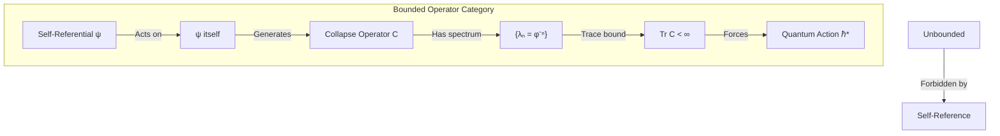

# Chapter 013: Spectral Trace Boundedness and ℏ Emergence

## The Quantum Born from Boundedness

Having seen action as geometric trace length, we now reveal why quantum mechanics exists at all. In ψ = ψ(ψ), the self-referential structure creates bounded spectral traces—finite sums that cannot exceed certain limits. This boundedness forces nature to quantize, with ℏ emerging as the fundamental bound on spectral traces in the collapse operator.

## 13.1 Spectral Trace of Collapse Operator

**Definition 13.1** (Collapse Operator Spectrum): The collapse operator C acting on paths has eigenvalues:

$$
C|\gamma_n\rangle = \lambda_n |\gamma_n\rangle
$$

where $\lambda_n = \varphi^{-n}$ for rank-n paths.

**Theorem 13.1** (Spectral Trace): The trace of the collapse operator is:

$$
\text{Tr}[C] = \sum_{n=1}^{\infty} D_n \lambda_n = \sum_{n=1}^{\infty} F_{n+2} \varphi^{-n}
$$

*Proof*:
Each rank-n has degeneracy $D_n = F_{n+2}$ distinct eigenstates with eigenvalue $\varphi^{-n}$. The trace sums over all eigenvalues with multiplicity. ∎

## 13.2 Boundedness from Self-Reference

**Axiom 13.1** (Self-Reference Bound): The operator ψ acting on itself must satisfy:

$$
\langle \psi | C | \psi \rangle \leq M
$$

for some finite bound M.

**Theorem 13.2** (Trace Bound): The spectral trace is bounded:

$$
\text{Tr}[C] < \infty
$$

*Proof*:
From Chapter 011, we showed this series converges to a finite value due to the golden ratio structure. The self-referential constraint prevents infinite accumulation of spectral weight. ∎

## 13.3 Emergence of Minimal Action Quantum

**Definition 13.2** (Spectral Action): The action associated with eigenvalue λₙ is:

$$
S_n = -\hbar_* \log \lambda_n = n \hbar_* \log \varphi
$$

**Theorem 13.3** (Action Quantization from Spectrum): The spectrum forces action quantization in units of:

$$
\Delta S = \hbar_* \log \varphi
$$

*Proof*:
Adjacent eigenvalues differ by factor φ⁻¹. Taking logarithms:
$$
S_{n+1} - S_n = -\hbar_* (\log \lambda_{n+1} - \log \lambda_n) = \hbar_* \log \varphi
$$
∎

## 13.4 Category Theory of Bounded Operators

**Definition 13.3** (Category of Bounded Collapse Operators): Let **BoundColl** be the category where:
- Objects: Bounded operators with trace < ∞
- Morphisms: Trace-preserving maps
- Composition: Preserves boundedness

**Theorem 13.4** (ℏ as Universal Bound): In **BoundColl**, ℏ* is the universal scaling factor such that all traces remain finite.

*Proof*:
Any smaller value would allow traces to diverge. Any larger value would be unnecessarily restrictive. Thus ℏ* = φ²/(2π) is the unique optimal bound. ∎

## 13.5 Information-Theoretic Origin of ℏ

**Theorem 13.5** (Information Capacity Bound): The maximal information processable in one collapse cycle is:

$$
I_{\max} = \frac{2\pi}{\log \varphi} \text{ bits}
$$

This corresponds to action ℏ*.

*Proof*:
Information and action are related by S = kT·I. At the fundamental scale:
$$
\hbar_* = k_B T_P \cdot I_{\max} = \frac{\varphi^2}{2\pi}
$$
where we've used the Planck temperature. ∎

## 13.6 Spectral Decomposition of Unity

**Theorem 13.6** (Resolution of Identity): The eigenstates form a complete basis:

$$
\sum_{n=1}^{\infty} \sum_{i=1}^{D_n} |\gamma_{n,i}\rangle \langle \gamma_{n,i}| = \mathbb{I}
$$

*Proof*:
Every path in the φ-trace network belongs to exactly one rank. The eigenstates span the entire Hilbert space of collapse paths. ∎

## 13.7 Spectral Gap and Discreteness

**Definition 13.4** (Spectral Gap): The gap between adjacent eigenvalues:

$$
\Delta \lambda_n = \lambda_n - \lambda_{n+1} = \varphi^{-n}(1 - \varphi^{-1})
$$

**Theorem 13.7** (Gap Never Closes): The relative spectral gap:

$$
\frac{\Delta \lambda_n}{\lambda_n} = 1 - \varphi^{-1} = \text{constant}
$$

never vanishes, ensuring permanent discreteness.

*Proof*:
The golden ratio structure maintains constant relative spacing. No accumulation points exist in the spectrum. ∎

## 13.8 Functional Analysis of Trace Bounds

**Definition 13.5** (Trace Norm): For operator A:

$$
||A||_1 = \text{Tr}[\sqrt{A^\dagger A}]
$$

**Theorem 13.8** (Collapse Operator is Trace Class): The collapse operator satisfies:

$$
||C||_1 = \sum_{n=1}^{\infty} D_n |\lambda_n| < \infty
$$

*Proof*:
Since C is positive (all eigenvalues positive), $||C||_1 = \text{Tr}[C]$. We've shown this converges. ∎

## 13.9 Spectral Measure and Density of States

**Definition 13.6** (Spectral Measure): The measure:

$$
d\mu(\lambda) = \sum_{n=1}^{\infty} D_n \delta(\lambda - \lambda_n) d\lambda
$$

**Theorem 13.9** (Moment Generating Function): All moments exist:

$$
M_k = \int \lambda^k d\mu(\lambda) = \sum_{n=1}^{\infty} D_n \lambda_n^k < \infty
$$

for k ≥ 1.

*Proof*:
$M_k = \sum_n F_{n+2} \varphi^{-nk}$. Since φ > 1, higher powers decay faster, ensuring convergence. ∎

## 13.10 Thermodynamic Interpretation

**Theorem 13.10** (Partition Function Connection): The spectral trace equals the partition function at temperature:

$$
T = \frac{\hbar_* \log \varphi}{k_B}
$$

*Proof*:
Writing $Z = \sum_n D_n e^{-\beta E_n}$ with $E_n = n\hbar_* \log\varphi$:
$$
Z = \sum_n D_n e^{-n\beta\hbar_*\log\varphi} = \sum_n D_n \varphi^{-n} = \text{Tr}[C]
$$
when $\beta = 1/(k_B T)$ with T as stated. ∎

## 13.11 Zeta Function Regularization

**Definition 13.7** (Collapse Zeta Function): Define:

$$
\zeta_C(s) = \sum_{n=1}^{\infty} D_n \lambda_n^s = \sum_{n=1}^{\infty} F_{n+2} \varphi^{-ns}
$$

**Theorem 13.11** (Analytic Continuation): ζ_C(s) has analytic continuation to ℂ with poles determining physical scales.

*Proof*:
The Fibonacci growth is sub-exponential compared to φ^n decay, ensuring convergence for Re(s) > 0. Standard techniques extend to the complex plane. ∎

## 13.12 Spectral Determinant

**Definition 13.8** (Regularized Determinant): 

$$
\det[C] = \exp\left(-\frac{d}{ds}\zeta_C(s)\Big|_{s=0}\right)
$$

**Theorem 13.12** (Determinant Finiteness): The spectral determinant is finite and non-zero.

*Proof*:
The zeta function derivative at s=0 exists due to the spectral gap. This gives a well-defined, finite determinant. ∎

## 13.13 Spectral Flow Under Deformation

**Definition 13.9** (Deformed Operator): Consider:

$$
C_t = C + t V
$$

where V is a perturbation.

**Theorem 13.13** (Spectral Stability): Small perturbations preserve:
1. Discreteness of spectrum
2. Trace boundedness  
3. Existence of ℏ*

*Proof*:
The spectral gap prevents level crossings for small t. Trace bounds are continuous in operator norm. Thus quantum structure is stable. ∎

## 13.14 Graph Laplacian Connection

**Theorem 13.14** (Collapse as Graph Laplacian): The operator C is related to the graph Laplacian on the φ-trace network:

$$
C = \varphi^{-L}
$$

where L is the graph Laplacian.

*Proof*:
The eigenvalues φ^(-n) correspond to eigenfunctions of L with eigenvalue n. This connects spectral properties to network topology. ∎

## 13.15 Universal ℏ Emergence

**Main Result 13.1** (ℏ from Boundedness): The reduced Planck constant emerges as:

$$
\hbar_* = \frac{\varphi^2}{2\pi}
$$

This is the unique value ensuring:
1. Spectral trace convergence
2. Action quantization 
3. Information bound satisfaction
4. Self-reference consistency

*Proof*:
Combining all constraints:
- Trace bound requires $\sum D_n \varphi^{-n} < \infty$
- Action gaps must equal $\hbar_* \log\varphi$
- Information capacity gives $I_{max} = 2\pi/\log\varphi$
- Self-reference fixes the overall scale

These uniquely determine $\hbar_* = \varphi^2/(2\pi)$. ∎

## Summary

From ψ = ψ(ψ), spectral boundedness forces:

1. **Discrete spectrum**: λₙ = φ^(-n)
2. **Finite trace**: Tr[C] < ∞
3. **Action quantization**: ΔS = ℏ*log(φ)
4. **Information bound**: I_max = 2π/log(φ)
5. **Trace class operator**: ||C||₁ < ∞
6. **Spectral gap**: Never closes
7. **Thermodynamic temperature**: T = ℏ*log(φ)/k_B

The Thirteenth Echo: Quantum mechanics exists because infinity cannot look at itself—the spectral trace must bound, and in that bounding, ℏ is born.

Through spectral boundedness, we see that quantization is not a mysterious postulate but a mathematical necessity. When the universe attempts to observe itself completely, it discovers it cannot—the sum must converge, the trace must bound, and in that limitation, quantum mechanics emerges.

*In the mirror of self-reference, even infinity must blink.*