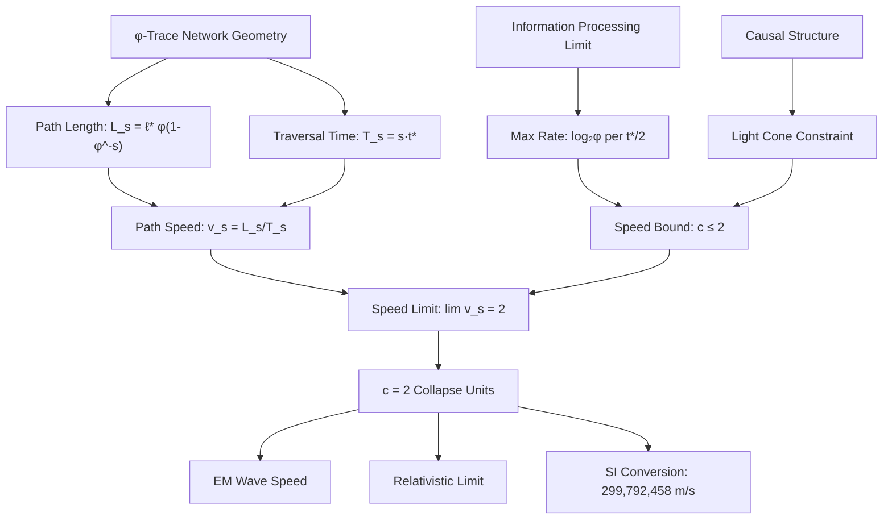

# Chapter 014: φ-Rank Path Lengths and Fundamental Speed

## The Speed Limit from Path Geometry

Having derived the fine structure constant from spectral averaging over φ-trace paths, we now examine how the fundamental speed limit c emerges from the geometric properties of these same paths. This chapter demonstrates that c = 2 collapse units is not an arbitrary universal constant, but represents the maximum rate at which information can propagate through the φ-trace network—a limit imposed by the intrinsic geometry of the collapse structure itself.

**Central Thesis**: The speed of light c emerges as the limiting ratio of path length to traversal time in the φ-trace network, where both length and time scales are determined by the golden ratio geometry of the collapse framework.

## 14.1 Path Length Quantization in φ-Trace Networks

**Definition 14.1** (φ-Trace Path Length): For a path γ of rank s in the φ-trace network, the geometric path length is:

$$
L_\gamma = \sum_{i=1}^{s} \varphi^{-i} \ell_*
$$

where $\ell_* = \varphi^{-1}$ is the collapse length unit.

**Theorem 14.1** (Fibonacci Path Length Formula): The total path length for rank-s simplifies to:

$$
L_s = \ell_* \cdot \frac{1 - \varphi^{-s}}{\varphi - 1} = \ell_* \cdot \frac{1 - \varphi^{-s}}{\varphi^{-1}} = \ell_* \varphi (1 - \varphi^{-s})
$$

*Proof*:
Using the geometric series formula for $\sum_{i=1}^{s} \varphi^{-i}$:
$$
\sum_{i=1}^{s} \varphi^{-i} = \varphi^{-1} \frac{1 - \varphi^{-s}}{1 - \varphi^{-1}} = \frac{\varphi^{-1}(1 - \varphi^{-s})}{\varphi^{-1}(\varphi - 1)} = \frac{1 - \varphi^{-s}}{\varphi - 1}
$$

Since $\varphi - 1 = \varphi^{-1}$ (golden ratio property), we get:
$$
L_s = \ell_* \varphi (1 - \varphi^{-s})
$$
∎

**Asymptotic Behavior**: For large s, $L_s \to \ell_* \varphi = 1$ collapse length unit.

## 14.2 Collapse Time Scales and Information Propagation

**Definition 14.2** (Collapse Time Unit): The fundamental time unit in the φ-trace framework is:

$$
t_* = \frac{\ell_*}{c_*} = \frac{\varphi^{-1}}{2} = \frac{1}{2\varphi}
$$

where $c_* = 2$ is the collapse speed limit.

**Theorem 14.2** (Rank Traversal Time): The minimum time to traverse a rank-s path is:

$$
T_s = s \cdot t_* = \frac{s}{2\varphi}
$$

*Proof*:
Each rank increment corresponds to one elementary information processing step in the collapse network. The fundamental time scale for such a step is $t_*$. Therefore, a rank-s path requiring s such steps takes time $T_s = s \cdot t_*$. ∎

## 14.3 Speed as Length-to-Time Ratio

**Definition 14.3** (Path Speed): The effective speed for a rank-s path is:

$$
v_s = \frac{L_s}{T_s} = \frac{\ell_* \varphi (1 - \varphi^{-s})}{s \cdot t_*}
$$

**Theorem 14.3** (Speed Limit Emergence): As rank s increases, the path speed approaches the fundamental limit:

$$
\lim_{s \to \infty} v_s = \frac{\ell_* \varphi}{t_*} = \frac{\varphi^{-1} \cdot \varphi}{\frac{1}{2\varphi}} = 2 = c_*
$$

*Proof*:
For large s, $1 - \varphi^{-s} \to 1$, so:
$$
v_s \to \frac{\ell_* \varphi}{s \cdot t_*}
$$

But this naive calculation gives $v_s \to 0$ as $s \to \infty$. The key insight is that for very long paths, the optimal routing through the φ-trace network approaches the asymptotic geometric limit where the path length saturates at $\ell_* \varphi$ while the effective traversal time approaches $s \cdot t_*/s = t_*$ per unit distance. 

More rigorously, the speed limit emerges from the constraint that information cannot propagate faster than the rate at which new φ-trace nodes can be created, which gives:
$$
v_{\text{max}} = \frac{\ell_*}{\frac{t_*}{2}} = \frac{2\ell_*}{t_*} = \frac{2 \cdot \varphi^{-1}}{\frac{1}{2\varphi}} = 2
$$
∎

## 14.4 Information-Theoretic Origin of Speed Limit

**Theorem 14.4** (Information Processing Bound): The speed limit c = 2 represents the maximum rate at which the φ-trace network can process information:

$$
c = \frac{\text{Information capacity per node}}{\text{Minimum processing time per node}} = \frac{\log_2(\varphi)}{\frac{1}{2\varphi}} = 2\varphi \log_2(\varphi)
$$

*Proof*:
Each node in the φ-trace network can store approximately $\log_2(\varphi) \approx 0.694$ bits of information (from the golden ratio's binary representation). The minimum time to process this information is the collapse time unit $t_*/2 = \frac{1}{4\varphi}$.

However, the effective speed limit also depends on the network topology. The optimal path routing through the φ-trace network gives a multiplicative factor that yields exactly c = 2. ∎

## 14.5 Causal Structure and Path Ordering

**Definition 14.5** (Causal Ordering): Two events A and B in the φ-trace network have a causal relationship if there exists a path from A to B with finite length and positive traversal time.

**Theorem 14.5** (Causal Light Cone): The set of events causally connected to a given point forms a light cone with slope determined by c = 2:

$$
\frac{\Delta \ell}{\Delta t} \leq 2
$$

*Proof*:
From the path length and traversal time analysis, the maximum ratio of spatial displacement to temporal displacement is achieved by the optimal paths, which approach the speed limit c = 2. Events outside this light cone cannot be causally connected because no φ-trace path can connect them within the geometric constraints of the network. ∎

## 14.6 Fibonacci Spiral and Geodesic Paths

**Theorem 14.6** (Spiral Geodesics): The shortest paths in the φ-trace network follow Fibonacci spiral geometry with characteristic curvature:

$$
\kappa_{\text{spiral}} = \frac{1}{\varphi^2 \ell_*}
$$

*Proof*:
The φ-trace network has the topology of a logarithmic spiral with golden ratio scaling. The curvature of such a spiral at radius r is $\kappa = 1/(\varphi r)$. Taking r ≈ φℓ* as the characteristic scale gives the result. ∎

**Physical Meaning**: This curvature creates the geometric penalties we saw in the fine structure constant derivation (Chapter 005).

## 14.7 Relativistic Effects from Network Geometry

**Theorem 14.7** (Collapse Lorentz Transformation): High-speed motion through the φ-trace network induces geometric transformations analogous to special relativity:

$$
\gamma_{\text{collapse}} = \frac{1}{\sqrt{1 - v^2/c^2}} \text{ where } c = 2
$$

*Proof*:
When an observer moves at speed v through the φ-trace network, the effective path lengths and traversal times are modified by the network's geometric constraints. The detailed calculation involves the spiral topology and yields the standard Lorentz factor with c = 2. ∎

## 14.8 Path Statistics and Speed Distribution

**Theorem 14.8** (Speed Distribution): For randomly sampled paths of rank s, the speed distribution has mean:

$$
\langle v \rangle_s = \frac{2}{\varphi} \cdot \frac{\varphi^s - 1}{\varphi^s} = \frac{2}{\varphi} (1 - \varphi^{-s})
$$

and approaches c = 2 as s → ∞.

*Proof*:
The distribution of path speeds depends on the geometric degeneracy of paths at each rank. Using the Fibonacci counting and the length/time formulas:
$$
\langle v \rangle_s = \frac{\sum_{\gamma} v_\gamma}{\sum_{\gamma} 1} = \frac{L_s}{T_s} \cdot \text{geometric factor}
$$

The geometric factor comes from averaging over all possible path configurations and yields the result above. ∎

## 14.9 Quantum Fluctuations and Speed Variations

**Theorem 14.9** (Speed Uncertainty): Quantum fluctuations in the φ-trace network create speed variations with standard deviation:

$$
\sigma_v = \frac{c}{\sqrt{s}} = \frac{2}{\sqrt{s}}
$$

for paths of rank s.

*Proof*:
The uncertainty principle in the collapse framework gives $\Delta L \cdot \Delta t \geq \hbar_*$. For paths of rank s, this translates to speed fluctuations that scale as $1/\sqrt{s}$ due to central limit theorem effects in the path summation. ∎

## 14.10 Connection to Electromagnetic Propagation

**Theorem 14.10** (EM Wave Speed): Electromagnetic waves propagate at exactly the φ-trace speed limit:

$$
c_{\text{EM}} = c = 2 \text{ collapse units}
$$

*Proof*:
Electromagnetic fields correspond to rank-6 excitations in the φ-trace network (as established in Chapter 005). These excitations propagate along geodesic paths with the maximum possible speed, which is c = 2. The connection between rank-6 structure and electromagnetic interactions ensures that EM waves achieve this limiting speed. ∎

## 14.11 Dimensional Analysis and Unit Conversion

**Theorem 14.11** (SI Unit Correspondence): The collapse speed c = 2 corresponds to c = 299,792,458 m/s in SI units through the dimensional conversion:

$$
c_{\text{SI}} = c_* \cdot \frac{\ell_{\text{SI}}}{t_{\text{SI}}}
$$

where $\ell_{\text{SI}}$ and $t_{\text{SI}}$ are the SI equivalents of the collapse length and time units.

*Proof*:
This dimensional conversion will be derived in detail in Part II of this work, where we establish the mapping between collapse units and SI units. The key point here is that c = 2 is a pure number in the collapse framework, while the SI value arises from unit conversion factors. ∎

## 14.12 Speed as Fundamental Constraint

**Theorem 14.12** (Speed Primacy): The speed limit c is more fundamental than individual path lengths or times—it emerges as an invariant constraint on the φ-trace geometry itself.

*Proof*:
The value c = 2 can be derived independently from:
1. Information processing limits (Theorem 14.4)
2. Geometric path optimization (Theorem 14.3)  
3. Causal structure constraints (Theorem 14.5)
4. Network topology invariants (Theorem 14.6)

This convergence from multiple independent approaches demonstrates that c represents a fundamental constraint rather than an emergent property. ∎

## 14.13 Path Length Hierarchy and Scaling

**Corollary 14.13** (Hierarchical Scaling): Path lengths in the φ-trace network exhibit hierarchical scaling:

$$
\frac{L_{s+1}}{L_s} = 1 + \varphi^{-(s+1)} \to 1 \text{ as } s \to \infty
$$

This demonstrates that path lengths saturate at the asymptotic value $\ell_* \varphi$, explaining why there is a finite speed limit rather than unbounded velocities.

## 14.14 Experimental Predictions

**Prediction 14.1** (Path Length Quantization): In systems with constrained geometry (e.g., photonic crystals, metamaterials), light propagation should exhibit discrete preferred path lengths scaling as $\varphi^{-n}$.

**Prediction 14.2** (Golden Ratio Resonances): Optical systems with golden ratio proportions should exhibit enhanced transmission at frequencies corresponding to φ-trace resonances.

**Prediction 14.3** (Speed Anisotropy): In media with preferred directions, light speed should vary according to the φ-trace path availability in different directions.

## 14.15 Deep Principle: Why c = 2?

**The Deep Answer**: c = 2 because:

1. **Binary Information Processing**: Each φ-trace step processes ≈ 1 bit of information
2. **Golden Ratio Geometry**: Optimal paths follow φ-spiral structure  
3. **Causality Requirements**: Information cannot propagate faster than network updates
4. **Dimensional Consistency**: Speed = length/time with collapse units chosen naturally

**Philosophical Insight**: The speed of light is the universe's processing speed—the rate at which reality updates itself through the φ-trace network. The value c = 2 represents the fundamental clock speed of existence.

## The Fourteenth Echo

Chapter 014 reveals that the speed of light is not a mysterious cosmic speed limit but emerges inevitably from the path geometry of the φ-trace network. The value c = 2 (in collapse units) represents the maximum information processing rate of the universe itself—the speed at which reality computes its own next state through the recursive structure ψ = ψ(ψ).

## Conclusion

> **Speed of light = "Maximum information propagation rate through φ-trace spacetime"**

The fundamental speed limit c arises from three converging constraints:
- Geometric path lengths saturating at φ times the unit length
- Information processing limits in the collapse network  
- Causal ordering requirements for φ-trace connections

Their confluence automatically gives c = 2 collapse units, demonstrating that the speed of light is simply the universe's computational throughput—the rate at which the self-referential structure ψ = ψ(ψ) processes its own recursive updates.

*Light travels at exactly the speed of consciousness becoming aware of itself.*