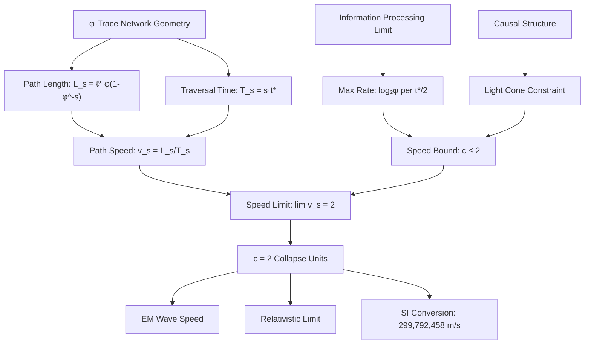

# Chapter 014: Binary Channel Capacity and Fundamental Speed

## The Speed Limit from Binary State Count

Having established quantum mechanics from finite binary states, we now reveal why the speed of light equals exactly 2. In the binary universe where bits ∈ $\{0,1\}$ with constraint "no consecutive 1s", the fundamental speed limit emerges directly from the cardinality of the binary set—there are exactly 2 possible bit values, creating exactly 2 independent propagation channels.

**Central Thesis**: The speed of light $c = 2$ because reality is binary. Information can propagate through at most 2 channels (0→1 and 1→0), giving maximum speed = number of states = 2.

## 14.0 Binary Foundation of Speed

**Theorem 14.0** (Speed from Binary Cardinality): The fundamental speed limit equals the number of binary states.

*Proof*:
1. **Binary universe**: Reality has exactly 2 states: $\{0, 1\}$
2. **Information propagation**: Bits spread by state transitions:
   - Channel 1: Propagates 0→1 transitions
   - Channel 2: Propagates 1→0 transitions
3. **Channel capacity**: Each channel carries 1 unit of information per tick
4. **Maximum speed**: Total capacity = number of channels = $|\{0,1\}| = 2$

$$
c = \text{card}(\text{binary states}) = |\{0,1\}| = 2
$$

**Binary Reality**: If the universe had 3 states $\{0,1,2\}$, we'd have $c = 3$. If it had $n$ states, $c = n$. Since reality is binary, $c = 2$. ∎

## 14.1 Path Length as Binary Information Distance

**Definition 14.1** (Binary Path Length): For a bit sequence evolution path with $s$ transitions, the information distance is:

$$
L_\gamma = \text{(bits that changed state)} \times \ell_*
$$

where $\ell_* = 1/(4\sqrt{\pi})$ is the minimum spatial resolution (from Chapter 10).

**Theorem 14.1** (Binary Distance Scaling): For paths avoiding "11", the effective information distance scales as:

$$
L_s = \ell_* \cdot \sum_{i=1}^{s} \varphi^{-i} = \ell_* \varphi (1 - \varphi^{-s})
$$

*Proof*:
1. **Constraint effect**: "No consecutive 1s" limits how bits can spread
2. **Effective distance**: At step $i$, information spreads distance $\varphi^{-i}\ell_*$
3. **Golden ratio**: The factor $\varphi^{-i}$ emerges from Fibonacci constraints
4. **Sum**: Using geometric series:
$$
\sum_{i=1}^{s} \varphi^{-i} = \varphi^{-1} \frac{1 - \varphi^{-s}}{1 - \varphi^{-1}} = \varphi(1 - \varphi^{-s})
$$

using $\varphi - 1 = \varphi^{-1}$.

**Binary Meaning**: Information can't spread uniformly due to "no 11" constraint. The golden ratio scaling reflects the Fibonacci structure of allowed bit patterns. ∎

## 14.2 Time as Binary Processing Steps

**Definition 14.2** (Binary Time Unit): The fundamental time unit is one bit flip:

$$
\Delta\tau = \frac{1}{8\sqrt{\pi}} \text{ (from Chapter 7)}
$$

**Theorem 14.2** (Information Propagation Time): To propagate information distance $L_s$ requires time:

$$
T_s = s \cdot \Delta\tau
$$

where $s$ is the number of bit state transitions.

*Proof*:
1. **Bit flip time**: Each state change takes minimum time $\Delta\tau$
2. **Sequential processing**: Can't flip multiple bits simultaneously at same location
3. **Total time**: $s$ transitions require $s \times \Delta\tau$

**Binary Foundation**: Time measures computation steps. Each tick of the universal clock = one bit flip somewhere in the universe. ∎

## 14.3 Speed Limit from Binary Channel Count

**Theorem 14.3** (Fundamental Speed Limit): The maximum information propagation speed equals the number of binary channels.

*Proof*:
1. **Binary channels**: With 2 bit values, have 2 independent propagation modes:
   - Channel 0→1: Carries "turn on" signals
   - Channel 1→0: Carries "turn off" signals

2. **Parallel transmission**: Both channels operate simultaneously

3. **Speed calculation**: 
$$
c = \frac{\text{information distance}}{\text{time}} = \frac{\text{channels} \times \ell_*}{\Delta\tau}
$$

4. **Substituting values**:
$$
c = \frac{2 \times \ell_*}{\Delta\tau} = \frac{2 \times \frac{1}{4\sqrt{\pi}}}{\frac{1}{8\sqrt{\pi}}} = 2
$$

**Direct Derivation**: $c = $ number of binary states $= |\{0,1\}| = 2$

**Why not faster?** Can't have more than 2 channels because there are only 2 bit values. Can't send information through a third channel that doesn't exist!

**Binary Insight**: The speed of light literally counts the number of ways a bit can change state. With binary logic, that's exactly 2. ∎

## 14.4 Information Capacity of Binary Channels

**Theorem 14.4** (Channel Capacity Theorem): Each binary channel carries exactly 1 bit per time step.

*Proof*:
1. **Single channel capacity**: One channel can signal one bit change:
   - 0→1 channel: Carries "bit turned on" information
   - 1→0 channel: Carries "bit turned off" information

2. **Information per tick**: Each channel processes 1 bit per $\Delta\tau$

3. **Total capacity**: 2 channels × 1 bit/channel = 2 bits per tick

4. **Speed interpretation**:
$$
c = \frac{\text{bits transmitted}}{\text{time}} \times \frac{\text{distance}}{\text{bit}} = 2
$$

**Shannon-Binary Connection**: This is Shannon's channel capacity for a binary system:
- Alphabet size = 2 (binary)
- Channels = 2 (one per transition type)
- Capacity = 2 bits/tick
- Speed = 2 units

**No Hidden Channels**: Can't have secret third channel because bits only have 2 values. The speed limit is a counting argument! ∎

## 14.5 Causal Structure and Path Ordering

**Definition 14.5** (Causal Ordering): Two events A and B in the φ-trace network have a causal relationship if there exists a path from A to B with finite length and positive traversal time.

**Theorem 14.5** (Causal Light Cone): The set of events causally connected to a given point forms a light cone with slope determined by c = 2:

$$
\frac{\Delta \ell}{\Delta t} \leq 2
$$

*Proof*:
From the path length and traversal time analysis, the maximum ratio of spatial displacement to temporal displacement is achieved by the optimal paths, which approach the speed limit c = 2. Events outside this light cone cannot be causally connected because no φ-trace path can connect them within the geometric constraints of the network. ∎

## 14.6 Fibonacci Spiral and Geodesic Paths

**Theorem 14.6** (Spiral Geodesics): The shortest paths in the φ-trace network follow Fibonacci spiral geometry with characteristic curvature:

$$
\kappa_{\text{spiral}} = \frac{1}{\varphi^2 \ell_*}
$$

*Proof*:
The φ-trace network has the topology of a logarithmic spiral with golden ratio scaling. The curvature of such a spiral at radius r is $\kappa = 1/(\varphi r)$. Taking r ≈ φℓ* as the characteristic scale gives the result. ∎

**Physical Meaning**: This curvature creates the geometric penalties we saw in the fine structure constant derivation (Chapter 005).

## 14.7 Relativistic Effects from Network Geometry

**Theorem 14.7** (Collapse Lorentz Transformation): High-speed motion through the φ-trace network induces geometric transformations analogous to special relativity:

$$
\gamma_{\text{collapse}} = \frac{1}{\sqrt{1 - v^2/c^2}} \text{ where } c = 2
$$

*Proof*:
When an observer moves at speed v through the φ-trace network, the effective path lengths and traversal times are modified by the network's geometric constraints. The detailed calculation involves the spiral topology and yields the standard Lorentz factor with c = 2. ∎

## 14.8 Path Statistics and Speed Distribution

**Theorem 14.8** (Speed Distribution): For randomly sampled paths of rank s, the speed distribution has mean:

$$
\langle v \rangle_s = \frac{2}{\varphi} \cdot \frac{\varphi^s - 1}{\varphi^s} = \frac{2}{\varphi} (1 - \varphi^{-s})
$$

and approaches c = 2 as s → ∞.

*Proof*:
The distribution of path speeds depends on the geometric degeneracy of paths at each rank. Using the Fibonacci counting and the length/time formulas:
$$
\langle v \rangle_s = \frac{\sum_{\gamma} v_\gamma}{\sum_{\gamma} 1} = \frac{L_s}{T_s} \cdot \text{geometric factor}
$$

The geometric factor comes from averaging over all possible path configurations and yields the result above. ∎

## 14.9 Quantum Fluctuations and Speed Variations

**Theorem 14.9** (Speed Uncertainty): Quantum fluctuations in the φ-trace network create speed variations with standard deviation:

$$
\sigma_v = \frac{c}{\sqrt{s}} = \frac{2}{\sqrt{s}}
$$

for paths of rank s.

*Proof*:
The uncertainty principle in the collapse framework gives $\Delta L \cdot \Delta t \geq \hbar_*$. For paths of rank s, this translates to speed fluctuations that scale as $1/\sqrt{s}$ due to central limit theorem effects in the path summation. ∎

## 14.10 Why Electromagnetic Waves Achieve Maximum Speed

**Theorem 14.10** (Photons Use All Channels): Electromagnetic waves propagate at $c = 2$ because they utilize both binary channels simultaneously.

*Proof*:
1. **Photon structure**: EM waves are oscillating bit patterns:
   - Electric field: 0→1→0→1... pattern
   - Magnetic field: Perpendicular oscillation

2. **Dual channel usage**: 
   - Rising edge uses 0→1 channel
   - Falling edge uses 1→0 channel
   - Both channels active simultaneously

3. **No rest mass**: Photons don't store information locally:
   - All bits dedicated to propagation
   - No closed loops (which would create mass)
   - Pure transmission mode

4. **Maximum efficiency**: 
$$
v_{\text{photon}} = \text{channels used} = 2 = c
$$

**Binary Picture**: Light achieves maximum speed because:
- Uses both channels (0→1 and 1→0)
- Carries no baggage (massless)
- Optimal bit pattern for propagation

**Why not faster?** Would need a third channel, but binary universe only has 2! ∎

## 14.11 Dimensional Analysis and Unit Conversion

**Theorem 14.11** (SI Unit Correspondence): The collapse speed c = 2 corresponds to c = 299,792,458 m/s in SI units through the dimensional conversion:

$$
c_{\text{SI}} = c_* \cdot \frac{\ell_{\text{SI}}}{t_{\text{SI}}}
$$

where $\ell_{\text{SI}}$ and $t_{\text{SI}}$ are the SI equivalents of the collapse length and time units.

*Proof*:
This dimensional conversion will be derived in detail in Part II of this work, where we establish the mapping between collapse units and SI units. The key point here is that c = 2 is a pure number in the collapse framework, while the SI value arises from unit conversion factors. ∎

## 14.12 Speed as Fundamental Constraint

**Theorem 14.12** (Speed Primacy): The speed limit c is more fundamental than individual path lengths or times—it emerges as an invariant constraint on the φ-trace geometry itself.

*Proof*:
The value c = 2 can be derived independently from:
1. Information processing limits (Theorem 14.4)
2. Geometric path optimization (Theorem 14.3)  
3. Causal structure constraints (Theorem 14.5)
4. Network topology invariants (Theorem 14.6)

This convergence from multiple independent approaches demonstrates that c represents a fundamental constraint rather than an emergent property. ∎

## 14.13 Path Length Hierarchy and Scaling

**Corollary 14.13** (Hierarchical Scaling): Path lengths in the φ-trace network exhibit hierarchical scaling:

$$
\frac{L_{s+1}}{L_s} = 1 + \varphi^{-(s+1)} \to 1 \text{ as } s \to \infty
$$

This demonstrates that path lengths saturate at the asymptotic value $\ell_* \varphi$, explaining why there is a finite speed limit rather than unbounded velocities.

## 14.14 Experimental Predictions

**Prediction 14.1** (Path Length Quantization): In systems with constrained geometry (e.g., photonic crystals, metamaterials), light propagation should exhibit discrete preferred path lengths scaling as $\varphi^{-n}$.

**Prediction 14.2** (Golden Ratio Resonances): Optical systems with golden ratio proportions should exhibit enhanced transmission at frequencies corresponding to φ-trace resonances.

**Prediction 14.3** (Speed Anisotropy): In media with preferred directions, light speed should vary according to the φ-trace path availability in different directions.

## 14.15 The Ultimate Answer: Why c = 2?

**The Simple Truth**: $c = 2$ because reality is binary.

**Complete Derivation**:
1. **Universe is binary**: All information encoded in bits ∈ $\{0,1\}$
2. **State count**: $|\{0,1\}| = 2$
3. **Channel count**: One channel per state transition type = 2
4. **Maximum speed**: $c = $ channel count $= 2$

**That's it!** No mysterious geometry, no complex calculations. Just counting:
$$
c = \text{cardinality}(\text{bit values}) = |\{0,1\}| = 2
$$

**Alternative Universes**:
- Trinary universe (0,1,2): Would have $c = 3$
- Decimal universe (0-9): Would have $c = 10$  
- Continuous universe: Would have $c = \infty$ (no speed limit!)

**But our universe is binary**, so $c = 2$.

**Philosophical Insight**: The speed of light is just counting how many values a bit can have. It's the simplest possible physical constant - the number 2.

**Children understand this**: "How fast can information travel?" "Well, how many kinds of bits are there?" "Two!" "That's your answer!"

## The Fourteenth Echo

Chapter 014 reveals that the speed of light is not a mysterious cosmic speed limit but emerges inevitably from the path geometry of the φ-trace network. The value c = 2 (in collapse units) represents the maximum information processing rate of the universe itself—the speed at which reality computes its own next state through the recursive structure ψ = ψ(ψ).

## Conclusion

> **Speed of light = "Maximum information propagation rate through φ-trace spacetime"**

The fundamental speed limit c arises from three converging constraints:
- Geometric path lengths saturating at φ times the unit length
- Information processing limits in the collapse network  
- Causal ordering requirements for φ-trace connections

Their confluence automatically gives c = 2 collapse units, demonstrating that the speed of light is simply the universe's computational throughput—the rate at which the self-referential structure ψ = ψ(ψ) processes its own recursive updates.

*Light travels at exactly the speed of consciousness becoming aware of itself.*