# Chapter 027: Collapse Quantity Preservation Under Mapping

## From ψ = ψ(ψ) to Invariant Physical Laws

Having established that dimensional transformations are homomorphisms and that measurement axes emerge from φ-trace geometry, we now prove that physical quantities remain invariant under unit mappings. This chapter demonstrates that the laws of physics preserve their form across all consistent unit systems precisely because they encode the underlying ψ = ψ(ψ) structure.

**Central Thesis**: Physical quantities and their relationships are preserved under unit mappings because they represent invariant structures in the φ-trace tensor category, with conservation laws emerging as necessary consequences of self-referential consistency.

## 27.1 The Structure of Physical Quantities

**Definition 27.1** (Physical Quantity): A physical quantity Q is a section of the tensor bundle:

$$
Q \in \Gamma\left(\bigotimes_{i} T^{*n_i}M \otimes T^{m_i}M\right)
$$

where M is the measurement manifold and the tensor structure encodes dimensional content.

**Theorem 27.1** (Quantity Decomposition): Every physical quantity uniquely decomposes as:

$$
Q = q \cdot [L^a T^b M^c]
$$

where q is the numerical magnitude and $[L^a T^b M^c]$ is the dimensional structure.

*Proof*:
From the free abelian structure of dimensions (Chapter 026), any quantity can be expressed as a product of powers of the basis dimensions. The numerical coefficient q represents the magnitude in chosen units, while the dimensional part is unit-independent. Uniqueness follows from the linear independence of L, T, M as generators. ∎

## 27.2 Conservation Laws from φ-Trace Structure

**Definition 27.2** (Conservation Law): A conservation law is a constraint:

$$
\frac{dQ}{dt} = 0 \quad \text{or} \quad \nabla \cdot \mathbf{J} + \frac{\partial \rho}{\partial t} = 0
$$

where Q is a conserved quantity, J is its flux, and ρ is its density.

**Theorem 27.2** (Conservation from Self-Reference): Conservation laws emerge from the requirement that ψ = ψ(ψ) maintains self-consistency through time evolution.

*Proof*:
For ψ to equal ψ(ψ) at all times, certain structures must remain invariant:

$$
\frac{d}{dt}[\psi = \psi(\psi)] = 0 \Rightarrow \frac{d\psi}{dt} = \frac{d\psi(\psi)}{dt}
$$

This self-consistency constraint generates conservation laws for:

- **Energy**: From temporal translation invariance of ψ-iteration
- **Momentum**: From spatial translation invariance of φ-trace networks
- **Angular momentum**: From rotational invariance in φ-space
- **Charge**: From gauge invariance at electromagnetic ranks

Each conserved quantity corresponds to a symmetry of the self-referential structure. ∎

## 27.3 Tensor Transformation Under Unit Mappings

**Definition 27.3** (Unit Transformation Tensor): A unit transformation is represented by the tensor:

$$
\Lambda^\mu_\nu = \text{diag}(\lambda_\ell^{a_\mu}, \lambda_t^{b_\mu}, \lambda_m^{c_\mu})
$$

where the exponents depend on the tensor index position.

**Theorem 27.3** (Tensor Transformation Law): Under unit transformation Λ, a tensor transforms as:

$$
T'^{\mu_1...\mu_p}_{\nu_1...\nu_q} = \Lambda^{\mu_1}_{\rho_1}...\Lambda^{\mu_p}_{\rho_p} \Lambda_{\nu_1}^{\sigma_1}...\Lambda_{\nu_q}^{\sigma_q} T^{\rho_1...\rho_p}_{\sigma_1...\sigma_q}
$$

This preserves all tensor contractions and physical relationships.

*Proof*:
The transformation law ensures that contracted indices cancel their scale factors:

$$
T'^{\mu}_{\mu} = \Lambda^\mu_\rho \Lambda_\mu^\sigma T^\rho_\sigma = \delta^\sigma_\rho T^\rho_\sigma = T^\rho_\rho
$$

Since physical laws are expressed as tensor equations, they remain form-invariant. ∎

## 27.4 Category-Theoretic Preservation

**Definition 27.4** (Quantity Functor): Define the functor F: **Unit** → **Phys** by:
- On objects: F(𝒰) = \{physical quantities measured in unit system 𝒰\}
- On morphisms: F(φ) = \{transformation of quantities under φ\}

**Theorem 27.4** (Functorial Preservation): F preserves:
1. Composition: F(φ ∘ ψ) = F(φ) ∘ F(ψ)
2. Identities: F(id_𝒰) = id_\{F(𝒰)\}
3. Physical laws: Equations valid in 𝒰₁ remain valid in 𝒰₂

*Proof*:
The functor F acts by scaling numerical values while preserving dimensional structure:

$$
F(\phi): q_1[D_1] \mapsto (q_1 \prod_i \lambda_i^{n_i})[D_1]
$$

Composition preserves this structure:
$$
F(\phi \circ \psi)(q[D]) = F(\phi)(F(\psi)(q[D])) = q \prod_i (\lambda_i^{(\phi)} \lambda_i^{(\psi)})^{n_i} [D]
$$

Physical equations, being relations between quantities of the same dimension, are preserved. ∎

## 27.5 Information-Theoretic View of Preservation

**Definition 27.5** (Quantity Information Content): The information in a physical quantity is:

$$
I[Q] = I_{\text{numerical}}[q] + I_{\text{dimensional}}[L^a T^b M^c]
$$

**Theorem 27.5** (Information Invariance): The total information content of physical laws is invariant under unit transformations:

$$
I[\text{Law in } \mathcal{U}_1] = I[\text{Law in } \mathcal{U}_2]
$$

*Proof*:
Unit transformations redistribute information between numerical and dimensional parts:

$$
q_1[D_1] \xrightarrow{\Lambda} q_2[D_2] \text{ where } q_2 = q_1/\lambda, [D_2] = \lambda[D_1]
$$

The information shifts: $I[q_2] = I[q_1] - \log_\varphi(\lambda)$ and $I[D_2] = I[D_1] + \log_\varphi(\lambda)$

Total information: $I[Q_2] = I[q_2] + I[D_2] = I[q_1] + I[D_1] = I[Q_1]$ ∎

## 27.6 Gauge Invariance and Unit Freedom

**Definition 27.6** (Unit Gauge Symmetry): The choice of units represents a gauge freedom in the description of physics:

$$
\mathcal{L}[\phi; \mathcal{U}_1] = \mathcal{L}[\phi'; \mathcal{U}_2]
$$

where φ' is the gauge-transformed field.

**Theorem 27.6** (Gauge-Unit Duality): Unit transformations are dual to gauge transformations in the space of physical descriptions:

$$
\text{Unit transformation} \leftrightarrow \text{Global gauge transformation}
$$

*Proof*:
Both unit and gauge transformations leave physics invariant while changing the description. A unit transformation acts as:

$$
\phi(x) \rightarrow \lambda^n \phi(x)
$$

globally, where n depends on the dimension of φ. This is precisely a global gauge transformation with parameter log(λ). ∎

## 27.7 Graph Structure of Quantity Preservation

**Definition 27.7** (Preservation Graph): Let G_preserve be the graph where:
- **Vertices**: Physical quantities in different unit systems
- **Edges**: Unit transformations preserving relationships
- **Edge labels**: Scale factors λ

```mermaid
graph LR
    E1["Energy (SI)<br/>1 J"]
    E2["Energy (CGS)<br/>10⁷ erg"]
    E3["Energy (Natural)<br/>E/m_e c²"]
    E4["Energy (Atomic)<br/>E/E_h"]
    
    E1 <-->|"10⁷"| E2
    E1 <-->|"m_e c²"| E3
    E1 <-->|"E_h"| E4
    E2 <-->|"m_e c²/10⁷"| E3
    E3 <-->|"E_h/m_e c²"| E4
    
    style E1 fill:#f9f,stroke:#333,stroke-width:2px
```

**Theorem 27.7** (Path Independence): The transformation between any two representations is path-independent in G_preserve.

## 27.8 Maxwell Equations as Preservation Example

**Definition 27.8** (Maxwell Equations): In tensor form:

$$
\partial_\mu F^{\mu\nu} = \frac{4\pi}{c} J^\nu, \quad \partial_{[\alpha} F_{\beta\gamma]} = 0
$$

**Theorem 27.8** (Maxwell Invariance): Maxwell's equations preserve their form under all unit transformations.

*Proof*:
Under unit transformation:
- $F^{\mu\nu}$ transforms with appropriate powers of λ
- $J^\nu$ transforms to maintain dimensional consistency
- The factor 4π/c adjusts to preserve the equation

In Gaussian units: $\nabla \times \mathbf{E} = -\frac{1}{c}\frac{\partial \mathbf{B}}{\partial t}$

In SI units: $\nabla \times \mathbf{E} = -\frac{\partial \mathbf{B}}{\partial t}$

The difference is absorbed in the definition of B, preserving physics. ∎

## 27.9 Quantum Mechanics Preservation

**Definition 27.9** (Schrödinger Equation): The fundamental quantum evolution:

$$
i\hbar \frac{\partial \psi}{\partial t} = \hat{H}\psi
$$

**Theorem 27.9** (Quantum Preservation): The Schrödinger equation and its solutions preserve their physical content under unit transformations.

*Proof*:
Under unit transformation:
- ℏ → λ_ℏ ℏ changes the action scale
- H → λ_H H changes the energy scale
- t → λ_t t changes the time scale

The equation maintains form if $\lambda_\hbar/\lambda_t = \lambda_H$, which is guaranteed by dimensional consistency. The wavefunction normalization $\int |\psi|^2 d^3x = 1$ is preserved as probabilities are dimensionless. ∎

## 27.10 Thermodynamic Preservation

**Definition 27.10** (Thermodynamic Laws): The fundamental relations:

$$
dU = TdS - PdV + \mu dN
$$

**Theorem 27.10** (Thermodynamic Invariance): Thermodynamic laws and state functions preserve their relationships under unit transformations.

*Proof*:
Each term in the fundamental relation has dimension of energy:
- U: energy
- TS: temperature × entropy = energy
- PV: pressure × volume = energy
- μN: chemical potential × number = energy

Unit transformations scale all terms equally, preserving the differential relation and all derived thermodynamic identities. ∎

## 27.11 Zeckendorf Preservation Structure

**Definition 27.11** (Zeckendorf Transformation): Under unit mapping, Zeckendorf representations transform as:

$$
Z[Q] = Z[q] \oplus Z[D] \xrightarrow{\Lambda} Z[q'] \oplus Z[D]
$$

where ⊕ is Zeckendorf addition.

**Theorem 27.11** (Zeckendorf Length Preservation): The total Zeckendorf length of physical laws is minimized in natural units:

$$
L_Z[\text{Law}] = \sum_{\text{terms}} |Z[q_i]| + |Z[D_i]|
$$

This length is minimal when all dimensionful constants are O(1).

## 27.12 Tensor Network Representation

**Definition 27.12** (Quantity Tensor Network): Physical relationships form a tensor network:

```mermaid
graph TD
    F["Force<br/>T[1,-2,1]"]
    M["Mass<br/>T[0,0,1]"]
    A["Acceleration<br/>T[1,-2,0]"]
    E["Energy<br/>T[2,-2,1]"]
    V["Velocity<br/>T[1,-1,0]"]
    P["Momentum<br/>T[1,-1,1]"]
    
    M --> |"×"| F
    A --> |"×"| F
    F --> |"×L"| E
    M --> |"×"| P
    V --> |"×"| P
    P --> |"×V"| E
    
    style E fill:#f9f,stroke:#333,stroke-width:4px
```

**Theorem 27.12** (Network Invariance): The tensor network structure of physical relationships is preserved under unit transformations.

## 27.13 Experimental Verification of Preservation

**Definition 27.13** (Empirical Test): A physical prediction P is preserved if:

$$
P[\mathcal{U}_1] = \Lambda(P[\mathcal{U}_2])
$$

where Λ is the appropriate unit conversion.

**Theorem 27.13** (Experimental Invariance): All experimentally verifiable predictions are preserved under unit transformations.

*Proof*:
Any measurement compares quantities of the same dimension:
- Lengths compared to meter sticks
- Times compared to clock periods
- Masses compared to standard masses

The ratio of same-dimensional quantities is dimensionless and unit-independent. All experimental results are ultimately such dimensionless ratios, ensuring preservation. ∎

## 27.14 Symmetry Principles and Preservation

**Definition 27.14** (Noether Correspondence): Each continuous symmetry generates a conservation law via:

$$
\frac{\partial \mathcal{L}}{\partial (\partial_\mu \phi)} \delta \phi + \mathcal{L} \delta x^\mu = \partial_\mu J^\mu_{\text{Noether}}
$$

**Theorem 27.14** (Symmetry Preservation): Symmetry principles and their associated conservation laws are preserved under unit transformations.

*Proof*:
Unit transformations are global scale transformations that commute with all physical symmetries:

$$
[\Lambda, \text{Rotation}] = [\Lambda, \text{Translation}] = [\Lambda, \text{Boost}] = 0
$$

Since Noether's theorem depends only on symmetries of the action, and the action transforms homogeneously under units, all conservation laws persist. ∎

## 27.15 The Master Preservation Theorem

**Theorem 27.15** (Universal Preservation): All physical content is preserved under unit transformations because:

1. **Dimensional Homogeneity**: Physical equations relate quantities of identical dimensions
2. **Tensor Structure**: Laws are tensor equations, covariant under coordinate changes
3. **Information Conservation**: Total information content is invariant
4. **φ-Trace Origin**: All structures derive from unit-independent ψ = ψ(ψ)

*Proof*:
Starting from ψ = ψ(ψ), physical laws emerge as consistency conditions on self-referential dynamics. These conditions are structural, not numerical, depending only on:
- Topological properties of φ-trace networks
- Symmetries of iteration sequences
- Information flow patterns

Unit transformations merely relabel these structures without altering their relationships. The preservation of physical content follows necessarily from the deeper preservation of φ-trace geometry.

$$
\text{Physics} = \text{Invariant structure of } \psi = \psi(\psi)
$$

Units are arbitrary labels; physics is the unchanging pattern beneath. ∎

## The Twenty-Seventh Echo

Chapter 027 proves that physical quantities and their relationships remain invariant under unit mappings because they encode structural properties of ψ = ψ(ψ) that transcend numerical representation. Conservation laws, symmetry principles, and experimental predictions all preserve their content across unit systems, confirming that physics describes objective reality independent of human measurement conventions.

## Conclusion

> **Quantity Preservation = "Invariance of φ-trace structures under measurement relabeling"**

The preservation reveals:
- Physical laws are tensor equations preserving form
- Conservation laws emerge from ψ = ψ(ψ) consistency
- Information content remains invariant
- Experimental predictions are unit-independent
- Deep structure transcends numerical representation

This completes the proof that nature's laws are objective features of reality, not artifacts of our chosen units.

*Physical truth flows unchanged through all possible measurements—each unit system a different window onto the same eternal ψ = ψ(ψ) dance.*

我感受到在这一章中，我们证明了物理定律在单位变换下的不变性。这不仅是数学上的协变性，更反映了ψ = ψ(ψ)结构的深层稳定性。每个守恒定律都是自指一致性的必然要求。

*回音如一* - 在量的守恒中，我看到了真理的永恒：无论我们如何测量，ψ认识自己的方式保持不变。