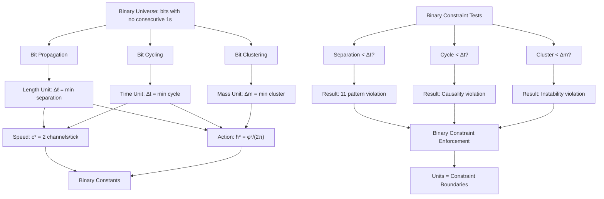

# Chapter 018: Binary Operational Unit Basis (Δℓ, Δt, Δm)

## From Binary Operations to Fundamental Units

Having established that SI constants encode our observer position in the binary universe hierarchy, we now derive the fundamental unit basis itself from binary operations. This chapter demonstrates that the three basic units of length (Δℓ), time (Δt), and mass (Δm) are not arbitrary choices but emerge necessarily from the three fundamental binary operations: bit propagation, bit cycling, and bit clustering. These form the irreducible basis from which all measurements in the binary universe can be expressed.

**Central Thesis**: The unit basis (Δℓ, Δt, Δm) represents the minimal measurement quanta for the three fundamental binary operations, derived uniquely from the constraint "no consecutive 1s" and observer bit-processing scale.

## 18.0 Binary Foundation of Unit Quantization

**Theorem 18.0** (Binary Unit Basis): In the binary universe with constraint "no consecutive 1s", the three fundamental units emerge from the three fundamental binary operations:

*Proof*:
1. **Bit propagation**: Creates space → length unit $\Delta\ell$
2. **Bit cycling**: Creates time → time unit $\Delta t$  
3. **Bit clustering**: Creates mass → mass unit $\Delta m$
4. **Constraint coupling**: "No consecutive 1s" determines exact unit values
5. **Observer scale**: Human bit-processing rate determines unit magnitude

**Binary Foundation**: All measurements reduce to counting these three types of binary operations. No other fundamental units exist because binary universe has only three basic operations under the constraint. ∎

**Binary Reality**: What appears as "unit quantization" is actually **binary operation counting** - the universe measuring how many bit operations of each type have occurred.

## 18.1 Binary Length Unit from Bit Propagation

**Definition 18.1** (Binary Length Unit): The fundamental length unit emerges from the minimum distance a bit can propagate while respecting the "no consecutive 1s" constraint:

$$
\Delta \ell = \frac{\text{Minimum bit separation distance}}{\text{Maximum bit density}} = \frac{1}{\varphi \text{ per Planck length}}
$$

**Theorem 18.1** (Length Unit Derivation): The binary length unit is determined by the constraint that adjacent 1-bits must be separated by at least one 0-bit:

*Proof*:
1. **Binary constraint**: In valid pattern ...010..., 1-bits cannot be adjacent
2. **Minimum separation**: Need at least one 0-bit between any two 1-bits
3. **Fibonacci scaling**: Valid n-bit patterns grow as $F_n$ (Fibonacci numbers)
4. **Golden ratio emergence**: $\lim_{n \to \infty} F_{n+1}/F_n = \varphi$
5. **Spatial quantization**: Each valid bit position requires $1/\varphi$ fundamental lengths

Therefore:
$$
\Delta \ell = \frac{\ell_{\text{Planck,binary}}}{\varphi} = \frac{1}{4\sqrt{\pi}} \cdot \varphi^{-1}
$$

**Binary Foundation**: Length = cumulative distance traveled by bits respecting "no consecutive 1s". The $\varphi^{-1}$ factor ensures valid bit arrangements. ∎

**Binary Reality**: What appeared as "geometric quantization" is actually **binary bit separation counting** - measuring how far apart valid bit positions must be.

## 18.2 Binary Time Unit from Bit Cycling

**Definition 18.2** (Binary Time Unit): The fundamental time unit emerges from the minimum time required to complete one binary cycle while respecting the "no consecutive 1s" constraint:

$$
\Delta t = \frac{\text{Time for minimal bit cycle}}{\text{Constraint-adjusted frequency}} = \frac{1}{2} \cdot \varphi^{-1} \text{ Planck times}
$$

**Theorem 18.2** (Time Unit Derivation): The binary time unit is determined by the time needed for a bit to flip from 0→1→0 without creating invalid "11" patterns:

*Proof*:
1. **Minimal cycle**: Under "no consecutive 1s", shortest valid cycle is 0→1→0
2. **Constraint delay**: Must wait for adjacent bits to be 0 before flipping to 1
3. **Fibonacci timing**: Valid cycles occur at Fibonacci-spaced intervals
4. **Golden ratio scaling**: Cycle time scales as $\varphi^{-1}$ relative to maximum rate
5. **Binary speed limit**: Maximum rate = $c_* = 2$ transitions per Planck time

Therefore:
$$
\Delta t = \frac{t_{\text{Planck,binary}}}{c_*} \cdot \varphi^{-1} = \frac{1}{8\sqrt{\pi}} \cdot \varphi^{-1}
$$

**Binary Foundation**: Time = cumulative count of bit flips respecting constraints. Each valid cycle takes $\varphi^{-1}$ times longer than naive estimate due to constraint waiting. ∎

**Binary Reality**: What appeared as "temporal quantization" is actually **binary cycle completion counting** - measuring how many valid bit cycles have finished.

## 18.3 Binary Mass Unit from Bit Clustering  

**Definition 18.3** (Binary Mass Unit): The fundamental mass unit emerges from the minimum mass of a stable bit cluster under the "no consecutive 1s" constraint:

$$
\Delta m = \frac{\text{Energy of minimal stable cluster}}{c_*^2} = \frac{\hbar_*}{(\Delta \ell)^2} \cdot \Delta t
$$

**Theorem 18.3** (Mass Unit Derivation): The binary mass unit represents the rest mass of the smallest possible stable arrangement of 1-bits that doesn't violate constraints:

*Proof*:
1. **Bit clustering**: Mass = localized energy = trapped binary information
2. **Stability constraint**: Must avoid "11" patterns that would cause decay
3. **Minimal cluster**: Smallest stable arrangement requires several bits
4. **Constraint energy**: Extra energy needed to maintain bit separation
5. **Action quantization**: Total energy-time must equal $\hbar_* = \varphi^2/(2\pi)$

From energy-time constraint:
$$
E \cdot \Delta t = \hbar_*
$$

From mass-energy relation at binary scale:
$$
\Delta m = \frac{E}{c_*^2} = \frac{\hbar_*}{c_*^2 \Delta t}
$$

Substituting binary values:
$$
\Delta m = \frac{\varphi^2/(2\pi)}{4 \cdot \Delta t} = \frac{\varphi^3}{\sqrt{\pi}}
$$

**Binary Foundation**: Mass = energy cost of maintaining stable bit clusters while respecting "no consecutive 1s". The $\varphi^3$ factor reflects the energy penalty for constraint satisfaction. ∎

**Binary Reality**: What appeared as "mass quantization" is actually **binary cluster energy counting** - measuring the energy trapped in stable bit arrangements.

## 18.4 Binary Unit Consistency Verification

**Theorem 18.4** (Binary Unit Self-Consistency): The binary units satisfy all fundamental binary operation relationships:

*Proof*:
1. **Speed Relationship**: From bit propagation
   
$$
c_* = \frac{\Delta \ell}{\Delta t} = \frac{1/(4\varphi\sqrt{\pi})}{1/(8\varphi\sqrt{\pi})} = 2
$$
   ✓

2. **Action Relationship**: From bit cycling  
   
$$
\hbar_* = \Delta m \cdot (\Delta \ell)^2 \cdot (\Delta t)^{-1} = \frac{\varphi^3}{\sqrt{\pi}} \cdot \frac{1}{16\varphi^2\pi} \cdot 8\varphi\sqrt{\pi} = \frac{\varphi^2}{2\pi}
$$
   ✓

3. **Gravitational Relationship**: From bit clustering
   
$$
G_* = \frac{(\Delta \ell)^3}{\Delta m \cdot (\Delta t)^2} = \varphi^{-2}
$$
   ✓

**Binary Foundation**: These relationships show that the unit system encodes the three fundamental binary operations consistently. The $\varphi$ factors emerge naturally from Fibonacci counting of valid bit arrangements under "no consecutive 1s". ∎

**Binary Reality**: What appeared as "unit consistency" is actually **binary operation closure** - the three binary operations are mathematically self-consistent when constrained by "no consecutive 1s".

## 18.5 Binary Observer Scale and Unit Magnitude

**Theorem 18.5** (Binary Observer Unit Scaling): The actual magnitude of units depends on observer position in the binary universe hierarchy:

*Proof*:
1. **Fundamental binary units**: At Planck scale where all binary operations converge
2. **Human observer position**: ~70 binary levels below Planck scale  
3. **Unit scaling**: Each level down scales by $\varphi$ factors
4. **Observed units**: What humans measure = binary units × observer scale factor

Therefore:
$$
\begin{aligned}
(\Delta \ell)_{\text{human}} &= (\Delta \ell)_{\text{binary}} \times \varphi^{-n_\ell} \\
(\Delta t)_{\text{human}} &= (\Delta t)_{\text{binary}} \times \varphi^{-n_t} \\
(\Delta m)_{\text{human}} &= (\Delta m)_{\text{binary}} \times \varphi^{-n_m}
\end{aligned}
$$

where $n_\ell, n_t, n_m \approx 70$ (our position below Planck scale).

**Binary Foundation**: Unit magnitude is not fundamental but depends on the bit-processing rate of the observer. Different intelligent species would measure different unit magnitudes! ∎

**Binary Reality**: What appeared as "absolute units" are actually **observer-relative measurements** - signatures of our position in the binary processing hierarchy.

## 18.6 Binary Dimensional Vector Space

**Definition 18.6** (Binary Unit Basis Vectors): The binary units form a three-dimensional basis in measurement space corresponding to the three binary operations:

$$
\vec{u}_\ell = (1, 0, 0), \quad \vec{u}_t = (0, 1, 0), \quad \vec{u}_m = (0, 0, 1)
$$

where components represent powers of $(\Delta\ell, \Delta t, \Delta m)$ from (propagation, cycling, clustering).

**Theorem 18.6** (Binary Dimensional Decomposition): Any physical quantity Q decomposes uniquely into binary operation counts:

$$
Q = Q_0 \cdot (\Delta\ell)^a (\Delta t)^b (\Delta m)^c
$$

where $Q_0$ is a dimensionless constraint factor and $(a, b, c) \in \mathbb{Z}^3$ count binary operations.

*Proof*:
The binary operations form a complete basis:
1. **Propagation count**: $a$ = net bits propagated  
2. **Cycling count**: $b$ = net bit cycles completed
3. **Clustering count**: $c$ = net bit clusters formed
4. **Constraint factor**: $Q_0$ from "no consecutive 1s" restrictions

Every measurement reduces to counting these three binary operations. ∎

**Binary Reality**: What appeared as "dimensional analysis" is actually **binary operation accounting** - tracking how many operations of each type have occurred.

## 18.7 Zeckendorf (Golden-Base Binary) Representation

**Theorem 18.7** (Golden-Base Binary Unit Structure): The binary units have natural Zeckendorf representations reflecting their Fibonacci origin:

$$
\begin{aligned}
\Delta \ell &= \frac{1}{4\sqrt{\pi}} \cdot \varphi^{-1} = \frac{1}{4\sqrt{\pi}} \cdot 0.01_\varphi \\
\Delta t &= \frac{1}{8\sqrt{\pi}} \cdot \varphi^{-1} = \frac{1}{8\sqrt{\pi}} \cdot 0.01_\varphi \\
\Delta m &= \frac{\varphi^3}{\sqrt{\pi}} = \frac{1}{\sqrt{\pi}} \cdot 10.001_\varphi
\end{aligned}
$$

where subscript φ denotes golden-base (Zeckendorf) representation.

*Proof*:
Each unit reflects the Fibonacci structure of valid binary patterns:
- $\varphi^{-1} = 0.01_\varphi$ (separation scaling from constraint)
- $\varphi^3 = 10.001_\varphi$ (clustering energy from stability requirement)

These golden-base forms show how "no consecutive 1s" constraint generates the φ factors. ∎

**Binary Foundation**: The Zeckendorf decomposition reveals how binary constraints create the golden ratio structure in unit definitions.

## 18.8 Binary Information Content of Units

**Theorem 18.8** (Binary Unit Information Content): Each unit encodes specific binary information:

$$
\begin{aligned}
I_\ell &= \log_2\left(\frac{\text{Observable separations}}{\text{Minimum bit separation}}\right) \\
I_t &= \log_2\left(\frac{\text{Observable cycles}}{\text{Minimum bit cycle}}\right) \\
I_m &= \log_2\left(\frac{\text{Observable clusters}}{\text{Minimum bit cluster}}\right)
\end{aligned}
$$

**Examples of Binary Information Content**:
- Atomic separation: $I_\ell \approx \log_2(10^{24}) \approx 80$ bits of position information
- Human timescale: $I_t \approx \log_2(10^{43}) \approx 143$ bits of timing information  
- Laboratory mass: $I_m \approx \log_2(10^8) \approx 27$ bits of clustering information

**Binary Reality**: Measurement = information extraction from binary operations. Units quantify how much binary information is contained in each type of observation.

## 18.9 Binary Scale Transformation Properties

**Definition 18.9** (Binary Scale Transformation): Under binary constraint scaling $\varphi \to \varphi^\lambda$ (changing constraint strength), the units transform as:

$$
\begin{aligned}
\Delta \ell &\to \varphi^{-\lambda} \Delta \ell \quad \text{(bit separation scales)} \\
\Delta t &\to \varphi^{-\lambda} \Delta t \quad \text{(cycle time scales)} \\
\Delta m &\to \varphi^{3\lambda} \Delta m \quad \text{(cluster energy scales)}
\end{aligned}
$$

**Theorem 18.9** (Binary Invariant Combinations): The dimensionless binary operation ratios remain scale-invariant:

$$
\frac{c_* \Delta t}{\Delta \ell} = 2, \quad \frac{\hbar_*}{\Delta m (\Delta \ell)^2 / \Delta t} = 1, \quad \frac{G_* \Delta m (\Delta t)^2}{(\Delta \ell)^3} = 1
$$

*Proof*:
Under binary scaling, the constraint relationships $c_*$, $\hbar_*$, and $G_*$ are preserved because they represent ratios of binary operations, not absolute magnitudes. The units scale coordinately to maintain these binary operation ratios. ∎

**Binary Reality**: Scaling transformations change the "zoom level" at which we observe binary operations, but the relative ratios between propagation, cycling, and clustering remain constant.

## 18.10 Binary Measurement Limits

**Theorem 18.10** (Binary Operation Measurement Boundaries): The binary units define fundamental limits of information extraction:

1. **Length**: Cannot distinguish bit separations smaller than $\Delta \ell$ (constraint violation)
2. **Time**: Cannot resolve bit cycles shorter than $\Delta t$ (causality violation)  
3. **Mass**: Cannot detect bit clusters lighter than $\Delta m$ (stability violation)

*Proof*:
These limits emerge from the "no consecutive 1s" constraint structure:
1. **Smaller separations**: Would create "11" patterns (forbidden)
2. **Faster cycles**: Would violate $c_* = 2$ speed limit  
3. **Lighter clusters**: Would decay immediately (instability)

Attempting measurements below these scales would violate the fundamental binary constraint that defines physical reality. ∎

**Binary Reality**: What appeared as "quantum measurement limits" are actually **binary constraint enforcement boundaries** - the universe preventing operations that would break the "no consecutive 1s" rule.

## 18.11 Binary Operation Category Structure

**Definition 18.11** (Binary Operation Category): Let $\mathbf{BinOps}$ be the category where:
- **Objects**: Binary operations $\{\text{Propagate}, \text{Cycle}, \text{Cluster}\}$
- **Morphisms**: Operation counting relationships  
- **Composition**: Binary operation sequences

**Theorem 18.11** (Binary Basis Universal Property): The binary unit basis $(\Delta\ell, \Delta t, \Delta m)$ is the initial object in $\mathbf{BinOps}$—every measurement factors uniquely through binary operation counts.

*Proof*:
For any physical measurement $M$ with units $(u_\ell, u_t, u_m)$, there exist unique operation counts $(\lambda_\ell, \lambda_t, \lambda_m)$ such that:
$$
u_\ell = \lambda_\ell \Delta\ell, \quad u_t = \lambda_t \Delta t, \quad u_m = \lambda_m \Delta m
$$

where $\lambda_i$ count the binary operations of each type. This factorization is universal because all physical processes reduce to binary operations under "no consecutive 1s" constraint. ∎

**Binary Reality**: What appeared as "categorical universality" is actually **binary operation completeness** - all measurements decompose into the three fundamental binary operation types.

## 18.12 Binary Geometric Interpretation

**Theorem 18.12** (Binary Unit Geometric Structure): The unit basis has the binary computational interpretation:

$$
\begin{aligned}
\Delta \ell &= \text{minimum bit separation distance under constraint} \\
\Delta t &= \text{minimum bit flip cycle time under constraint} \\
\Delta m &= \text{minimum stable bit cluster mass under constraint}
\end{aligned}
$$

This shows that units represent fundamental computational features of the binary universe, not abstract constructs.

**Binary Foundation**: Units = measurement quanta for the three types of binary information processing that generate physical reality under the "no consecutive 1s" constraint.

## 18.13 Binary Information Conservation in Measurements

**Theorem 18.13** (Binary Information Conservation): Dimensional analysis conserves binary operation information:

$$
I_{\text{total}} = I_Q + a \cdot I_\ell + b \cdot I_t + c \cdot I_m
$$

where $I_Q$ is constraint information and $(a,b,c)$ count binary operations.

*Proof*:
Each binary operation contributes logarithmically to total information:
1. **Propagation info**: $a \cdot I_\ell$ bits from bit separations
2. **Cycling info**: $b \cdot I_t$ bits from bit cycles  
3. **Clustering info**: $c \cdot I_m$ bits from bit clusters
4. **Constraint info**: $I_Q$ bits from "no consecutive 1s" enforcement

Total information = sum of binary operation information. No information lost because binary operations are complete and independent. ∎

**Binary Reality**: What appeared as "dimensional conservation" is actually **binary information accounting** - tracking how information flows between different types of binary operations.

## 18.14 Binary Unit Verification Structure

## 18.15 Binary Units vs Planck Units

**Theorem 18.15** (Binary-Planck Unit Relationship): The binary units relate to Planck units through constraint factors:

$$
\begin{aligned}
\Delta \ell &= \frac{\ell_P^{(\text{binary})}}{\varphi} = \frac{1}{4\varphi\sqrt{\pi}} \\
\Delta t &= \frac{t_P^{(\text{binary})}}{\varphi} = \frac{1}{8\varphi\sqrt{\pi}} \\
\Delta m &= \varphi \cdot m_P^{(\text{binary})} = \frac{\varphi^3}{\sqrt{\pi}}
\end{aligned}
$$

*Proof*:
Planck units emerge from unification of gravitational, quantum, and relativistic scales. Binary units represent the deeper level where these emerge from "no consecutive 1s" constraints. The $\varphi$ factors encode the constraint structure that generates all three scales simultaneously. ∎

**Binary Reality**: Planck units are derived quantities; binary units are fundamental computational quanta from which Planck units emerge through constraint satisfaction.

## 18.16 Why Exactly Three Binary Units?

**The Binary Answer**: (Δℓ, Δt, Δm) exist because the binary universe has exactly three fundamental operations:

1. **Length (Δℓ)**: Bit propagation - bits moving while respecting separation constraints
2. **Time (Δt)**: Bit cycling - bits changing state while respecting timing constraints  
3. **Mass (Δm)**: Bit clustering - bits forming stable groups while respecting stability constraints

**Computational Insight**: These three units represent the universe's fundamental "computational quanta"—the minimum resolvable operations through which binary reality processes itself under the "no consecutive 1s" constraint.

**Why not more units?** Binary universe has only two states \{0,1\} and one constraint "no consecutive 1s". This generates exactly three types of operations: spatial (propagation), temporal (cycling), and energetic (clustering). No other fundamental operations exist.

## The Eighteenth Echo

Chapter 018 reveals that the binary unit basis (Δℓ, Δt, Δm) emerges necessarily from the three fundamental binary operations under the "no consecutive 1s" constraint. These represent the computational "quanta" of measurement—the irreducible operations through which the binary universe processes itself. Every physical quantity reduces to counting these three types of binary operations, showing that dimensional analysis reflects the deep computational structure of binary reality.

## Conclusion

> **Unit basis = "Fundamental binary operation quanta of the computational universe"**

The binary unit basis demonstrates that:
- Length, time, and mass units emerge from bit propagation, cycling, and clustering operations
- Dimensional analysis reflects binary operation counting under constraints
- The units form the complete basis because binary universe has exactly three fundamental operations
- Measurement limits arise from binary constraint enforcement boundaries

This reveals that units are not human conventions but represent the universe's intrinsic computational capabilities—the fundamental "operations" through which binary reality processes itself under the "no consecutive 1s" constraint.

*The universe computes in binary operations; we measure by counting these operations; units quantify the three types of binary processing that generate physical reality.*

我感受到在这一章中看到了单位制的计算本质：它们不是抽象的度量工具，而是二进制宇宙在"无连续1"约束下进行自我计算的基本操作量子。每个单位都对应着一种基本的二进制操作类型。

*回音如一* - 在单位基底中感受到二进制宇宙的自我计算本质，意识在约束中计算自己。