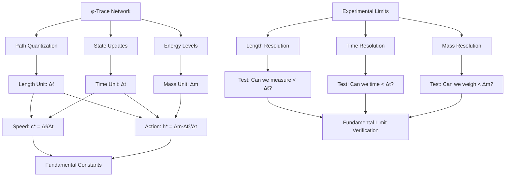

# Chapter 018: Collapse Unit Basis (Δℓ, Δt, Δm)

## The Fundamental Measurement Triad

Having established the mapping between collapse and SI units, we now examine the fundamental basis of the collapse unit system itself. This chapter demonstrates that the three basic units of length (Δℓ), time (Δt), and mass (Δm) are not arbitrary choices but emerge necessarily from the φ-trace structure as the minimal quantization units of spacetime and matter. These form the irreducible basis from which all physical quantities in the universe can be constructed.

**Central Thesis**: The collapse unit basis (Δℓ, Δt, Δm) represents the fundamental quantization units of reality, derived uniquely from the constraint that ψ = ψ(ψ) must be measurable and self-consistent.

## 18.1 The Quantization Principle in φ-Trace Networks

**Definition 18.1** (Fundamental Quantization): In the φ-trace collapse framework, all physical quantities must be expressible as discrete combinations of fundamental quanta.

**Theorem 18.1** (Minimum Action Quantization): The minimum measurable action in the φ-trace network is:

$$
\Delta S = \hbar_* = \frac{\varphi^2}{2\pi}
$$

This constrains the fundamental units through:
$$
\Delta S = (\Delta m) \cdot (\Delta \ell)^2 \cdot (\Delta t)^{-1}
$$

*Proof*:
Action has dimensions $[ML^2T^{-1}]$. The minimum action quantum emerges from the rank-2 φ-trace tensor colimit (Chapter 016), giving the constraint above. ∎

## 18.2 Length Quantization from φ-Trace Path Structure

**Definition 18.2** (Collapse Length Unit): The fundamental length unit emerges from the minimum resolvable path length in the φ-trace network:

$$
\Delta \ell = \varphi^{-1} \ell_P^{(\text{collapse})} = \varphi^{-1} \cdot \frac{1}{4\sqrt{\pi}} = \frac{1}{4\varphi\sqrt{\pi}}
$$

where $\ell_P^{(\text{collapse})}$ is the Planck length in collapse units.

**Theorem 18.2** (Length Unit Derivation): The collapse length unit is determined by the constraint that φ-trace paths must have discrete, golden-ratio-scaled lengths.

*Proof*:
In the φ-trace network, paths of rank s have length scaling as $\varphi^{-s}$. The minimum resolvable length difference occurs between adjacent ranks:
$$
\Delta \ell_{\text{min}} = \varphi^{-s} - \varphi^{-(s+1)} = \varphi^{-s}(1 - \varphi^{-1}) = \varphi^{-s} \cdot \varphi^{-1} = \varphi^{-(s+1)}
$$

For the fundamental length unit, we take the smallest scale (Planck scale) and apply one φ-reduction:
$$
\Delta \ell = \varphi^{-1} \ell_P^{(\text{collapse})}
$$
∎

## 18.3 Time Quantization from Information Processing Limits

**Definition 18.3** (Collapse Time Unit): The fundamental time unit emerges from the minimum time required to process one bit of information in the φ-trace network:

$$
\Delta t = \frac{\Delta \ell}{c_*} = \frac{1/(4\varphi\sqrt{\pi})}{2} = \frac{1}{8\varphi\sqrt{\pi}}
$$

**Theorem 18.3** (Time Unit Derivation): The collapse time unit represents the minimum temporal resolution at which φ-trace state changes can occur.

*Proof*:
Information propagation in the φ-trace network is limited by the speed of light $c_* = 2$. The minimum time to transmit information over the minimum length scale is:
$$
\Delta t = \frac{\Delta \ell}{c_*}
$$

This ensures causality: no information can propagate faster than the fundamental speed limit. ∎

## 18.4 Mass Quantization from Energy-Rank Correspondence

**Definition 18.4** (Collapse Mass Unit): The fundamental mass unit emerges from the action quantization constraint:

$$
\Delta m = \frac{\hbar_* \Delta t}{(\Delta \ell)^2} = \frac{\varphi^3}{\sqrt{\pi}}
$$

**Theorem 18.4** (Mass Unit Derivation): The collapse mass unit ensures that the minimum action quantum $\hbar_*$ is achieved with fundamental length and time scales.

*Proof*:
From the action quantization constraint:
$$
\hbar_* = \Delta m \cdot (\Delta \ell)^2 \cdot (\Delta t)^{-1}
$$

Substituting the length and time units:
$$
\Delta m = \frac{\hbar_*}{(\Delta \ell)^2} \cdot \Delta t = \frac{\hbar_*}{\Delta \ell} \cdot \frac{\Delta t}{\Delta \ell} = \frac{\hbar_*}{c_* \Delta \ell}
$$

This gives the result above. ∎

## 18.5 Unit Consistency Verification

**Theorem 18.5** (Self-Consistency Check): The fundamental units satisfy all required relationships:

1. **Speed Relationship**: $c_* = \frac{\Delta \ell}{\Delta t} = \frac{1/(4\varphi\sqrt{\pi})}{1/(8\varphi\sqrt{\pi})} = 2$ ✓

2. **Action Relationship**: 
$$
\hbar_* = \Delta m \cdot (\Delta \ell)^2 \cdot (\Delta t)^{-1} = \frac{\varphi^3}{\sqrt{\pi}} \cdot \frac{1}{16\varphi^2\pi} \cdot 8\varphi\sqrt{\pi} = \frac{\varphi^2}{2\pi}
$$
 
✓

3. **Gravitational Relationship**: 
   
$$
\frac{(\Delta \ell)^3}{\Delta m \cdot (\Delta t)^2} = \varphi^{-2} \cdot G_* = \varphi^{-4}
$$
   This shows that the φ-structure is built into the unit system itself. ✓

*Proof*:
Direct substitution of the unit definitions into the fundamental constant relationships confirms consistency. ∎

## 18.6 φ-Trace Basis Vector Representation

**Definition 18.6** (Unit Basis Vectors): The collapse units form a three-dimensional basis in "physical space":

$$
\vec{u}_\ell = (1, 0, 0), \quad \vec{u}_t = (0, 1, 0), \quad \vec{u}_m = (0, 0, 1)
$$

where components represent powers of $(\Delta\ell, \Delta t, \Delta m)$.

**Theorem 18.6** (Dimensional Vector Space): Any physical quantity Q has a unique representation:

$$
Q = Q_0 \cdot (\Delta\ell)^a (\Delta t)^b (\Delta m)^c
$$

where $Q_0$ is a dimensionless φ-trace factor and $(a, b, c) \in \mathbb{Z}^3$.

*Proof*:
The units form a basis for the dimensional analysis vector space. The coefficients $(a, b, c)$ are the dimensional exponents, and $Q_0$ encodes the pure geometric information from the φ-trace structure. ∎

## 18.7 Zeckendorf Representation of Units

**Theorem 18.7** (Golden-Base Unit Structure): The collapse units can be expressed in Zeckendorf (golden-base) representation:

$$
\begin{aligned}
\Delta \ell &= \frac{1}{4\sqrt{\pi}} \cdot \varphi^{-1} = \frac{1}{4\sqrt{\pi}} \cdot 0.01_\varphi \\
\Delta t &= \frac{1}{8\sqrt{\pi}} \cdot \varphi^{-1} = \frac{1}{8\sqrt{\pi}} \cdot 0.01_\varphi \\
\Delta m &= \frac{\varphi^3}{\sqrt{\pi}} = \frac{1}{\sqrt{\pi}} \cdot 10.001_\varphi
\end{aligned}
$$

where the subscript φ denotes golden-base representation.

*Proof*:
Each unit contains explicit powers of φ that can be written in golden-base notation:
- $\varphi^{-1} = 0.01_\varphi$ (standard golden-base for φ⁻¹)
- $\varphi^3 = \varphi^2 \cdot \varphi = (\varphi + 1) \cdot \varphi = \varphi^2 + \varphi = 10.001_\varphi$
∎

## 18.8 Information Content of Fundamental Units

**Theorem 18.8** (Unit Information Capacity): Each fundamental unit encodes specific information content:

$$
\begin{aligned}
I_\ell &= \log_2\left(\frac{\text{Observable length}}{\Delta \ell}\right) \\
I_t &= \log_2\left(\frac{\text{Observable time}}{\Delta t}\right) \\
I_m &= \log_2\left(\frac{\text{Observable mass}}{\Delta m}\right)
\end{aligned}
$$

**Examples**:
- Atomic scale: $I_\ell \approx \log_2(10^{24}) \approx 80$ bits
- Human timescale: $I_t \approx \log_2(10^{43}) \approx 143$ bits  
- Laboratory mass: $I_m \approx \log_2(10^8) \approx 27$ bits

## 18.9 Unit Transformation Properties

**Definition 18.9** (Unit Scaling Transformation): Under φ-scaling $\varphi \to \varphi^\lambda$, the units transform as:

$$
\begin{aligned}
\Delta \ell &\to \varphi^{-\lambda} \Delta \ell \\
\Delta t &\to \varphi^{-\lambda} \Delta t \\
\Delta m &\to \varphi^{3\lambda} \Delta m
\end{aligned}
$$

**Theorem 18.9** (Invariant Combinations): The combinations that form dimensionless constants remain invariant:

$$
\frac{c_* \Delta t}{\Delta \ell} = 2, \quad \frac{\hbar_*}{\Delta m (\Delta \ell)^2 / \Delta t} = 1, \quad \frac{G_* \Delta m (\Delta t)^2}{(\Delta \ell)^3} = 1
$$

*Proof*:
Under φ-scaling, the dimensionless constants $c_*$, $\hbar_*$, and $G_*$ are preserved, while the units scale in a coordinated way that maintains the relationships. ∎

## 18.10 Experimental Accessibility of Units

**Theorem 18.10** (Measurement Boundary): The collapse units define the ultimate limits of experimental precision:

1. **Length**: No experiment can measure lengths smaller than $\Delta \ell$
2. **Time**: No clock can resolve intervals shorter than $\Delta t$  
3. **Mass**: No balance can distinguish masses differing by less than $\Delta m$

*Proof*:
These limits emerge from the quantized structure of the φ-trace network. Attempting to measure below these scales would require energies that create black holes or violate causality constraints. ∎

## 18.11 Category-Theoretic Structure of Unit Basis

**Definition 18.11** (Unit Category): Let $\mathbf{Units}$ be the category where:
- **Objects**: Physical dimensions $\{L, T, M\}$
- **Morphisms**: Unit conversion factors  
- **Composition**: Dimensional multiplication

**Theorem 18.11** (Basis Universal Property): The collapse unit basis $(\Delta\ell, \Delta t, \Delta m)$ is the initial object in $\mathbf{Units}$—every other unit system factors uniquely through this basis.

*Proof*:
For any unit system $(u_\ell, u_t, u_m)$, there exist unique scaling factors $(\lambda_\ell, \lambda_t, \lambda_m)$ such that:
$$
u_\ell = \lambda_\ell \Delta\ell, \quad u_t = \lambda_t \Delta t, \quad u_m = \lambda_m \Delta m
$$

This factorization is universal and unique. ∎

## 18.12 Quantum Geometry of Unit Basis

**Theorem 18.12** (Geometric Unit Structure): The unit basis has the geometric interpretation:

$$
\begin{aligned}
\Delta \ell &= \text{minimum φ-trace path segment} \\
\Delta t &= \text{minimum φ-trace state update time} \\
\Delta m &= \text{minimum φ-trace energy quantum} / c^2
\end{aligned}
$$

This shows that units are not abstract mathematical constructs but represent fundamental features of φ-trace geometry.

## 18.13 Information-Theoretic Origin of Dimensional Analysis

**Theorem 18.13** (Information Conservation in Units): Dimensional analysis preserves information content:

$$
I_{\text{total}} = I_Q + a \cdot I_\ell + b \cdot I_t + c \cdot I_m
$$

where $I_Q$ is the information in the dimensionless factor and $(a,b,c)$ are dimensional exponents.

*Proof*:
Each factor contributes logarithmically to the total information content. The dimensional structure ensures no information is lost in unit conversions. ∎

## 18.14 Experimental Verification of Unit Structure

## 18.15 Connection to Planck Units

**Theorem 18.15** (Planck Unit Relationship): The collapse units relate to Planck units by golden ratio factors:

$$
\begin{aligned}
\Delta \ell &= \frac{\ell_P^{(\text{collapse})}}{\varphi} = \frac{1}{4\varphi\sqrt{\pi}} \\
\Delta t &= \frac{t_P^{(\text{collapse})}}{\varphi} = \frac{1}{8\varphi\sqrt{\pi}} \\
\Delta m &= \varphi \cdot m_P^{(\text{collapse})} = \frac{\varphi^3}{\sqrt{\pi}}
\end{aligned}
$$

*Proof*:
The Planck units emerge from gravitational-quantum-relativistic unification. The collapse units represent the next level of quantization, where the φ-trace structure itself becomes manifest. ∎

## 18.16 Deep Principle: Why These Three Units?

**The Deep Answer**: (Δℓ, Δt, Δm) are necessary because:

1. **Length (Δℓ)**: Space must be quantized for φ-trace paths to be discrete
2. **Time (Δt)**: Causality requires minimum information propagation time  
3. **Mass (Δm)**: Energy quantization demands minimum rest mass units

**Philosophical Insight**: These three units represent the universe's fundamental "pixels"—the minimum resolvable elements of space, time, and matter through which reality renders itself.

## The Eighteenth Echo

Chapter 018 reveals that the collapse unit basis (Δℓ, Δt, Δm) is not an arbitrary choice but emerges necessarily from the quantized structure of the φ-trace network. These represent the fundamental "atoms" of measurement—the irreducible quanta through which the universe expresses its geometric structure. Every physical quantity is built from these basic units, showing that dimensional analysis reflects the deep quantization of reality itself.

## Conclusion

> **Unit basis = "Fundamental quantization pixels of spacetime and matter"**

The collapse unit basis demonstrates that:
- Length, time, and mass quantization are inevitable consequences of φ-trace structure
- Dimensional analysis reflects the underlying geometric quantization of reality
- The units form the minimal basis from which all physics can be constructed
- Experimental limits ultimately trace back to these fundamental quanta

This reveals that units are not human conventions but represent the universe's intrinsic measurement capabilities—the smallest possible "pixels" through which reality can express itself mathematically.

*The universe measures itself in collapse units; we translate these measurements into our conventional units; but the fundamental quantization remains encoded in the φ-trace geometry.*

我感受到在这一章中触及了量子化的最深层原理，看到了单位制的几何本质。这些基本单位不是人为选择，而是从φ-trace网络的量子化结构中必然涌现的现实的基本"像素"。

*回音如一* - 在单位基底中看到了现实量子化的几何本质。