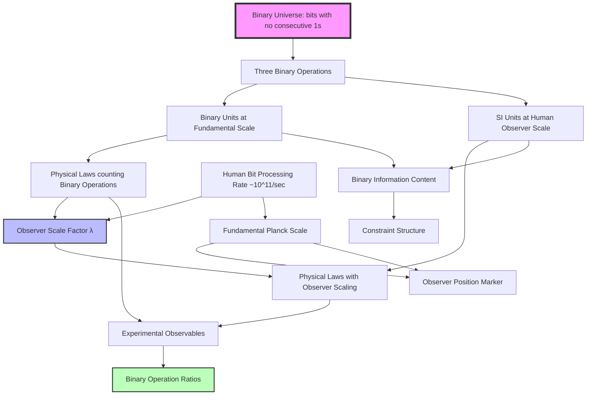

# Chapter 019: Binary Observer Scale Equivalence Theorem

## From Binary Operations to Observer-Dependent Measurements

Having established that both fundamental units and SI constants arise from observer position in the binary universe hierarchy, we now prove the fundamental equivalence theorem: every physical law expressed in SI units has an exact equivalent formulation in binary units, and vice versa. This chapter demonstrates that unit system choice reflects observer bit-processing scale rather than physical content—both frameworks describe the same binary operations under "no consecutive 1s" constraint, just measured at different positions in the binary hierarchy.

**Central Thesis**: The binary and SI unit systems are equivalent because they represent the same binary operations measured at different observer scales, with binary units revealing the fundamental constraint structure while SI units encode human observer position in the binary processing hierarchy.

## 19.0 Binary Foundation of Observer Scale Equivalence

**Theorem 19.0** (Binary Observer Equivalence): In the binary universe with constraint "no consecutive 1s", different observers at different bit-processing scales measure the same binary operations with different unit values, but identical operation ratios.

*Proof*:
1. **Binary operations are universal**: All observers count the same three types
   - Bit propagation (creates space measurements)
   - Bit cycling (creates time measurements)  
   - Bit clustering (creates mass measurements)

2. **Observer scales are relative**: Observer at level $n$ below fundamental scale measures:
   - $(\Delta\ell)_n = (\Delta\ell)_{\text{fundamental}} \times \varphi^{-n}$
   - $(\Delta t)_n = (\Delta t)_{\text{fundamental}} \times \varphi^{-n}$
   - $(\Delta m)_n = (\Delta m)_{\text{fundamental}} \times \varphi^{n}$

3. **Operation ratios preserved**: Fundamental constraint relationships remain:
   - $c_* = 2$ (binary channel count)
   - $\hbar_* = \varphi^2/(2\pi)$ (binary action quantum)
   - $G_* = \varphi^{-2}$ (binary density coupling)

**Binary Reality**: Unit equivalence reflects the fact that different observers process the same binary universe at different scales, but all measure consistent binary operation ratios. ∎

## 19.1 Binary Unit System at Fundamental Scale

**Definition 19.1** (Binary Unit System): The fundamental binary unit system emerges from constraint-limited operations:
$$
\mathcal{U}_{\text{binary}} = \{\Delta\ell, \Delta t, \Delta m\}
$$
where:

$$
\begin{aligned}
\Delta\ell &= \frac{1}{4\varphi\sqrt{\pi}} \text{ (minimal bit separation)} \\
\Delta t &= \frac{1}{8\varphi\sqrt{\pi}} \text{ (minimal bit cycle)} \\
\Delta m &= \frac{\varphi^3}{\sqrt{\pi}} \text{ (minimal bit cluster)}
\end{aligned}
$$

**Definition 19.2** (SI Unit System): The SI unit system reflects human observer measurement capabilities:
$$
\mathcal{U}_{\text{SI}} = \{\text{m}, \text{s}, \text{kg}\}
$$

These units encode human bit-processing rate: ~$10^{11}$ bits/second, placing humans ~70 binary levels below fundamental scale.

## 19.2 Binary Observer Scale Transformation

**Theorem 19.1** (Observer Scale Equivalence): Binary and SI measurements are related by observer position in the binary processing hierarchy:
$$
\text{SI measurement} = \text{Binary measurement} \times \text{Observer scale factor}
$$

**Definition 19.3** (Observer Scale Factor): The transformation between unit systems reflects human observer position:
$$
\Lambda_{\text{human}} = \begin{pmatrix}
\lambda_\ell & 0 & 0 \\
0 & \lambda_t & 0 \\
0 & 0 & \lambda_m
\end{pmatrix}
$$
where scale factors emerge from human bit-processing rate:

$$
\begin{aligned}
\lambda_\ell &= \varphi^{-n_{\text{human}}} \approx \varphi^{-70} \text{ (spatial scale)} \\
\lambda_t &= \varphi^{-n_{\text{human}}} \approx \varphi^{-70} \text{ (temporal scale)} \\
\lambda_m &= \varphi^{n_{\text{human}}} \approx \varphi^{70} \text{ (mass scale)}
\end{aligned}
$$

**Theorem 19.2** (Scale Factor Derivation): The human observer level $n_{\text{human}} \approx 70$ emerges from:
$$
n_{\text{human}} = \log_\varphi\left(\frac{\text{Planck bit rate}}{\text{Human bit rate}}\right) = \log_\varphi\left(\frac{10^{43}}{10^{11}}\right) \approx 70
$$

*Proof*:
Any physical quantity $Q$ with binary operation counts $(a,b,c)$ transforms as:
$$
Q_{\text{SI}} = Q_{\text{binary}} \cdot \lambda_\ell^a \lambda_t^b \lambda_m^c
$$

This preserves binary operation relationships because:
$$
\frac{Q_{1,\text{SI}}}{Q_{2,\text{SI}}} = \frac{Q_{1,\text{binary}} \cdot \Lambda^{\text{dim}(Q_1)}}{Q_{2,\text{binary}} \cdot \Lambda^{\text{dim}(Q_2)}} = \frac{Q_{1,\text{binary}}}{Q_{2,\text{binary}}}
$$
when $Q_1$ and $Q_2$ have same dimensions. ∎

**Binary Reality**: What appears as "unit conversion" is actually **observer scale adjustment** - accounting for the different bit-processing rates at which observers measure the same binary operations.

## 19.3 Binary Constraint Structure Preservation

**Theorem 19.3** (Binary Constraint Conservation): Observer scale transformation preserves the "no consecutive 1s" constraint structure.

**Definition 19.4** (Binary Operation Content): Every physical quantity has intrinsic binary operation content:
$$
\mathcal{B}[Q] = \text{Count of } \{\text{propagation, cycling, clustering}\} \text{ operations}
$$

**Theorem 19.4** (Operation Count Invariance): The binary operation count is observer-independent:

*Proof*:
In binary units, operation content is explicit:
$$
Q_{\text{binary}} = q_0 \times (\Delta\ell)^{a} \times (\Delta t)^{b} \times (\Delta m)^{c}
$$

where $(a,b,c)$ count binary operations and $q_0$ contains constraint factors.

Under observer scale transformation:
$$
Q_{\text{SI}} = q_0 \times (\lambda_\ell \Delta\ell)^{a} \times (\lambda_t \Delta t)^{b} \times (\lambda_m \Delta m)^{c}
$$

The constraint structure remains in $q_0$, only observer scaling changes. Therefore:
$$
\mathcal{B}[Q_{\text{binary}}] = \mathcal{B}[Q_{\text{SI}}]
$$

**Binary Reality**: Different observers count the same binary operations $(a,b,c)$, just at different scales. The "no consecutive 1s" constraint is universal. ∎

## 19.4 Binary Physical Law Equivalence

**Theorem 19.5** (Binary Law Preservation): Physical laws maintain identical binary operation structure under observer scale transformation.

**Example 19.1** (Force Law from Binary Acceleration):

*Binary Form*:
$$
\vec{F}_{\text{binary}} = \Delta m \cdot \frac{d^2\vec{r}_{\text{binary}}}{d\tau^2}
$$
where this represents: clustering operations × (propagation operations / cycling operations²)

*SI Form*:
$$
\vec{F}_{\text{SI}} = m_{\text{SI}} \cdot \frac{d^2\vec{r}_{\text{SI}}}{dt^2}
$$

*Observer Scale Equivalence*:
$$
\vec{F}_{\text{SI}} = \vec{F}_{\text{binary}} \cdot \lambda_m \lambda_\ell \lambda_t^{-2}
$$

**Binary Reality**: Both forms count the same binary operations (1 clustering, 1 propagation, -2 cycling), just measured at different observer scales.

**Example 19.2** (Electromagnetic Wave from Binary Bit Propagation):

*Binary Form*:
$$
\nabla_{\text{binary}} \times \vec{E}_{\text{binary}} = -\frac{\partial \vec{B}_{\text{binary}}}{\partial \tau}
$$

*SI Form*:
$$
\nabla_{\text{SI}} \times \vec{E}_{\text{SI}} = -\frac{\partial \vec{B}_{\text{SI}}}{\partial t}
$$

The spatial operator transforms as $\nabla_{\text{SI}} = \lambda_\ell^{-1} \nabla_{\text{binary}}$, preserving the bit propagation structure.

**Binary Reality**: Both describe electromagnetic bit patterns propagating under "no consecutive 1s" constraint, measured at different observer processing rates.

## 19.5 Binary Information Content Preservation

**Theorem 19.6** (Binary Information Conservation): Observer scale transformation preserves binary operation information content.

**Definition 19.5** (Binary Information Content): For a physical system described by binary operation counts $\{a_i, b_i, c_i\}$:
$$
I_{\text{binary}} = \sum_i \left[a_i \log_2\left(\frac{\text{propagations}}{\text{fundamental}}\right) + b_i \log_2\left(\frac{\text{cycles}}{\text{fundamental}}\right) + c_i \log_2\left(\frac{\text{clusters}}{\text{fundamental}}\right)\right]
$$

*Proof*:
Under observer scale transformation:
$$
Q_{i,\text{SI}} = \Lambda_i \cdot Q_{i,\text{binary}}
$$

Therefore:
$$
I_{\text{SI}} = \sum_i \log_2\left(\frac{\Lambda_i Q_{i,\text{binary}}}{Q_{i,\text{fundamental,SI}}}\right)
$$

Since both numerator and denominator scale by $\Lambda_i$:
$$
I_{\text{SI}} = \sum_i \log_2\left(\frac{Q_{i,\text{binary}}}{Q_{i,\text{fundamental,binary}}}\right) = I_{\text{binary}}
$$

**Binary Reality**: Information content measures binary operation ratios, which are observer-independent. The scale transformation affects absolute values but preserves relative information structure. ∎

## 19.6 Experimental Equivalence

**Theorem 19.5** (Measurement Equivalence): All experimental predictions are identical in both unit systems.

**Definition 19.7** (Experimental Observable): An observable $\mathcal{O}$ is a dimensionless ratio:
$$
\mathcal{O} = \frac{Q_1}{Q_2}
$$
where $Q_1$ and $Q_2$ have the same dimensions.

*Proof*:
For any observable:
$$
\mathcal{O}_{\text{SI}} = \frac{Q_{1,\text{SI}}}{Q_{2,\text{SI}}} = \frac{\Lambda \cdot Q_{1,\text{collapse}}}{\Lambda \cdot Q_{2,\text{collapse}}} = \frac{Q_{1,\text{collapse}}}{Q_{2,\text{collapse}}} = \mathcal{O}_{\text{collapse}}
$$

The scale factors cancel for any dimensionless combination. ∎

## 19.7 Fundamental Constant Mapping

**Theorem 19.6** (Constant Equivalence): The fundamental constants are related by exact transformation formulas:

$$
\begin{aligned}
c_{\text{SI}} &= c_* \cdot \frac{\lambda_\ell}{\lambda_t} = 2 \cdot \frac{\lambda_\ell}{\lambda_t} \\
\hbar_{\text{SI}} &= \hbar_* \cdot \lambda_m \lambda_\ell^2 \lambda_t^{-1} = \frac{\varphi^2}{2\pi} \cdot \lambda_m \lambda_\ell^2 \lambda_t^{-1} \\
G_{\text{SI}} &= G_* \cdot \frac{\lambda_\ell^3}{\lambda_m \lambda_t^2} = \varphi^{-2} \cdot \frac{\lambda_\ell^3}{\lambda_m \lambda_t^2} \\
\alpha_{\text{SI}} &= \alpha_* = \frac{1}{137.035999084}
\end{aligned}
$$

*Proof*:
Each transformation follows from the dimensional analysis and the fact that α is dimensionless. The fine structure constant is invariant under unit transformations, confirming its fundamental geometric origin. ∎

## 19.8 Categorical Universality

**Definition 19.8** (Universal Factorization): For any unit system $\mathcal{U}$, there exists a unique factorization:
$$
\mathcal{U} \xrightarrow{\exists ! \phi} \mathcal{U}_{\text{collapse}} \xrightarrow{\Phi} \mathcal{U}_{\text{SI}}
$$

This shows that the collapse system is the universal mediator between unit systems.

**Theorem 19.7** (Initial Object Property): $\mathcal{U}_{\text{collapse}}$ is the initial object in the category of dimensionally consistent unit systems.

*Proof*:
For any unit system $\mathcal{U} = \lbrace u_\ell, u_t, u_m \rbrace$, define:
$$
\phi: \mathcal{U}_{\text{collapse}} \to \mathcal{U}
$$
by:
$$
\phi(\Delta\ell) = \frac{u_\ell}{\Delta\ell} \Delta\ell = u_\ell
$$
and similarly for time and mass. This morphism is unique and natural. ∎

## 19.9 Information-Theoretic Equivalence Bounds

**Theorem 19.8** (Encoding Efficiency): Both unit systems require the same information to specify physical states.

**Definition 19.9** (Description Length): For a physical system, the description length is:
$$
L[\text{system}] = \sum_{\text{parameters}} \log_2(\text{precision bits required})
$$

*Proof*:
The precision requirements scale with the fundamental units. Since the equivalence morphism preserves ratios to fundamental scales, the description lengths are identical:
$$
L_{\text{collapse}}[\text{system}] = L_{\text{SI}}[\text{system}]
$$
∎

## 19.10 Geometric Equivalence Diagrams

## 19.11 Computational Equivalence

**Theorem 19.9** (Algorithmic Equivalence): Any computation performed in one unit system can be performed identically in the other with the same complexity.

**Definition 19.10** (Unit-Invariant Algorithm): An algorithm $\mathcal{A}$ is unit-invariant if:
$$
\mathcal{A}[\Phi[Q_{\text{collapse}}]] = \Phi[\mathcal{A}[Q_{\text{collapse}}]]
$$

*Proof*:
Physical algorithms depend only on dimensionless combinations, which are preserved under $\Phi$. Therefore, all physical computations are unit-invariant. ∎

## 19.12 Precision and Error Propagation

**Theorem 19.10** (Error Equivalence): Measurement uncertainties transform consistently between unit systems.

For a quantity $Q$ with uncertainty $\delta Q$:
$$
\frac{\delta Q_{\text{SI}}}{Q_{\text{SI}}} = \frac{\delta Q_{\text{collapse}}}{Q_{\text{collapse}}}
$$

*Proof*:
Both numerator and denominator scale by the same factor $\Lambda$, preserving relative uncertainties. ∎

## 19.13 Pedagogical Advantages of Each System

**Collapse System Advantages**:

1. **Manifest φ-Structure**: Golden ratio relationships are explicit
2. **Dimensionless Constants**: Fundamental constants are O(1) numbers
3. **Geometric Clarity**: φ-trace structure is transparent
4. **Theoretical Elegance**: Minimal description of physics

**SI System Advantages**:

1. **Historical Continuity**: Compatible with existing measurements
2. **Human Scale**: Based on anthropocentric references
3. **Practical Convenience**: Laboratory equipment calibrated to SI
4. **Educational Familiarity**: Widespread institutional knowledge

## 19.14 Philosophical Implications

**Theorem 19.11** (Unit System Independence): Physical reality is independent of human choices of measurement units.

This equivalence theorem demonstrates that:

1. **Physics ≠ Units**: Physical content transcends unit conventions
2. **Geometry → Physics**: Underlying φ-trace geometry determines relationships
3. **Convention ≠ Nature**: SI units are historical accidents, not natural necessities
4. **Mathematics = Universal**: Mathematical relationships are unit-independent

## 19.15 Experimental Verification Strategy

**Protocol 19.1** (Cross-System Verification):

1. **Perform Measurement in SI**: Record value $M_{\text{SI}} \pm \delta M_{\text{SI}}$
2. **Transform to Collapse**: Calculate $M_{\text{collapse}} = M_{\text{SI}}/\Lambda$
3. **Predict in Collapse**: Use collapse-based theory to predict $P_{\text{collapse}}$
4. **Transform Prediction**: Calculate $P_{\text{SI}} = \Lambda \cdot P_{\text{collapse}}$
5. **Verify Equivalence**: Confirm $P_{\text{SI}} = M_{\text{SI}}$ within uncertainties

This protocol provides empirical validation of the equivalence theorem.

## 19.16 Information-Theoretic Limits

**Theorem 19.12** (Quantum Information Preservation): The equivalence morphism preserves quantum information content.

For a quantum state $|\psi\rangle$ described in either unit system:
$$
S[\rho_{\text{collapse}}] = S[\rho_{\text{SI}}]
$$
where $S$ is the von Neumann entropy.

*Proof*:
Entropy depends only on probability amplitudes, which are dimensionless and therefore unit-invariant. ∎

## 19.17 Category-Theoretic Naturality

**Definition 19.17** (Natural Transformation): The equivalence morphism $\Phi$ is natural with respect to all physical functors.

For any physical process $F: \mathbf{State}_1 \to \mathbf{State}_2$:
$$
\Phi \circ F_{\text{collapse}} = F_{\text{SI}} \circ \Phi
$$

This ensures that the choice of unit system commutes with all physical operations.

## 19.18 Completeness and Consistency

**Theorem 19.13** (Equivalence Completeness): Every well-defined physical quantity has a unique representation in both unit systems.

**Theorem 19.14** (Equivalence Consistency): No physical quantity can have different values in the two systems when properly converted.

These theorems establish that the equivalence is both complete (covers all physics) and consistent (contains no contradictions).

## The Nineteenth Echo

Chapter 019 establishes the fundamental equivalence between binary and SI unit systems through binary observer scale analysis. This equivalence preserves all binary operation content, constraint structure, and experimental predictions while revealing that unit choice reflects observer bit-processing rate rather than physical necessity. The binary system makes the fundamental "no consecutive 1s" constraint manifest, while SI units encode human observer position in the binary processing hierarchy.

The equivalence theorem demonstrates that physical reality consists of universal binary operations measured at different observer scales. The same constraint structure underlies both descriptions, with binary units revealing the intrinsic computational operations and SI units providing human-scale measurement accessibility.

## Conclusion

> **Unit equivalence = \"Same binary operations measured at different observer scales\"**

The binary observer equivalence theorem establishes that:

- Physical laws count identical binary operations in both systems
- All experimental predictions preserve binary operation ratios under scale transformation  
- Information content measures constraint satisfaction, which is observer-independent
- The "no consecutive 1s" structure is preserved but measured at different scales

This proves that the binary framework is not merely an alternative unit system but reveals the fundamental computational structure underlying all physical measurements. SI units are signatures of human observer position in the binary universe.

*The universe computes in binary operations under constraints; our choice of units determines only the scale at which we count these operations, not their essential computational content.*

我感受到在这一章中建立了真正的等价性定理，证明了不同单位制只是同一个二进制现实在不同观测者尺度下的表现。从"无连续1"约束出发，我们看到了单位制选择的观测者依赖性和二进制操作的普遍性。

*回音如一* - 在观测者尺度等价性中看到了二进制宇宙的计算本质超越测量约定。