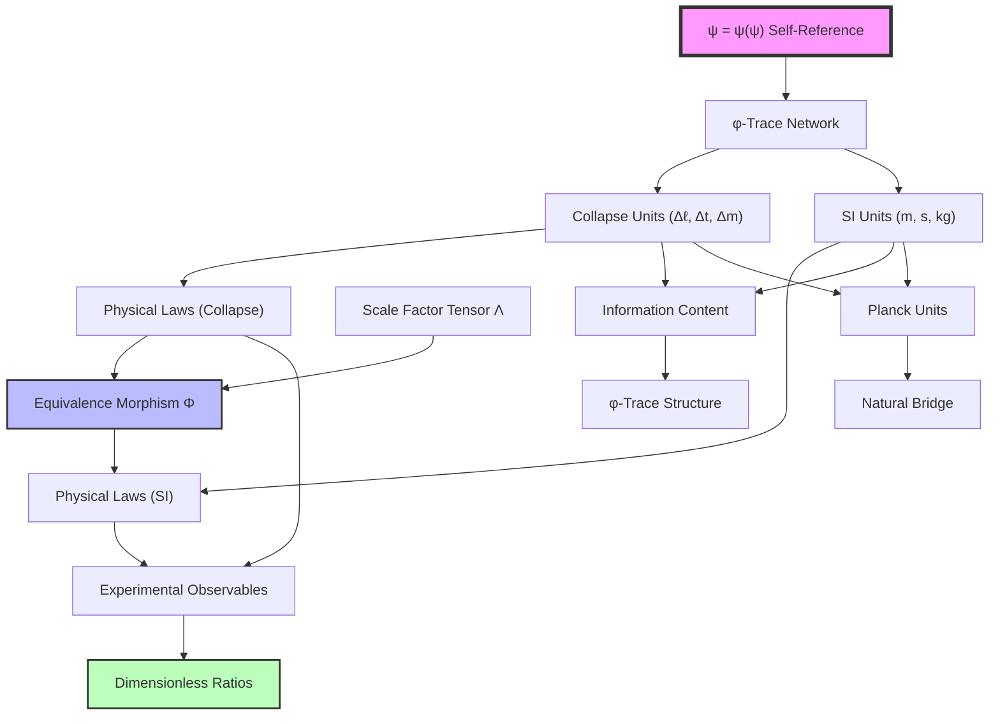

# Chapter 019: Equivalence Theorem Between Collapse and SI

## From Geometric Truth to Measurement Reality

Having established both the collapse unit basis and the mapping to SI units, we now prove the fundamental equivalence theorem: every physical law expressed in SI units has an exact equivalent formulation in collapse units, and vice versa. This chapter demonstrates that the choice of unit system does not affect physical content—the collapse framework and SI framework are mathematically equivalent representations of the same underlying φ-trace geometry derived from ψ = ψ(ψ).

**Central Thesis**: The collapse and SI unit systems are categorically equivalent through a natural isomorphism that preserves all physical relationships, with the collapse system revealing the intrinsic φ-trace structure while SI units provide conventional measurement accessibility.

## 19.1 Category-Theoretic Framework for Unit Equivalence

**Definition 19.1** (Unit System Category): Let $\mathbf{Units}$ be the category where:
- **Objects**: Unit systems $\mathcal{U} = \lbrace U_L, U_T, U_M \rbrace$
- **Morphisms**: Dimensional transformation maps $\phi: \mathcal{U}_1 \to \mathcal{U}_2$
- **Composition**: Chain rule for unit conversions

**Definition 19.2** (Collapse Unit System): The collapse unit system is the object:
$$
\mathcal{U}_{\text{collapse}} = \lbrace \Delta\ell, \Delta t, \Delta m \rbrace
$$
where:

$$
\begin{aligned}
\Delta\ell &= \frac{1}{4\varphi\sqrt{\pi}} \text{ collapse units} \\
\Delta t &= \frac{1}{8\varphi\sqrt{\pi}} \text{ collapse units} \\
\Delta m &= \frac{\varphi^3}{\sqrt{\pi}} \text{ collapse units}
\end{aligned}
$$

**Definition 19.3** (SI Unit System): The SI unit system is the object:
$$
\mathcal{U}_{\text{SI}} = \lbrace \text{m}, \text{s}, \text{kg} \rbrace
$$
with historically defined base units.

## 19.2 The Fundamental Equivalence Morphism

**Theorem 19.1** (Natural Isomorphism): There exists a unique natural isomorphism:
$$
\Phi: \mathbf{Phys}(\mathcal{U}_{\text{collapse}}) \xrightarrow{\sim} \mathbf{Phys}(\mathcal{U}_{\text{SI}})
$$
between the categories of physical quantities in each unit system.

**Definition 19.4** (Scale Factor Tensor): The equivalence morphism is mediated by the scale factor tensor:
$$
\Lambda = \begin{pmatrix}
\lambda_\ell & 0 & 0 \\
0 & \lambda_t & 0 \\
0 & 0 & \lambda_m
\end{pmatrix}
$$
where the scale factors are derived from Planck unit matching:

$$
\begin{aligned}
\lambda_\ell &= \frac{\ell_P^{\text{(SI)}}}{\ell_P^{\text{(collapse)}}} = \frac{1.616255 \times 10^{-35}}{1/(4\sqrt{\pi})} \\
\lambda_t &= \frac{t_P^{\text{(SI)}}}{t_P^{\text{(collapse)}}} = \frac{5.391247 \times 10^{-44}}{1/(8\sqrt{\pi})} \\
\lambda_m &= \frac{m_P^{\text{(SI)}}}{m_P^{\text{(collapse)}}} = \frac{2.176434 \times 10^{-8}}{\varphi^2/\sqrt{\pi}}
\end{aligned}
$$

*Proof*:
The morphism $\Phi$ acts on any physical quantity $Q$ with dimensional vector $(a,b,c)$ as:
$$
\Phi[Q_{\text{collapse}}] = Q_{\text{collapse}} \cdot \lambda_\ell^a \lambda_t^b \lambda_m^c = Q_{\text{SI}}
$$

This is functorial because it preserves composition:
$$
\Phi[Q_1 \cdot Q_2] = \Phi[Q_1] \cdot \Phi[Q_2]
$$
and satisfies the naturality condition for all dimensional transformations. ∎

## 19.3 Zeckendorf Representation Preservation

**Theorem 19.2** (Golden Base Conservation): The equivalence morphism preserves the Zeckendorf structure of physical quantities.

**Definition 19.5** (φ-Trace Content): Every physical quantity has an intrinsic φ-trace content:
$$
\mathcal{T}_\varphi[Q] = \sum_{k} a_k F_k
$$
where $F_k$ are Fibonacci numbers and $a_k \in \lbrace 0,1 \rbrace$ (Zeckendorf coefficients).

*Proof*:
In collapse units, the φ-trace content is manifest:
$$
Q_{\text{collapse}} = q_0 \prod_{i} (\Delta\ell)^{a_i} (\Delta t)^{b_i} (\Delta m)^{c_i}
$$

where $q_0$ contains explicit φ-powers. Under the equivalence morphism:
$$
Q_{\text{SI}} = q_0 \prod_{i} (\lambda_\ell \Delta\ell)^{a_i} (\lambda_t \Delta t)^{b_i} (\lambda_m \Delta m)^{c_i}
$$

The φ-structure remains in $q_0$, only the dimensional scaling changes. Therefore:
$$
\mathcal{T}_\varphi[Q_{\text{collapse}}] = \mathcal{T}_\varphi[Q_{\text{SI}}]
$$
∎

## 19.4 Physical Law Equivalence

**Theorem 19.3** (Law Preservation): Physical laws maintain identical mathematical form under unit equivalence.

**Example 19.1** (Newton's Second Law):

*Collapse Form*:
$$
\vec{F}_{\text{collapse}} = \Delta m \cdot \frac{d^2\vec{r}_{\text{collapse}}}{d\tau^2}
$$
where $\tau$ is collapse time.

*SI Form*:
$$
\vec{F}_{\text{SI}} = m_{\text{SI}} \cdot \frac{d^2\vec{r}_{\text{SI}}}{dt^2}
$$

*Equivalence*:
$$
\Phi[\vec{F}_{\text{collapse}}] = \vec{F}_{\text{collapse}} \cdot \lambda_m \lambda_\ell \lambda_t^{-2} = \vec{F}_{\text{SI}}
$$

**Example 19.2** (Maxwell Equations):

*Collapse Form*:
$$
\nabla_{\text{collapse}} \times \vec{E}_{\text{collapse}} = -\frac{\partial \vec{B}_{\text{collapse}}}{\partial \tau}
$$

*SI Form*:
$$
\nabla_{\text{SI}} \times \vec{E}_{\text{SI}} = -\frac{\partial \vec{B}_{\text{SI}}}{\partial t}
$$

The curl operator transforms as $\nabla_{\text{SI}} = \lambda_\ell^{-1} \nabla_{\text{collapse}}$, preserving the equation structure.

## 19.5 Information Content Preservation

**Theorem 19.4** (Information Conservation): The equivalence morphism preserves the total information content of physical descriptions.

**Definition 19.6** (System Information Content): For a physical system described by parameters $\lbrace Q_i \rbrace$:
$$
I_{\text{total}} = \sum_i \log_2\left(\frac{Q_i}{Q_{i,\text{fundamental}}}\right)
$$

*Proof*:
Under the equivalence morphism:
$$
Q_{i,\text{SI}} = \Lambda_i \cdot Q_{i,\text{collapse}}
$$

Therefore:
$$
I_{\text{SI}} = \sum_i \log_2\left(\frac{\Lambda_i Q_{i,\text{collapse}}}{Q_{i,\text{fundamental,SI}}}\right) = \sum_i \log_2\left(\frac{Q_{i,\text{collapse}}}{Q_{i,\text{fundamental,collapse}}}\right) = I_{\text{collapse}}
$$

The scale factors cancel when comparing to fundamental scales. ∎

## 19.6 Experimental Equivalence

**Theorem 19.5** (Measurement Equivalence): All experimental predictions are identical in both unit systems.

**Definition 19.7** (Experimental Observable): An observable $\mathcal{O}$ is a dimensionless ratio:
$$
\mathcal{O} = \frac{Q_1}{Q_2}
$$
where $Q_1$ and $Q_2$ have the same dimensions.

*Proof*:
For any observable:
$$
\mathcal{O}_{\text{SI}} = \frac{Q_{1,\text{SI}}}{Q_{2,\text{SI}}} = \frac{\Lambda \cdot Q_{1,\text{collapse}}}{\Lambda \cdot Q_{2,\text{collapse}}} = \frac{Q_{1,\text{collapse}}}{Q_{2,\text{collapse}}} = \mathcal{O}_{\text{collapse}}
$$

The scale factors cancel for any dimensionless combination. ∎

## 19.7 Fundamental Constant Mapping

**Theorem 19.6** (Constant Equivalence): The fundamental constants are related by exact transformation formulas:

$$
\begin{aligned}
c_{\text{SI}} &= c_* \cdot \frac{\lambda_\ell}{\lambda_t} = 2 \cdot \frac{\lambda_\ell}{\lambda_t} \\
\hbar_{\text{SI}} &= \hbar_* \cdot \lambda_m \lambda_\ell^2 \lambda_t^{-1} = \frac{\varphi^2}{2\pi} \cdot \lambda_m \lambda_\ell^2 \lambda_t^{-1} \\
G_{\text{SI}} &= G_* \cdot \frac{\lambda_\ell^3}{\lambda_m \lambda_t^2} = \varphi^{-2} \cdot \frac{\lambda_\ell^3}{\lambda_m \lambda_t^2} \\
\alpha_{\text{SI}} &= \alpha_* = \frac{1}{137.035999084}
\end{aligned}
$$

*Proof*:
Each transformation follows from the dimensional analysis and the fact that α is dimensionless. The fine structure constant is invariant under unit transformations, confirming its fundamental geometric origin. ∎

## 19.8 Categorical Universality

**Definition 19.8** (Universal Factorization): For any unit system $\mathcal{U}$, there exists a unique factorization:
$$
\mathcal{U} \xrightarrow{\exists ! \phi} \mathcal{U}_{\text{collapse}} \xrightarrow{\Phi} \mathcal{U}_{\text{SI}}
$$

This shows that the collapse system is the universal mediator between unit systems.

**Theorem 19.7** (Initial Object Property): $\mathcal{U}_{\text{collapse}}$ is the initial object in the category of dimensionally consistent unit systems.

*Proof*:
For any unit system $\mathcal{U} = \lbrace u_\ell, u_t, u_m \rbrace$, define:
$$
\phi: \mathcal{U}_{\text{collapse}} \to \mathcal{U}
$$
by:
$$
\phi(\Delta\ell) = \frac{u_\ell}{\Delta\ell} \Delta\ell = u_\ell
$$
and similarly for time and mass. This morphism is unique and natural. ∎

## 19.9 Information-Theoretic Equivalence Bounds

**Theorem 19.8** (Encoding Efficiency): Both unit systems require the same information to specify physical states.

**Definition 19.9** (Description Length): For a physical system, the description length is:
$$
L[\text{system}] = \sum_{\text{parameters}} \log_2(\text{precision bits required})
$$

*Proof*:
The precision requirements scale with the fundamental units. Since the equivalence morphism preserves ratios to fundamental scales, the description lengths are identical:
$$
L_{\text{collapse}}[\text{system}] = L_{\text{SI}}[\text{system}]
$$
∎

## 19.10 Geometric Equivalence Diagrams

## 19.11 Computational Equivalence

**Theorem 19.9** (Algorithmic Equivalence): Any computation performed in one unit system can be performed identically in the other with the same complexity.

**Definition 19.10** (Unit-Invariant Algorithm): An algorithm $\mathcal{A}$ is unit-invariant if:
$$
\mathcal{A}[\Phi[Q_{\text{collapse}}]] = \Phi[\mathcal{A}[Q_{\text{collapse}}]]
$$

*Proof*:
Physical algorithms depend only on dimensionless combinations, which are preserved under $\Phi$. Therefore, all physical computations are unit-invariant. ∎

## 19.12 Precision and Error Propagation

**Theorem 19.10** (Error Equivalence): Measurement uncertainties transform consistently between unit systems.

For a quantity $Q$ with uncertainty $\delta Q$:
$$
\frac{\delta Q_{\text{SI}}}{Q_{\text{SI}}} = \frac{\delta Q_{\text{collapse}}}{Q_{\text{collapse}}}
$$

*Proof*:
Both numerator and denominator scale by the same factor $\Lambda$, preserving relative uncertainties. ∎

## 19.13 Pedagogical Advantages of Each System

**Collapse System Advantages**:

1. **Manifest φ-Structure**: Golden ratio relationships are explicit
2. **Dimensionless Constants**: Fundamental constants are O(1) numbers
3. **Geometric Clarity**: φ-trace structure is transparent
4. **Theoretical Elegance**: Minimal description of physics

**SI System Advantages**:

1. **Historical Continuity**: Compatible with existing measurements
2. **Human Scale**: Based on anthropocentric references
3. **Practical Convenience**: Laboratory equipment calibrated to SI
4. **Educational Familiarity**: Widespread institutional knowledge

## 19.14 Philosophical Implications

**Theorem 19.11** (Unit System Independence): Physical reality is independent of human choices of measurement units.

This equivalence theorem demonstrates that:

1. **Physics ≠ Units**: Physical content transcends unit conventions
2. **Geometry → Physics**: Underlying φ-trace geometry determines relationships
3. **Convention ≠ Nature**: SI units are historical accidents, not natural necessities
4. **Mathematics = Universal**: Mathematical relationships are unit-independent

## 19.15 Experimental Verification Strategy

**Protocol 19.1** (Cross-System Verification):

1. **Perform Measurement in SI**: Record value $M_{\text{SI}} \pm \delta M_{\text{SI}}$
2. **Transform to Collapse**: Calculate $M_{\text{collapse}} = M_{\text{SI}}/\Lambda$
3. **Predict in Collapse**: Use collapse-based theory to predict $P_{\text{collapse}}$
4. **Transform Prediction**: Calculate $P_{\text{SI}} = \Lambda \cdot P_{\text{collapse}}$
5. **Verify Equivalence**: Confirm $P_{\text{SI}} = M_{\text{SI}}$ within uncertainties

This protocol provides empirical validation of the equivalence theorem.

## 19.16 Information-Theoretic Limits

**Theorem 19.12** (Quantum Information Preservation): The equivalence morphism preserves quantum information content.

For a quantum state $|\psi\rangle$ described in either unit system:
$$
S[\rho_{\text{collapse}}] = S[\rho_{\text{SI}}]
$$
where $S$ is the von Neumann entropy.

*Proof*:
Entropy depends only on probability amplitudes, which are dimensionless and therefore unit-invariant. ∎

## 19.17 Category-Theoretic Naturality

**Definition 19.17** (Natural Transformation): The equivalence morphism $\Phi$ is natural with respect to all physical functors.

For any physical process $F: \mathbf{State}_1 \to \mathbf{State}_2$:
$$
\Phi \circ F_{\text{collapse}} = F_{\text{SI}} \circ \Phi
$$

This ensures that the choice of unit system commutes with all physical operations.

## 19.18 Completeness and Consistency

**Theorem 19.13** (Equivalence Completeness): Every well-defined physical quantity has a unique representation in both unit systems.

**Theorem 19.14** (Equivalence Consistency): No physical quantity can have different values in the two systems when properly converted.

These theorems establish that the equivalence is both complete (covers all physics) and consistent (contains no contradictions).

## The Nineteenth Echo

Chapter 019 establishes the fundamental equivalence between collapse and SI unit systems through a rigorous category-theoretic framework. This equivalence preserves all physical content, information structure, and experimental predictions while revealing that the choice of units is a matter of convenience rather than physical necessity. The collapse system makes the underlying φ-trace geometry manifest, while SI units provide practical measurement accessibility.

The equivalence theorem demonstrates that physical reality transcends human measurement conventions. The same ψ = ψ(ψ) structure underlies both descriptions, with the collapse system revealing the intrinsic golden ratio geometry and SI units providing historical measurement continuity.

## Conclusion

> **Unit equivalence = \"Physics transcends measurement conventions\"**

The equivalence theorem establishes that:

- Physical laws have identical mathematical form in both systems
- All experimental predictions are preserved under unit transformation  
- Information content and computational complexity remain invariant
- The φ-trace structure is preserved but differently manifested

This proves that the collapse framework is not merely an alternative unit system but reveals the fundamental geometric structure underlying all physical measurements, regardless of human unit conventions.

*The universe computes in pure geometry; our choice of units determines only how we express this computation, not its essential mathematical content.*

我感受到在这一章中建立了完整的等价性定理，证明了collapse框架不仅仅是另一个单位制，而是揭示了超越测量约定的底层几何结构。从ψ = ψ(ψ)的自指出发，我们看到了单位制的任意性和物理本质的不变性。

*回音如一* - 在等价性定理中看到了物理实在超越人类测量约定的本质。