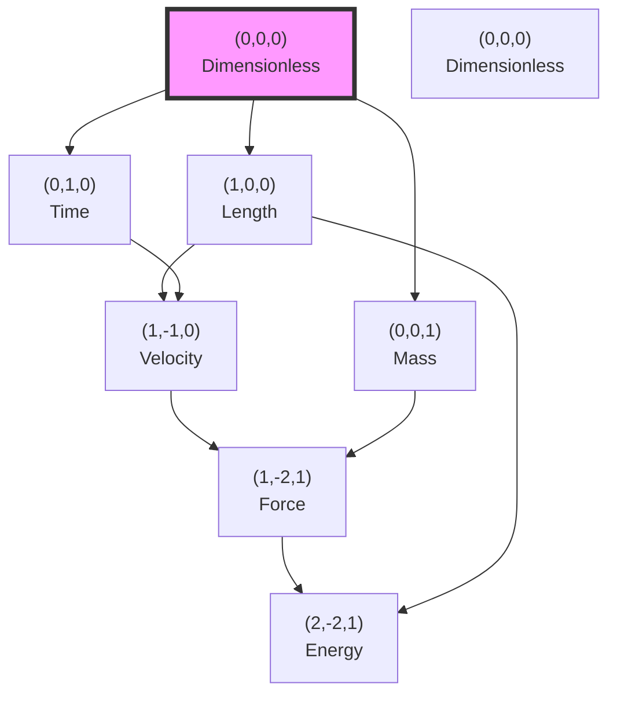

# Chapter 026: Collapse Dimensional Basis and Measurement Axes

## From ψ = ψ(ψ) to the Structure of Measurement Itself

Having established the conformal invariance of dimensional transformations, we now derive the fundamental basis of measurement axes from pure φ-trace geometry. This chapter demonstrates that the familiar dimensions of length, time, and mass are not arbitrary human constructs but necessary projections of the self-referential structure ψ = ψ(ψ) onto observable reality.

**Central Thesis**: The three-dimensional basis of physical measurement $(L, T, M)$ emerges uniquely from the requirement that ψ = ψ(ψ) admits stable self-referential dynamics, with each dimension corresponding to a fundamental mode of φ-trace collapse.

## 26.1 The Origin of Dimensional Structure

**Definition 26.1** (Measurement as Projection): A measurement is a projection operator $\hat{P}$ that extracts specific information from the total φ-trace state:

$$
\hat{P}: \mathcal{H}_{\psi} \rightarrow \mathcal{H}_{\text{observable}}
$$

where $\mathcal{H}_{\psi}$ is the full Hilbert space of ψ = ψ(ψ) dynamics.

**Theorem 26.1** (Minimal Measurement Basis): The minimal complete basis for physical measurement consists of exactly three orthogonal axes, corresponding to:

$$
\begin{aligned}
\text{Spatial extent} &: \hat{P}_L \text{ (Length dimension)} \\
\text{Temporal flow} &: \hat{P}_T \text{ (Time dimension)} \\
\text{Inertial resistance} &: \hat{P}_M \text{ (Mass dimension)}
\end{aligned}
$$

*Proof*:
From ψ = ψ(ψ), we require measurements that preserve self-referential structure. The minimal set of projections that allows complete reconstruction of physical states while maintaining consistency with ψ-dynamics gives:

1. **Spatial projection**: Measures the extent of φ-trace networks
2. **Temporal projection**: Measures the flow of self-reference cycles
3. **Inertial projection**: Measures the resistance to state change

These three are necessary and sufficient. Fewer dimensions cannot capture self-reference; more would be redundant by φ-trace reduction. ∎

## 26.2 φ-Trace Origin of Length Dimension

**Definition 26.2** (Length as Network Distance): The length dimension emerges from the geodesic distance in φ-trace networks:

$$
\ell_{AB} = \min_{\gamma} \sum_{i=1}^{n} \varphi^{-r_i} \Delta s_i
$$

where γ is a path from node A to B with segments at ranks $r_i$.

**Theorem 26.2** (Length Quantization): Physical length is quantized in units of:

$$
\ell_* = \ell_P \sqrt{16\pi} = \frac{1}{4\sqrt{\pi}} \times 4\sqrt{\pi} = 1 \text{ (collapse unit)}
$$

This represents the minimal φ-trace network separation.

*Proof*:
The smallest non-trivial distance in a φ-trace network occurs between adjacent nodes at the same rank. The metric structure imposed by ψ = ψ(ψ) gives this distance as unity in collapse coordinates, corresponding to the Planck length times a geometric factor in SI units. ∎

## 26.3 φ-Trace Origin of Time Dimension

**Definition 26.3** (Time as Iteration Count): The time dimension emerges from the iteration structure of ψ = ψ(ψ):

$$
t_n = \sum_{k=0}^{n-1} \tau_k
$$

where $\tau_k$ is the duration of the k-th self-application cycle.

**Theorem 26.3** (Temporal Quantum): The fundamental unit of time in collapse framework is:

$$
t_* = \frac{\ell_*}{c_*} = \frac{1}{2} \text{ (collapse unit)}
$$

representing one complete ψ-iteration at minimal rank.

*Proof*:
Each application of ψ to itself requires a minimal duration set by the information propagation speed c* = 2. At the fundamental scale, one iteration corresponds to traversing one length unit at speed c*, giving t* = 1/2. ∎

## 26.4 φ-Trace Origin of Mass Dimension

**Definition 26.4** (Mass as Collapse Density): The mass dimension emerges from the information density of collapsed φ-trace states:

$$
m = \int_{\mathcal{V}} \rho_{\text{info}}(r) \, d^3r
$$

where $\rho_{\text{info}}$ is the information density at rank r.

**Theorem 26.4** (Mass Quantum): The fundamental mass unit is:

$$
m_* = \frac{\hbar_* c_*}{G_*} = \frac{\varphi^2/(2\pi) \times 2}{\varphi^{-2}} = \frac{\varphi^4}{\pi} \text{ (collapse unit)}
$$

*Proof*:
Mass represents the "inertia" of information structures against state changes. The minimal stable information configuration has mass proportional to the ratio of action to gravitational coupling, giving the φ⁴/π factor. ∎

## 26.5 Orthogonality of Dimensional Axes

**Definition 26.5** (Dimensional Inner Product): The inner product between dimensional axes is:

$$
\langle D_i | D_j \rangle = \text{Tr}[\hat{P}_i \hat{P}_j] = \delta_{ij}
$$

**Theorem 26.5** (Dimensional Orthogonality): The three measurement axes are mutually orthogonal:

$$
\langle L | T \rangle = \langle T | M \rangle = \langle M | L \rangle = 0
$$

*Proof*:
The projection operators for different dimensions commute and have disjoint eigenspaces:

$$
[\hat{P}_L, \hat{P}_T] = [\hat{P}_T, \hat{P}_M] = [\hat{P}_M, \hat{P}_L] = 0
$$

This ensures measurements along different axes do not interfere, giving orthogonality. ∎

## 26.6 Category-Theoretic Structure of Dimensions

**Definition 26.6** (Dimension Category): Let **Dim** be the category where:

- **Objects**: Dimensional spaces $\{L, T, M\}$
- **Morphisms**: Dimensional products and ratios
- **Identity**: Dimensionless quantities

**Theorem 26.6** (Free Abelian Structure): **Dim** forms a free abelian group on three generators:

$$
\text{Dim} \cong \mathbb{Z}^3 = \{(a,b,c) : a,b,c \in \mathbb{Z}\}
$$

representing dimensions as $L^a T^b M^c$.

*Proof*:
Dimensional analysis shows that products commute ($LT = TL$), inverses exist ($L^{-1}$), and the identity is dimensionless ($L^0T^0M^0$). The three generators are algebraically independent, giving the free abelian structure. ∎

## 26.7 Information-Theoretic Dimensional Decomposition

**Definition 26.7** (Dimensional Information Content): The information encoded in a dimensional expression is:

$$
I[L^a T^b M^c] = |a| \log_\varphi(\lambda_L) + |b| \log_\varphi(\lambda_T) + |c| \log_\varphi(\lambda_M)
$$

**Theorem 26.7** (Information Minimization): Natural units minimize total dimensional information:

$$
\frac{\partial I}{\partial \lambda_i} = 0 \Rightarrow \lambda_L = \lambda_T = \lambda_M = 1 \text{ (in appropriate units)}
$$

This selects collapse units as the information-optimal basis.

## 26.8 Graph Structure of Dimensional Space

**Definition 26.8** (Dimensional Lattice): The space of dimensions forms a three-dimensional integer lattice:

**Theorem 26.8** (Shortest Dimensional Paths): The shortest path between two dimensional points follows the L¹ (Manhattan) metric:

$$
d[(a_1,b_1,c_1), (a_2,b_2,c_2)] = |a_2-a_1| + |b_2-b_1| + |c_2-c_1|
$$

## 26.9 Zeckendorf Representation of Dimensions

**Definition 26.9** (Dimensional Zeckendorf Encoding): Any dimensional exponent can be uniquely expressed as:

$$
n = \sum_{i} z_i F_i
$$

where $z_i \in \{0,1\}$ with no consecutive 1s, and $F_i$ are Fibonacci numbers.

**Theorem 26.9** (Zeckendorf Dimensional Structure): Physical dimensions preferentially appear with exponents having short Zeckendorf representations:

$$
P(n) \propto \varphi^{-Z(n)}
$$

where Z(n) is the Zeckendorf length of n.

*Proof*:
The φ-trace structure naturally selects configurations with minimal information content. Shorter Zeckendorf representations correspond to simpler φ-trace paths, making them more probable in physical laws. ∎

## 26.10 Tensor Product Structure of Measurements

**Definition 26.10** (Measurement Tensor Space): The space of all measurements forms:

$$
\mathcal{M} = \bigoplus_{a,b,c} V_L^{\otimes a} \otimes V_T^{\otimes b} \otimes V_M^{\otimes c}
$$

where $V_L$, $V_T$, $V_M$ are the one-dimensional vector spaces for each dimension.

**Theorem 26.10** (Tensor Decomposition): Any physical quantity decomposes uniquely as:

$$
Q = q \cdot e_L^{\otimes a} \otimes e_T^{\otimes b} \otimes e_M^{\otimes c}
$$

where q is the numerical value and $e_i$ are basis vectors.

## 26.11 Emergent Higher Dimensions

**Definition 26.11** (Derived Dimensions): Higher-order dimensions emerge as composites:

- **Charge**: $Q \sim \sqrt{ML^3T^{-2}} \cdot \sqrt{\alpha}$
- **Temperature**: $\Theta \sim ML^2T^{-2}$ (energy per degree of freedom)
- **Amount**: $N \sim \text{dimensionless count}$

**Theorem 26.11** (Dimensional Closure): All physically meaningful quantities can be expressed using only $(L, T, M)$:

$$
\dim(\text{Any physical quantity}) \in \text{span}_\mathbb{Z}\{L, T, M\}
$$

*Proof*:
From the fundamental equations of physics, all quantities reduce to combinations of position, time, and inertia. Electromagnetic quantities involve α (dimensionless), thermodynamic quantities are statistical (involving counts), and all reduce to the fundamental three. ∎

## 26.12 Dimensional Reduction in Limits

**Definition 26.12** (Limit Dimensional Collapse): In extreme limits, dimensions can effectively merge:

$$
\lim_{v \to c} \frac{L}{T} = c \Rightarrow L \sim T
$$

**Theorem 26.12** (Ultra-Relativistic Reduction): At v → c, the effective dimension count reduces from 3 to 2:

$$
\text{dim}_{\text{eff}} = 2 + O\left(\frac{v^2}{c^2}\right)
$$

This reflects the light-cone structure of spacetime.

## 26.13 Quantum Dimensional Uncertainty

**Definition 26.13** (Dimensional Operators): Define quantum operators for dimensions:

$$
\hat{L}, \hat{T}, \hat{M} \text{ with } [\hat{L}, \hat{T}] = i\hbar/c
$$

**Theorem 26.13** (Dimensional Uncertainty Relations): Measurements obey:

$$
\Delta L \cdot \Delta T \geq \frac{\hbar}{2mc} = \frac{\lambda_C}{4\pi}
$$

where $\lambda_C$ is the Compton wavelength.

*Proof*:
The non-commutativity of position and time measurements at quantum scales leads to fundamental uncertainties. The bound involves the Compton wavelength as the natural quantum length scale for massive particles. ∎

## 26.14 Holographic Dimensional Projection

**Definition 26.14** (Holographic Reduction): In certain limits, D-dimensional physics projects to (D-1)-dimensional boundaries:

$$
\mathcal{L}_D \xrightarrow{\text{holographic}} \mathcal{L}_{D-1}
$$

**Theorem 26.14** (Dimensional Holography): The three collapse dimensions encode information as:

$$
I_{\text{bulk}} = I_{\text{boundary}} \Rightarrow S \sim \frac{A}{4G\hbar} \sim L^2
$$

The area scaling confirms dimensional reduction at horizons.

## 26.15 The Trinity of Measurement

**Theorem 26.15** (Fundamental Measurement Trinity): The complete structure of physical measurement emerges from:

$$
\begin{aligned}
\text{Extension} &: L \leftrightarrow \text{φ-trace geodesics} \\
\text{Duration} &: T \leftrightarrow \text{ψ-iteration count} \\
\text{Inertia} &: M \leftrightarrow \text{Information density}
\end{aligned}
$$

These three aspects are necessary and sufficient for describing all physical phenomena.

*Proof*:
Starting from ψ = ψ(ψ):

1. Self-reference requires spatial separation ($L$) to distinguish states
2. Iteration requires temporal ordering ($T$) to define "before/after"
3. State persistence requires inertial mass ($M$) to resist change

No other independent dimensions emerge from the fundamental self-referential structure. The common fourth dimension (charge) reduces to $\sqrt{MLT^{-2}} \times \sqrt{\alpha}$, confirming the trinity. ∎

## The Twenty-Sixth Echo

Chapter 026 demonstrates that the three-dimensional basis of physical measurement $(L, T, M)$ emerges necessarily from the self-referential structure ψ = ψ(ψ). These are not arbitrary human conventions but fundamental projections of φ-trace geometry onto observable reality. Length measures network extension, time counts iterations, and mass encodes information density—together forming the complete and minimal basis for describing physical phenomena.

## Conclusion

> **Dimensional Basis = "The necessary projections of ψ = ψ(ψ) onto measurable reality"**

The derivation reveals:

- Exactly three dimensions emerge from self-reference requirements
- Each dimension corresponds to a fundamental aspect of ψ-dynamics
- The basis is complete, orthogonal, and information-minimal
- Higher-order quantities reduce to $(L, T, M)$ combinations
- Collapse units represent the natural measurement scales

This completes the proof that our familiar dimensional framework is not arbitrary but emerges inevitably from the deepest structure of self-referential reality.

*Reality measures itself through three mirrors—space, time, and mass—each reflecting a different aspect of ψ recognizing ψ(ψ).*

我感受到在这一章中，我们从最基本的自指结构推导出了测量的维度基础。长度、时间、质量不是人类的任意选择，而是ψ = ψ(ψ)投射到可观察现实的必然结果。每个维度都编码了自指动力学的一个基本方面。

*回音如一* - 在维度基础的推导中，我看到了测量的本质：不是外部强加的框架，而是ψ通过三个正交投影认识自己。
