# Chapter 027: Binary Universe Quantity Preservation Under Mapping

## From Binary Information Invariance to Physical Law Preservation

Having established the binary foundation of dimensional structure and conformal invariance, we now prove that physical quantities remain invariant under unit mappings because they encode binary information patterns that must be preserved under "no consecutive 1s" constraint. This chapter demonstrates that the laws of physics preserve their form across all unit systems as a direct consequence of binary correlation invariance in ψ = ψ(ψ).

**Central Thesis**: Physical quantities and their relationships are preserved under unit mappings because they represent invariant binary information correlation patterns under "no consecutive 1s" constraint. Conservation laws emerge as requirements for maintaining binary correlation coherence across different observer scales in the φ^n hierarchy.

## 27.0 Binary Foundation of Quantity Preservation

**Theorem 27.0** (Binary Information Invariance): In the binary universe with constraint "no consecutive 1s", physical quantities preserve their information content under scale transformations because binary correlation patterns are invariant under Fibonacci-indexed scaling.

*Proof*:
1. **Self-Reference Axiom**: From ψ = ψ(ψ), the universe maintains self-consistency through binary information processing
2. **Binary Constraint**: "No consecutive 1s" creates correlation patterns that must be preserved to maintain information coherence
3. **Scale Transformation**: Under $\varphi^{F_n}$ scaling (Fibonacci-indexed), binary patterns transform as:
   
$$
   pattern_{binary} \to \varphi^{F_n} \cdot pattern_{binary}
   
$$
4. **Correlation Preservation**: The relative relationships between patterns remain invariant:
   
$$
   \frac{pattern_1}{pattern_2} \to \frac{\varphi^{F_n} pattern_1}{\varphi^{F_n} pattern_2} = \frac{pattern_1}{pattern_2}
   
$$
This shows that binary information relationships are preserved under Fibonacci-indexed scaling, ensuring physical law invariance. ∎

**Definition 27.0** (Binary Physical Quantity): A physical quantity in binary universe theory is:

$$
Q_{binary} = \sum_{k} B_k φ^{F_{n_k}} [D_{binary}]^{m_k}
$$

where $B_k \in \{0,1\}$ are binary coefficients satisfying "no consecutive 1s", $F_{n_k}$ are Fibonacci indices, and $[D_{binary}]$ are binary dimensional channels.

## 27.1 The Structure of Physical Quantities

**Definition 27.1** (Binary-Enhanced Physical Quantity): A physical quantity Q in binary universe theory is a binary information pattern with dimensional structure:

$$
Q_{binary} = q_{binary} \cdot [L^{a_{F_5}} T^{b_{F_8}} M^{c_{F_{13}}}]
$$

where $q_{binary}$ is the binary-encoded magnitude and the exponents have Fibonacci indices preserving "no consecutive 1s".

**Theorem 27.1** (Binary Quantity Decomposition): Every physical quantity uniquely decomposes into binary information and Fibonacci-indexed dimensional structure:

$$
Q = \left(\sum_{k} B_k \varphi^{F_k}\right) \cdot [L^a T^b M^c]
$$

where $B_k \in \{0,1\}$ with no consecutive 1s, and dimensional powers satisfy binary correlation requirements.

*Proof*:
From binary universe theory with "no consecutive 1s" constraint:
1. Numerical part: Binary representation with Fibonacci base ensures unique decomposition
2. Dimensional part: Three independent binary channels (L, T, M) with Fibonacci indices F_5, F_8, F_{13}
3. Uniqueness: "No consecutive 1s" constraint ensures unique binary representation
4. Independence: Channel indices satisfy |F_i - F_j| > 1, ensuring orthogonality ∎

## 27.2 Binary Conservation Laws from Correlation Preservation

**Definition 27.2** (Binary Conservation Law): A conservation law in binary universe theory is a constraint maintaining binary correlation patterns:

$$
\frac{d}{dt}[\text{Binary Pattern}] = 0 \quad \text{preserving "no consecutive 1s"}
$$

**Theorem 27.2** (Binary Conservation from Self-Reference): Conservation laws emerge from maintaining binary information coherence in ψ = ψ(ψ) under "no consecutive 1s" constraint.

*Proof*:
For ψ = ψ(ψ) to maintain binary self-consistency:

$$
\frac{d}{dt}[\psi = \psi(\psi)]_{binary} = 0
$$

This requires preserving binary correlation patterns:

1. **Energy Conservation**: Binary temporal correlation patterns (F_8 = 21 indexing) must maintain coherence:
   
$$
E_{binary} = \sum_k B_k^{(E)} \varphi^{F_k} \text{ with } \frac{dE_{binary}}{dt} = 0
$$
2. **Momentum Conservation**: Binary spatial correlation patterns (F_5 = 5 indexing) must preserve structure:
   
$$
P_{binary} = \sum_k B_k^{(P)} \varphi^{F_k} \text{ with } \frac{dP_{binary}}{dt} = 0
$$
3. **Information Conservation**: Total binary information with "no consecutive 1s" must be preserved:
   
$$
I_{total} = \sum_{\text{valid patterns}} B_i \log_2(φ^{F_i}) = \text{constant}
$$
Each conservation law maintains specific binary correlation channels required for self-referential consistency. ∎

## 27.3 Tensor Transformation Under Unit Mappings

**Definition 27.3** (Unit Transformation Tensor): A unit transformation is represented by the tensor:

$$
\Lambda^\mu_\nu = \text{diag}(\lambda_\ell^{a_\mu}, \lambda_t^{b_\mu}, \lambda_m^{c_\mu})
$$

where the exponents depend on the tensor index position.

**Theorem 27.3** (Tensor Transformation Law): Under unit transformation Λ, a tensor transforms as:

$$
T'^{\mu_1...\mu_p}_{\nu_1...\nu_q} = \Lambda^{\mu_1}_{\rho_1}...\Lambda^{\mu_p}_{\rho_p} \Lambda_{\nu_1}^{\sigma_1}...\Lambda_{\nu_q}^{\sigma_q} T^{\rho_1...\rho_p}_{\sigma_1...\sigma_q}
$$

This preserves all tensor contractions and physical relationships.

*Proof*:
The transformation law ensures that contracted indices cancel their scale factors:

$$
T'^{\mu}_{\mu} = \Lambda^\mu_\rho \Lambda_\mu^\sigma T^\rho_\sigma = \delta^\sigma_\rho T^\rho_\sigma = T^\rho_\rho
$$

Since physical laws are expressed as tensor equations, they remain form-invariant. ∎

## 27.4 Category-Theoretic Preservation

**Definition 27.4** (Quantity Functor): Define the functor F: **Unit** → **Phys** by:
- On objects: F(𝒰) = \{physical quantities measured in unit system 𝒰\}
- On morphisms: F(φ) = \{transformation of quantities under φ\}

**Theorem 27.4** (Functorial Preservation): F preserves:
1. Composition: F(φ ∘ ψ) = F(φ) ∘ F(ψ)
2. Identities: F(id_𝒰) = id_\{F(𝒰)\}
3. Physical laws: Equations valid in 𝒰₁ remain valid in 𝒰₂

*Proof*:
The functor F acts by scaling numerical values while preserving dimensional structure:

$$
F(\phi): q_1[D_1] \mapsto (q_1 \prod_i \lambda_i^{n_i})[D_1]
$$

Composition preserves this structure:
$$
F(\phi \circ \psi)(q[D]) = F(\phi)(F(\psi)(q[D])) = q \prod_i (\lambda_i^{(\phi)} \lambda_i^{(\psi)})^{n_i} [D]
$$

Physical equations, being relations between quantities of the same dimension, are preserved. ∎

## 27.5 Binary Information-Theoretic Preservation

**Definition 27.5** (Binary Quantity Information): The information in a physical quantity under binary universe theory:

$$
I_{binary}[Q] = \sum_{k} B_k \log_2(\varphi^{F_k}) + \sum_{D} |n_D| \log_2(F_{n_D})
$$

where first sum is over binary magnitude representation, second over dimensional channels.

**Theorem 27.5** (Binary Information Invariance): Total binary information content is preserved under Fibonacci-indexed unit transformations:

$$
I_{binary}[\text{Law in } \mathcal{U}_1] = I_{binary}[\text{Law in } \mathcal{U}_2]
$$

*Proof*:
Under binary unit transformation with Fibonacci index $F_n$:

$$
Q_{binary} \xrightarrow{\varphi^{F_n}} Q'_{binary}
$$

The binary information redistributes:
1. Magnitude: $q_{binary} \to q_{binary}/\varphi^{F_n}$ shifts information by $-F_n \log_2(\varphi)$
2. Dimensions: $[D] \to \varphi^{F_n}[D]$ shifts information by $+F_n \log_2(\varphi)$
3. Total: $I_{total} = I_{magnitude} + I_{dimension}$ remains constant

The "no consecutive 1s" constraint ensures valid binary patterns map to valid patterns, preserving information structure. ∎

## 27.6 Gauge Invariance and Unit Freedom

**Definition 27.6** (Unit Gauge Symmetry): The choice of units represents a gauge freedom in the description of physics:

$$
\mathcal{L}[\phi; \mathcal{U}_1] = \mathcal{L}[\phi'; \mathcal{U}_2]
$$

where φ' is the gauge-transformed field.

**Theorem 27.6** (Gauge-Unit Duality): Unit transformations are dual to gauge transformations in the space of physical descriptions:

$$
\text{Unit transformation} \leftrightarrow \text{Global gauge transformation}
$$

*Proof*:
Both unit and gauge transformations leave physics invariant while changing the description. A unit transformation acts as:

$$
\phi(x) \rightarrow \lambda^n \phi(x)
$$

globally, where n depends on the dimension of φ. This is precisely a global gauge transformation with parameter log(λ). ∎

## 27.7 Graph Structure of Quantity Preservation

**Definition 27.7** (Preservation Graph): Let G_preserve be the graph where:
- **Vertices**: Physical quantities in different unit systems
- **Edges**: Unit transformations preserving relationships
- **Edge labels**: Scale factors λ

```mermaid
graph LR
    E1["Energy (SI)<br/>1 J"]
    E2["Energy (CGS)<br/>10⁷ erg"]
    E3["Energy (Natural)<br/>E/m_e c²"]
    E4["Energy (Atomic)<br/>E/E_h"]
    
    E1 <-->|"10⁷"| E2
    E1 <-->|"m_e c²"| E3
    E1 <-->|"E_h"| E4
    E2 <-->|"m_e c²/10⁷"| E3
    E3 <-->|"E_h/m_e c²"| E4
    
    style E1 fill:#f9f,stroke:#333,stroke-width:2px
```

**Theorem 27.7** (Path Independence): The transformation between any two representations is path-independent in G_preserve.

## 27.8 Binary Maxwell Equations as Preservation Example

**Definition 27.8** (Binary Maxwell Structure): Maxwell equations encode binary electromagnetic correlations:

$$
\partial_\mu F^{\mu\nu}_{binary} = \frac{4\pi}{c_*} J^\nu_{binary}
$$

where $c_* = 2$ is binary channel capacity and fields have Fibonacci-indexed correlations.

**Theorem 27.8** (Binary Maxwell Invariance): Maxwell's equations preserve binary correlation structure under all Fibonacci-indexed unit transformations.

*Proof*:
In binary universe theory:
1. **Field Tensor**: $F^{\mu\nu}_{binary}$ encodes binary correlation between space-time channels
2. **Current**: $J^\nu_{binary}$ represents binary information flow with "no consecutive 1s"
3. **Transformation**: Under $\varphi^{F_n}$ scaling:
   - $F^{\mu\nu} \to \varphi^{F_n \cdot w_F} F^{\mu\nu}$ with Fibonacci weight $w_F$
   - $J^{\nu} \to \varphi^{F_n \cdot w_J} J^{\nu}$ with matching weight
   - Equation structure preserved by dimensional matching

The apparent unit dependence (Gaussian vs SI) reflects different positions in binary hierarchy:
- Gaussian: Closer to binary fundamental scale
- SI: Human scale with additional φ^{-148} factors

Binary correlation patterns remain invariant. ∎

## 27.9 Quantum Mechanics Preservation

**Definition 27.9** (Schrödinger Equation): The fundamental quantum evolution:

$$
i\hbar \frac{\partial \psi}{\partial t} = \hat{H}\psi
$$

**Theorem 27.9** (Quantum Preservation): The Schrödinger equation and its solutions preserve their physical content under unit transformations.

*Proof*:
Under unit transformation:
- ℏ → λ_ℏ ℏ changes the action scale
- H → λ_H H changes the energy scale
- t → λ_t t changes the time scale

The equation maintains form if $\lambda_\hbar/\lambda_t = \lambda_H$, which is guaranteed by dimensional consistency. The wavefunction normalization $\int |\psi|^2 d^3x = 1$ is preserved as probabilities are dimensionless. ∎

## 27.10 Thermodynamic Preservation

**Definition 27.10** (Thermodynamic Laws): The fundamental relations:

$$
dU = TdS - PdV + \mu dN
$$

**Theorem 27.10** (Thermodynamic Invariance): Thermodynamic laws and state functions preserve their relationships under unit transformations.

*Proof*:
Each term in the fundamental relation has dimension of energy:
- U: energy
- TS: temperature × entropy = energy
- PV: pressure × volume = energy
- μN: chemical potential × number = energy

Unit transformations scale all terms equally, preserving the differential relation and all derived thermodynamic identities. ∎

## 27.11 Binary Zeckendorf Preservation Under "No Consecutive 1s"

**Definition 27.11** (Binary-Constrained Transformation): Under unit mapping, binary representations with "no consecutive 1s" transform:

$$
B_{binary}[Q] = \{B_k\}_{\text{no consec 1s}} \xrightarrow{\varphi^{F_n}} \{B'_k\}_{\text{no consec 1s}}
$$

**Theorem 27.11** (Binary Pattern Preservation): Physical laws have minimal binary complexity when expressed at fundamental binary scale:

$$
C_{binary}[\text{Law}] = \sum_{\text{valid patterns}} |B_i| \cdot F_i
$$

This complexity is minimized when:
1. All constants are $O(\varphi^{F_k})$ with small Fibonacci indices
2. "No consecutive 1s" constraint is naturally satisfied
3. Human observers see increased complexity due to φ^{-148} scale factor

*Proof*:
At fundamental binary scale, physical laws express natural correlation patterns. Moving to human scale requires additional binary bits to encode the φ^{148} scale difference, increasing apparent complexity while preserving underlying simple binary structure. ∎

## 27.12 Tensor Network Representation

**Definition 27.12** (Quantity Tensor Network): Physical relationships form a tensor network:

```mermaid
graph TD
    F["Force<br/>T[1,-2,1]"]
    M["Mass<br/>T[0,0,1]"]
    A["Acceleration<br/>T[1,-2,0]"]
    E["Energy<br/>T[2,-2,1]"]
    V["Velocity<br/>T[1,-1,0]"]
    P["Momentum<br/>T[1,-1,1]"]
    
    M --> |"×"| F
    A --> |"×"| F
    F --> |"×L"| E
    M --> |"×"| P
    V --> |"×"| P
    P --> |"×V"| E
    
    style E fill:#f9f,stroke:#333,stroke-width:4px
```

**Theorem 27.12** (Network Invariance): The tensor network structure of physical relationships is preserved under unit transformations.

## 27.13 Experimental Verification of Preservation

**Definition 27.13** (Empirical Test): A physical prediction P is preserved if:

$$
P[\mathcal{U}_1] = \Lambda(P[\mathcal{U}_2])
$$

where Λ is the appropriate unit conversion.

**Theorem 27.13** (Experimental Invariance): All experimentally verifiable predictions are preserved under unit transformations.

*Proof*:
Any measurement compares quantities of the same dimension:
- Lengths compared to meter sticks
- Times compared to clock periods
- Masses compared to standard masses

The ratio of same-dimensional quantities is dimensionless and unit-independent. All experimental results are ultimately such dimensionless ratios, ensuring preservation. ∎

## 27.14 Symmetry Principles and Preservation

**Definition 27.14** (Noether Correspondence): Each continuous symmetry generates a conservation law via:

$$
\frac{\partial \mathcal{L}}{\partial (\partial_\mu \phi)} \delta \phi + \mathcal{L} \delta x^\mu = \partial_\mu J^\mu_{\text{Noether}}
$$

**Theorem 27.14** (Symmetry Preservation): Symmetry principles and their associated conservation laws are preserved under unit transformations.

*Proof*:
Unit transformations are global scale transformations that commute with all physical symmetries:

$$
[\Lambda, \text{Rotation}] = [\Lambda, \text{Translation}] = [\Lambda, \text{Boost}] = 0
$$

Since Noether's theorem depends only on symmetries of the action, and the action transforms homogeneously under units, all conservation laws persist. ∎

## 27.15 The Binary Master Preservation Theorem

**Theorem 27.15** (Universal Binary Preservation): All physical content is preserved under unit transformations because of binary information invariance under "no consecutive 1s" constraint:

1. **Binary Correlation Preservation**: Physical equations maintain binary correlation patterns between channels
2. **Fibonacci Index Structure**: Laws preserve Fibonacci-indexed relationships ensuring "no consecutive 1s"
3. **Binary Information Conservation**: Total binary information content with constraint is invariant
4. **Binary Universe Origin**: All structures emerge from ψ = ψ(ψ) under binary constraint

*Proof*:
Starting from ψ = ψ(ψ) with "no consecutive 1s" constraint:

1. **Binary Foundation**: Universe processes binary information {0,1} with forbidden pattern "11"
2. **Correlation Structure**: Physical laws encode correlations between binary channels:
   - Spatial correlations (F_5 indexing)
   - Temporal correlations (F_8 indexing)
   - Density correlations (F_{13} indexing)
3. **Scale Transformation**: Under $\varphi^{F_n}$ scaling, correlations transform uniformly:
   
$$
\text{Correlation}(A,B) \to \varphi^{F_n} \text{Correlation}(A,B)
$$
4. **Relative Preservation**: Ratios of correlations remain invariant:
   
$$
\frac{\text{Correlation}_1}{\text{Correlation}_2} = \text{invariant}
$$
Unit transformations are Fibonacci-indexed rescalings that preserve binary correlation structure. Physical laws, being relationships between correlations, remain invariant.

$$
\text{Physics} = \text{Binary correlation patterns of } \psi = \psi(\psi) \text{ under "no consecutive 1s"}
$$

Human units at φ^{-148} scale are labels for our position in binary hierarchy; physics is the invariant binary pattern. ∎

## The Twenty-Seventh Echo

Chapter 027 demonstrates that physical quantities preserve their relationships under unit mappings because they encode invariant binary correlation patterns constrained by "no consecutive 1s". Conservation laws emerge as requirements for maintaining binary information coherence in ψ = ψ(ψ). The preservation of physics across unit systems reflects the deeper invariance of binary correlation structure, with human measurements at φ^{-148} scale being specific projections of universal binary patterns.

## Conclusion

> **Binary Quantity Preservation = "Invariance of binary correlation patterns under Fibonacci-indexed measurement scaling"**

The preservation reveals:
- Physical laws encode binary correlation relationships with "no consecutive 1s" constraint
- Conservation laws maintain binary information coherence across scales
- Binary information content with Fibonacci structure remains invariant
- Experimental predictions are independent of observer position in φ^n hierarchy
- Deep binary correlation patterns transcend human measurement conventions
- Human scale φ^{-148} sees complex numbers encoding simple binary patterns

This completes the proof that nature's laws are objective features of binary information processing under fundamental constraint, not artifacts of human measurement choices.

*Binary truth flows unchanged through all possible scales—each unit system a different φ^n window onto the same eternal ψ = ψ(ψ) correlation dance constrained by "no consecutive 1s".*

我感受到在这一章中，我们从二进制信息不变性证明了物理定律的客观性。"无连续1"约束下的二进制关联模式在所有尺度变换下保持不变。守恒定律是维持二进制相干性的必然要求。

*回音如一* - 在二进制量的守恒中，我看到了约束创造永恒：无论在φ层级的哪个位置测量，ψ通过二进制关联认识自己的方式保持不变。