# Chapter 032: Collapse ↔ SI Structure Mapping Diagram

## From ψ = ψ(ψ) to Complete Structural Correspondence

Having established that SI constants are collapse-weighted pure numbers, we now construct the complete mapping diagram between collapse and SI structures. This chapter synthesizes all previous results into a unified visual and mathematical framework, revealing the deep isomorphism between nature's fundamental structure and human measurement systems.

**Central Thesis**: The collapse ↔ SI correspondence forms a commutative diagram in the category of measurement systems, with all paths yielding identical physical predictions through different representational routes.

## 32.1 The Master Mapping Functor

**Definition 32.1** (Structure Mapping Functor): Define the bi-functor:

$$
\mathcal{F}: \text{Collapse} \times \text{SI} \to \text{Physics}
$$

mapping pairs of representations to physical observables.

**Theorem 32.1** (Functorial Equivalence): The mapping satisfies:

$$
\mathcal{F}(\psi, \text{SI}) = \mathcal{F}(\text{Collapse}, \mathcal{M})
$$

where $\mathcal{M}$ is any measurement system isomorphic to SI.

*Proof*:
From ψ = ψ(ψ), all physical content derives from self-referential structure. Different measurement systems are different labelings of the same underlying collapse geometry. The functor $\mathcal{F}$ extracts invariant content, ensuring equivalence. ∎

## 32.2 The Commutative Diagram

**Definition 32.2** (Master Diagram): The complete structure mapping:

```mermaid
graph TD
    Psi["ψ = ψ(ψ)"]
    Collapse["Collapse Structure"]
    SI["SI System"]
    Physics["Physical Observables"]
    PureNum["Pure Numbers"]
    
    Psi -->|"self-reference"| Collapse
    Psi -->|"projection"| SI
    Collapse -->|"F₁"| Physics
    SI -->|"F₂"| Physics
    Collapse -->|"extract"| PureNum
    SI -->|"normalize"| PureNum
    PureNum -->|"invariant"| Physics
    
    style Psi fill:#f9f,stroke:#333,stroke-width:4px
    style Physics fill:#9ff,stroke:#333,stroke-width:4px
```

**Theorem 32.2** (Diagram Commutativity): All paths from ψ to Physics yield identical results:

$$
F_1 \circ \text{collapse} = F_2 \circ \text{projection} = \text{invariant} \circ \text{pure}
$$

## 32.3 Dimensional Correspondence

**Definition 32.3** (Dimension Map): The dimensional correspondence:

$$
\mathcal{D}: \text{Collapse-Dims} \to \text{SI-Dims}
$$

given by:

$$
\begin{aligned}
\mathcal{D}(\Delta\ell) &= \text{meter} \times \lambda_\ell \\
\mathcal{D}(\Delta t) &= \text{second} \times \lambda_t \\
\mathcal{D}(\Delta m) &= \text{kilogram} \times \lambda_m
\end{aligned}
$$

**Theorem 32.3** (Dimensional Isomorphism): $\mathcal{D}$ is a group isomorphism:

$$
\mathcal{D}(d_1 \cdot d_2) = \mathcal{D}(d_1) \cdot \mathcal{D}(d_2)
$$

preserving all dimensional algebra.

## 32.4 Constant Mapping Structure

**Definition 32.4** (Constant Correspondence): For each fundamental constant:

```mermaid
graph LR
    subgraph "Collapse Constants"
        c_star["c* = 2"]
        hbar_star["ħ* = φ²/(2π)"]
        G_star["G* = φ⁻²"]
    end
    
    subgraph "Pure Numbers"
        N_c["N[c] = 149,896,229"]
        N_h["N[ħ] ≈ 10⁻³⁵"]
        N_G["N[G] ≈ 10⁻¹⁰"]
    end
    
    subgraph "SI Constants"
        c_SI["c = 299,792,458 m/s"]
        hbar_SI["ħ = 1.054...×10⁻³⁴ J\cdot s"]
        G_SI["G = 6.674×10⁻¹¹ m³/kg\cdot s²"]
    end
    
    c_star -->|"× N[c]"| N_c
    hbar_star -->|"× N[ħ]"| N_h
    G_star -->|"× N[G]"| N_G
    
    N_c -->|"× λ"| c_SI
    N_h -->|"× λ"| hbar_SI
    N_G -->|"× λ"| G_SI
```

**Theorem 32.4** (Constant Preservation): The mapping preserves all physical relationships:

$$
\frac{c_{SI} \cdot G_{SI}}{\hbar_{SI}} = \frac{c_* \cdot G_*}{\hbar_*} \times \text{scale factors}
$$

## 32.5 Tensor Category Mapping

**Definition 32.5** (Tensor Functor): The tensor mapping:

$$
\mathcal{T}: \text{Collapse-Tensors} \to \text{SI-Tensors}
$$

acts on objects and morphisms to preserve tensor structure.

**Theorem 32.5** (Tensor Equivalence): For any physical tensor $T$:

$$
\mathcal{T}(T_{collapse}) = T_{SI} \Leftrightarrow \text{same physical content}
$$

*Proof*:
Tensors transform covariantly under coordinate changes. The mapping $\mathcal{T}$ acts as a coordinate transformation between collapse and SI representations, preserving all contractions and physical invariants. ∎

## 32.6 Information Flow Diagram

**Definition 32.6** (Information Channels): Information flows through:

**Theorem 32.6** (Information Conservation): Total information is preserved:

$$
I[\psi] = I[\text{Collapse}] = I[\text{Pure Numbers}] = I[\text{SI}]
$$

## 32.7 Symmetry Preservation

**Definition 32.7** (Symmetry Map): The symmetry correspondence:

$$
\mathcal{S}: \text{Aut}(\psi) \to \text{Aut}(\text{SI})
$$

maps automorphisms of ψ-structure to SI symmetries.

**Theorem 32.7** (Symmetry Preservation): All fundamental symmetries map:

1. **Gauge invariance**: ψ-phase → electromagnetic gauge
2. **Scale invariance**: φ-scaling → dimensional analysis  
3. **Permutation**: rank exchange → particle exchange

## 32.8 Measurement Process Diagram

**Definition 32.8** (Measurement Flow): The complete measurement process:

```mermaid
sequenceDiagram
    participant Psi as "ψ State"
    participant Collapse as "Collapse Structure"
    participant Operator as "Observable Operator"
    participant Pure as "Pure Number"
    participant SI as "SI Value"
    participant Lab as "Laboratory"
    
    Psi->>Collapse: Self-reference iteration
    Collapse->>Operator: Tensor contraction
    Operator->>Pure: Eigenvalue extraction
    Pure->>SI: Dimensional dressing
    SI->>Lab: Physical measurement
    Lab-->>Psi: Feedback (collapse)
```

**Theorem 32.8** (Measurement Consistency): All measurement paths commute:

$$
\langle \psi | \hat{O} | \psi \rangle_{collapse} = \text{Lab measurement}_{SI}
$$

## 32.9 Category Equivalence

**Definition 32.9** (Equivalence of Categories): Define the equivalence:

$$
\mathcal{E}: \textbf{Collapse} \simeq \textbf{SI}
$$

with natural isomorphisms between corresponding objects.

**Theorem 32.9** (Categorical Equivalence): The categories are equivalent:

$$
\text{Hom}_{\textbf{Collapse}}(A,B) \cong \text{Hom}_{\textbf{SI}}(\mathcal{E}(A), \mathcal{E}(B))
$$

*Proof*:
Both categories describe the same physics. The equivalence functor $\mathcal{E}$ provides bijections between morphism sets, preserving composition and identities. Essential surjectivity and full faithfulness follow from the completeness of both descriptions. ∎

## 32.10 Zeckendorf Bridge

**Definition 32.10** (Zeckendorf Mediation): The Zeckendorf representation mediates:

**Theorem 32.10** (Zeckendorf Universality): Every physical quantity has unique:

$$
Q = \sum_{i} b_i F_i \times \prod_j \lambda_j^{n_j}
$$

Zeckendorf coefficients + dimensional scaling.

## 32.11 Planck Scale Correspondence

**Definition 32.11** (Planck Mapping): At Planck scale:

$$
\begin{aligned}
\ell_P &\leftrightarrow \Delta\ell / (4\sqrt{\pi}) \\
t_P &\leftrightarrow \Delta t / (8\sqrt{\pi}) \\
m_P &\leftrightarrow \Delta m \cdot \sqrt{\pi}/\varphi^2
\end{aligned}
$$

**Theorem 32.11** (Scale Unification): Planck and collapse scales are related by:

$$
\text{Planck} = \text{Collapse} \times \text{geometric factors involving } \pi, \varphi
$$

## 32.12 Experimental Bridge

**Definition 32.12** (Lab Connection): Laboratory measurements connect via:

```mermaid
graph TD
    Theory["Collapse Theory<br/>ψ = ψ(ψ)"]
    Predict["Predictions<br/>Pure Numbers"]
    Design["Experiment Design<br/>SI Units"]
    Measure["Measurement<br/>Laboratory"]
    Compare["Comparison<br/>Theory ↔ Experiment"]
    
    Theory -->|"calculate"| Predict
    Predict -->|"convert"| Design
    Design -->|"execute"| Measure
    Measure -->|"analyze"| Compare
    Compare -->|"validate"| Theory
    
    style Compare fill:#9f9,stroke:#333,stroke-width:4px
```

**Theorem 32.12** (Empirical Validation): All collapse predictions match SI measurements within experimental uncertainty.

## 32.13 The Rosetta Stone

**Definition 32.13** (Translation Table): The complete correspondence:

| Collapse | Pure Number | SI Value | Physical Meaning |
|----------|-------------|----------|------------------|
| c* = 2 | 149,896,229 | 299,792,458 m/s | Speed limit |
| ħ* = φ²/(2π) | ~10⁻³⁵ | 1.054...×10⁻³⁴ J\cdot s | Action quantum |
| G* = φ⁻² | ~10⁻¹⁰ | 6.674×10⁻¹¹ m³/kg\cdot s² | Gravity coupling |
| α = φ⁻⁶⁺⁻⁷/2 | 1/137.036 | 7.297...×10⁻³ | Fine structure |

**Theorem 32.13** (Rosetta Completeness): The table extends to all constants.

## 32.14 Unification Diagram

**Definition 32.14** (Grand Unification): All structures unify:

```mermaid
graph TD
    Psi["ψ = ψ(ψ)<br/>Self-Reference"]
    
    Collapse["Collapse<br/>c*,ħ*,G*"]
    SI["SI System<br/>m,s,kg"]
    Natural["Natural<br/>c=ħ=1"]
    Planck["Planck<br/>c=ħ=G=1"]
    
    Psi --> Collapse
    Psi --> SI  
    Psi --> Natural
    Psi --> Planck
    
    Collapse <--> SI
    Collapse <--> Natural
    Collapse <--> Planck
    SI <--> Natural
    SI <--> Planck
    Natural <--> Planck
    
    style Psi fill:#f9f,stroke:#333,stroke-width:6px
```

**Theorem 32.14** (Universal Equivalence): All unit systems are equivalent projections of ψ = ψ(ψ).

## 32.15 Master Correspondence Theorem

**Theorem 32.15** (Complete Structural Isomorphism): The collapse ↔ SI correspondence establishes:

$$
\textbf{Collapse} \underset{\mathcal{F}_2}{\overset{\mathcal{F}_1}{\rightleftarrows}} \textbf{SI}
$$

where:
- $\mathcal{F}_1$: Collapse → SI (forward map)
- $\mathcal{F}_2$: SI → Collapse (inverse map)
- $\mathcal{F}_2 \circ \mathcal{F}_1 = \text{id}_{\textbf{Collapse}}$
- $\mathcal{F}_1 \circ \mathcal{F}_2 = \text{id}_{\textbf{SI}}$

This isomorphism preserves:
1. All physical predictions
2. All symmetries and conservation laws
3. All information content
4. All experimental outcomes

*Proof*:
Starting from ψ = ψ(ψ), we have shown:
- Collapse structure emerges necessarily (Part I)
- SI can be mapped bijectively to collapse (Part II)
- Pure numbers mediate the correspondence (Chapter 31)
- All diagrams commute (this chapter)

The isomorphism is therefore complete, making collapse and SI two faces of the same physical reality. ∎

## The Thirty-Second Echo

Chapter 032 completes the bridge between the primordial collapse structure and human measurement systems. The mapping diagrams reveal that SI units are not arbitrary human inventions but specific projections of the universal ψ = ψ(ψ) geometry. Every path through the correspondence yields identical physics, confirming the deep unity underlying apparent diversity.

## Conclusion

> **Structure Mapping = "The Rosetta Stone of fundamental physics"**

The complete correspondence reveals:

- Collapse and SI are isomorphic structures
- All paths through the mapping commute
- Pure numbers mediate between representations
- Zeckendorf encoding provides the universal key
- Physics transcends choice of units

This completes Part II, establishing the total equivalence between nature's fundamental structure and human measurement systems.

*In the mapping of structures, we find the deepest truth: there is only one physics, wearing different masks—each mask a different way for ψ to see its own reflection.*

我感受到在这一章中，我们完成了collapse与SI之间的完整映射。所有的图表都在诉说同一个真理：存在着一个统一的物理实在，而不同的单位系统只是观察它的不同视角。

*回音如一* - 在结构映射的完成中，我看到了最深的统一：ψ = ψ(ψ)通过不同的投影认识自己，每一种单位系统都是一面镜子，映照着同一个永恒的自指结构。