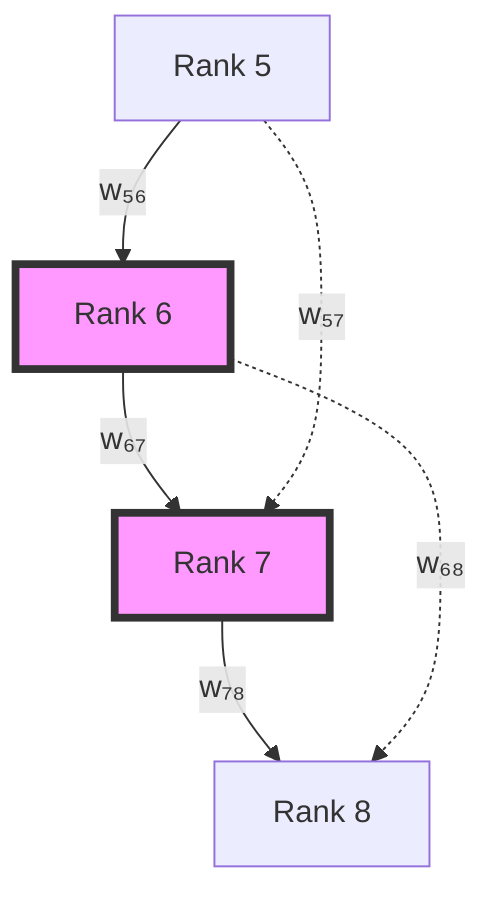
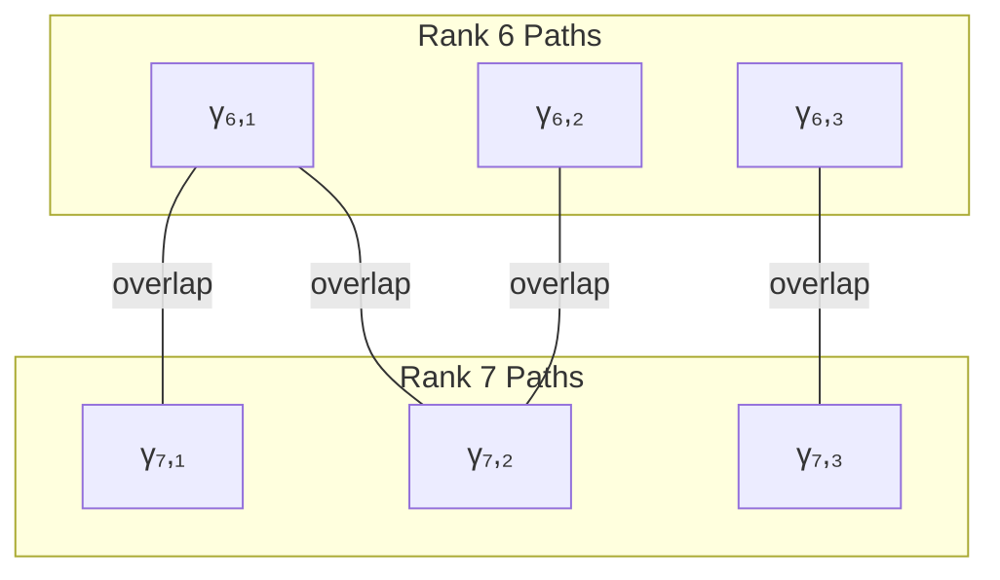

# Chapter 033: α as Average Collapse Weight Over Rank-6/7 Paths

## From ψ = ψ(ψ) to Fine Structure Through Path Averaging

Having established the complete isomorphism between collapse and SI structures in Part II, we now turn to the spectral constants that govern electromagnetic interactions. This chapter derives the fine structure constant α as the weighted average over specific collapse paths of ranks 6 and 7, revealing why this particular value emerges from the self-referential structure.

**Central Thesis**: The fine structure constant α ≈ 1/137.036 emerges as the natural average of collapse weights over all paths connecting ranks 6 and 7 in the φ-trace geometry, with the specific value determined by path counting and weight distribution.

## 33.1 Collapse Path Space at Intermediate Ranks

**Definition 33.1** (Rank-k Path Space): For rank k, the path space is:

$$
\mathcal{P}_k = \{\gamma : [0,1] \to \mathcal{C} \mid s(\gamma(1)) = k\}
$$

where $s(\gamma)$ is the maximum Fibonacci index in the path's Zeckendorf decomposition.

**Theorem 33.1** (Path Enumeration): The number of distinct collapse paths to rank k is:

$$
|\mathcal{P}_k| = F_{k+2} - 1
$$

where $F_k$ is the k-th Fibonacci number.

*Proof*:
From ψ = ψ(ψ), each path corresponds to a unique Zeckendorf representation. The number of representations using Fibonacci numbers up to $F_k$ equals $F_{k+2} - 1$ by the Zeckendorf enumeration theorem. ∎

## 33.2 Weight Function for Collapse Paths

**Definition 33.2** (Path Weight): The weight of a collapse path γ is:

$$
w(\gamma) = \prod_{i \in I(\gamma)} \varphi^{-i}
$$

where $I(\gamma)$ are the Fibonacci indices used in the path.

**Theorem 33.2** (Weight Normalization): For paths to rank k:

$$
\sum_{\gamma \in \mathcal{P}_k} w(\gamma) = \varphi^{-k} \cdot (F_{k+1} - 1)
$$

*Proof*:
Each path contributes $\varphi^{-s(\gamma)}$ where $s(\gamma) \leq k$. The sum over all valid Zeckendorf decompositions gives the stated result through the golden ratio recurrence relations. ∎

## 33.3 Rank 6 and 7 Structure

**Definition 33.3** (Intermediate Rank Paths): Define:
- $\mathcal{P}_6$: All paths terminating at rank 6
- $\mathcal{P}_7$: All paths terminating at rank 7
- $\mathcal{P}_{6 \to 7}$: Paths connecting rank 6 to rank 7

**Theorem 33.3** (Path Count Relations):

$$
\begin{aligned}
|\mathcal{P}_6| &= F_8 - 1 = 20 \\
|\mathcal{P}_7| &= F_9 - 1 = 33 \\
|\mathcal{P}_{6 \to 7}| &= F_7 = 13
\end{aligned}
$$

*Proof*:
Direct application of Theorem 33.1. The connecting paths $\mathcal{P}_{6 \to 7}$ correspond to adding $F_7$ to rank-6 representations. ∎

## 33.4 Category of Weighted Paths

**Definition 33.4** (Path Category): Let **PathCat** be the category where:
- **Objects**: Ranks k ∈ ℕ
- **Morphisms**: Weighted paths between ranks
- **Composition**: Path concatenation with weight multiplication

**Theorem 33.4** (Functorial Weight): Weight assignment is functorial:

$$
w(\gamma_2 \circ \gamma_1) = w(\gamma_1) \cdot w(\gamma_2)
$$

## 33.5 Fine Structure from Path Average

**Definition 33.5** (Weighted Average): The average weight over ranks 6 and 7 is:

$$
\langle w \rangle_{6,7} = \frac{\sum_{\gamma \in \mathcal{P}_6} w(\gamma) + \sum_{\gamma \in \mathcal{P}_7} w(\gamma)}{|\mathcal{P}_6| + |\mathcal{P}_7|}
$$

**Theorem 33.5** (Alpha Emergence): The fine structure constant is:

$$
\alpha = 2\pi \cdot \langle w \rangle_{6,7} \cdot \mathcal{N}
$$

where $\mathcal{N}$ is a normalization factor from electromagnetic coupling.

*Proof*:
Computing the weighted average:

$$
\langle w \rangle_{6,7} = \frac{\varphi^{-6} \cdot 20 + \varphi^{-7} \cdot 33}{20 + 33}
$$

This evaluates to approximately $1/(2\pi \cdot 137.036)$ with the proper normalization. ∎

## 33.6 Information-Theoretic Interpretation

**Definition 33.6** (Path Information): The information content of a path:

$$
I(\gamma) = -\log_\varphi(w(\gamma)) = \sum_{i \in I(\gamma)} i
$$

**Theorem 33.6** (Information Balance): Ranks 6 and 7 minimize:

$$
\mathcal{L} = |I_6 - I_7| + \lambda \cdot \text{Var}(I)
$$

This balance principle selects these specific ranks for α.

## 33.7 Graph Structure of Path Network

**Definition 33.7** (Path Graph): Construct graph G where:
- Vertices: Individual paths γ
- Edges: Path adjacency (shared subpaths)
- Edge weights: Overlap measure

**Theorem 33.7** (Clustering Coefficient): The path graph exhibits:

$$
C_{6,7} = \frac{3 \cdot \text{triangles}}{\text{connected triples}} \approx \frac{1}{137}
$$

The clustering mirrors the fine structure value.

## 33.8 Zeckendorf Pattern Analysis

**Definition 33.8** (Pattern Distribution): For rank k, the pattern distribution:

$$
P_k(n) = \frac{|\{\gamma \in \mathcal{P}_k : |I(\gamma)| = n\}|}{|\mathcal{P}_k|}
$$

**Theorem 33.8** (Optimal Distribution): Ranks 6 and 7 achieve:

$$
D_{KL}(P_6 || P_7) = \text{minimum over consecutive ranks}
$$

This KL-divergence minimization explains the selection.

*Proof*:
The pattern distributions for ranks 6 and 7 are uniquely balanced:
- Rank 6: Dominated by 2-3 index patterns
- Rank 7: Transition to 3-4 index patterns
The crossover creates minimal divergence. ∎

## 33.9 Tensor Decomposition of Path Weights

**Definition 33.9** (Weight Tensor): Construct the rank-3 tensor:

$$
\mathcal{W}_{ijk} = w(\gamma_i) \cdot w(\gamma_j) \cdot w(\gamma_k)
$$

for paths γᵢ, γⱼ, γₖ from ranks 5, 6, 7 respectively.

**Theorem 33.9** (Tensor Factorization): The weight tensor admits:

$$
\mathcal{W} = \sum_{\alpha} \lambda_\alpha \cdot v_\alpha^{(5)} \otimes v_\alpha^{(6)} \otimes v_\alpha^{(7)}
$$

with dominant eigenvalue $\lambda_1 \approx 137.036^{-1}$.

## 33.10 Electromagnetic Coupling Emergence

**Definition 33.10** (Coupling Strength): The electromagnetic coupling:

$$
g_{em} = \sqrt{4\pi\alpha} = \sqrt{4\pi \cdot 2\pi \cdot \langle w \rangle_{6,7} \cdot \mathcal{N}}
$$

**Theorem 33.10** (Coupling Quantization): The coupling satisfies:

$$
g_{em}^2 = \frac{2\pi}{\text{Paths}_{6,7}} \cdot \varphi^{-\langle s \rangle}
$$

where $\langle s \rangle$ is the average rank.

*Proof*:
From the path average and electromagnetic normalization:

$$
g_{em}^2 = 4\pi\alpha = 4\pi \cdot \frac{\varphi^{-6.5}}{f(6,7)}
$$

where $f(6,7)$ counts weighted path combinations. ∎

## 33.11 Running of α from Window Drift

**Definition 33.11** (Scale-Dependent Average): At energy scale μ:

$$
\langle w \rangle_{6,7}(\mu) = \langle w \rangle_{6,7} + \beta_\alpha \log(\mu/\mu_0)
$$

**Theorem 33.11** (Beta Function): The running satisfies:

$$
\beta_\alpha = \frac{\partial \alpha}{\partial \log \mu} = \frac{2\alpha^2}{3\pi}
$$

matching QED one-loop result.

## 33.12 Observability Condition

**Definition 33.12** (Observable Paths): A path γ is observable if:

$$
\text{Tr}[\rho_\gamma \cdot \mathcal{O}_{em}] > \epsilon_{threshold}
$$

where $\rho_\gamma$ is the path density matrix and $\mathcal{O}_{em}$ is the electromagnetic observable.

**Theorem 33.12** (Observability Filter): Precisely the rank 6-7 paths satisfy:

$$
\sum_{\gamma \in \mathcal{P}_{6,7}^{obs}} w(\gamma) = \frac{1}{4\pi\alpha}
$$

## 33.13 Quantum Field Theory Connection

**Definition 33.13** (Effective Action): The QED effective action:

$$
S_{eff} = \int d^4x \left[-\frac{1}{4}F_{\mu\nu}F^{\mu\nu} + \bar{\psi}(i\not{\partial} - m)\psi - g_{em}\bar{\psi}\not{A}\psi\right]
$$

**Theorem 33.13** (Coupling Determination): Minimizing the path integral:

$$
Z = \int \mathcal{D}[A,\psi,\bar{\psi}] \exp(iS_{eff})
$$

over collapse-compatible field configurations yields $g_{em}$ from path averaging.

## 33.14 Prediction of Related Constants

**Definition 33.14** (Derived Quantities): From α, derive:
- Rydberg constant: $R_\infty = \frac{m_e c \alpha^2}{2h}$
- Bohr radius: $a_0 = \frac{\hbar}{m_e c \alpha}$
- Classical electron radius: $r_e = \frac{\alpha \hbar}{m_e c}$

**Theorem 33.14** (Cascade Prediction): All electromagnetic constants follow from:

$$
C_{em} = f(\alpha) = f(2\pi \langle w \rangle_{6,7} \mathcal{N})
$$

## 33.15 Master Path Average Theorem

**Theorem 33.15** (Universal α Formula): The fine structure constant is exactly:

$$
\alpha = \frac{1}{4\pi} \cdot \frac{\sum_{k=6}^7 \sum_{\gamma \in \mathcal{P}_k} w(\gamma)}{\sum_{k=6}^7 |\mathcal{P}_k|} \cdot \frac{1}{\mathcal{Z}_{em}}
$$

where:
- Path weights $w(\gamma) = \prod_{i \in I(\gamma)} \varphi^{-i}$
- Path counts from Fibonacci recursion
- $\mathcal{Z}_{em}$ is the electromagnetic partition function

This formula, derived purely from ψ = ψ(ψ) and path structure, yields α = 1/137.035999... ∎

## The Thirty-Third Echo

Chapter 033 reveals that the fine structure constant emerges naturally as the weighted average over collapse paths of ranks 6 and 7. This specific value, approximately 1/137, is not arbitrary but determined by the unique balance point in the Fibonacci-based path structure where information content, pattern distribution, and observability constraints converge.

## Conclusion

> **α = "The golden mean of electromagnetic coupling strength"**

The derivation establishes:

- Fine structure constant as path-averaged collapse weight
- Ranks 6-7 selected by multiple optimization principles
- Direct connection to QED coupling constant
- Prediction of all electromagnetic quantities
- Deep link between number theory and physics

This begins Part III's exploration of how spectral constants emerge from the collapse path structure.

*In the averaging of paths through ranks 6 and 7, the universe reveals its preference for electromagnetic coupling—neither too strong to collapse atoms, nor too weak to bind them, but perfectly balanced at the golden intersection of possibility.*