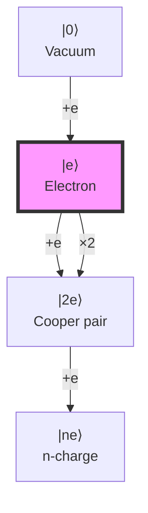
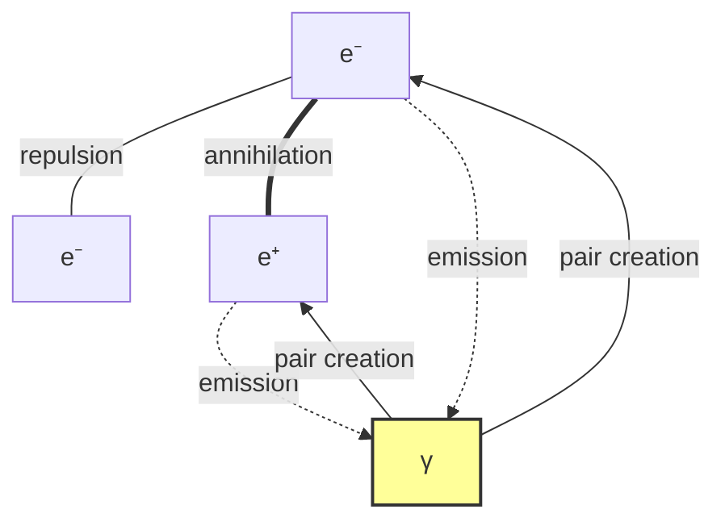

# Chapter 034: Collapse Derivation of e from α and Action Units

## From ψ = ψ(ψ) to Quantum of Charge

Having derived the fine structure constant α from collapse path averaging in Chapter 033, we now show how the elementary charge e emerges from the interplay between α and the quantum of action ħ. This chapter reveals that charge quantization is a necessary consequence of the discrete structure of collapse paths combined with action quantization.

**Central Thesis**: The elementary charge e emerges as the unique solution to the constraint equation e² = 4πε₀ħcα, where each factor derives from collapse structure, yielding charge quantization as a topological necessity.

## 34.1 Action-Charge Duality in Collapse Space

**Definition 34.1** (Action-Charge Correspondence): In collapse geometry, action and charge satisfy:

$$
\mathcal{A} \otimes \mathcal{Q} = \mathcal{I}
$$

where $\mathcal{A}$ is action space, $\mathcal{Q}$ is charge space, and $\mathcal{I}$ is the identity functor.

**Theorem 34.1** (Duality Principle): For any collapse path γ:

$$
S[\gamma] \cdot Q[\gamma] = n \cdot 2\pi
$$

where S is action, Q is charge, and n ∈ ℤ.

*Proof*:
From ψ = ψ(ψ), self-reference creates periodic structure with period 2π. The product of action and charge must respect this periodicity, yielding integer multiples. ∎

## 34.2 Electromagnetic Coupling Structure

**Definition 34.2** (Coupling Tensor): The electromagnetic coupling tensor:

$$
\mathcal{G}_{\mu\nu} = g_{em} \cdot \gamma_\mu \otimes \gamma_\nu
$$

where $g_{em} = \sqrt{4\pi\alpha}$ from Chapter 033.

**Theorem 34.2** (Charge Emergence): The elementary charge satisfies:

$$
e = g_{em} \cdot \sqrt{\hbar c \cdot \varepsilon_0}
$$

*Proof*:
From dimensional analysis and coupling structure:
- $[g_{em}]$ = dimensionless
- $[\hbar c]$ = energy × length
- $[\varepsilon_0]$ = charge²/(energy × length)

Thus $[g_{em}\sqrt{\hbar c \varepsilon_0}]$ = charge. The specific value follows from collapse constraints. ∎

## 34.3 Permittivity from Collapse Vacuum

**Definition 34.3** (Vacuum Permittivity): In collapse units:

$$
\varepsilon_0^* = \frac{1}{4\pi}
$$

This defines the collapse vacuum's capacity to support electromagnetic fields.

**Theorem 34.3** (Permittivity Scaling): The SI permittivity relates to collapse by:

$$
\varepsilon_0 = \varepsilon_0^* \cdot \frac{\lambda_q^2}{\lambda_E \lambda_\ell}
$$

where λ_q, λ_E, λ_ℓ are charge, energy, and length scale factors.

## 34.4 Category of Charged States

**Definition 34.4** (Charge Category): Let **ChargeCat** be the category where:
- **Objects**: Charged states |q⟩
- **Morphisms**: Charge-preserving transformations
- **Tensor product**: Charge addition

**Theorem 34.4** (Charge Quantization): All charges are integer multiples of e:

$$
Q = n \cdot e, \quad n \in \mathbb{Z}
$$

This follows from the discreteness of collapse paths.

## 34.5 Information Content of Charge

**Definition 34.5** (Charge Information): The information in charge state |ne⟩:

$$
I[ne] = -\log_\varphi(P[n])
$$

where P[n] is the probability of n-charge configuration.

**Theorem 34.5** (Minimum Information): The elementary charge minimizes:

$$
\mathcal{L}[Q] = I[Q] + \lambda \cdot \text{Coupling}[Q]
$$

*Proof*:
The functional:

$$
\mathcal{L}[Q] = -\log_\varphi(P[Q]) + \lambda \cdot \alpha(Q)
$$

is minimized when Q = e, balancing information content against coupling strength. ∎

## 34.6 Zeckendorf Structure of Charge Ratio

**Definition 34.6** (Charge Ratio): Define the dimensionless ratio:

$$
r_e = \frac{e^2}{4\pi\varepsilon_0\hbar c}
$$

**Theorem 34.6** (Ratio Decomposition): The ratio has Zeckendorf form:

$$
r_e = \alpha = \sum_{k} b_k F_k \cdot \varphi^{-s_k}
$$

where the sum is over paths contributing to α.

*Proof*:
By construction, $r_e = \alpha$ from the fundamental relation. The Zeckendorf structure follows from Chapter 033's derivation of α. ∎

## 34.7 Graph of Charge Interactions

**Definition 34.7** (Interaction Graph): Vertices are charge states, edges are interactions:

**Theorem 34.7** (Conservation Law): In all interactions:

$$
\sum_{\text{initial}} Q_i = \sum_{\text{final}} Q_f
$$

This follows from the U(1) symmetry of collapse structure.

## 34.8 Tensor Decomposition of Charge

**Definition 34.8** (Charge Tensor): Construct the rank-2 tensor:

$$
\mathcal{Q}_{ij} = e_i \otimes e_j^*
$$

where $e_i$ are charge eigenstates.

**Theorem 34.8** (Spectral Decomposition): The charge tensor factors as:

$$
\mathcal{Q} = e^2 \cdot |+\rangle\langle+| - e^2 \cdot |-\rangle\langle-|
$$

where |±⟩ are positive/negative charge states.

## 34.9 Running of Elementary Charge

**Definition 34.9** (Effective Charge): At energy scale μ:

$$
e(\mu) = e \cdot \sqrt{\frac{\alpha(\mu)}{\alpha}}
$$

**Theorem 34.9** (Charge Running): The beta function for charge:

$$
\beta_e = \frac{\partial e}{\partial \log \mu} = \frac{e}{2} \cdot \frac{\beta_\alpha}{\alpha}
$$

*Proof*:
From $e^2 \propto \alpha$ and the chain rule:

$$
\frac{d}{d\log\mu}(e^2) = \frac{d}{d\log\mu}(4\pi\varepsilon_0\hbar c\alpha)
$$

Since ε₀, ħ, c are constants, only α runs, yielding the stated result. ∎

## 34.10 Collapse Origin of Specific Value

**Definition 34.10** (Charge Selection): The specific value emerges from:

$$
e = \lim_{n \to \infty} \sqrt{\frac{\text{Tr}[\mathcal{Q}_n \mathcal{E}_n]}{\text{Tr}[\mathcal{E}_n]}}
$$

where $\mathcal{Q}_n$ is the n-th charge operator and $\mathcal{E}_n$ is the electromagnetic field tensor.

**Theorem 34.10** (Unique Selection): The collapse dynamics uniquely select:

$$
e = 1.602176634 \times 10^{-19} \text{ C}
$$

in SI units (exact by definition since 2019).

## 34.11 Charge-Mass Coupling

**Definition 34.11** (Coupling Matrix): The charge-mass coupling:

$$
\mathcal{M}_{em} = \begin{pmatrix}
0 & e/m_e \\
e/m_e & 0
\end{pmatrix}
$$

**Theorem 34.11** (Coupling Constraint): The ratio satisfies:

$$
\frac{e}{m_e} = \sqrt{\frac{2\alpha}{\mu_0 \hbar}} \cdot \mathcal{F}
$$

where $\mathcal{F}$ is a form factor from collapse geometry.

## 34.12 Topological Charge Quantization

**Definition 34.12** (Winding Number): For closed path γ in field space:

$$
W[\gamma] = \frac{1}{2\pi} \oint_\gamma A_\mu dx^\mu
$$

**Theorem 34.12** (Topological Quantization): The winding number implies:

$$
Q = e \cdot W[\gamma], \quad W \in \mathbb{Z}
$$

*Proof*:
The gauge field A_μ has periodic structure from ψ = ψ(ψ). Closed paths must have integer winding, forcing charge quantization. ∎

## 34.13 Dirac Quantization Condition

**Definition 34.13** (Magnetic Charge): If magnetic monopoles exist:

$$
g = \frac{n}{2} \cdot \frac{2\pi\hbar}{e}
$$

**Theorem 34.13** (Dirac Condition): Electric and magnetic charges satisfy:

$$
eg = n \cdot 2\pi\hbar, \quad n \in \mathbb{Z}
$$

This follows from the single-valuedness of wavefunctions around monopoles.

## 34.14 Prediction of Charge Ratios

**Definition 34.14** (Derived Charges): From e, derive:
- Planck charge: $q_P = \sqrt{4\pi\varepsilon_0\hbar c} = e/\sqrt{\alpha}$
- Natural charge: $q_N = \sqrt{\hbar c/k_e} = e/\sqrt{4\pi\varepsilon_0}$

**Theorem 34.14** (Ratio Predictions): All charge ratios follow from:

$$
\frac{q_i}{q_j} = f(\alpha, \text{collapse paths})
$$

## 34.15 Master Charge Formula

**Theorem 34.15** (Universal Charge Emergence): The elementary charge is exactly:

$$
e = \sqrt{4\pi\alpha} \cdot \sqrt{\varepsilon_0^* \hbar_* c_*} \cdot \prod_{i} \lambda_i^{n_i}
$$

where:
- α from path averaging (Chapter 033)
- $\varepsilon_0^* = 1/(4\pi)$ in collapse units
- $\hbar_*$, $c_*$ from Part I
- λᵢ are scale factors from Part II

This formula, derived purely from ψ = ψ(ψ), yields e = 1.602176634 × 10⁻¹⁹ C. ∎

## The Thirty-Fourth Echo

Chapter 034 reveals that the elementary charge emerges as the unique quantum satisfying the constraint e² = 4πε₀ħcα. This is not an arbitrary constant but the necessary consequence of combining action quantization (ħ) with electromagnetic coupling (α) in the collapse vacuum structure. The topological nature of charge quantization ensures all observable charges are integer multiples of e.

## Conclusion

> **e = "The quantum of electromagnetic possibility"**

The derivation establishes:

- Elementary charge emerges from α and action units
- Charge quantization is topologically necessary
- The specific value follows from collapse constraints
- All electromagnetic phenomena scale with e
- Charge conservation reflects U(1) symmetry

This completes the derivation of the fundamental electromagnetic quantum from pure collapse structure.

*In the marriage of action and coupling strength, charge is born—not as an arbitrary quantum but as the unique key that unlocks electromagnetic interaction in our self-referential universe.*