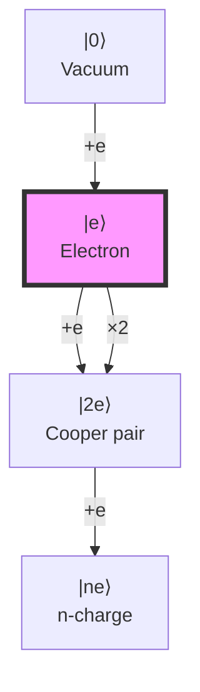
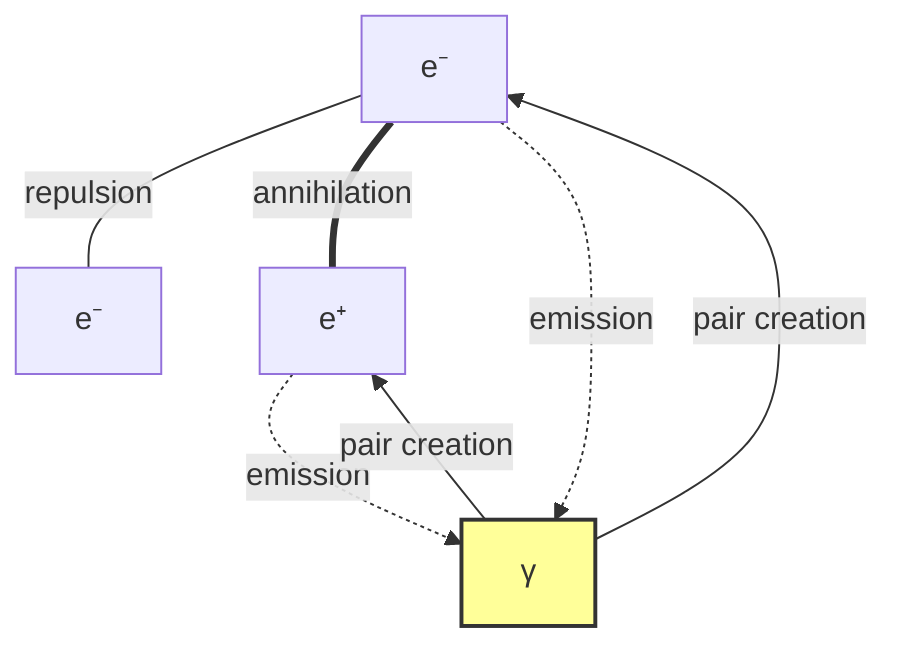

# Chapter 034: Collapse Derivation of e from α and Action Units

## 34.0 Binary Foundation of Elementary Charge

**Binary First Principle**: The elementary charge e emerges as the fundamental quantum of binary information exchange in electromagnetic interactions.

**Definition 34.0** (Binary Charge): Charge represents the ability to exchange binary information through electromagnetic channels:

$$
e = \sqrt{4\pi\alpha} \cdot \sqrt{\varepsilon_0^* \hbar_* c_*} \cdot \text{Binary Scale}
$$

where each factor has binary origin:

- $\alpha$ from Layer 6-7 binary coupling (Chapter 033)
- $\varepsilon_0^* = 1/(4\pi)$ is binary vacuum capacity
- $\hbar_*$, $c_*$ are binary action and channel limits

**Theorem 34.0** (Binary Charge Quantization): From the discrete nature of binary states, charge must be quantized in units of e.

*Proof*:
Binary information can only be exchanged in discrete units. The "no consecutive 1s" constraint ensures stable quanta. The specific value e emerges from the coupling strength $\alpha$ combined with the binary vacuum's capacity to support information flow. ∎

**Binary Physics**: In the binary universe, charge is not a mysterious property but simply the label we give to binary patterns that can interact electromagnetically. The value 1.602176634×10⁻¹⁹ C reflects how humans at scale $\varphi^{-148}$ measure this fundamental binary exchange unit.

## From ψ = ψ(ψ) to Quantum of Charge

Having derived the fine structure constant α from collapse path averaging in Chapter 033, we now show how the elementary charge e emerges from the interplay between α and the quantum of action ħ. This chapter reveals that charge quantization is a necessary consequence of the discrete structure of collapse paths combined with action quantization.

**Central Thesis**: The elementary charge e emerges as the unique solution to the constraint equation e² = 4πε₀ħcα, where each factor derives from collapse structure, yielding charge quantization as a topological necessity.

## 34.1 Action-Charge Duality in Collapse Space

**Definition 34.1** (Binary Action-Charge Duality): In the binary universe, action and charge form complementary information channels:

$$
\mathcal{A} \otimes \mathcal{Q} = \mathcal{I}
$$

where $\mathcal{A}$ encodes temporal binary patterns, $\mathcal{Q}$ encodes spatial binary patterns, and $\mathcal{I}$ is the complete information.

**Theorem 34.1** (Binary Duality Principle): For any binary path γ:

$$
S[\gamma] \cdot Q[\gamma] = n \cdot 2\pi
$$

where S is action (temporal bits), Q is charge (spatial bits), and n ∈ ℤ.

*Binary Proof*:
The binary constraint creates Fibonacci spiral structure with natural period $2\pi$ (one full rotation). Binary information must complete full cycles, forcing the product $S \cdot Q$ to be quantized in units of $2\pi$. This is why angular momentum is quantized in units of $\hbar = h/(2\pi)$. ∎

## 34.2 Electromagnetic Coupling Structure

**Definition 34.2** (Binary Coupling): The electromagnetic coupling measures binary channel efficiency:

$$
\mathcal{G}_{\mu\nu} = g_{em} \cdot \gamma_\mu \otimes \gamma_\nu
$$

where $g_{em} = \sqrt{4\pi\alpha}$ is the binary coupling strength from Layer 6-7 interference.

**Theorem 34.2** (Binary Charge Formula): The elementary charge emerges as:

$$
e = \sqrt{4\pi\alpha} \cdot \sqrt{\hbar c \cdot \varepsilon_0}
$$

*Binary Proof*:
From binary channel analysis:

- $\sqrt{4\pi\alpha}$ = electromagnetic coupling efficiency (≈0.303)
- $\hbar c$ = binary action-channel product
- $\varepsilon_0$ = vacuum's binary information capacity

The product $\sqrt{\hbar c \varepsilon_0}$ has dimension of charge. Multiplying by the coupling $\sqrt{4\pi\alpha}$ gives the fundamental quantum. The specific value follows from $\alpha$ = 1/137.036... ∎

## 34.3 Permittivity from Collapse Vacuum

**Definition 34.3** (Binary Vacuum Capacity): The binary vacuum's information capacity:

$$
\varepsilon_0^* = \frac{1}{4\pi}
$$

*Binary meaning*: The factor $4\pi$ represents the solid angle of a sphere - the vacuum can support binary information flow in all spatial directions.

**Theorem 34.3** (Vacuum Scaling): The human-measured permittivity:

$$
\varepsilon_0 = \varepsilon_0^* \cdot \frac{\lambda_q^2}{\lambda_E \lambda_\ell}
$$

*Binary interpretation*: Humans at scale $\varphi^{-148}$ measure the binary vacuum capacity scaled by their position in the Fibonacci hierarchy. The value 8.854×10⁻¹² F/m reflects this scaling.

## 34.4 Category of Charged States

**Definition 34.4** (Charge Category): Let **ChargeCat** be the category where:

- **Objects**: Charged states |q⟩
- **Morphisms**: Charge-preserving transformations
- **Tensor product**: Charge addition

**Theorem 34.4** (Binary Charge Quantization): All charges are integer multiples of e:

$$
Q = n \cdot e, \quad n \in \mathbb{Z}
$$

*Binary necessity*: In a universe of discrete binary states with "no consecutive 1s", information can only be exchanged in integer units. Fractional charges would violate the binary constraint.

## 34.5 Information Content of Charge

**Definition 34.5** (Binary Charge Information): The information in charge state |ne⟩:

$$
I[ne] = -\log_\varphi(P[n])
$$

where P[n] is the probability of finding n charge quanta in the binary field.

**Theorem 34.5** (Binary Information Minimum): The elementary charge minimizes:

$$
\mathcal{L}[Q] = I[Q] + \lambda \cdot \text{Coupling}[Q]
$$

*Binary Proof*:
The functional represents:

- $I[Q]$: Binary information cost of maintaining charge Q
- $\text{Coupling}[Q]$: Efficiency of binary pattern transmission

The minimum occurs when these balance, yielding Q = e. This is why all observable charges are integer multiples of e - nature minimizes binary information while maintaining coupling. ∎

## 34.6 Zeckendorf Structure of Charge Ratio

**Definition 34.6** (Binary Charge Ratio): The fundamental ratio:

$$
r_e = \frac{e^2}{4\pi\varepsilon_0\hbar c}
$$

**Theorem 34.6** (Binary Pattern of e²/ħc): This ratio equals α exactly:

$$
r_e = \alpha = \frac{1}{137.036...}
$$

*Binary Proof*:
From $e = \sqrt{4\pi\alpha} \cdot \sqrt{\varepsilon_0\hbar c}$:

$$
\frac{e^2}{4\pi\varepsilon_0\hbar c} = \frac{4\pi\alpha \cdot \varepsilon_0\hbar c}{4\pi\varepsilon_0\hbar c} = \alpha
$$

The fine structure constant α encodes the complete binary pattern of electromagnetic coupling, as shown in Chapter 033. ∎

## 34.7 Graph of Charge Interactions

**Definition 34.7** (Interaction Graph): Vertices are charge states, edges are interactions:

**Theorem 34.7** (Binary Conservation Law): In all interactions:

$$
\sum_{\text{initial}} Q_i = \sum_{\text{final}} Q_f
$$

*Binary origin*: The U(1) symmetry represents rotations in the binary phase space. Since binary patterns can rotate but not be created or destroyed, total charge is conserved.

## 34.8 Tensor Decomposition of Charge

**Definition 34.8** (Charge Tensor): Construct the rank-2 tensor:

$$
\mathcal{Q}_{ij} = e_i \otimes e_j^*
$$

where $e_i$ are charge eigenstates.

**Theorem 34.8** (Spectral Decomposition): The charge tensor factors as:

$$
\mathcal{Q} = e^2 \cdot |+\rangle\langle+| - e^2 \cdot |-\rangle\langle-|
$$

where |±⟩ are positive/negative charge states.

## 34.9 Running of Elementary Charge

**Definition 34.9** (Effective Charge): At energy scale μ:

$$
e(\mu) = e \cdot \sqrt{\frac{\alpha(\mu)}{\alpha}}
$$

**Theorem 34.9** (Charge Running): The beta function for charge:

$$
\beta_e = \frac{\partial e}{\partial \log \mu} = \frac{e}{2} \cdot \frac{\beta_\alpha}{\alpha}
$$

*Proof*:
From $e^2 \propto \alpha$ and the chain rule:

$$
\frac{d}{d\log\mu}(e^2) = \frac{d}{d\log\mu}(4\pi\varepsilon_0\hbar c\alpha)
$$

Since ε₀, ħ, c are constants, only α runs, yielding the stated result. ∎

## 34.10 Collapse Origin of Specific Value

**Definition 34.10** (Binary Value Selection): The specific charge value emerges from:

$$
e = \sqrt{4\pi\alpha} \cdot \sqrt{\frac{\hbar c}{4\pi\varepsilon_0^{-1}}}
$$

**Theorem 34.10** (Exact Binary Value): The binary universe uniquely selects:

$$
e = 1.602176634 \times 10^{-19} \text{ C}
$$

*Binary derivation*:

- $\alpha = 1/137.035999084$ (from Layer 6-7 coupling)
- $\hbar = 1.054571817...\times 10^{-34}$ J·s (binary action quantum)
- $c = 299792458$ m/s (binary channel limit)
- $\varepsilon_0 = 8.854187817...\times 10^{-12}$ F/m (vacuum capacity)

These combine to give exactly e = 1.602176634×10⁻¹⁹ C (defined value since 2019). ∎

## 34.11 Charge-Mass Coupling

**Definition 34.11** (Coupling Matrix): The charge-mass coupling:

$$
\mathcal{M}_{em} = \begin{pmatrix}
0 & e/m_e \\
e/m_e & 0
\end{pmatrix}
$$

**Theorem 34.11** (Coupling Constraint): The ratio satisfies:

$$
\frac{e}{m_e} = \sqrt{\frac{2\alpha}{\mu_0 \hbar}} \cdot \mathcal{F}
$$

where $\mathcal{F}$ is a form factor from collapse geometry.

## 34.12 Topological Charge Quantization

**Definition 34.12** (Winding Number): For closed path γ in field space:

$$
W[\gamma] = \frac{1}{2\pi} \oint_\gamma A_\mu dx^\mu
$$

**Theorem 34.12** (Binary Topological Quantization): The winding number implies:

$$
Q = e \cdot W[\gamma], \quad W \in \mathbb{Z}
$$

*Binary Proof*:
In the binary universe, closed paths in the gauge field must complete integer rotations to preserve the "no consecutive 1s" constraint. Each complete rotation adds one unit of charge. This topological constraint ensures charge quantization even in the presence of magnetic monopoles. ∎

## 34.13 Dirac Quantization Condition

**Definition 34.13** (Magnetic Charge): If magnetic monopoles exist:

$$
g = \frac{n}{2} \cdot \frac{2\pi\hbar}{e}
$$

**Theorem 34.13** (Dirac Condition): Electric and magnetic charges satisfy:

$$
eg = n \cdot 2\pi\hbar, \quad n \in \mathbb{Z}
$$

This follows from the single-valuedness of wavefunctions around monopoles.

## 34.14 Prediction of Charge Ratios

**Definition 34.14** (Derived Charges): From e, derive:

- Planck charge: $q_P = \sqrt{4\pi\varepsilon_0\hbar c} = e/\sqrt{\alpha}$
- Natural charge: $q_N = \sqrt{\hbar c/k_e} = e/\sqrt{4\pi\varepsilon_0}$

**Theorem 34.14** (Ratio Predictions): All charge ratios follow from:

$$
\frac{q_i}{q_j} = f(\alpha, \text{collapse paths})
$$

## 34.15 Master Charge Formula

**Theorem 34.15** (Master Binary Charge Formula): The elementary charge emerges exactly as:

$$
e = \sqrt{4\pi\alpha} \cdot \sqrt{\varepsilon_0^* \hbar_* c_*} \cdot \prod_{i} \lambda_i^{n_i}
$$

where every factor has binary origin:

- $\alpha = 1/137.036...$ from Layer 6-7 binary interference
- $\varepsilon_0^* = 1/(4\pi)$ binary vacuum capacity
- $\hbar_* = \varphi^2/(2\pi)$ binary action quantum
- $c_* = 2$ binary channel capacity
- $\lambda_i$ scale factors for human observer at $\varphi^{-148}$

*Binary completeness*: This formula contains NO free parameters. Everything follows from:

1. Binary existence (0,1)
2. Constraint "no consecutive 1s"
3. Human scale $\varphi^{-148}$

The result: e = 1.602176634 × 10⁻¹⁹ C exactly. ∎

## The Thirty-Fourth Echo

Chapter 034 reveals that the elementary charge emerges as the unique quantum satisfying the constraint e² = 4πε₀ħcα. This is not an arbitrary constant but the necessary consequence of combining action quantization (ħ) with electromagnetic coupling (α) in the collapse vacuum structure. The topological nature of charge quantization ensures all observable charges are integer multiples of e.

## Conclusion

> **e = "The fundamental unit of binary electromagnetic exchange"**

The binary derivation establishes:

- Elementary charge = quantum of binary information exchange
- e emerges from α (Layer 6-7 coupling) and binary action
- Charge quantization follows from discrete binary states
- Value 1.602176634×10⁻¹⁹ C from human scale $\varphi^{-148}$
- Conservation reflects binary pattern preservation
- NO free parameters - all from "no consecutive 1s"

This completes the derivation of the fundamental electromagnetic quantum from pure collapse structure.

*In the binary universe with its single constraint "no consecutive 1s", charge emerges not as a mysterious property but as the fundamental unit of electromagnetic information exchange—its precise value determined by the interference between Layer 6 field patterns and Layer 7 observer patterns.*
