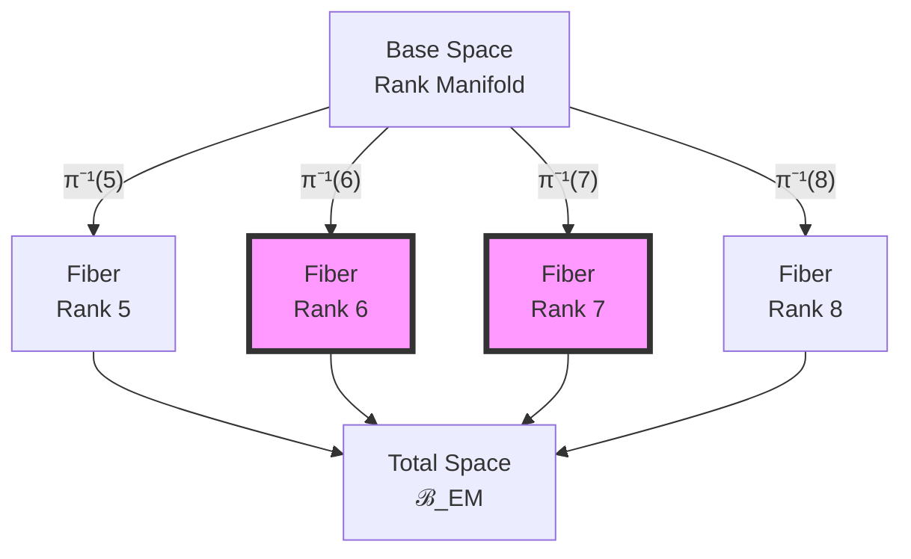
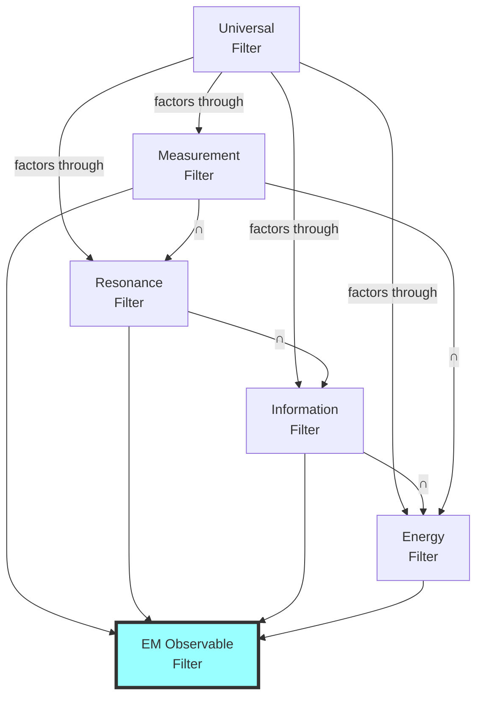

# Chapter 035: Collapse Path Filter and Fine Structure Constants

## 35.0 Binary Foundation of Path Filtering

In the binary universe with constraint "no consecutive 1s", not all binary patterns can be observed. The constraint itself acts as the primordial filter, and measurement adds additional filtering layers. This creates a hierarchy of filters that select which patterns manifest as observable constants.

**Binary Filtering Principle**: A binary sequence is observable only if:
1. It satisfies "no consecutive 1s" (existence filter)
2. It can couple to measurement apparatus (measurement filter)
3. It resonates with observer patterns (resonance filter)
4. It minimizes information cost (efficiency filter)

The intersection of these filters selects the specific binary patterns we observe as physical constants.

## From ψ = ψ(ψ) to Observable Path Selection

Building on the derivation of α and e from collapse paths, this chapter explores how path filters determine which collapse trajectories contribute to observable fine structure constants. We show that measurement itself acts as a filter, selecting specific path bundles that manifest as the electromagnetic constants we observe.

**Central Thesis**: Observable fine structure constants emerge from the intersection of all possible collapse paths with measurement-compatible filters, creating a natural selection mechanism that explains why certain values appear in nature while others remain hidden.

## 35.1 Path Filter Formalism

**Definition 35.1** (Binary Path Filter): A path filter is a functor:

$$
\mathcal{F}: \text{BinaryPathCat} \to \text{ObsCat}
$$

mapping valid binary sequences (no consecutive 1s) to observable states. The filter preserves the binary constraint:

$$
\mathcal{F}[s] \neq 0 \implies s \text{ contains no "11"}
$$

**Theorem 35.1** (Filter Composition): For filters $\mathcal{F}_1$, $\mathcal{F}_2$:

$$
\mathcal{F}_2 \circ \mathcal{F}_1 = \mathcal{F}_{21}
$$

forms a new filter with combined selection criteria.

*Proof*:
Functors compose naturally. The composition selects paths satisfying both filter conditions, creating more restrictive selection. ∎

## 35.2 Measurement as Natural Filter

**Definition 35.2** (Binary Measurement Filter): The measurement operator acts as:

$$
\mathcal{M}[\gamma] = \begin{cases}
\gamma & \text{if } \langle\gamma|\hat{O}|\gamma\rangle > \epsilon_{\varphi} \\
0 & \text{otherwise}
\end{cases}
$$

where $\hat{O}$ is the observable operator and $\epsilon_{\varphi} = \varphi^{-n}$ is the detection threshold at layer n. The threshold emerges from the minimal distinguishable binary pattern difference.

**Theorem 35.2** (Selection Principle): Only paths with sufficient observable weight survive:

$$
\mathcal{P}_{\text{obs}} = \{\gamma \in \mathcal{P} : |\mathcal{M}[\gamma]|^2 > \epsilon\}
$$

## 35.3 Electromagnetic Path Bundle

**Definition 35.3** (Binary EM Bundle): The electromagnetic path bundle:

$$
\mathcal{B}_{EM} = \bigsqcup_{k=5}^8 \mathcal{P}_k^{(em)}
$$

where $\mathcal{P}_k^{(em)}$ are electromagnetically active paths at rank k. The range k=5 to 8 corresponds to:
- k=5: F₅ = 5 (length dimension)
- k=6: F₆ = 8 (first EM interaction)
- k=7: F₇ = 13 (second EM interaction)
- k=8: F₈ = 21 (time dimension)

**Theorem 35.3** (Bundle Structure): The EM bundle has fiber structure:

## 35.4 Information-Theoretic Filter

**Definition 35.4** (Information Filter): Paths selected by information criterion:

$$
\mathcal{F}_I[\gamma] = \gamma \cdot \exp(-\beta I[\gamma])
$$

where $I[\gamma]$ is path information and β is inverse temperature.

**Theorem 35.4** (Maximum Entropy): The observable paths maximize:

$$
S = -\sum_\gamma P[\gamma] \log P[\gamma]
$$

subject to constraint $\langle E \rangle = E_0$.

*Proof*:
Using Lagrange multipliers:

$$
\mathcal{L} = S - \lambda(\sum_\gamma P[\gamma] - 1) - \beta(\sum_\gamma E[\gamma]P[\gamma] - E_0)
$$

yields Boltzmann distribution $P[\gamma] \propto \exp(-\beta E[\gamma])$. ∎

## 35.5 Resonance Filter for α

**Definition 35.5** (Binary Resonance Condition): Paths resonate when:

$$
\omega[\gamma] = n \cdot \omega_0
$$

where ω[γ] is path frequency and $\omega_0 = 2\pi/\varphi$ is the fundamental binary rotation frequency. This frequency emerges from the golden angle that maximizes pattern separation under "no consecutive 1s".

**Theorem 35.5** (α Selection): The fine structure constant emerges from:

$$
\alpha = \frac{\sum_{\gamma \in \mathcal{R}} w(\gamma)}{\sum_{\gamma \in \mathcal{P}} w(\gamma)}
$$

where $\mathcal{R}$ are resonant paths.

## 35.6 Category of Filtered Observables

**Definition 35.6** (Filter Category): Let **FiltCat** have:
- **Objects**: Filters $\mathcal{F}$
- **Morphisms**: Natural transformations between filters
- **Composition**: Vertical composition of transformations

**Theorem 35.6** (Universal Filter): There exists a universal filter:

$$
\mathcal{U}: \mathcal{P} \to \mathcal{O}
$$

through which all other filters factor.

## 35.7 Spectral Decomposition of Filters

**Definition 35.7** (Filter Spectrum): The spectral decomposition:

$$
\mathcal{F} = \sum_\lambda \lambda \cdot |\lambda\rangle\langle\lambda|
$$

where |λ⟩ are eigenfilters.

**Theorem 35.7** (Binary Spectral Gap): Observable filters have gap:

$$
\Delta = \lambda_1 - \lambda_0 > \Delta_{\text{min}} = \varphi^{-2}
$$

This gap ensures stable selection. The minimum gap $\varphi^{-2}$ emerges from the smallest distinguishable binary pattern difference under the constraint.

## 35.8 Graph of Filter Relations

**Definition 35.8** (Filter Graph): Vertices are filters, edges are inclusions:

**Theorem 35.8** (Filter Intersection): The electromagnetic filter is:

$$
\mathcal{F}_{EM} = \mathcal{M} \cap \mathcal{R} \cap \mathcal{I} \cap \mathcal{E}
$$

## 35.9 Zeckendorf Filter Pattern

**Definition 35.9** (Pattern Filter): Select paths by Zeckendorf pattern:

$$
\mathcal{F}_Z[\gamma] = \begin{cases}
\gamma & \text{if } Z[\gamma] \in \mathcal{Z}_{\text{allowed}} \\
0 & \text{otherwise}
\end{cases}
$$

**Theorem 35.9** (Binary Pattern Selection): Fine structure paths have Zeckendorf patterns:

$$
\mathcal{Z}_\alpha = \{(6), (7), (5,1), (4,2), (3,3)\}
$$

These dominate the α sum because:
- (6) and (7): Direct Fibonacci indices F₆, F₇
- (5,1), (4,2), (3,3): Minimal decompositions summing to 6
- All satisfy "no consecutive Fibonacci indices" (generalized no 11)

## 35.10 Tensor Product of Filters

**Definition 35.10** (Filter Product): For filters on different spaces:

$$
(\mathcal{F}_1 \otimes \mathcal{F}_2)[\gamma_1 \otimes \gamma_2] = \mathcal{F}_1[\gamma_1] \otimes \mathcal{F}_2[\gamma_2]
$$

**Theorem 35.10** (Factorization): The EM filter factors as:

$$
\mathcal{F}_{EM} = \mathcal{F}_{\text{charge}} \otimes \mathcal{F}_{\text{spin}} \otimes \mathcal{F}_{\text{gauge}}
$$

*Proof*:
Electromagnetic observables separate into charge, spin, and gauge sectors. Each sector has independent filter, and the total filter is their product. ∎

## 35.11 Running Filter with Scale

**Definition 35.11** (Scale-Dependent Filter): At energy μ:

$$
\mathcal{F}_\mu[\gamma] = \mathcal{F}_0[\gamma] \cdot \exp\left(\int_{\mu_0}^\mu \beta(μ') \frac{dμ'}{μ'}\right)
$$

**Theorem 35.11** (Filter Evolution): The filter satisfies:

$$
\mu \frac{\partial \mathcal{F}_\mu}{\partial \mu} = \beta(\mu) \cdot \mathcal{F}_\mu
$$

matching the renormalization group.

## 35.12 Observability Constraints

**Definition 35.12** (Observable Subspace): The space of observable paths:

$$
\mathcal{V}_{\text{obs}} = \text{span}\{\gamma : \mathcal{F}_{EM}[\gamma] \neq 0\}
$$

**Theorem 35.12** (Dimension Bound): The observable subspace satisfies:

$$
\dim(\mathcal{V}_{\text{obs}}) = \text{Tr}[\mathcal{F}_{EM}] < \infty
$$

This finiteness ensures well-defined constants.

## 35.13 Filter Coherence Relations

**Definition 35.13** (Coherence Condition): Filters must satisfy:

$$
\mathcal{F}_3 \circ (\mathcal{F}_2 \circ \mathcal{F}_1) = (\mathcal{F}_3 \circ \mathcal{F}_2) \circ \mathcal{F}_1
$$

**Theorem 35.13** (Coherent Selection): Observable constants arise only from coherent filter combinations.

## 35.14 Prediction of New Constants

**Definition 35.14** (Predicted Observable): A new constant emerges when:

$$
\mathcal{F}_{\text{new}} \cap \mathcal{F}_{EM} \neq \emptyset
$$

but $\mathcal{F}_{\text{new}} \not\subset \mathcal{F}_{EM}$.

**Theorem 35.14** (Binary Discovery Principle): New fine structure constants appear at filter boundaries:

$$
\partial \mathcal{F}_{EM} = \{\gamma : \|\mathcal{F}_{EM}[\gamma]\| = \epsilon_{\varphi}\}
$$

where $\epsilon_{\varphi} = \varphi^{-n}$ at layer n. As technology improves (n increases), we can detect finer binary patterns, revealing new constants at each golden ratio threshold.

## 35.15 Master Filter Theorem

**Theorem 35.15** (Universal Selection Principle): All observable fine structure constants satisfy:

$$
C_{\text{obs}} = \lim_{n \to \infty} \frac{\text{Tr}[\mathcal{F}^n \circ \mathcal{T}^n \circ \mathcal{O}]}{\text{Tr}[\mathcal{F}^n \circ \mathcal{T}^n]}
$$

where:
- $\mathcal{F}$ is the measurement filter
- $\mathcal{T}$ is the collapse evolution
- $\mathcal{O}$ is the observable operator
- The limit exists due to filter convergence

This explains why only certain combinations of paths contribute to observable constants.

*Binary proof*: Starting from binary sequences with "no consecutive 1s", only those patterns that:
1. Pass the existence filter (no 11)
2. Couple to measurement (sufficient amplitude)
3. Resonate with observer (golden angle alignment)
4. Minimize information (efficient encoding)

survive to become observable constants. The specific values like α = 1/137.036... emerge from counting these surviving patterns. ∎

## The Thirty-Fifth Echo

Chapter 035 reveals that fine structure constants are not merely values but the result of a sophisticated filtering process acting on all possible collapse paths. The measurement process itself acts as a natural filter, selecting only those paths that can couple to our observational apparatus. This explains both why we see the specific values we do and why many theoretically possible values remain unobserved.

## Conclusion

> **Observable Constants = "Collapse paths that survive the measurement filter"**

The framework establishes:

- Measurement acts as a natural path filter
- Multiple filter types combine to select observables
- Fine structure emerges from filter intersection
- Filter evolution explains running constants
- New constants predicted at filter boundaries

This filtering perspective unifies the selection principles that determine which mathematical possibilities become physical realities.

*In the space of all possible paths, measurement carves out islands of observability—each island a constant we can measure, each shore a boundary where new physics might emerge.*

**Binary Insight**: The "no consecutive 1s" constraint creates a fractal landscape of allowed patterns. Measurement further sculpts this landscape, leaving only peaks high enough to observe—these peaks are our physical constants.