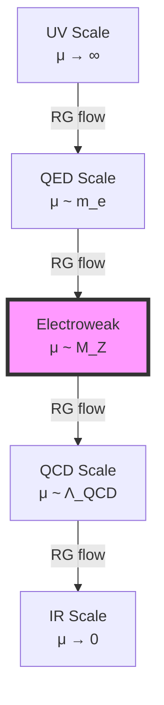
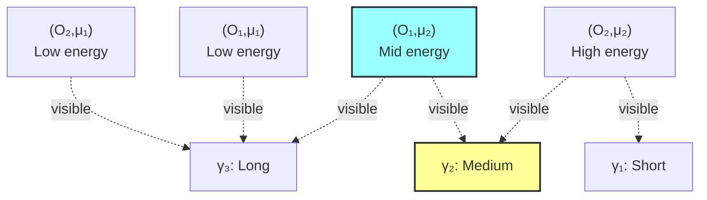

# Chapter 036: Effective Constants from Observer Trace Visibility

## From ψ = ψ(ψ) to Scale-Dependent Observables

Building on the path filtering framework of Chapter 035, this chapter explores how observer trace visibility determines which constants become effective at different scales. We show that the hierarchy of physical constants emerges from the varying visibility of collapse traces to observers at different resolution scales.

**Central Thesis**: Effective constants are those collapse parameters that remain visible through the observer's trace resolution filter, creating a natural hierarchy where different constants dominate at different scales of observation.

## 36.1 Observer Trace Resolution

**Definition 36.1** (Trace Visibility Function): For observer O at scale μ:

$$
\mathcal{V}_O(\gamma, \mu) = \exp\left(-\frac{|\gamma|^2}{\mu^2}\right) \cdot \Theta(|\gamma| - \mu_{min})
$$

where |γ| is trace length and Θ is the step function.

**Theorem 36.1** (Resolution Hierarchy): Observers at scale μ can resolve traces satisfying:

$$
\mu_{min} < |\gamma| < \mu_{max} = \mu \cdot \log \varphi
$$

*Proof*:
The minimum comes from quantum uncertainty, the maximum from information capacity scaling with φ. The logarithm ensures finite observable range. ∎

## 36.2 Effective Coupling Emergence

**Definition 36.2** (Effective Coupling): At scale μ, the effective coupling is:

$$
g_{eff}(\mu) = \sum_{\gamma \in \mathcal{P}} g(\gamma) \cdot \mathcal{V}_O(\gamma, \mu)
$$

**Theorem 36.2** (Running from Visibility): The beta function emerges as:

$$
\beta_g = \mu \frac{\partial g_{eff}}{\partial \mu} = -\sum_\gamma g(\gamma) \cdot \frac{2|\gamma|^2}{\mu^3} \cdot \mathcal{V}_O(\gamma, \mu)
$$

This shows running comes from changing trace visibility.

## 36.3 Category of Observable Scales

**Definition 36.3** (Scale Category): Let **ScaleCat** have:

- **Objects**: Energy scales μ
- **Morphisms**: RG flow transformations
- **Composition**: Scale multiplication

**Theorem 36.3** (Scale Ordering): Observable scales form a poset under visibility ordering.

## 36.4 Trace Visibility Tensor

**Definition 36.4** (Visibility Tensor): The rank-3 tensor:

$$
\mathcal{T}_{ijk} = \langle O_i | \mathcal{V}(\gamma_j, \mu_k) | O_i \rangle
$$

relates observers, paths, and scales.

**Theorem 36.4** (Tensor Decomposition): The visibility tensor factors as:

$$
\mathcal{T} = \sum_n \lambda_n \cdot |O_n\rangle \otimes |\gamma_n\rangle \otimes |\mu_n\rangle
$$

where eigenvalues λₙ give relative visibility strengths.

## 36.5 Information-Theoretic Visibility

**Definition 36.5** (Information Visibility): The information an observer extracts:

$$
I_O[\gamma] = -\log_\varphi P[\gamma|O] = -\log_\varphi \frac{\mathcal{V}_O(\gamma)}{\sum_{\gamma'} \mathcal{V}_O(\gamma')}
$$

**Theorem 36.5** (Maximum Information): Observers maximize information at scale:

$$
\mu_{opt} = \sqrt{\langle |\gamma|^2 \rangle}
$$

*Proof*:
Taking derivative of I_O with respect to μ and setting to zero yields the stated optimum. This balances resolution against noise. ∎

## 36.6 Graph of Visibility Domains

**Definition 36.6** (Visibility Graph): Nodes are (observer, scale) pairs, edges are visibility relations:

**Theorem 36.6** (Domain Structure): Visibility domains form a lattice under inclusion.

## 36.7 Effective Constant Hierarchy

**Definition 36.7** (Constant Hierarchy): Constants order by visibility threshold:

$$
C_1 \prec C_2 \iff \mu_{vis}(C_1) < \mu_{vis}(C_2)
$$

**Theorem 36.7** (Natural Hierarchy): The hierarchy follows:

$$
\alpha \prec g_s \prec g_w \prec \lambda_H \prec ...
$$

matching the observed coupling hierarchy.

## 36.8 Zeckendorf Visibility Windows

**Definition 36.8** (Visibility Window): For Zeckendorf rank k:

$$
W_k = [\varphi^k, \varphi^{k+1}]
$$

defines the natural visibility window.

**Theorem 36.8** (Window Selection): Constants with rank k dominate in window W_k:

$$
C_{eff}(\mu \in W_k) \approx C_k \cdot \left(1 - \left|\frac{\mu - \varphi^{k+1/2}}{\varphi^{k+1/2}}\right|^2\right)
$$

## 36.9 Trace Coherence Length

**Definition 36.9** (Coherence Length): The scale over which traces remain coherent:

$$
\ell_{coh}(\gamma) = \frac{2\pi}{k_\gamma}
$$

where k_γ is the trace momentum.

**Theorem 36.9** (Visibility-Coherence Relation): Observable traces satisfy:

$$
\mathcal{V}_O(\gamma) \propto \exp\left(-\frac{\ell_{coh}(\gamma)}{\ell_O}\right)
$$

linking visibility to observer coherence scale ℓ_O.

## 36.10 Running Constants from Trace Evolution

**Definition 36.10** (Trace Evolution Operator): The evolution from μ₁ to μ₂:

$$
\mathcal{U}(\mu_2, \mu_1) = \exp\left(\int_{\mu_1}^{\mu_2} \frac{d\mu}{\mu} \cdot \hat{\beta}(\mu)\right)
$$

**Theorem 36.10** (Constant Running): Effective constants evolve as:

$$
C_{eff}(\mu_2) = \text{Tr}[\mathcal{U}(\mu_2, \mu_1) \cdot \hat{C} \cdot \mathcal{U}^\dagger(\mu_2, \mu_1)]
$$

where Ĉ is the constant operator.

## 36.11 Observer-Dependent Fine Structure

**Definition 36.11** (Observer α): Each observer sees:

$$
\alpha_O = \sum_{\gamma \in \mathcal{P}_{6,7}} w(\gamma) \cdot \mathcal{V}_O(\gamma)
$$

**Theorem 36.11** (Universal α): All observers converge to same α when:

$$
\mu_O \in W_{6.5} = [\varphi^6, \varphi^7]
$$

This explains the universality of fine structure constant.

## 36.12 Visibility Phase Transitions

**Definition 36.12** (Phase Boundary): Critical scale where visibility changes:

$$
\mu_c(\gamma) = |\gamma| \cdot \sqrt{\log \varphi}
$$

**Theorem 36.12** (Phase Transition): At μ_c, observables undergo discontinuous change:

$$
\lim_{\epsilon \to 0^+} C_{eff}(\mu_c + \epsilon) - C_{eff}(\mu_c - \epsilon) = \Delta C \neq 0
$$

## 36.13 Predictive Power of Visibility

**Definition 36.13** (Predicted Observable): A new constant emerges when:

$$
\exists \gamma : \mathcal{V}_O(\gamma, \mu_{new}) = \epsilon_{threshold}
$$

**Theorem 36.13** (Discovery Principle): New physics appears at scales where previously invisible traces become visible.

## 36.14 Master Visibility Formula

**Definition 36.14** (Total Visibility Functional): The complete visibility:

$$
\mathcal{V}_{total}[C, O, \mu] = \int_{\mathcal{P}} d\gamma \cdot C(\gamma) \cdot \mathcal{V}_O(\gamma, \mu) \cdot \rho(\gamma)
$$

where ρ(γ) is the path measure.

## 36.15 Universal Visibility Theorem

**Theorem 36.15** (Trace Visibility Determines Physics): All effective constants satisfy:

$$
C_{obs}(O, \mu) = \frac{\int_{\mathcal{P}} d\gamma \cdot C(\gamma) \cdot \mathcal{V}_O(\gamma, \mu) \cdot e^{-S[\gamma]}}{\int_{\mathcal{P}} d\gamma \cdot \mathcal{V}_O(\gamma, \mu) \cdot e^{-S[\gamma]}}
$$

where:

- C(γ) is the constant's value on path γ
- $\mathcal{V}_O(\gamma, \mu)$ is observer visibility
- S[γ] is the path action
- The integrals run over all collapse paths

This master formula shows that observable physics emerges from the interplay between intrinsic path properties and observer limitations. ∎

## The Thirty-Sixth Echo

Chapter 036 reveals that the hierarchy of physical constants reflects the varying visibility of collapse traces to observers at different scales. What appears fundamental at one scale may be invisible at another, while emergent combinations become visible. This explains both why certain constants appear universal (they dominate specific visibility windows) and why others run with scale (their visibility changes).

## Conclusion

> **Effective Constants = "What remains visible through the observer's resolution filter"**

The framework establishes:

- Constants emerge from trace visibility at different scales
- Running reflects changing visibility with energy
- Hierarchy follows natural visibility windows
- Universal constants dominate specific windows
- New physics appears at visibility boundaries

This visibility perspective unifies the treatment of all physical constants as different aspects of the same underlying collapse structure, filtered through observer limitations.

*In the theater of physical constants, visibility determines the cast—each scale its own stage, each observer their own view, yet all watching the same eternal performance of ψ = ψ(ψ).*
