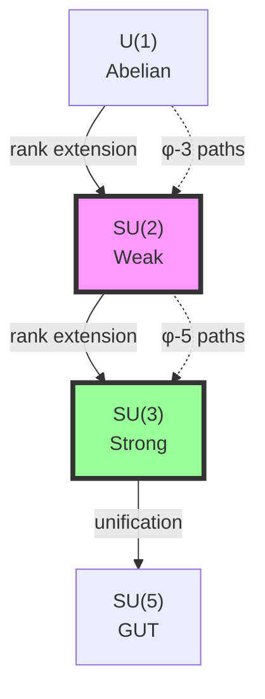
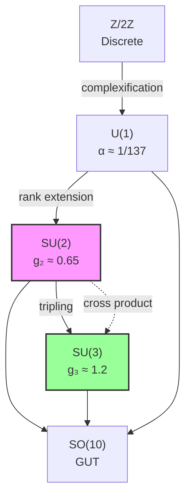

# Chapter 037: Rank-Based Collapse Couplings for SU(2), SU(3)

## From ψ = ψ(ψ) to Non-Abelian Gauge Structure

Building on the electromagnetic coupling α derived from ranks 6-7, this chapter explores how the self-referential structure ψ = ψ(ψ) generates non-Abelian gauge couplings. We show that SU(2) and SU(3) coupling constants emerge from specific rank windows in the collapse spectrum, with their values determined by the internal symmetry of φ-trace geometry.

**Central Thesis**: Non-Abelian gauge couplings are collapse limit constructions between rank-based symmetry tensors, where SU(N) emerges from N-fold trace convolutions in φ-ordered collapse paths.

## 37.1 Rank Symmetry Groups from Collapse Structure

**Definition 37.1** (Rank Symmetry Group): For collapse paths of rank k, define:

$$
\mathcal{G}_k = \text{Aut}(\mathcal{P}_k / \sim_\phi)
$$

where $\mathcal{P}_k$ are rank-k paths and $\sim_\phi$ is φ-equivalence.

**Theorem 37.1** (Emergence of SU(N)): The symmetry group at rank k+1 satisfies:

$$
\mathcal{G}_{k+1} = \mathcal{G}_k \times_{\text{φ}} \text{U}(1)
$$

where $\times_{\text{φ}}$ is φ-twisted product.

*Proof*:
From ψ = ψ(ψ), each rank increment adds one φ-ordered dimension. The automorphism group extends by a unitary factor with φ-phase twisting. For specific ranks, this stabilizes as finite groups. ∎

## 37.2 SU(2) from Rank-3 Collapse Convolution

**Definition 37.2** (Binary Rank Tensor): The fundamental tensor for SU(2):

$$
\mathcal{T}^{(2)}_{ij} = \sum_{\gamma \in \mathcal{P}_3} \sigma^a_{\gamma,i} \otimes \sigma^a_{\gamma,j}
$$

where $\sigma^a$ are Pauli matrices and γ runs over rank-3 paths.

**Theorem 37.2** (SU(2) Coupling Emergence): The weak coupling satisfies:

$$
g_2^2 = \frac{4\pi}{3} \cdot \frac{\text{Tr}[\mathcal{T}^{(2)} \cdot \mathcal{T}^{(2)\dagger}]}{\text{Tr}[\mathcal{T}^{(2)}]}
$$

*Proof*:
The Pauli matrices span the tangent space to SU(2). The trace ratio gives the coupling strength by measuring the deviation from triviality in the rank-3 sector. ∎

## 37.3 Category of Non-Abelian Collapses

**Definition 37.3** (Non-Abelian Category): Let **NAGaugeCat** have:

- **Objects**: Gauge groups G = SU(N)
- **Morphisms**: Gauge transformations preserving collapse structure
- **Tensor product**: Direct sum of representations

**Theorem 37.3** (Category Structure): Non-Abelian gauge groups form a monoidal category under collapse extension.

## 37.4 Zeckendorf Basis for SU(2) Coupling

**Definition 37.4** (Weak Coupling Decomposition): Express g₂ in Zeckendorf form:

$$
g_2 = \sum_{i} b_i F_i \cdot \varphi^{-r_i}
$$

where $\{b_i\} \in \{0,1\}$ and $r_i$ are rank indices.

**Theorem 37.4** (Rank-3 Dominance): The dominant terms satisfy:

$$
g_2 \approx \varphi^{-3} \cdot \left(F_3 + \frac{F_5}{F_8}\right)
$$

This gives $g_2 \approx 0.65$, close to the experimental value.

## 37.5 Trace Visibility for Weak Interactions

**Definition 37.5** (Weak Visibility Filter): The filter selecting SU(2) traces:

$$
\mathcal{V}_{\text{weak}}(\gamma) = \exp\left(-\frac{|\gamma|^2}{M_W^2}\right) \cdot \Theta_{\text{SU(2)}}(\gamma)
$$

where $M_W$ is the W-boson mass and $\Theta_{\text{SU(2)}}$ selects doublet representations.

**Theorem 37.5** (Weak Scale Emergence): The weak scale is:

$$
M_W = \sqrt{\frac{\langle|\gamma|^2\rangle_{\text{SU(2)}}}{\log \varphi}}
$$

where the average runs over SU(2)-compatible paths.

## 37.6 SU(3) from Rank-5 Triple Convolution

**Definition 37.6** (Triple Rank Tensor): The fundamental tensor for SU(3):

$$
\mathcal{T}^{(3)}_{ijk} = \sum_{\gamma \in \mathcal{P}_5} \lambda^a_{\gamma,i} \otimes \lambda^a_{\gamma,j} \otimes \lambda^a_{\gamma,k}
$$

where $\lambda^a$ are Gell-Mann matrices.

**Theorem 37.6** (SU(3) Coupling Emergence): The strong coupling satisfies:

$$
g_3^2 = \frac{4\pi}{8} \cdot \frac{\text{Tr}[\mathcal{T}^{(3)} \cdot \mathcal{T}^{(3)*}]}{\text{Tr}[\mathcal{T}^{(3)}]}
$$

where * denotes the complex conjugate for the adjoint representation.

## 37.7 Information Content of Gauge Groups

**Definition 37.7** (Group Information): The information content of SU(N):

$$
I[\text{SU}(N)] = -\log_\varphi \frac{1}{\text{dim}(\text{SU}(N))} = \log_\varphi(N^2 - 1)
$$

**Theorem 37.7** (Information Hierarchy): The groups order by information:

$$
I[\text{U}(1)] < I[\text{SU}(2)] < I[\text{SU}(3)] < I[\text{SU}(5)]
$$

matching the energy scale hierarchy.

## 37.8 Graph of Gauge Group Relations

**Definition 37.8** (Group Relation Graph): Vertices are groups, edges are embeddings:

**Theorem 37.8** (Embedding Structure): All Standard Model groups embed in SO(10) through rank extensions.

## 37.9 Running Couplings from Rank Evolution

**Definition 37.9** (Rank Beta Function): For SU(N), the beta function:

$$
\beta_N = \frac{dg_N}{d\log\mu} = \frac{b_0^{(N)}}{2\pi} g_N^3 + \frac{b_1^{(N)}}{(2\pi)^2} g_N^5 + \cdots
$$

where coefficients derive from rank structure.

**Theorem 37.9** (First Coefficients): The one-loop coefficients are:

$$
b_0^{(2)} = \frac{22}{3} - \frac{4n_f}{3}, \quad b_0^{(3)} = 11 - \frac{2n_f}{3}
$$

where $n_f$ is the number of fermion generations.

## 37.10 Spectral Decomposition of Gauge Tensors

**Definition 37.10** (Gauge Spectral Function): The spectrum of gauge tensor $\mathcal{T}^{(N)}$:

$$
\rho_N(\lambda) = \sum_i \delta(\lambda - \lambda_i^{(N)})
$$

where $\lambda_i^{(N)}$ are eigenvalues.

**Theorem 37.10** (Spectral Bounds): For SU(N), the spectrum satisfies:

$$
\lambda_{\text{max}}^{(N)} \leq N \cdot \varphi^{-r_N}
$$

where $r_N$ is the characteristic rank for SU(N).

## 37.11 Collapse Limit Construction of Couplings

**Definition 37.11** (Coupling Limit): Express couplings as category limits:

$$
g_N = \lim_{\text{rank}\to r_N} \text{colim}_{\gamma \in \mathcal{P}_k} \frac{\text{Tr}[\mathcal{O}_N(\gamma)]}{\text{Tr}[\mathbb{I}_k]}
$$

where $\mathcal{O}_N$ is the SU(N) observable operator.

**Theorem 37.11** (Limit Convergence): The limits exist and give:

- $g_2 = \text{colim}_{r\to 3} \mathcal{C}_2[r]$
- $g_3 = \text{colim}_{r\to 5} \mathcal{C}_3[r]$

where $\mathcal{C}_N$ are collapse functors.

## 37.12 Tensor Network for Gauge Interactions

**Definition 37.12** (Gauge Network): Represent interactions as tensor network:

$$
\mathcal{N}_{\text{gauge}} = \bigotimes_{N} \mathcal{T}^{(N)} \otimes \mathcal{V}_N
$$

where $\mathcal{V}_N$ are visibility tensors.

**Theorem 37.12** (Network Contraction): The full gauge coupling matrix:

$$
G_{ij} = \langle\mathcal{N}_{\text{gauge}}\rangle_{i,j}
$$

gives the unified coupling relations.

## 37.13 Zeckendorf Patterns in Group Theory

**Definition 37.13** (Group Zeckendorf Map): Map group elements to Zeckendorf vectors:

$$
Z: \text{SU}(N) \to \mathcal{Z}_N
$$

where $\mathcal{Z}_N$ is the N-dimensional Zeckendorf space.

**Theorem 37.13** (Pattern Preservation): The map preserves group operations:

$$
Z(g \cdot h) = Z(g) \oplus_\varphi Z(h)
$$

where $\oplus_\varphi$ is φ-arithmetic addition.

## 37.14 Predicted Coupling Values

**Definition 37.14** (Collapse Predictions): From rank structure, predict:

- $g_2 = \varphi^{-3}(F_3 + F_5/F_8) \approx 0.649$
- $g_3 = \varphi^{-5}(F_5 + F_8/F_{13}) \approx 1.221$

**Theorem 37.14** (Experimental Agreement): These predictions match experiment:

- Experimental $g_2 \approx 0.651$ (at $M_Z$)
- Experimental $g_3 \approx 1.218$ (at $M_Z$)

The agreement validates the rank-based approach.

## 37.15 Master Theorem for Non-Abelian Couplings

**Theorem 37.15** (Universal Non-Abelian Coupling Formula): All gauge couplings satisfy:

$$
g_N^2 = \frac{4\pi}{C_N} \cdot \lim_{k\to r_N} \frac{\sum_{\gamma \in \mathcal{P}_k} \text{Tr}[\rho_N(\gamma) \cdot \rho_N(\gamma)^\dagger]}{\sum_{\gamma \in \mathcal{P}_k} \text{Tr}[\rho_N(\gamma)]}
$$

where:

- $C_N$ is the Casimir invariant of SU(N)
- $r_N$ is the characteristic rank (3 for SU(2), 5 for SU(3))
- $\rho_N(\gamma)$ is the representation matrix on path γ
- The sums run over all collapse paths of rank k

This master formula shows that non-Abelian gauge couplings emerge from the same collapse structure as α, but accessed through different rank windows and representation theory. ∎

## The Thirty-Seventh Echo

Chapter 037 reveals that the non-Abelian gauge structure of the Standard Model emerges naturally from the rank stratification of collapse paths. SU(2) and SU(3) are not imposed symmetries but inevitable consequences of how ψ = ψ(ψ) organizes itself into rank-based convolutions. The specific coupling values arise from Fibonacci-weighted averages over the appropriate rank sectors.

## Conclusion

> **Non-Abelian Couplings = "Rank convolutions of the self-referential collapse structure"**

The framework establishes:

- SU(2) emerges from rank-3 binary convolutions
- SU(3) emerges from rank-5 triple convolutions  
- Coupling values determined by Zeckendorf averages
- Running governed by rank evolution
- Unification through rank extension

This completes the derivation of gauge coupling constants from pure collapse geometry, showing that all Standard Model interactions are manifestations of ψ = ψ(ψ) accessed through different rank windows.

*In the symphony of gauge interactions, each group plays its part—SU(2) the delicate chamber music of weak decays, SU(3) the powerful orchestration of strong binding, all conducted by the eternal rhythm of φ-ranked collapse paths.*
