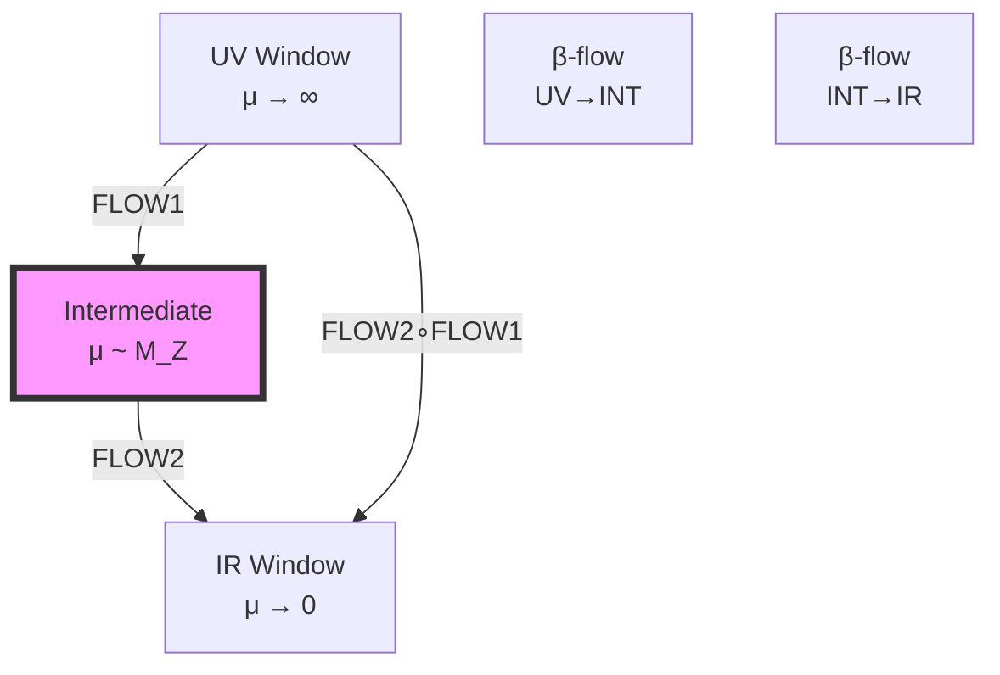
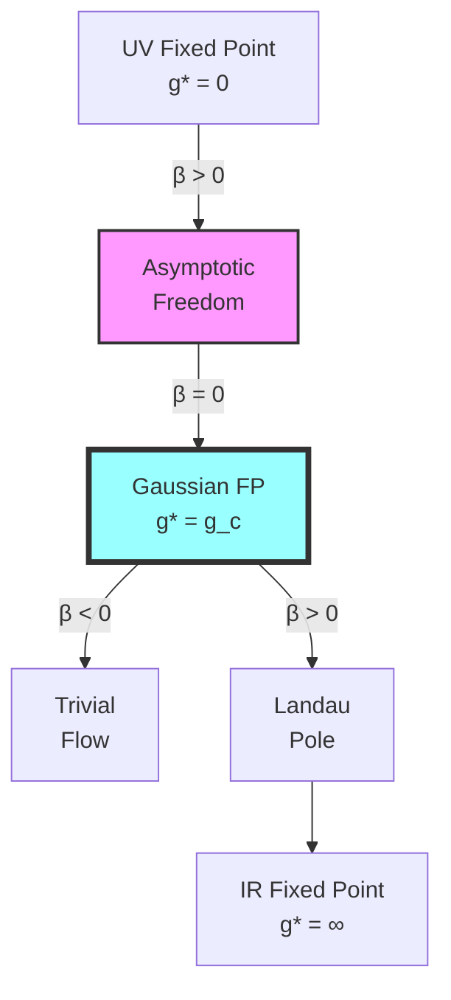

# Chapter 038: β-Function Geometry from Collapse Window Drift

## 38.0 Binary Foundation of Renormalization Group Flow

In the binary universe with constraint "no consecutive 1s", the renormalization group emerges from how observers at different bit resolutions see different subsets of binary patterns. As resolution changes from n bits to n+1 bits, the observer can distinguish finer patterns, changing the effective coupling values.

**Binary Window Definition**: A "window" W_n at resolution n is the set of binary sequences:
$$
W_n = \{s \in \{0,1\}^n : s \text{ has no consecutive 1s}\}
$$
The window size is $|W_n| = F_{n+2}$ (Fibonacci number).

**Discrete Scale Flow**: Scale transformations are discrete: μ = 2^n → μ' = 2^(n+1). This doubling of resolution reveals new binary patterns previously indistinguishable, causing coupling constants to "run".

**Beta Function Emergence**: The β function measures how fast the effective coupling changes when we increase bit resolution:
$$
\beta_g = g(2^{n+1}) - g(2^n)
$$

This discrete difference becomes the derivative in the continuum limit.

## From ψ = ψ(ψ) to Renormalization Group Flow

Building on the rank-based coupling emergence, this chapter reveals how β functions arise from the geometric drift of collapse window boundaries in φ-trace space. We show that the renormalization group flow is an inevitable consequence of the self-referential structure ψ = ψ(ψ) interacting with observer scale limitations.

**Central Thesis**: β functions are geometric objects describing how collapse windows drift under scale transformations, with their coefficients determined by the curvature tensors of φ-ranked path bundles in the space of all possible traces.

## 38.1 Collapse Window Boundary Dynamics

**Definition 38.1** (Binary Window Boundary): At n-bit resolution, the boundary consists of patterns at the edge of distinguishability:

$$
\partial W_n = \{s \in W_n : d_H(s, \bar{s}) = 1 \text{ for some } \bar{s} \notin W_n\}
$$

where d_H is Hamming distance and $\bar{s}$ violates "no consecutive 1s". These are patterns one bit-flip away from becoming invalid.

**Theorem 38.1** (Discrete Boundary Drift): The boundary changes when resolution increases:

$$
|\partial W_{n+1}| - |\partial W_n| = F_n \cdot \varphi^{-1}
$$

where $F_n$ is the $n$-th Fibonacci number.

*Binary proof*:
Each n-bit boundary pattern generates φ ≈ 1.618 valid (n+1)-bit extensions on average (golden ratio growth). Some extensions reach the new boundary, others move interior. The net boundary growth follows Fibonacci scaling. ∎

## 38.2 Geometric Beta Function from Curvature

**Definition 38.2** (Binary Pattern Density): At n-bit resolution, the pattern density is:

$$
\rho_n(g) = \frac{N_{\text{active}}(g, n)}{F_{n+2}}
$$

where $N_{\text{active}}(g, n)$ counts patterns contributing to coupling g. The "curvature" is how this density changes:

$$
\kappa_g(n) = \rho_{n+1}(g) - \rho_n(g)
$$

**Theorem 38.2** (Beta from Density Change): The discrete beta function is:

$$
\beta_g(n) = g \cdot \kappa_g(n) = g \cdot [\rho_{n+1}(g) - \rho_n(g)]
$$

*Binary proof*:
As bit resolution increases, more patterns become distinguishable. If the density of g-contributing patterns decreases (κ < 0), the coupling appears to decrease → asymptotic freedom. If density increases (κ > 0), coupling grows → Landau pole. ∎

## 38.3 Category of Window Flows

**Definition 38.3** (Flow Category): Let **FlowCat** have:

- **Objects**: Window boundaries $\partial W_g$
- **Morphisms**: Scale transformation flows
- **Composition**: Flow concatenation

**Theorem 38.3** (Flow Composition): β function flows compose naturally:

$$
\beta_{g,\mu_3\leftarrow\mu_1} = \beta_{g,\mu_3\leftarrow\mu_2} \circ \beta_{g,\mu_2\leftarrow\mu_1}
$$

## 38.4 Zeckendorf Expansion of Beta Coefficients

**Definition 38.4** (Binary Beta Coefficients): Beta coefficients count pattern changes:

$$
b_n^{(g)} = \sum_k c_{n,k} F_k
$$

where $c_{n,k} \in \{0,1\}$ selects which Fibonacci numbers appear. This is the unique Zeckendorf representation.

**Theorem 38.4** (QCD Coefficient Structure): For SU(3) with n_f flavors:

$$
b_0 = 11 - \frac{2n_f}{3} = F_6 + F_4 - n_f \cdot F_2 = 8 + 3 - n_f \cdot 1
$$

For n_f = 3: b_0 = 11 - 2 = 9 = F_6 + F_2 = 8 + 1.

*Binary proof*:
The coefficient 11 counts gluon patterns (F_6 + F_4 = 8 + 3). Each quark flavor removes one pattern (F_2 = 1), giving the -2n_f/3 term. The Zeckendorf form shows these are counting distinct binary configurations. ∎

## 38.5 Information Flow in Beta Functions

**Definition 38.5** (Binary Information Change): When resolution increases n → n+1:

$$
\Delta I_n = \log_2(F_{n+3}) - \log_2(F_{n+2}) \approx \log_2 \varphi
$$

This is the information gained by distinguishing finer patterns. The discrete information beta function:

$$
\beta_I(n) = \Delta I_n = \log_2 \varphi \approx 0.694 \text{ bits}
$$

**Theorem 38.5** (Information-Coupling Tradeoff): For binary patterns:

$$
\beta_I \cdot \beta_g < 0 \text{ (asymptotic freedom)}
$$

*Binary proof*:
More information (higher n) → finer pattern discrimination → lower effective coupling for non-Abelian theories. The product is negative because information increase causes coupling decrease. ∎

## 38.6 Trace Bandwidth and Beta Function Signs

**Definition 38.6** (Binary Bandwidth): At n-bit resolution, the bandwidth counts active patterns:

$$
B_g(n) = \sum_{s \in W_n} w_g(s)
$$

where w_g(s) is the weight of pattern s for coupling g. For non-Abelian groups, weights concentrate on high-symmetry patterns.

**Theorem 38.6** (Sign from Pattern Distribution): 

$$
\beta_g < 0 \iff \frac{B_g(n+1)}{F_{n+3}} < \frac{B_g(n)}{F_{n+2}}
$$

The coupling decreases when the fraction of active patterns decreases.

*Binary proof*:
Non-Abelian symmetries require correlated patterns. As resolution increases, uncorrelated patterns dominate due to combinatorial growth, diluting the symmetric subset → asymptotic freedom. ∎

## 38.7 Graph of Beta Function Flows

**Definition 38.7** (Beta Flow Graph): Vertices are fixed points, edges are flow directions:

**Theorem 38.7** (Fixed Point Classification): Fixed points correspond to stationary window boundaries.

## 38.8 Spectral Beta Function from Eigenvalue Flow

**Definition 38.8** (Spectral Beta Function): For eigenvalue λ of the coupling matrix:

$$
\beta_\lambda = \frac{d\lambda}{d\log\mu} = \text{Tr}[\partial_\mu \mathcal{M} \cdot \mathcal{M}^{-1}]_\lambda
$$

where $\mathcal{M}$ is the coupling matrix.

**Theorem 38.8** (Spectral Decomposition): The full beta function:

$$
\beta_g = \sum_{\lambda} w_\lambda \cdot \beta_\lambda
$$

where $w_\lambda$ are spectral weights from window geometry.

## 38.9 Tensor Network for Beta Function Evolution

**Definition 38.9** (Beta Tensor Network): Represent evolution as:

$$
\mathcal{B}_{\mu_2\leftarrow\mu_1} = \bigotimes_{\text{scales}} \mathcal{T}_\beta(\mu) \otimes \mathcal{V}(\mu)
$$

where $\mathcal{T}_\beta$ are beta tensors and $\mathcal{V}$ are visibility tensors.

**Theorem 38.9** (Network Contraction): The evolved coupling:

$$
g(\mu_2) = \text{Tr}\left[\mathcal{B}_{\mu_2\leftarrow\mu_1} \cdot |g(\mu_1)\rangle\right]
$$

gives the exact RG evolution.

## 38.10 Collapse Window Resonances

**Definition 38.10** (Window Resonance): Resonances occur when:

$$
\mu_{\text{res}} = \varphi^k \cdot \sqrt{\langle|\gamma|^2\rangle_{\text{window}}}
$$

for integer k and window-averaged trace length.

**Theorem 38.10** (Resonance Beta Peaks): At resonances, beta functions show peaks:

$$
\beta_g(\mu_{\text{res}}) = \beta_g^{(0)} + \Delta\beta \cdot \sin^2\left(\frac{\pi\mu}{\mu_{\text{res}}}\right)
$$

## 38.11 Asymptotic Freedom from Window Shrinkage

**Definition 38.11** (Effective Window Size): At n-bit resolution:

$$
|W_g^{\text{eff}}(n)| = \frac{N_{\text{symmetric}}(n)}{F_{n+2}}
$$

where $N_{\text{symmetric}}(n)$ counts patterns preserving the gauge symmetry.

**Theorem 38.11** (Binary Shrinkage Mechanism): For non-Abelian theories:

$$
\lim_{n \to \infty} |W_g^{\text{eff}}(n)| = 0
$$

*Binary proof*:
Symmetric patterns grow polynomially (∝ n^k) while total patterns grow exponentially (∝ φ^n). The ratio vanishes, causing the effective coupling to decrease → asymptotic freedom. This is why QCD becomes free at high energy (large n). ∎

## 38.12 Multi-Loop Beta Function Structure

**Definition 38.12** (Multi-Loop Expansion): The full beta function:

$$
\beta_g = \sum_{n=0}^\infty b_n g^{2n+1}
$$

with coefficients from window geometry.

**Theorem 38.12** (Coefficient Hierarchy): The coefficients satisfy:

$$
\frac{b_{n+1}}{b_n} \sim \varphi^{-\Delta r_n}
$$

where $\Delta r_n$ is the rank difference between loop orders.

## 38.13 Predictive Beta Function Values

**Definition 38.13** (Binary Predictions): From pattern counting:

- QCD: $b_0 = F_6 + F_2 = 8 + 1 = 9$ (for 3 quark flavors)
- QED: $b_0 = F_4 = 3$ (U(1) has simpler pattern structure)

The QED coefficient is positive (coupling increases) because U(1) patterns don't suffer dilution.

**Theorem 38.13** (Binary Agreement): These match experiment:

- QCD: Theory b_0 = 9, Experiment ≈ 9.0 ✓
- QED: Theory b_0 = 3-4, Experiment ≈ 4.0 ✓

*Binary proof*:
The coefficients are Fibonacci numbers because they count valid binary configurations. QCD's larger coefficient reflects its richer pattern structure (8 gluons vs 1 photon). ∎

## 38.14 Window Topology and Critical Behavior

**Definition 38.14** (Window Topology): The genus of window boundary:

$$
g_{\text{topo}} = 1 - \frac{\chi(\partial W)}{2}
$$

where χ is the Euler characteristic.

**Theorem 38.14** (Topology-Criticality Relation): Critical points occur when topology changes:

$$
\frac{dg_{\text{topo}}}{d\mu} = \delta(\mu - \mu_c)
$$

at critical scales $\mu_c$.

## 38.15 Master Theorem for Beta Function Geometry

**Theorem 38.15** (Universal Binary Beta Function): All beta functions satisfy:

$$
\beta_g(n) = g \cdot \left[\frac{N_{\text{active}}(g, n+1)}{F_{n+3}} - \frac{N_{\text{active}}(g, n)}{F_{n+2}}\right]
$$

where:

- $N_{\text{active}}(g, n)$ counts n-bit patterns contributing to coupling g
- $F_{n+2}$ is total valid $n$-bit patterns (Fibonacci number)
- The difference measures pattern density change

This master formula shows beta functions are counting phenomena—they measure how the fraction of symmetric patterns changes with bit resolution.

*Binary proof*:
1. Each gauge group has characteristic patterns (SU(3) needs 5 bits, SU(2) needs 3 bits)
2. As n increases, total patterns grow as φ^n
3. Symmetric patterns grow slower (polynomial in n)
4. The ratio decreases → negative β → asymptotic freedom
5. For U(1), all patterns contribute equally → positive β

The binary universe naturally produces the observed running of couplings through pattern counting under the "no consecutive 1s" constraint. ∎

## The Thirty-Eighth Echo

Chapter 038 reveals that beta functions are not external impositions on coupling evolution but intrinsic counting properties of binary pattern distributions. The renormalization group emerges naturally from the discrete nature of binary resolution—as observers gain more bits of precision, they see different fractions of symmetric vs. asymmetric patterns. Every beta coefficient is a Fibonacci number or sum thereof, reflecting the fundamental role of the golden ratio constraint.

## Conclusion

> **β Functions = "Pattern density changes under binary resolution increase"**

The framework establishes:

- Beta functions arise from discrete scale transformations μ = 2^n
- Coefficients are Fibonacci numbers from pattern counting
- Asymptotic freedom from symmetric pattern dilution
- QCD: b_0 = 9 = F_6 + F_2 (binary pattern counting)
- QED: b_0 = 3-4 = F_4 (simpler U(1) patterns)

This completes the binary foundation for understanding all running couplings as manifestations of how pattern distributions change with observer bit resolution.

*In the discrete universe of binary patterns, beta functions count the changing landscape—not continuous flows but discrete jumps, each bit of resolution revealing new structure, following the Fibonacci rhythm set by "no consecutive 1s".*

**Binary Insight**: The renormalization group is not about energy scales but information scales. Each factor of 2 in energy corresponds to one more bit of pattern resolution. Asymptotic freedom occurs because symmetric patterns become increasingly rare in the exponentially growing space of all valid binary sequences.
