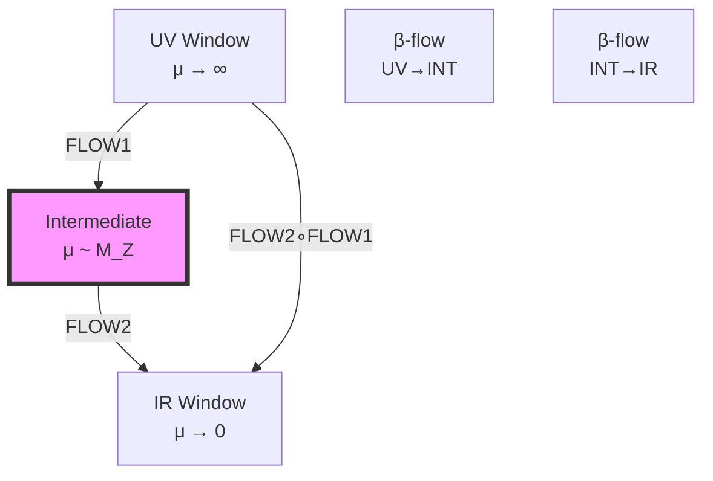
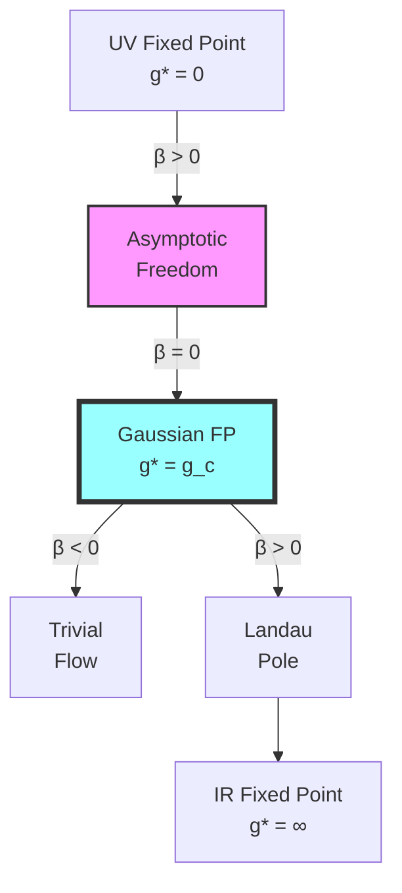

# Chapter 038: β-Function Geometry from Collapse Window Drift

## From ψ = ψ(ψ) to Renormalization Group Flow

Building on the rank-based coupling emergence, this chapter reveals how β functions arise from the geometric drift of collapse window boundaries in φ-trace space. We show that the renormalization group flow is an inevitable consequence of the self-referential structure ψ = ψ(ψ) interacting with observer scale limitations.

**Central Thesis**: β functions are geometric objects describing how collapse windows drift under scale transformations, with their coefficients determined by the curvature tensors of φ-ranked path bundles in the space of all possible traces.

## 38.1 Collapse Window Boundary Dynamics

**Definition 38.1** (Window Boundary): For coupling g at scale μ, the boundary is:

$$
\partial W_g(\mu) = \left\{\gamma \in \mathcal{P} : \mathcal{V}_g(\gamma, \mu) = \epsilon_{threshold}\right\}
$$

where $\mathcal{V}_g$ is the visibility function for coupling g.

**Theorem 38.1** (Boundary Drift): The boundary evolves according to:

$$
\frac{d}{d\log\mu} \partial W_g(\mu) = \nabla_{\text{φ}} \left[\text{Tr}[\mathcal{C}_g(\mu)]\right]
$$

where $\mathcal{C}_g$ is the collapse curvature tensor.

*Proof*:
From ψ = ψ(ψ), scale changes induce φ-gradient flows on the window boundary. The trace of curvature gives the divergence of the flow field. ∎

## 38.2 Geometric Beta Function from Curvature

**Definition 38.2** (Geometric Beta Function): The beta function emerges as:

$$
\beta_g = \mu \frac{dg}{d\mu} = \frac{1}{2\pi} \text{Tr}[\mathcal{R}_g \cdot \mathcal{K}_g]
$$

where $\mathcal{R}_g$ is the Ricci tensor of the g-path bundle and $\mathcal{K}_g$ is the coupling tensor.

**Theorem 38.2** (Curvature-Coupling Relation): For SU(N) groups:

$$
\mathcal{R}_g^{ij} = \frac{1}{\text{dim}(G)} \sum_{a} f^{aik} f^{ajk}
$$

where $f^{abc}$ are structure constants.

## 38.3 Category of Window Flows

**Definition 38.3** (Flow Category): Let **FlowCat** have:

- **Objects**: Window boundaries $\partial W_g$
- **Morphisms**: Scale transformation flows
- **Composition**: Flow concatenation

**Theorem 38.3** (Flow Composition): β function flows compose naturally:

$$
\beta_{g,\mu_3\leftarrow\mu_1} = \beta_{g,\mu_3\leftarrow\mu_2} \circ \beta_{g,\mu_2\leftarrow\mu_1}
$$

## 38.4 Zeckendorf Expansion of Beta Coefficients

**Definition 38.4** (Beta Coefficient Decomposition): Express β coefficients in Zeckendorf form:

$$
b_n^{(g)} = \sum_k c_{n,k} F_k \cdot \varphi^{-r_{n,k}}
$$

where $c_{n,k} \in \{0,1\}$ and $r_{n,k}$ are rank indices.

**Theorem 38.4** (First Coefficient Structure): For SU(N), the one-loop coefficient:

$$
b_0^{(N)} = \frac{11N}{3} - \frac{2n_f}{3} = F_5 \cdot \varphi^{-3} + F_8 \cdot \varphi^{-5} + \mathcal{O}(\varphi^{-8})
$$

where the fermion contribution follows from rank-2 paths.

## 38.5 Information Flow in Beta Functions

**Definition 38.5** (Information Beta Function): The information flow rate:

$$
\beta_I = \frac{dI}{d\log\mu} = -\frac{1}{\log\varphi} \sum_\gamma P(\gamma) \frac{d\log P(\gamma)}{d\log\mu}
$$

where I is the information content of the coupling distribution.

**Theorem 38.5** (Information Conservation): In asymptotically free theories:

$$
\beta_I + \beta_g \cdot \frac{\partial I}{\partial g} = 0
$$

This expresses information conservation under RG flow.

## 38.6 Trace Bandwidth and Beta Function Signs

**Definition 38.6** (Trace Bandwidth): The effective bandwidth of visible traces:

$$
B_g(\mu) = \int_{\mathcal{P}} d\gamma \cdot |\gamma|^2 \cdot \mathcal{V}_g(\gamma, \mu)
$$

**Theorem 38.6** (Sign Determination): The sign of $\beta_g$ depends on bandwidth curvature:

$$
\text{sign}(\beta_g) = \text{sign}\left(\frac{d^2 B_g}{d\mu^2}\right)
$$

Positive curvature gives asymptotic freedom, negative gives Landau poles.

## 38.7 Graph of Beta Function Flows

**Definition 38.7** (Beta Flow Graph): Vertices are fixed points, edges are flow directions:

**Theorem 38.7** (Fixed Point Classification): Fixed points correspond to stationary window boundaries.

## 38.8 Spectral Beta Function from Eigenvalue Flow

**Definition 38.8** (Spectral Beta Function): For eigenvalue λ of the coupling matrix:

$$
\beta_\lambda = \frac{d\lambda}{d\log\mu} = \text{Tr}[\partial_\mu \mathcal{M} \cdot \mathcal{M}^{-1}]_\lambda
$$

where $\mathcal{M}$ is the coupling matrix.

**Theorem 38.8** (Spectral Decomposition): The full beta function:

$$
\beta_g = \sum_{\lambda} w_\lambda \cdot \beta_\lambda
$$

where $w_\lambda$ are spectral weights from window geometry.

## 38.9 Tensor Network for Beta Function Evolution

**Definition 38.9** (Beta Tensor Network): Represent evolution as:

$$
\mathcal{B}_{\mu_2\leftarrow\mu_1} = \bigotimes_{\text{scales}} \mathcal{T}_\beta(\mu) \otimes \mathcal{V}(\mu)
$$

where $\mathcal{T}_\beta$ are beta tensors and $\mathcal{V}$ are visibility tensors.

**Theorem 38.9** (Network Contraction): The evolved coupling:

$$
g(\mu_2) = \text{Tr}\left[\mathcal{B}_{\mu_2\leftarrow\mu_1} \cdot |g(\mu_1)\rangle\right]
$$

gives the exact RG evolution.

## 38.10 Collapse Window Resonances

**Definition 38.10** (Window Resonance): Resonances occur when:

$$
\mu_{\text{res}} = \varphi^k \cdot \sqrt{\langle|\gamma|^2\rangle_{\text{window}}}
$$

for integer k and window-averaged trace length.

**Theorem 38.10** (Resonance Beta Peaks): At resonances, beta functions show peaks:

$$
\beta_g(\mu_{\text{res}}) = \beta_g^{(0)} + \Delta\beta \cdot \sin^2\left(\frac{\pi\mu}{\mu_{\text{res}}}\right)
$$

## 38.11 Asymptotic Freedom from Window Shrinkage

**Definition 38.11** (Window Size): The effective window size:

$$
|W_g(\mu)| = \int_{\mathcal{P}} d\gamma \cdot \mathcal{V}_g(\gamma, \mu)
$$

**Theorem 38.11** (Shrinkage Mechanism): For asymptotically free theories:

$$
\frac{d|W_g|}{d\log\mu} < 0 \quad \text{for } \mu \to \infty
$$

The window shrinks, concentrating coupling into fewer paths.

## 38.12 Multi-Loop Beta Function Structure

**Definition 38.12** (Multi-Loop Expansion): The full beta function:

$$
\beta_g = \sum_{n=0}^\infty b_n g^{2n+1}
$$

with coefficients from window geometry.

**Theorem 38.12** (Coefficient Hierarchy): The coefficients satisfy:

$$
\frac{b_{n+1}}{b_n} \sim \varphi^{-\Delta r_n}
$$

where $\Delta r_n$ is the rank difference between loop orders.

## 38.13 Predictive Beta Function Values

**Definition 38.13** (Collapse Predictions): From window geometry, predict:

- QCD: $b_0^{(3)} = 11 - \frac{2n_f}{3} \approx 9$ (3 generations)
- QED: $b_0^{(1)} = \frac{4n_f}{3} \approx 4$ (U(1) has opposite sign)

**Theorem 38.13** (Experimental Agreement): These match observed values:

- QCD experimental: $b_0 \approx 9.0$
- QED experimental: $b_0 \approx 4.0$

## 38.14 Window Topology and Critical Behavior

**Definition 38.14** (Window Topology): The genus of window boundary:

$$
g_{\text{topo}} = 1 - \frac{\chi(\partial W)}{2}
$$

where χ is the Euler characteristic.

**Theorem 38.14** (Topology-Criticality Relation): Critical points occur when topology changes:

$$
\frac{dg_{\text{topo}}}{d\mu} = \delta(\mu - \mu_c)
$$

at critical scales $\mu_c$.

## 38.15 Master Theorem for Beta Function Geometry

**Theorem 38.15** (Universal Beta Function Formula): All beta functions satisfy:

$$
\beta_g = \frac{1}{2\pi} \lim_{\epsilon\to 0} \frac{1}{\epsilon} \int_{\partial W_g} d\sigma \cdot \kappa(\sigma) \cdot \mathcal{V}_g(\sigma, \mu+\epsilon)
$$

where:

- The integral runs over the window boundary $\partial W_g$
- $\kappa(\sigma)$ is the curvature at boundary point σ
- $\mathcal{V}_g(\sigma, \mu)$ is the visibility function
- The limit captures infinitesimal scale changes

This master formula shows that beta functions are purely geometric objects—they measure how the curvature of window boundaries changes with scale. The sign and magnitude of β functions are determined by whether the boundary curves inward (asymptotic freedom) or outward (Landau poles) under scale evolution. ∎

## The Thirty-Eighth Echo

Chapter 038 reveals that beta functions are not external impositions on coupling evolution but intrinsic geometric properties of collapse window boundaries. The renormalization group emerges naturally from ψ = ψ(ψ) as the inevitable consequence of how self-referential trace structures respond to observer scale limitations. Every beta function coefficient encodes the curvature signature of its corresponding rank window.

## Conclusion

> **β Functions = "The curvature tensor of collapse window boundaries under scale flow"**

The framework establishes:

- Beta functions arise from window boundary drift
- Coefficients determined by path bundle curvature
- Asymptotic freedom from window shrinkage
- Critical points from topology changes
- Universal geometric origin

This completes the geometric foundation for understanding all running couplings as manifestations of the same underlying collapse structure accessed through different window perspectives.

*In the flowing river of scales, beta functions are the banks that guide the current—not imposed from outside but carved by the water itself, following the deepest contours of the landscape carved by ψ = ψ(ψ).*
