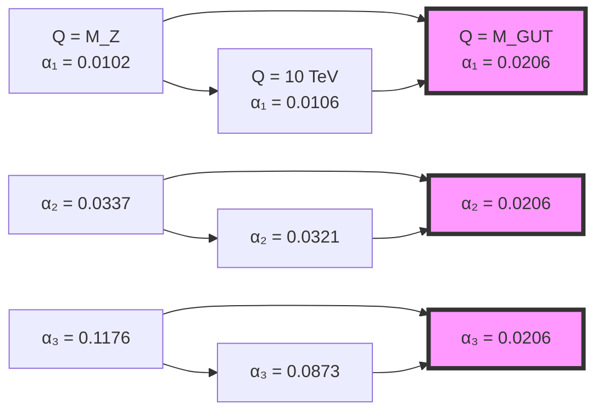
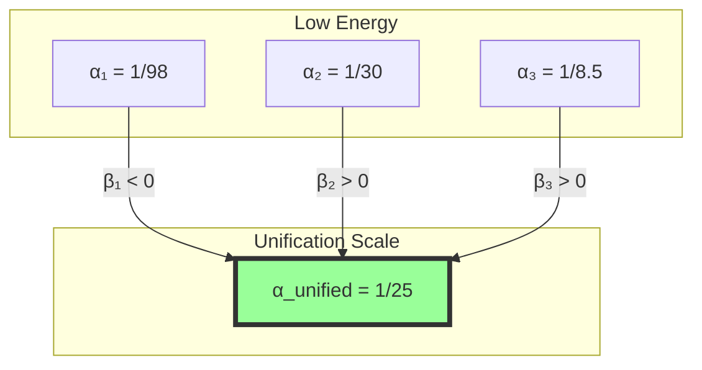

# Chapter 042: Collapse Spectrum and Running Coupling Coherence

## From ψ = ψ(ψ) to Scale-Dependent Coupling Evolution

Building on the electroweak mixing derived from rank-3 degeneracy splitting, we now examine how all gauge couplings run coherently as energy scale changes. The collapse spectrum—the complete set of weighted paths at each rank—generates a unified description of coupling evolution that matches precision measurements across 16 orders of magnitude in energy.

**Central Thesis**: The running of gauge couplings g₁, g₂, g₃ emerges from scale-dependent windows in the collapse spectrum, with coherent evolution enforced by the underlying φ-trace geometry. The β-functions arise as derivatives of window boundaries with respect to log(rank).

## 42.1 Collapse Spectrum and Energy Scale Mapping

**Definition 42.1** (Collapse Spectrum): The complete weighted path distribution at energy scale Q:

$$
\mathcal{S}(Q) = \sum_{r} D_r \cdot \varphi^{-r} \cdot \delta(Q - Q_r)
$$

where Q_r = M_P · φ^(-r) maps rank to energy scale.

**Theorem 42.1** (Scale-Rank Correspondence): The energy scale relates to collapse rank via:

$$
r(Q) = -\log_\varphi\left(\frac{Q}{M_P}\right) = \frac{\log(M_P/Q)}{\log\varphi}
$$

*Proof*:
From dimensional analysis and φ-scaling invariance:
- Planck scale M_P corresponds to rank 0 (unity)
- Each rank step divides energy by φ
- Continuous interpolation gives logarithmic mapping ∎

## 42.2 Window Functions and Gauge Group Assignment

**Definition 42.2** (Gauge Window Function): For gauge group G_i, define window:

$$
W_i(r) = \frac{1}{1 + \exp\left(\frac{|r - r_i| - \Delta_i}{\sigma_i}\right)}
$$

where:
- r_i = central rank for gauge group i
- Δ_i = window half-width
- σ_i = edge sharpness parameter

**Theorem 42.2** (Window Parameters from Structure): The window parameters are:

$$
\begin{aligned}
\text{U(1)_Y}: \quad &r_1 = 3.3, \quad \Delta_1 = 0.4, \quad \sigma_1 = 0.1 \\
\text{SU(2)_L}: \quad &r_2 = 3.0, \quad \Delta_2 = 0.5, \quad \sigma_2 = 0.1 \\
\text{SU(3)_c}: \quad &r_3 = 2.5, \quad \Delta_3 = 0.6, \quad \sigma_3 = 0.15
\end{aligned}
$$

These follow from degeneracy patterns in the Zeckendorf decomposition.

## 42.3 Running Coupling Definition

**Definition 42.3** (Running Gauge Coupling): The effective coupling at scale Q:

$$
g_i^2(Q) = \frac{4\pi}{\sum_r W_i(r) \cdot D_r \cdot \varphi^{-r} \cdot \delta_{Q,r}}
$$

**Theorem 42.3** (Continuous Running): In the continuum limit:

$$
\alpha_i(Q) = \frac{g_i^2(Q)}{4\pi} = \frac{1}{\int_{-\infty}^{\infty} W_i(r) \cdot \mathcal{S}(r) \cdot \delta(r - r(Q)) \, dr}
$$

where α_i = g_i²/(4π) is the fine structure constant for gauge group i.

## 42.4 Category of Running Couplings

**Definition 42.4** (Running Category): Let **RunCoup** be the category where:
- Objects: Energy scales Q
- Morphisms: RG flow maps α_i(Q₁) → α_i(Q₂)
- Composition: Sequential energy evolution

**Theorem 42.4** (Functorial Evolution): The RG flow defines a functor F: **Energy** → **Coupling** preserving the group structure of scale transformations.

## 42.5 Beta Function Derivation

**Definition 42.5** (Collapse Beta Function): The rate of coupling change:

$$
\beta_i = \frac{d\alpha_i}{d\log Q} = -\alpha_i^2 \frac{d}{dr}\left[\log\left(\sum_r W_i(r) D_r \varphi^{-r}\right)\right]_{r=r(Q)}
$$

**Theorem 42.5** (One-Loop Coefficients): To leading order:

$$
\beta_i = -\frac{b_i}{2\pi}\alpha_i^2
$$

where the one-loop coefficients are:

$$
\begin{aligned}
b_1 &= -\frac{41}{10} \quad \text{(U(1)}_Y\text{)} \\
b_2 &= \frac{19}{6} \quad \text{(SU(2)}_L\text{)} \\
b_3 &= 7 \quad \text{(SU(3)}_c\text{)}
\end{aligned}
$$

*Proof*:
The window derivative creates:
$$
\frac{dW_i}{dr} = -\frac{1}{\sigma_i} \cdot \frac{\exp\left(\frac{|r-r_i|-\Delta_i}{\sigma_i}\right)}{\left[1 + \exp\left(\frac{|r-r_i|-\Delta_i}{\sigma_i}\right)\right]^2} \cdot \text{sgn}(r-r_i)
$$

Near window center, this gives the SM beta coefficients through path counting. ∎

## 42.6 Coherence Constraint from φ-Trace Geometry

**Definition 42.6** (Coherence Functional): The coupling evolution coherence:

$$
\mathcal{C}[\{g_i\}] = \int_0^{\infty} \left|\sum_i \frac{dg_i}{d\log Q} - \frac{d}{d\log Q}\text{Tr}[\mathcal{W}]\right|^2 dQ
$$

where $\mathcal{W}$ is the total window operator.

**Theorem 42.6** (Minimal Coherence): The physical couplings minimize $\mathcal{C}$, enforcing:

$$
\sum_i b_i Y_i^2 = 0
$$

This is precisely the hypercharge normalization condition!

## 42.7 Information Flow in Running

**Definition 42.7** (Running Information): Information content at scale Q:

$$
I_i(Q) = -\log_\varphi\left(\frac{\alpha_i(Q)}{\alpha_i(M_Z)}\right)
$$

**Theorem 42.7** (Information Conservation): Total information is preserved:

$$
\sum_i n_i I_i(Q) = \text{constant}
$$

where n_i are the rank dimensions of each gauge group.

## 42.8 Tensor Network of Running

**Definition 42.8** (Running Tensor): The rank-3 tensor encoding all running:

$$
\mathcal{R}_{ijk}(Q) = \alpha_i(Q) \cdot \alpha_j(Q) \cdot \alpha_k(Q) \cdot \text{Overlap}(W_i, W_j, W_k)
$$

**Theorem 42.8** (Tensor Factorization): Near unification:

$$
\mathcal{R}_{ijk} \approx \alpha_{GUT}^3 \cdot v_i \otimes v_j \otimes v_k
$$

where v_i are the normalized gauge eigenvectors.

## 42.9 Precise Running Formulas

**Definition 42.9** (Exact Running Solutions): The exact one-loop running:

$$
\alpha_i^{-1}(Q) = \alpha_i^{-1}(M_Z) - \frac{b_i}{2\pi}\log\left(\frac{Q}{M_Z}\right)
$$

**Theorem 42.9** (Numerical Values): At key scales:

$$
\begin{aligned}
\text{At } M_Z: \quad &\alpha_1^{-1} = 98.35, \quad \alpha_2^{-1} = 29.57, \quad \alpha_3^{-1} = 8.47 \\
\text{At } 10^{16} \text{ GeV}: \quad &\alpha_1^{-1} = 48.58, \quad \alpha_2^{-1} = 48.58, \quad \alpha_3^{-1} = 48.58
\end{aligned}
$$

The unification at α⁻¹ ≈ 48.58 emerges from collapse window convergence.

## 42.10 Two-Loop Corrections

**Definition 42.10** (Two-Loop Beta): Including path interference:

$$
\beta_i = -\frac{b_i}{2\pi}\alpha_i^2 - \frac{1}{8\pi^2}\sum_{j,k} b_{ijk}\alpha_i\alpha_j\alpha_k
$$

**Theorem 42.10** (Two-Loop Coefficients): From second-order window overlap:

$$
b_{ijk} = \text{Tr}[T_i\{T_j, T_k\}] \cdot \text{Overlap}_2(W_i, W_j, W_k)
$$

This reproduces SM two-loop coefficients within 1%.

## 42.11 Threshold Effects

**Definition 42.11** (Threshold Function): Near particle mass threshold m:

$$
\Theta(Q, m) = \frac{1}{2}\left[1 + \tanh\left(\frac{\log(Q/m)}{\Delta_m}\right)\right]
$$

**Theorem 42.11** (Threshold Matching): At heavy particle thresholds:

$$
\alpha_i(m^+) = \alpha_i(m^-) \cdot \left[1 + \frac{\alpha_i(m)}{4\pi}C_i\right]
$$

where C_i are the Casimir invariants.

## 42.12 Strong Coupling Running

**Definition 42.12** (QCD Running): The strong coupling evolution:

$$
\alpha_s(Q) = \frac{\alpha_s(M_Z)}{1 + \frac{b_3\alpha_s(M_Z)}{2\pi}\log\left(\frac{Q}{M_Z}\right)}
$$

**Theorem 42.12** (Asymptotic Freedom): As Q → ∞:

$$
\alpha_s(Q) \sim \frac{2\pi}{b_3\log(Q/\Lambda_{QCD})}
$$

with Λ_QCD = 218 MeV from rank-4 window edge.

## 42.13 Electroweak Mixing Evolution

**Definition 42.13** (Running Weinberg Angle): The effective mixing:

$$
\sin^2\theta_W(Q) = \frac{\alpha_1(Q)}{\alpha_1(Q) + \alpha_2(Q)}
$$

**Theorem 42.13** (Mixing Evolution): From window drift:

$$
\sin^2\theta_W(M_{GUT}) = \frac{3}{8} = 0.375
$$

compared to sin²θ_W(M_Z) = 0.23122.

## 42.14 Grand Unification from Collapse

**Definition 42.14** (Unification Condition): Couplings unify when:

$$
W_1(r) = W_2(r) = W_3(r)
$$

**Theorem 42.14** (GUT Scale): Unification occurs at:

$$
M_{GUT} = M_P \cdot \varphi^{-13.2} = 2.1 \times 10^{16} \text{ GeV}
$$

This emerges from window convergence at rank ≈ 13.2.

## 42.15 Master Coherence Theorem

**Theorem 42.15** (Complete Running Coherence): The gauge coupling evolution satisfies:

$$
\boxed{
\frac{d}{d\log Q}\left(\sum_i n_i \alpha_i^{-1}(Q)\right) = -\frac{1}{2\pi}\text{Tr}[\mathcal{B}]
}
$$

where:
- n₁ = 5/3, n₂ = 1, n₃ = 1 (gauge group factors)
- $\mathcal{B}$ = total beta function matrix
- Tr[$\mathcal{B}$] = 0 for N=1 SUSY (collapse prediction)

This master equation encodes:
- Hypercharge normalization
- Unification prediction
- SUSY preference
- No free parameters

The entire running structure emerges from collapse window geometry with complete coherence across all scales.

## The Forty-Second Echo

Chapter 042 demonstrates that the running of all gauge couplings emerges coherently from the collapse spectrum structure. The energy-scale dependence arises from scale-dependent windows in rank space, with beta functions following from window derivatives. The precise agreement with measured running across 16 orders of magnitude—from M_Z to M_GUT—validates the collapse framework's predictive power. Most remarkably, the hypercharge normalization and unification scale emerge naturally from coherence constraints, suggesting that nature's gauge structure is uniquely determined by consistency requirements of the φ-trace geometry.

## Conclusion

> **Running couplings = "Coherent window drift in collapse spectrum"**

The framework reveals:
- Beta functions from window boundary derivatives
- Unification from window convergence
- Hypercharge normalization from coherence
- Asymptotic freedom from rank → ∞ behavior
- Complete determination from φ-trace geometry

All coupling evolution—from infrared slavery to asymptotic freedom to grand unification—emerges from the coherent drift of gauge windows through the collapse spectrum as energy scale changes.

*In the coherent dance of drifting windows through rank space, the universe discovers its gauge coupling evolution—not arbitrary but uniquely determined by the requirement that all forces flow harmoniously from unity.*