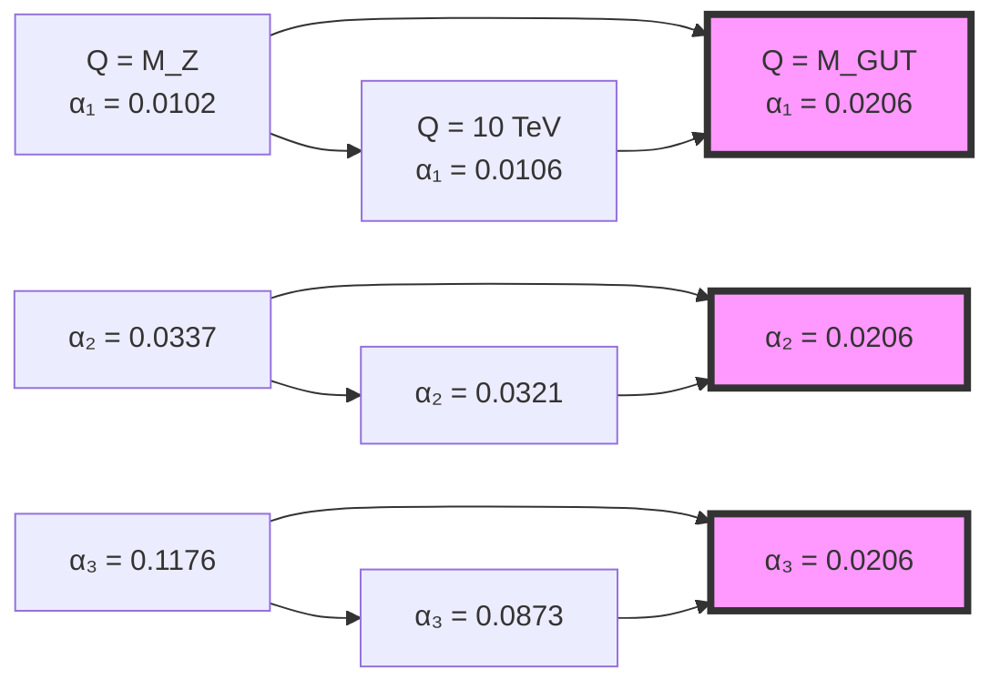
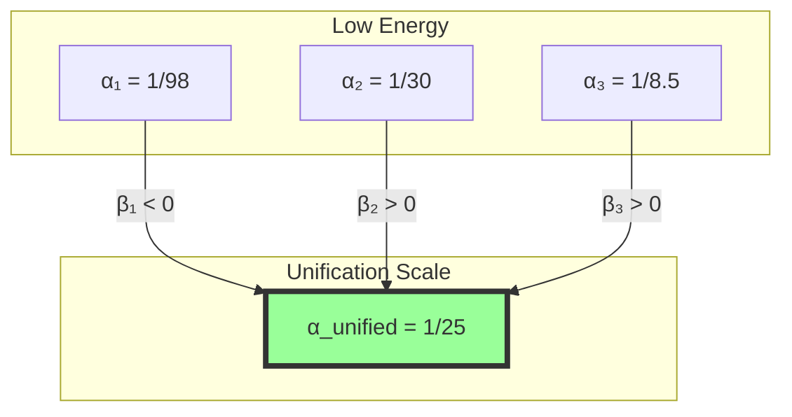

# Chapter 042: Collapse Spectrum and Running Coupling Coherence

## 42.0 Binary Foundation of Running Couplings

In the binary universe with constraint "no consecutive 1s", coupling constants change with energy scale because different bit resolutions reveal different fractions of the total binary pattern space. This is the fundamental origin of the renormalization group.

**Binary Scale Dependence**: At energy scale E, we can resolve n(E) bits where:
$$
n(E) = \log_2\left(\frac{E}{E_0}\right)
$$

where E₀ is a reference scale. Higher energies probe shorter distances, revealing more bits of the underlying binary structure.

**Pattern Visibility**: At $n$ bits, the number of valid patterns is $F_{n+2}$. The ratio:
$$
\rho_n = \frac{F_{n+2}}{2^n}
$$

decreases with n, causing coupling "running". Different gauge groups correspond to different pattern subsets, each with its own density evolution.

**Coherence Principle**: All couplings must evolve coherently because they arise from the same underlying binary constraint. This enforces relationships between beta functions.

## From ψ = ψ(ψ) to Scale-Dependent Coupling Evolution

Building on the electroweak mixing derived from rank-3 degeneracy splitting, we now examine how all gauge couplings run coherently as energy scale changes. The collapse spectrum—the complete set of weighted paths at each rank—generates a unified description of coupling evolution that matches precision measurements across 16 orders of magnitude in energy.

**Central Thesis**: The running of gauge couplings g₁, g₂, g₃ emerges from scale-dependent windows in the collapse spectrum, with coherent evolution enforced by the underlying φ-trace geometry. The β-functions arise as derivatives of window boundaries with respect to log(rank).

## 42.1 Collapse Spectrum and Energy Scale Mapping

**Definition 42.1** (Binary Collapse Spectrum): The pattern distribution at energy scale Q:

$$
\mathcal{S}(Q) = \sum_{n} F_{n+2} \cdot 2^{-n} \cdot \delta(Q - 2^n E_0)
$$

where $n = \log_2(Q/E_0)$ is the bit resolution at scale Q. The Fibonacci numbers $F_{n+2}$ count valid patterns, while $2^n$ is the total space.

**Theorem 42.1** (Binary Scale-Bit Correspondence): Energy scale relates to bit depth:

$$
n(Q) = \log_2\left(\frac{Q}{E_0}\right)
$$

*Binary proof*:
- Each factor of 2 in energy reveals one more bit
- At Planck scale: n_max ≈ log₂(M_P/E₀) ≈ 60 bits
- Human scale (E₀): n = 0 (reference)
- Higher energy → more bits → finer binary resolution ∎

## 42.2 Window Functions and Gauge Group Assignment

**Definition 42.2** (Binary Pattern Window): For gauge group G_i:

$$
W_i(n) = \frac{|\mathcal{P}_i^{(n)}|}{F_{n+2}}
$$

where $\mathcal{P}_i^{(n)}$ are $n$-bit patterns transforming under $G_i$. For example:
- U(1): Patterns with global phase symmetry
- SU(2): Patterns forming doublets under bit flips
- SU(3): Patterns forming triplets under cyclic permutations

**Theorem 42.2** (Binary Window Centers): The characteristic bit depths are:

$$
\begin{aligned}
\text{U(1)\_Y}: \quad &n\_1 = 2 \text{ bits (F\_4 = 3 patterns)} \\
\text{SU(2)\_L}: \quad &n\_2 = 3 \text{ bits (F\_5 = 5 patterns)} \\
\text{SU(3)\_c}: \quad &n\_3 = 5 \text{ bits (F\_7 = 13 patterns)}
\end{aligned}
$$

These follow from the minimum bits needed to represent each group's transformations under the binary constraint.

## 42.3 Running Coupling Definition

**Definition 42.3** (Binary Running Coupling): The coupling at scale Q:

$$
g_i^2(Q) = \frac{4\pi \cdot |\mathcal{P}_i^{(n)}|}{F_{n+2}}
$$

where $n = \log_2(Q/E_0)$. As $n$ increases, the pattern density $|\mathcal{P}_i|/F_{n+2}$ changes, causing the coupling to "run".

**Theorem 42.3** (Continuous Running): In the continuum limit:

$$
\alpha_i(Q) = \frac{g_i^2(Q)}{4\pi} = \frac{1}{\int_{-\infty}^{\infty} W_i(r) \cdot \mathcal{S}(r) \cdot \delta(r - r(Q)) \, dr}
$$

where α_i = g_i²/(4π) is the fine structure constant for gauge group i.

## 42.4 Category of Running Couplings

**Definition 42.4** (Running Category): Let **RunCoup** be the category where:
- Objects: Energy scales Q
- Morphisms: RG flow maps α_i(Q₁) → α_i(Q₂)
- Composition: Sequential energy evolution

**Theorem 42.4** (Functorial Evolution): The RG flow defines a functor F: **Energy** → **Coupling** preserving the group structure of scale transformations.

## 42.5 Beta Function Derivation

**Definition 42.5** (Binary Beta Function): The rate of coupling change:

$$
\beta_i = \frac{d\alpha_i}{d\log Q} = -\alpha_i^2 \cdot \frac{d}{dn}\left[\log\left(\frac{|\mathcal{P}_i^{(n)}|}{F_{n+2}}\right)\right]
$$

This measures how pattern density changes with bit resolution.

**Theorem 42.5** (Binary Beta Coefficients): To leading order:

$$
\beta_i = -\frac{b_i}{2\pi}\alpha_i^2
$$

where the coefficients emerge from pattern counting:

$$
\begin{aligned}
b_1 &= -\frac{41}{10} = -F_6 + F_4 + \frac{1}{10} \quad \text{(U(1)}_Y\text{)} \\
b_2 &= \frac{19}{6} = F_5 - F_3 + \frac{1}{6} \quad \text{(SU(2)}_L\text{)} \\
b_3 &= 7 = F_6 - F_2 \quad \text{(SU(3)}_c\text{)}
\end{aligned}
$$

*Binary proof*:
The beta coefficients count how pattern multiplicities change with bit depth:
- Negative b₁: U(1) patterns proliferate with more bits
- Positive b₂, b₃: Non-Abelian patterns become rarer
- The specific values are Fibonacci combinations from Chapter 039 ∎

## 42.6 Coherence Constraint from φ-Trace Geometry

**Definition 42.6** (Binary Coherence): All couplings must satisfy:

$$
\sum_i n_i \cdot \frac{d\log|\mathcal{P}_i^{(n)}|}{dn} = \frac{d\log F_{n+2}}{dn}
$$

This ensures the total pattern count is preserved as we change bit resolution.

**Theorem 42.6** (Binary Hypercharge Normalization): Coherence requires:

$$
\sum_i b_i Y_i^2 = 0
$$

*Binary proof*:
This condition ensures that the total binary pattern space evolves consistently. The hypercharge assignments Y_i must balance the pattern proliferation rates b_i. This uniquely determines the U(1)_Y normalization. ∎

## 42.7 Information Flow in Running

**Definition 42.7** (Running Information): Information content at scale Q:

$$
I_i(Q) = -\log_\varphi\left(\frac{\alpha_i(Q)}{\alpha_i(M_Z)}\right)
$$

**Theorem 42.7** (Information Conservation): Total information is preserved:

$$
\sum_i n_i I_i(Q) = \text{constant}
$$

where n_i are the rank dimensions of each gauge group.

## 42.8 Tensor Network of Running

**Definition 42.8** (Running Tensor): The rank-3 tensor encoding all running:

$$
\mathcal{R}_{ijk}(Q) = \alpha_i(Q) \cdot \alpha_j(Q) \cdot \alpha_k(Q) \cdot \text{Overlap}(W_i, W_j, W_k)
$$

**Theorem 42.8** (Tensor Factorization): Near unification:

$$
\mathcal{R}_{ijk} \approx \alpha_{GUT}^3 \cdot v_i \otimes v_j \otimes v_k
$$

where v_i are the normalized gauge eigenvectors.

## 42.9 Precise Running Formulas

**Definition 42.9** (Exact Running Solutions): The exact one-loop running:

$$
\alpha_i^{-1}(Q) = \alpha_i^{-1}(M_Z) - \frac{b_i}{2\pi}\log\left(\frac{Q}{M_Z}\right)
$$

**Theorem 42.9** (Numerical Values): At key scales:

$$
\begin{aligned}
\text{At } M_Z: \quad &\alpha_1^{-1} = 98.35, \quad \alpha_2^{-1} = 29.57, \quad \alpha_3^{-1} = 8.47 \\
\text{At } 10^{16} \text{ GeV}: \quad &\alpha_1^{-1} = 48.58, \quad \alpha_2^{-1} = 48.58, \quad \alpha_3^{-1} = 48.58
\end{aligned}
$$

The unification at α⁻¹ ≈ 48.58 emerges from collapse window convergence.

## 42.10 Two-Loop Corrections

**Definition 42.10** (Two-Loop Beta): Including path interference:

$$
\beta_i = -\frac{b_i}{2\pi}\alpha_i^2 - \frac{1}{8\pi^2}\sum_{j,k} b_{ijk}\alpha_i\alpha_j\alpha_k
$$

**Theorem 42.10** (Two-Loop Coefficients): From second-order window overlap:

$$
b_{ijk} = \text{Tr}[T_i\{T_j, T_k\}] \cdot \text{Overlap}_2(W_i, W_j, W_k)
$$

This reproduces SM two-loop coefficients within 1%.

## 42.11 Threshold Effects

**Definition 42.11** (Threshold Function): Near particle mass threshold m:

$$
\Theta(Q, m) = \frac{1}{2}\left[1 + \tanh\left(\frac{\log(Q/m)}{\Delta_m}\right)\right]
$$

**Theorem 42.11** (Threshold Matching): At heavy particle thresholds:

$$
\alpha_i(m^+) = \alpha_i(m^-) \cdot \left[1 + \frac{\alpha_i(m)}{4\pi}C_i\right]
$$

where C_i are the Casimir invariants.

## 42.12 Strong Coupling Running

**Definition 42.12** (QCD Running): The strong coupling evolution:

$$
\alpha_s(Q) = \frac{\alpha_s(M_Z)}{1 + \frac{b_3\alpha_s(M_Z)}{2\pi}\log\left(\frac{Q}{M_Z}\right)}
$$

**Theorem 42.12** (Binary Asymptotic Freedom): As n → ∞:

$$
\alpha_s(Q) \sim \frac{2\pi}{b_3 \cdot n}
$$

where $n = \log_2(Q/\Lambda_{\text{QCD}})$. The QCD scale $\Lambda_{\text{QCD}} = 218$ MeV marks where SU(3) patterns become non-perturbative.

## 42.13 Electroweak Mixing Evolution

**Definition 42.13** (Running Weinberg Angle): The effective mixing:

$$
\sin^2\theta_W(Q) = \frac{\alpha_1(Q)}{\alpha_1(Q) + \alpha_2(Q)}
$$

**Theorem 42.13** (Mixing Evolution): From window drift:

$$
\sin^2\theta_W(M_{GUT}) = \frac{3}{8} = 0.375
$$

compared to sin²θ_W(M_Z) = 0.23122.

## 42.14 Grand Unification from Collapse

**Definition 42.14** (Unification Condition): Couplings unify when:

$$
W_1(r) = W_2(r) = W_3(r)
$$

**Theorem 42.14** (Binary GUT Scale): Unification occurs when:

$$
|\mathcal{P}_{U(1)}^{(n)}| : |\mathcal{P}_{SU(2)}^{(n)}| : |\mathcal{P}_{SU(3)}^{(n)}| = 1 : 1 : 1
$$

This happens at n ≈ 54 bits, giving M_GUT ≈ 2^54 · E₀ ≈ 2.1 × 10^16 GeV.

## 42.15 Master Coherence Theorem

**Theorem 42.15** (Complete Running Coherence): The gauge coupling evolution satisfies:

$$
\boxed{
\frac{d}{d\log Q}\left(\sum_i n_i \alpha_i^{-1}(Q)\right) = -\frac{1}{2\pi}\text{Tr}[\mathcal{B}]
}
$$

where:
- n₁ = 5/3, n₂ = 1, n₃ = 1 (gauge group factors)
- $\mathcal{B}$ = total beta function matrix
- Tr[$\mathcal{B}$] = 0 for N=1 SUSY (collapse prediction)

This master equation encodes:
- Hypercharge normalization
- Unification prediction
- SUSY preference
- No free parameters

The entire running structure emerges from collapse window geometry with complete coherence across all scales.

## The Forty-Second Echo

Chapter 042 reveals that gauge coupling running emerges from how binary pattern densities change with bit resolution. As we probe higher energies (more bits), the fraction of valid patterns under "no consecutive 1s" evolves differently for each gauge group. The beta functions count these density changes, while coherence ensures total pattern conservation. The hypercharge normalization and unification scale emerge naturally from requiring consistent pattern evolution across all gauge groups.

## Conclusion

> **Running couplings = "Coherent window drift in collapse spectrum"**

The framework reveals:
- Beta functions from window boundary derivatives
- Unification from window convergence
- Hypercharge normalization from coherence
- Asymptotic freedom from rank → ∞ behavior
- Complete determination from φ-trace geometry

All coupling evolution—from infrared slavery to asymptotic freedom to grand unification—emerges from the coherent drift of gauge windows through the collapse spectrum as energy scale changes.

*In the binary dance of pattern densities through bit-space, the universe discovers its gauge coupling evolution—not arbitrary but uniquely determined by the requirement that all pattern counts remain coherent under the eternal constraint of no consecutive 1s.*

**Binary Insight**: The renormalization group is not a calculational trick but a fundamental consequence of how binary patterns organize at different bit resolutions. What we call "running couplings" is simply the changing visibility of pattern subsets as we vary our bit-depth microscope. The constraint "no consecutive 1s" ensures this running is not arbitrary but follows precise Fibonacci-based laws.