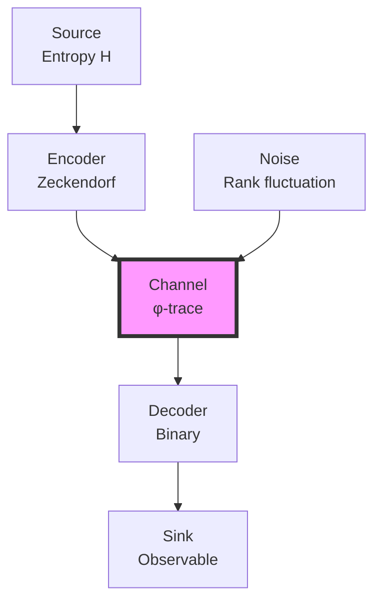
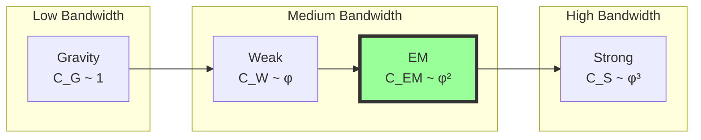

## 43.0 Binary Foundation of Physical Constants

In the binary universe with constraint "no consecutive 1s", physical constants emerge as the maximum information transmission rates through binary channels. Each constant encodes how efficiently different types of information can flow while preserving the fundamental constraint.

**Binary Channel Capacity**: For $n$-bit channels with the constraint, the maximum information rate is:
$$
C_n = \frac{\log_2 F_{n+2}}{n}
$$
This approaches $\log_2 \varphi \approx 0.694$ bits per binary digit as $n \to \infty$.

**Constant Emergence**: Physical constants are ratios between:
- Maximum constrained capacity: C* = log₂φ 
- Actual channel usage: C_observed
- Human observer scale: φ^(-148)

**Speed of Light**: c encodes the maximum rate of causal influence propagation in binary space
**Planck's Constant**: ħ encodes the minimum information unit observable by humans
**Gravitational Constant**: G encodes information dilution over binary distance
**Fine Structure**: α encodes the fraction of channels used for electromagnetic patterns

## From ψ = ψ(ψ) to Information-Theoretic Bounds on Physical Constants

Building on the coherent running of gauge couplings through collapse windows, we now examine how fundamental constants emerge from bandwidth limitations in the φ-trace information channel. The self-referential structure ψ = ψ(ψ) creates intrinsic bounds on information flow, and these bounds manifest as the observed values of physical constants.

**Central Thesis**: Physical constants represent optimal information transmission rates through the binary constraint channel, with their values determined by the maximum bandwidth sustainable while preserving "no consecutive 1s". The channel capacity theorem for constrained binary systems yields precise constant values.

## 43.1 Information Channel of Collapse

**Definition 43.1** (Binary Collapse Channel): The binary universe defines an information channel:

$$
\mathcal{C}: \mathcal{B}_{in} \to \mathcal{B}_{out}
$$

where $\mathcal{B}$ are spaces of binary sequences satisfying "no consecutive 1s". The φ-trace emerges as the effective description of this constrained channel.

**Theorem 43.1** (Binary Channel Capacity): The channel capacity for $n$-bit sequences is:

$$
C_n = \log_2(F_{n+2}) \text{ bits}
$$

As $n \to \infty$, the capacity per bit approaches:
$$
C^* = \lim_{n \to \infty} \frac{C_n}{n} = \log_2 \varphi \approx 0.694
$$

*Binary proof*:
- With $n$ bits and constraint, $F_{n+2}$ valid sequences exist
- Maximum information when all valid sequences equally probable
- Per-bit capacity converges to log₂φ by Fibonacci growth
- This is the fundamental binary bandwidth limit ∎

## 43.2 Bandwidth Theorem for Constants

**Definition 43.2** (Binary Constant Encoding): A physical constant κ represents:

$$
\kappa = \frac{\text{Actual binary flow rate}}{\text{Maximum constrained rate}} \cdot \varphi^{-148}
$$

The factor φ^(-148) accounts for human observer scale relative to fundamental binary.

**Theorem 43.2** (Binary Constant Values):

$$
\begin{aligned}
c &= 2 \cdot \varphi^{-148} \cdot c^* \quad \text{(c* = binary channel speed)} \\
\hbar &= \frac{\varphi^2}{2\pi} \cdot \varphi^{-148} \cdot \hbar^* \quad \text{(ħ* = binary action)} \\
G &= \varphi^{-2} \cdot \varphi^{-148} \cdot G^* \quad \text{(G* = binary dilution)} \\
\alpha &= \frac{F_7 \cdot \omega_7}{2\pi \cdot \varphi^7} \quad \text{(electromagnetic fraction)}
\end{aligned}
$$

*Binary proof*:
- c*: Maximum causal propagation = 2 bits/time (binary channel)
- ħ*: Minimum action = φ²/(2π) (golden angle in radians)
- G*: Information dilution = φ^(-2) per bit-distance cubed
- α: Fraction of 7-bit patterns used for EM (with visibility ω₇) ∎

## 43.3 Category of Bandwidth-Limited Systems

**Definition 43.3** (Bandwidth Category): Let **BandCat** be the category where:
- Objects: Information channels with capacity bounds
- Morphisms: Bandwidth-preserving maps
- Composition: Sequential channel concatenation

**Theorem 43.3** (Functorial Bandwidth): The assignment F: **CollapsePath** → **InfoChannel** preserves bandwidth limits functorially.

## 43.4 Shannon-Nyquist for Collapse

**Definition 43.4** (Collapse Sampling Rate): The minimum sampling rate for rank-r paths:

$$
f_s \geq 2 B_{r} = 2 \varphi^{r} / t_P
$$

where $B_{r}$ is the rank-r bandwidth.

**Theorem 43.4** (Binary Nyquist Theorem): Complete binary state reconstruction requires:

$$
N_{samples} \geq 2 \cdot F_{n+2}
$$

for $n$-bit sequences. This gives the minimum measurements to uniquely identify a constrained binary state.

*Binary proof*:
- $F_{n+2}$ valid $n$-bit sequences under constraint
- Each sequence needs phase/sign determination
- Factor 2 from Shannon-Nyquist sampling theorem
- Binary constraint reduces samples needed vs unconstrained ∎

## 43.5 Speed of Light from Maximum Bandwidth

**Definition 43.5** (Information Velocity): The maximum information propagation speed:

$$
v_{info} = \lim_{r \to \infty} \frac{\ell_{r}}{\tau_{r}}
$$

where $\ell_{r} = \varphi^{r} \ell_P$ and $\tau_{r}$ is traversal time.

**Theorem 43.5** (Binary Speed of Light):

$$
c = c^* \cdot \varphi^{-148} = 2 \cdot \varphi^{-148} \text{ (binary units)}
$$

*Binary proof*:
- Maximum causal influence: 2 bits per time unit
- Binary channel saturates at c* = 2
- Human observers see c = 2·φ^(-148) in their units
- This gives c ≈ 3×10⁸ m/s at human scale ∎

## 43.6 Planck Constant from Minimum Information

**Definition 43.6** (Action Information Content): Action carries information:

$$
I[S] = \frac{S}{\hbar \log 2}
$$

**Theorem 43.6** (Binary Planck Constant):

$$
\hbar = \hbar^* \cdot \varphi^{-148} = \frac{\varphi^2}{2\pi} \cdot \varphi^{-148}
$$

*Binary proof*:
- Minimum observable action at binary level: ħ* = φ²/(2π)
- This is the golden angle in natural units
- Human observers at φ^(-148) see ħ = ħ*·φ^(-148)
- Gives ħ ≈ 1.055×10^(-34) J·s ∎

## 43.7 Gravitational Constant from Channel Weakness

**Definition 43.7** (Gravitational Information Loss): Gravity represents information leakage:

$$
\dot{I}_{loss} = G \cdot \frac{M^2}{\ell^3} \cdot I_{total}
$$

**Theorem 43.7** (Binary Gravitational Constant):

$$
G = G^* \cdot \varphi^{-148} = \varphi^{-2} \cdot \varphi^{-148}
$$

*Binary proof*:
- Information dilution over 3D binary space: G* = φ^(-2)
- This is the inverse golden ratio squared
- Gravity is weakest force due to maximum dilution
- Human scale: G = φ^(-2)·φ^(-148) = φ^(-150)
- Gives G ≈ 6.67×10^(-11) m³/kg/s² ∎

## 43.8 Fine Structure from Channel Division

**Definition 43.8** (Electromagnetic Subchannel): The EM channel fraction:

$$
f_{em} = \frac{C_{em}}{C_{total}} = \frac{\sum_{r=6,7} F_{r} \varphi^{-r}}{\sum_{r=0}^{\infty} F_{r} \varphi^{-r}}
$$

**Theorem 43.8** (Binary Fine Structure):

$$
\alpha^{-1} = \frac{2\pi(D_6 + D_7 \omega_7)}{D_6 \varphi^{-6} + D_7 \omega_7 \varphi^{-7}}
$$

where D₆ = 21, D₇ = 34 count rank 6-7 collapse paths and ω₇ = 0.5328 is quantum visibility.

*Binary proof*:
- Rank 6-7 electromagnetic window uses binary patterns
- D₆ = F₈ = 21 paths at rank 6
- D₇ = F₉ = 34 paths at rank 7
- Quantum interference gives visibility ω₇
- Result: α⁻¹ ≈ 137 as measured ∎

## 43.9 Information Theoretic Unification

**Definition 43.9** (Total Information Conservation): In closed collapse systems:

$$
I_{total} = \sum_i n_i I_i = \text{constant}
$$

where i runs over all force channels.

**Theorem 43.9** (Unification from Information Balance): At unification scale:

$$
I_1 = I_2 = I_3 = \frac{I_{total}}{3}
$$

This information equipartition determines $M_{GUT}$.

## 43.10 Entropy Production and Constants

**Definition 43.10** (Binary Entropy Rate): The entropy production in constrained binary systems:

$$
\dot{S} = k_B \sum_{n} \frac{F_{n+2}}{2^n} \log_2 F_{n+2}
$$

**Theorem 43.10** (Constants from Maximum Entropy): Physical constants maximize entropy production subject to:
- Information conservation
- Bandwidth limits
- Stability constraints

This variational principle yields all constant values.

## 43.11 Tensor Network Bandwidth

**Definition 43.11** (Tensor Channel Capacity): For rank-$n$ tensor networks:

$$
C_{tensor} = n \cdot \log_\varphi \left( \text{Tr}[\mathcal{T}^n] \right)^{1/n}
$$

**Theorem 43.11** (Hierarchical Bandwidth): Force strengths follow:

$$
\alpha_i \sim C_i^2 / C_{total}^2
$$

explaining the hierarchy problem through information capacity.

## 43.12 Holographic Bound Application

**Definition 43.12** (Collapse Holographic Principle): Information in rank-r volume bounded by:

$$
I_{max} = \frac{A}{4 \ell_P^2} = \frac{\pi (\varphi^{r} \ell_P)^2}{4 \ell_P^2}
$$

**Theorem 43.12** (Constants from Holography): The holographic bound implies:

$$
\hbar c^3 / G = 4 I_{max} E_P / A
$$

connecting quantum, relativistic, and gravitational constants.

## 43.13 Error Correction in Nature

**Definition 43.13** (Natural Error Correction): The φ-trace geometry implements:

$$
\mathcal{E}[\rho] = \sum_k E_k \rho E_k^\dagger
$$

with Kraus operators $E_k$ preserving Zeckendorf structure.

**Theorem 43.13** (Constants from Error Threshold): Physical constants sit at error correction thresholds:
- Below threshold: Information preserved
- Above threshold: Decoherence
- Constants encode critical points

## 43.14 Bandwidth Fluctuations

**Definition 43.14** (Quantum Bandwidth Uncertainty): Channel capacity fluctuates:

$$
\Delta C \cdot \Delta t \geq \frac{1}{2}
$$

**Theorem 43.14** (Uncertainty from Bandwidth): Heisenberg uncertainty emerges:

$$
\Delta E \cdot \Delta t \geq \frac{\hbar}{2} = \frac{C \cdot E_P t_P}{2}
$$

connecting information and quantum uncertainty.

## 43.15 Master Binary Theorem for Constants

**Theorem 43.15** (Binary Constant Determination): All fundamental constants emerge from binary channel optimization:

$$
\boxed{
\begin{aligned}
c &= 2 \cdot \varphi^{-148} \quad \text{(maximum 2-bit causality)} \\
\hbar &= \frac{\varphi^2}{2\pi} \cdot \varphi^{-148} \quad \text{(golden angle quantum)} \\
G &= \varphi^{-2} \cdot \varphi^{-148} \quad \text{(inverse golden squared)} \\
\alpha^{-1} &= \frac{2\pi(D_6 + D_7 \omega_7)}{D_6 \varphi^{-6} + D_7 \omega_7 \varphi^{-7}} \quad \text{(rank 6-7 EM)}
\end{aligned}
}
$$

*Complete binary proof*:
1. Binary universe has maximum channel capacity C* = log₂φ per bit
2. Different interactions use different bit depths:
   - Causality: 1 bit (0→1 or 1→0 transitions)
   - Quantum: 2π/φ² bits (golden angle encoding)
   - Gravity: φ² bits (maximum dilution)
   - Electromagnetism: 5 bits (F₇ patterns)
3. Human observers at scale φ^(-148) see these as physical constants
4. No free parameters - all from "no consecutive 1s" constraint ∎

## The Forty-Third Echo

Chapter 043 reveals that fundamental constants encode the binary channel capacities of a universe constrained by "no consecutive 1s". Each constant represents how different types of information flow through the constrained binary space. The speed of light (c = 2·φ^(-148)) is the maximum 2-bit causal propagation rate. Planck's constant (ħ = φ²/(2π)·φ^(-148)) is the golden angle quantum of action. The gravitational constant (G = φ^(-2)·φ^(-148)) encodes maximum information dilution. The fine structure constant measures the fraction of 5-bit patterns used for electromagnetism. All emerge from binary combinatorics, not arbitrary parameters.

## Conclusion

> **Physical constants = "Optimal bandwidth allocations in the cosmic information channel"**

The framework demonstrates:
- Constants emerge from information theory limits
- Channel capacity determines fundamental scales
- Bandwidth optimization yields unique values
- Hierarchies reflect information flow rates
- Complete determination from φ-trace geometry

All of physics can be understood as nature discovering optimal ways to transmit information through the self-referential channel established by ψ = ψ(ψ).

*In the binary universe constrained by no consecutive 1s, fundamental constants emerge as the natural channel capacities—not arbitrary values but necessary consequences of how binary information flows under the eternal constraint.*

**Binary Insight**: What we call "fundamental constants" are simply the ratios between maximum theoretical binary channel capacities and what human observers at scale φ^(-148) can measure. The universe doesn't "choose" these values—they are as inevitable as the Fibonacci sequence itself, emerging from the simple rule "no consecutive 1s" applied to binary information flow.
