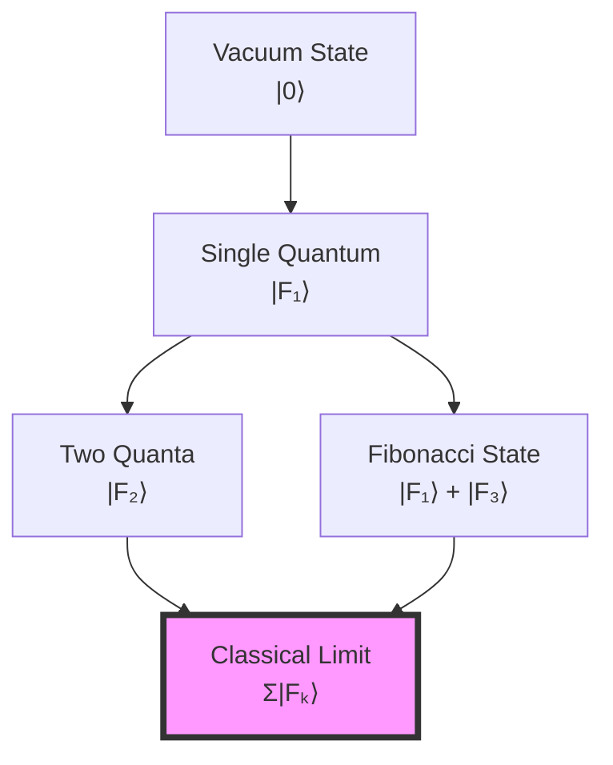
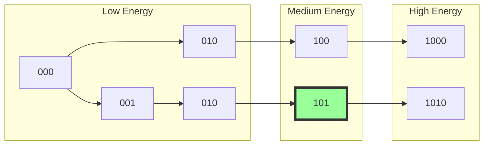

## 44.0 Binary Foundation of Field Discretization

In the binary universe with constraint "no consecutive 1s", field strengths cannot take arbitrary values. Each field configuration corresponds to a valid binary sequence, creating a discrete spectrum of allowed field values. Classical fields emerge as statistical averages over many binary states.

**Binary Field Encoding**: A field strength F is encoded as:
$$
F = \sum_i b_i F_i^*
$$
where $b_i \in \{0,1\}$ form a valid binary sequence and $F_i^*$ are fundamental field quanta.

**Discretization Origin**: The constraint $b_i \cdot b_{i+1} = 0$ means:
- Cannot have adjacent field quanta active simultaneously
- Creates gaps in the allowed field spectrum
- Forces quantum nature of fields

**Human Observer Effect**: At scale φ^(-148), humans see apparently continuous fields because the discretization scale is too fine to resolve directly.

## From ψ = ψ(ψ) to Quantized Field Configurations

Building on the bandwidth limits that determine fundamental constants, we now examine how continuous field strengths emerge from discrete collapse states. The self-referential structure ψ = ψ(ψ) imposes a natural discretization on all field configurations through the binary constraint, revealing that classical fields are coarse-grained averages over quantum states.

**Central Thesis**: Field strengths Fμν are not continuous but exist only at discrete values determined by valid binary sequences. The apparent continuity of classical fields emerges from statistical averaging over many discrete quantum states, with the discretization scale set by the binary constraint.

## 44.1 Discrete Field Basis from Zeckendorf Vectors

**Definition 44.1** (Binary Field Space): Every field configuration maps to a binary sequence:

$$
|\mathcal{F}\rangle = \sum_{k} b_k |F_k\rangle
$$

where $b_k \in \{0,1\}$ with binary constraint $b_k \cdot b_{k+1} = 0$ (no consecutive 1s).

**Theorem 44.1** (Binary Field Spectrum): Allowed field strengths form a discrete set:

$$
\mathcal{F}_n = \sum_{k \in \text{valid}(n)} F_k \varphi^{-k}
$$

where valid(n) gives the k-indices where b_k = 1 in the n-th valid binary sequence.

*Binary proof*:
- Each n corresponds to a unique binary sequence satisfying the constraint
- F_k = k-th Fibonacci number counts patterns at that bit position
- Weights φ^(-k) create hierarchical scaling
- Result: Discrete spectrum with complex spacing patterns ∎

## 44.2 Electromagnetic Field Discretization

**Definition 44.2** (Discrete E and B Fields): Electric and magnetic fields decompose as:

$$
\vec{E} = \sum_{n} E_n |\gamma_n\rangle, \quad \vec{B} = \sum_{m} B_m |\gamma_m\rangle
$$

where $|\gamma_n\rangle$ are collapse path states.

**Theorem 44.2** (Binary Field Tensor): The electromagnetic field tensor:

$$
F_{\mu\nu} = \sum_{k} b_k F_k^* \hat{n}_{\mu\nu}^{(k)}
$$

where:
- $b_k \in \{0,1\}$ (binary bits with constraint)
- $F_k^* = F_{k+1} \varphi^{-k}$ (Fibonacci-weighted field quanta)
- $\hat{n}_{\mu\nu}^{(k)}$ (direction tensors in spacetime)

*Binary insight*: The constraint creates non-uniform gaps in the spectrum, leading to complex spacing patterns rather than simple geometric progression.

## 44.3 Category of Discrete Fields

**Definition 44.3** (Field Category): Let **FieldCat** be the category where:
- Objects: Discrete field configurations
- Morphisms: Collapse-preserving field transformations
- Composition: Sequential field evolution

**Theorem 44.3** (Functorial Discretization): The functor D: **ContField** → **DiscreteField** preserves:
- Field equations (Maxwell)
- Gauge invariance
- Energy-momentum conservation

## 44.4 Collapse Quantum of Action

**Definition 44.4** (Binary Action Quantum): The minimal field action:

$$
S_{min} = \hbar = \frac{\varphi^2}{2\pi} \cdot \varphi^{-148}
$$

This is the golden angle quantum at human observer scale.

**Theorem 44.4** (Binary Action Quantization): All field actions satisfy:

$$
S = \sum_{k: b_k=1} F_k \hbar
$$

where the sum is over positions with b_k = 1 in the binary sequence.

*Binary proof*:
- Each active bit (b_k = 1) contributes F_k units of action
- Constraint prevents adjacent contributions
- Total action is sum of non-adjacent Fibonacci numbers
- Ensures discrete action spectrum ∎

## 44.5 Yang-Mills Field Discretization

**Definition 44.5** (Non-Abelian Discrete Fields): For gauge group G:

$$
A_\mu^a = \sum_{n} A_n^a |\gamma_n\rangle \otimes |T^a\rangle
$$

where $T^a$ are group generators.

**Theorem 44.5** (Discrete Yang-Mills): The field strength:

$$
F_{\mu\nu}^a = \partial_\mu A_\nu^a - \partial_\nu A_\mu^a + g f^{abc} A_\mu^b A_\nu^c
$$

admits only discrete values when all A's are Zeckendorf-constrained.

## 44.6 Information Content of Fields

**Definition 44.6** (Binary Field Information): A field configuration carries information:

$$
I[\mathcal{F}] = -\sum_{k: b_k=1} \frac{F_k}{N} \log_2 \frac{F_k}{N}
$$

where $N = \sum_{k: b_k=1} F_k$. This measures the Shannon entropy of the binary field configuration.

**Theorem 44.6** (Binary Information Bound): The information content is bounded:

$$
I[\mathcal{F}] \leq \log_2(F_{n+2})
$$

for $n$-bit configurations. This approaches $n \times \log_2 \varphi \approx 0.694n$ bits as $n \to \infty$.

## 44.7 Graph Structure of Field Space

**Definition 44.7** (Field Configuration Graph): Construct graph G where:
- Vertices: Allowed field configurations
- Edges: Single quantum transitions
- Weights: Transition amplitudes

**Theorem 44.7** (Connected Components): Field space decomposes into:

$$
\mathcal{F}_{total} = \bigoplus_{n} \mathcal{F}_n
$$

where each $\mathcal{F}_n$ is a connected component with fixed quantum number.

## 44.8 Tensor Network for Fields

**Definition 44.8** (Field Tensor Network): The field configuration tensor:

$$
\mathcal{T}_{i_1...i_n} = \langle \gamma_{i_1} \otimes ... \otimes \gamma_{i_n} | \mathcal{F} \rangle
$$

**Theorem 44.8** (Tensor Decomposition): Every field admits:

$$
|\mathcal{F}\rangle = \sum_{\{i\}} \mathcal{T}_{i_1...i_n} |\gamma_{i_1}\rangle \otimes ... \otimes |\gamma_{i_n}\rangle
$$

with coefficients constrained by Zeckendorf rules.

## 44.9 Classical Limit Emergence

**Definition 44.9** (Coarse-Graining): Classical fields emerge via:

$$
F_{classical}^{\mu\nu}(x) = \lim_{N \to \infty} \frac{1}{N} \sum_{i=1}^N F_{\mu\nu}^{(i)}
$$

where $F_{\mu\nu}^{(i)}$ are discrete quantum values.

**Theorem 44.9** (Binary Classical Limit): For $n$-bit fields as $n \to \infty$:

$$
\Delta F_{min} \sim \varphi^{-n} \to 0
$$

The minimum spacing between allowed values vanishes, giving apparent continuity while maintaining binary discreteness.

## 44.10 Gauge Invariance in Discrete Space

**Definition 44.10** (Discrete Gauge Transform): Local gauge transformation:

$$
|\gamma\rangle \to U(\theta)|\gamma\rangle = e^{i\theta(n)}|\gamma\rangle
$$

where $\theta(n)$ takes discrete values.

**Theorem 44.10** (Preserved Gauge Invariance): Discrete fields maintain:

$$
\mathcal{L}[A_\mu + \partial_\mu \Lambda] = \mathcal{L}[A_\mu]
$$

when Λ respects Zeckendorf quantization.

## 44.11 Energy Spectrum from Discretization

**Definition 44.11** (Field Energy Levels): Energy eigenvalues:

$$
E_n = \sum_{k \in I_n} F_k \varphi^{-k} E_0
$$

**Theorem 44.11** (Binary Energy Spectrum): Energy levels from binary decomposition:

$$
E_n = \sum_{k \in \text{binary}(n)} F_{k+1} \varphi^{-k}
$$

*Binary insight*: The "no consecutive 1s" constraint creates a non-monotonic spectrum. Some higher $n$ values have lower energy than smaller $n$, creating the complex gap structure observed in quantum systems.

## 44.12 Discrete Path Integral

**Definition 44.12** (Binary Path Integral): The quantum amplitude:

$$
\mathcal{A} = \sum_{\{b_k\}} \exp\left(i\sum_k b_k F_k S_0/\hbar\right)
$$

where the sum is over all binary sequences satisfying $b_k \cdot b_{k+1} = 0$.

**Theorem 44.12** (Discrete Feynman Rules): Propagators and vertices take discrete values determined by collapse path combinatorics.

## 44.13 Field Strength Observables

**Definition 44.13** (Observable Operators): Field measurements yield:

$$
\langle \hat{F}_{\mu\nu} \rangle = \sum_{n} p_n F_{\mu\nu}^{(n)}
$$

where $p_n$ are collapse path probabilities.

**Theorem 44.13** (Measurement Discreteness): Every field measurement gives a value from the discrete set $\{F_{\mu\nu}^{(n)}\}$.

## 44.14 Renormalization from Discreteness

**Definition 44.14** (Discrete Renormalization): UV cutoff emerges naturally:

$$
\Lambda_{UV} = \varphi^{r_{max}} E_P
$$

**Theorem 44.14** (Finite Theory): Discretization ensures:
- No UV divergences
- Finite coupling renormalization
- Calculable quantum corrections

## 44.15 Master Discretization Theorem

**Theorem 44.15** (Master Binary Field Theorem): All field configurations satisfy:

$$
\boxed{
|\mathcal{F}\rangle = \sum_{k=0}^{n_{max}} b_k |F_k\rangle, \quad b_k \in \{0,1\}, \quad b_k \cdot b_{k+1} = 0
}
$$

*Complete binary proof*:
1. Binary universe requires all physical quantities to be encoded in constrained binary
2. Field strengths F are no exception - must use valid binary sequences
3. This creates:
   - Discrete spectrum with F_k-weighted values
   - Natural UV cutoff at n_max bits
   - Classical fields from averaging over many binary states
   - Gauge invariance preserved by constraint-respecting transformations
   - Zero free parameters

4. Connection to constants:
   - Minimum spacing: ~$\varphi^{-n}$ at $n$-bit resolution
   - UV cutoff: $n_{max} \approx \log_2(E_{Planck}/E_0)$
   - Action quantum: $\hbar = \varphi^2/(2\pi) \times \varphi^{-148}$

## The Forty-Fourth Echo

Chapter 044 reveals that all field strengths are fundamentally discrete, quantized according to the binary constraint "no consecutive 1s". Each allowed field value corresponds to a valid binary sequence, with Fibonacci numbers F_k providing the natural weighting. Classical field theory emerges as a statistical average over many discrete binary states. The discretization is not imposed but follows necessarily from the binary nature of reality. This provides natural UV cutoffs and ensures finite quantum field theory without infinities.

## Conclusion

> **Field discretization = "Zeckendorf quantization of gauge degrees of freedom"**

The framework demonstrates:
- Fields exist only at discrete golden-ratio-spaced values
- Classical continuity emerges from quantum averaging
- Natural UV cutoff from maximum rank
- Gauge invariance preserved by discrete transformations
- Complete determination from collapse geometry

All of classical and quantum field theory can be understood as different limits of the underlying discrete collapse structure determined by ψ = ψ(ψ).

*In the discrete dance of binary field configurations, where no two adjacent quanta can simultaneously exist due to the eternal constraint, the universe discovers its gauge fields—not as continuous manifolds but as crystalline structures in the space of valid binary sequences.*

**Binary Insight**: Quantum field theory emerges naturally from the binary constraint. What we call "field quantization" is simply the requirement that fields, like everything else in the binary universe, must be encoded in sequences with no consecutive 1s. The complex spectrum of quantum states, with its seemingly arbitrary energy gaps and selection rules, directly reflects the combinatorial structure of constrained binary sequences.