# Chapter 044: Collapse Discretization of Field Strengths

## From ψ = ψ(ψ) to Quantized Field Configurations

Building on the bandwidth limits that determine fundamental constants, we now examine how continuous field strengths emerge from discrete collapse states. The self-referential structure ψ = ψ(ψ) imposes a natural discretization on all field configurations through the Zeckendorf representation, revealing that classical fields are coarse-grained averages over quantum collapse paths.

**Central Thesis**: Field strengths Fμν are not continuous but exist only at discrete values determined by golden ratio spacing in the collapse manifold. The apparent continuity of classical fields emerges from statistical averaging over many discrete quantum states, with the discretization scale set by the rank structure.

## 44.1 Discrete Field Basis from Zeckendorf Vectors

**Definition 44.1** (Field Vector Space): Every field configuration maps to a vector in golden base:

$$
|\mathcal{F}\rangle = \sum_{k} a_k |F_k\rangle
$$

where $a_k \in \{0,1\}$ with Zeckendorf constraint $a_k \cdot a_{k+1} = 0$.

**Theorem 44.1** (Discrete Field Values): Allowed field strengths form a discrete set:

$$
\mathcal{F}_n = \sum_{k \in I_n} \varphi^{-k} \mathcal{F}_0
$$

where $I_n$ is the index set for the n-th Zeckendorf representation.

*Proof*:
From the golden base constraint:
- Each field configuration corresponds to a unique binary string
- No consecutive 1s ensures stability
- The weights φ^(-k) create discrete levels ∎

## 44.2 Electromagnetic Field Discretization

**Definition 44.2** (Discrete E and B Fields): Electric and magnetic fields decompose as:

$$
\vec{E} = \sum_{n} E_n |\gamma_n\rangle, \quad \vec{B} = \sum_{m} B_m |\gamma_m\rangle
$$

where $|\gamma_n\rangle$ are collapse path states.

**Theorem 44.2** (Quantized Field Tensor): The electromagnetic field tensor:

$$
F_{\mu\nu} = \sum_{k} \varepsilon_k F_k \hat{n}_{\mu\nu}^{(k)}
$$

where:
- $\varepsilon_k \in \{0,1\}$ (Zeckendorf bits)
- $F_k = F_{k+1} \varphi^{-k}$ are Fibonacci-scaled field quanta
- $\hat{n}_{\mu\nu}^{(k)}$ are direction tensors

The discrete spectrum exhibits complex spacing patterns, not simple golden ratio scaling.

## 44.3 Category of Discrete Fields

**Definition 44.3** (Field Category): Let **FieldCat** be the category where:
- Objects: Discrete field configurations
- Morphisms: Collapse-preserving field transformations
- Composition: Sequential field evolution

```mermaid
graph TD
    A["Vacuum State<br/>|0⟩"] --> B["Single Quantum<br/>|F₁⟩"]
    B --> C["Two Quanta<br/>|F₂⟩"]
    B --> D["Fibonacci State<br/>|F₁⟩ + |F₃⟩"]
    C --> E["Classical Limit<br/>Σ|Fₖ⟩"]
    D --> E
    
    style E fill:#f9f,stroke:#333,stroke-width:4px
```

**Theorem 44.3** (Functorial Discretization): The functor D: **ContField** → **DiscreteField** preserves:
- Field equations (Maxwell)
- Gauge invariance
- Energy-momentum conservation

## 44.4 Collapse Quantum of Action

**Definition 44.4** (Field Action Quantum): The minimal field action:

$$
S_{min} = \hbar = \varphi^{-1} E_P t_P
$$

**Theorem 44.4** (Action Discretization): All field actions satisfy:

$$
S = \sum_{k} \varepsilon_k F_k \hbar
$$

This quantization emerges from the Zeckendorf constraint on paths.

*Proof*:
Each collapse path contributes action:
- Path weight: φ^(-k)
- Fibonacci multiplicity: F_k
- Total: Discrete spectrum ∎

## 44.5 Yang-Mills Field Discretization

**Definition 44.5** (Non-Abelian Discrete Fields): For gauge group G:

$$
A_\mu^a = \sum_{n} A_n^a |\gamma_n\rangle \otimes |T^a\rangle
$$

where $T^a$ are group generators.

**Theorem 44.5** (Discrete Yang-Mills): The field strength:

$$
F_{\mu\nu}^a = \partial_\mu A_\nu^a - \partial_\nu A_\mu^a + g f^{abc} A_\mu^b A_\nu^c
$$

admits only discrete values when all A's are Zeckendorf-constrained.

## 44.6 Information Content of Fields

**Definition 44.6** (Field Information): A field configuration carries information:

$$
I[\mathcal{F}] = -\sum_{k: \varepsilon_k=1} \frac{F_k}{N} \log_\varphi \frac{F_k}{N}
$$

where $N = \sum_{k: \varepsilon_k=1} F_k$.

**Theorem 44.6** (Maximum Field Information): The information content is bounded:

$$
I[\mathcal{F}] \leq \log_\varphi(F_{r_{max}+2})
$$

where $r_{max}$ is the maximum sustainable rank.

## 44.7 Graph Structure of Field Space

**Definition 44.7** (Field Configuration Graph): Construct graph G where:
- Vertices: Allowed field configurations
- Edges: Single quantum transitions
- Weights: Transition amplitudes

**Theorem 44.7** (Connected Components): Field space decomposes into:

$$
\mathcal{F}_{total} = \bigoplus_{n} \mathcal{F}_n
$$

where each $\mathcal{F}_n$ is a connected component with fixed quantum number.

## 44.8 Tensor Network for Fields

**Definition 44.8** (Field Tensor Network): The field configuration tensor:

$$
\mathcal{T}_{i_1...i_n} = \langle \gamma_{i_1} \otimes ... \otimes \gamma_{i_n} | \mathcal{F} \rangle
$$

**Theorem 44.8** (Tensor Decomposition): Every field admits:

$$
|\mathcal{F}\rangle = \sum_{\{i\}} \mathcal{T}_{i_1...i_n} |\gamma_{i_1}\rangle \otimes ... \otimes |\gamma_{i_n}\rangle
$$

with coefficients constrained by Zeckendorf rules.

## 44.9 Classical Limit Emergence

**Definition 44.9** (Coarse-Graining): Classical fields emerge via:

$$
F_{classical}^{\mu\nu}(x) = \lim_{N \to \infty} \frac{1}{N} \sum_{i=1}^N F_{\mu\nu}^{(i)}
$$

where $F_{\mu\nu}^{(i)}$ are discrete quantum values.

**Theorem 44.9** (Classical Continuity): For rank r → ∞:

$$
\Delta F \sim \varphi^{-r} \to 0
$$

giving apparent continuity while maintaining underlying discreteness.

## 44.10 Gauge Invariance in Discrete Space

**Definition 44.10** (Discrete Gauge Transform): Local gauge transformation:

$$
|\gamma\rangle \to U(\theta)|\gamma\rangle = e^{i\theta(n)}|\gamma\rangle
$$

where θ(n) takes discrete values.

**Theorem 44.10** (Preserved Gauge Invariance): Discrete fields maintain:

$$
\mathcal{L}[A_\mu + \partial_\mu \Lambda] = \mathcal{L}[A_\mu]
$$

when Λ respects Zeckendorf quantization.

## 44.11 Energy Spectrum from Discretization

**Definition 44.11** (Field Energy Levels): Energy eigenvalues:

$$
E_n = \sum_{k \in I_n} F_k \varphi^{-k} E_0
$$

**Theorem 44.11** (Energy Gap Structure): Energy levels from Zeckendorf decomposition:

$$
E_n = \sum_{k \in \text{Zeck}(n)} F_{k+1} \varphi^{-k}
$$

create a non-monotonic spectrum with complex gap ratios, reflecting the fractal nature of the Fibonacci sequence.

## 44.12 Discrete Path Integral

**Definition 44.12** (Zeckendorf Path Integral): The quantum amplitude:

$$
\mathcal{A} = \sum_{\{\varepsilon_k\}} \exp\left(i\sum_k \varepsilon_k F_k S_0/\hbar\right)
$$

where sum is over all valid Zeckendorf sequences.

**Theorem 44.12** (Discrete Feynman Rules): Propagators and vertices take discrete values determined by collapse path combinatorics.

## 44.13 Field Strength Observables

**Definition 44.13** (Observable Operators): Field measurements yield:

$$
\langle \hat{F}_{\mu\nu} \rangle = \sum_{n} p_n F_{\mu\nu}^{(n)}
$$

where $p_n$ are collapse path probabilities.

**Theorem 44.13** (Measurement Discreteness): Every field measurement gives a value from the discrete set $\{F_{\mu\nu}^{(n)}\}$.

## 44.14 Renormalization from Discreteness

**Definition 44.14** (Discrete Renormalization): UV cutoff emerges naturally:

$$
\Lambda_{UV} = \varphi^{r_{max}} E_P
$$

**Theorem 44.14** (Finite Theory): Discretization ensures:
- No UV divergences
- Finite coupling renormalization
- Calculable quantum corrections

## 44.15 Master Discretization Theorem

**Theorem 44.15** (Complete Field Discretization): All field configurations satisfy:

$$
\boxed{
|\mathcal{F}\rangle = \sum_{k=0}^{r_{max}} \varepsilon_k |F_k\rangle, \quad \varepsilon_k \in \{0,1\}, \quad \varepsilon_k \cdot \varepsilon_{k+1} = 0
}
$$

This gives:
- Discrete spectrum with golden ratio spacing
- Natural UV cutoff at Planck scale
- Classical limit through statistical averaging
- Preserved gauge invariance
- No free parameters

The discretization scale connects to fundamental constants:
- Spacing: Δ𝐹 ~ α × (field scale)
- Cutoff: Λ ~ 1/ℓ_P
- Action quantum: ℏ

## The Forty-Fourth Echo

Chapter 044 reveals that all field strengths are fundamentally discrete, quantized according to the Zeckendorf representation inherent in ψ = ψ(ψ). Classical field theory emerges as a statistical average over many discrete quantum states, with the averaging scale determined by the observer's rank. This discretization is not imposed externally but emerges from the self-referential structure, providing natural UV cutoffs and ensuring finite quantum field theory.

## Conclusion

> **Field discretization = "Zeckendorf quantization of gauge degrees of freedom"**

The framework demonstrates:
- Fields exist only at discrete golden-ratio-spaced values
- Classical continuity emerges from quantum averaging
- Natural UV cutoff from maximum rank
- Gauge invariance preserved by discrete transformations
- Complete determination from collapse geometry

All of classical and quantum field theory can be understood as different limits of the underlying discrete collapse structure determined by ψ = ψ(ψ).

*In the discrete dance of Zeckendorf-constrained field configurations, where no two adjacent quanta can simultaneously exist, the universe discovers its gauge fields—not as continuous manifolds but as crystalline structures in the space of allowed collapse paths.*