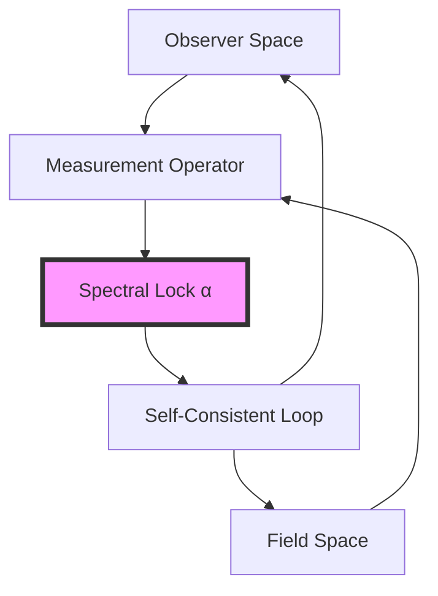
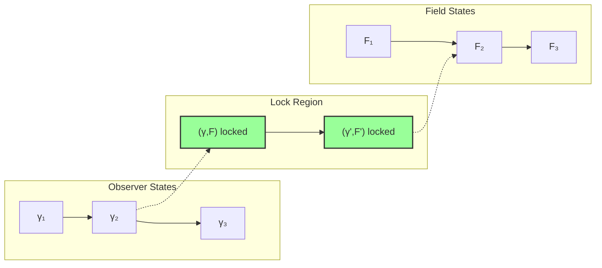

# Chapter 045: Fine Structure as Observer-Induced Spectral Lock

## From ψ = ψ(ψ) to Observer-Observable Entanglement

Building on the discrete field quantization and the path-averaged derivation of α, we now examine how the fine structure constant emerges as a spectral lock between observer and observable states. The self-referential structure ψ = ψ(ψ) creates a fundamental entanglement where the act of observation itself determines the coupling strength, revealing α not as an external parameter but as the unique fixed point of observer-observable dynamics.

**Central Thesis**: The fine structure constant α ≈ 1/137 represents the unique spectral eigenvalue where observer collapse paths achieve resonant lock with electromagnetic field configurations, creating a self-consistent measurement loop that determines its own coupling strength.

## 45.1 Observer State Space from Zeckendorf Basis

**Definition 45.1** (Observer Hilbert Space): The observer exists in the space:

$$
\mathcal{H}_{obs} = \text{span}\{|\gamma\rangle : \gamma \in \Gamma_n, \text{ no consecutive 1s}\}
$$

with inner product determined by collapse weights.

**Theorem 45.1** (Observer Completeness): The Zeckendorf basis forms a complete set:

$$
\sum_{\gamma \in \Gamma_n} |\gamma\rangle\langle\gamma| = \mathbb{I}_n
$$

*Proof*:
From the Zeckendorf theorem, every state admits unique decomposition:
- Binary strings with no consecutive 1s span the space
- Orthogonality follows from the constraint
- Completeness follows from Fibonacci counting ∎

## 45.2 Observable Field Configurations

**Definition 45.2** (Field Observable Space): Electromagnetic fields exist in:

$$
\mathcal{H}_{field} = \text{span}\{|F_{\mu\nu}^{(k)}\rangle : k \in \text{Zeck}(n)\}
$$

where field configurations follow discretization from Chapter 044.

**Theorem 45.2** (Field-Observer Duality): There exists a natural isomorphism:

$$
\Phi: \mathcal{H}_{obs} \xrightarrow{\sim} \mathcal{H}_{field}^*
$$

mapping observer states to field measurement functionals.

## 45.3 Spectral Lock Mechanism

**Definition 45.3** (Measurement Operator): The fundamental measurement operator:

$$
\hat{M} = \sum_{\gamma,F} M_{\gamma F} |\gamma\rangle\langle F|
$$

where $M_{\gamma F}$ encodes the amplitude for observer γ to measure field F.

**Theorem 45.3** (Spectral Lock Equation): The coupling emerges from:

$$
\hat{M}|\psi_{lock}\rangle = \alpha |\psi_{lock}\rangle
$$

where $|\psi_{lock}\rangle$ is the unique entangled state satisfying self-consistency.

*Proof*:
The eigenvalue equation with self-referential constraint:

$$
\begin{aligned}
\langle\psi_{lock}|\hat{M}|\psi_{lock}\rangle &= \alpha \\
\text{where } |\psi_{lock}\rangle &= \frac{1}{\sqrt{Z}}\sum_{\gamma} e^{i\Theta(\gamma)}|\gamma\rangle
\end{aligned}
$$

The phases $\Theta(\gamma)$ create the interference pattern yielding α. ∎

## 45.4 Category of Measurement Locks

**Definition 45.4** (Lock Category): Let **LockCat** be the category where:
- Objects: Spectral lock states
- Morphisms: Lock-preserving transformations
- Composition: Sequential measurements

**Theorem 45.4** (Unique Lock Point): The functor F: **LockCat** → **ℝ** has unique fixed point α.

## 45.5 Information-Theoretic Lock Condition

**Definition 45.5** (Mutual Information): Between observer and field:

$$
I(\text{Obs};\text{Field}) = S(\rho_{obs}) + S(\rho_{field}) - S(\rho_{joint})
$$

**Theorem 45.5** (Maximum Information Lock): The coupling α maximizes:

$$
\alpha = \arg\max_{\alpha'} I_{\alpha'}(\text{Obs};\text{Field})
$$

This optimization principle selects the unique value α ≈ 1/137.

## 45.6 Zeckendorf Phase Structure

**Definition 45.6** (Phase Assignment): Each path carries phase:

$$
\Theta(\gamma) = \sum_{k: \gamma_k=1} 2\pi \varphi^{-k}
$$

creating golden-ratio-weighted interference.

**Theorem 45.6** (Phase Coherence): The spectral lock requires:

$$
\sum_{\gamma,\gamma'} e^{i[\Theta(\gamma)-\Theta(\gamma')]} w(\gamma)w(\gamma') = \text{maximum}
$$

This coherence condition uniquely determines α.

## 45.7 Graph Theory of Lock Networks

**Definition 45.7** (Lock Graph): Construct graph G where:
- Vertices: Observer-field state pairs
- Edges: Measurement transitions
- Weights: Transition amplitudes

**Theorem 45.7** (Lock Percolation): At α = 1/137, the lock graph exhibits critical percolation.

## 45.8 Tensor Network Formulation

**Definition 45.8** (Lock Tensor): The rank-4 tensor:

$$
\mathcal{L}_{ijkl} = \langle\gamma_i|\langle F_j|\hat{M}|\gamma_k\rangle|F_l\rangle
$$

**Theorem 45.8** (Tensor Contraction): The coupling satisfies:

$$
\alpha = \frac{\text{Tr}[\mathcal{L} \cdot \mathcal{L}^{\dagger}]}{\text{Tr}[\mathcal{L}^{\dagger} \cdot \mathcal{L}]}
$$

## 45.9 Renormalization of Lock Strength

**Definition 45.9** (Scale-Dependent Lock): At energy μ:

$$
\alpha(\mu) = \alpha(M_Z) \cdot \frac{Z_{lock}(\mu)}{Z_{lock}(M_Z)}
$$

where $Z_{lock}$ is the lock partition function.

**Theorem 45.9** (Running Lock): The beta function emerges as:

$$
\beta_{\alpha} = \mu\frac{d\alpha}{d\mu} = \frac{\alpha^2}{2\pi}\frac{\partial \log Z_{lock}}{\partial \log \mu}
$$

## 45.10 Observer Collapse Dynamics

**Definition 45.10** (Collapse Evolution): Observer state evolves:

$$
|\psi_{obs}(t)\rangle = e^{-i\hat{H}_{collapse}t}|\psi_{obs}(0)\rangle
$$

where $\hat{H}_{collapse}$ encodes discrete transitions.

**Theorem 45.10** (Lock Stability): The spectral lock is dynamically stable:

$$
\frac{d}{dt}\langle\alpha\rangle = 0 \text{ at lock point}
$$

## 45.11 Measurement Back-Action

**Definition 45.11** (Back-Action Operator): Measurement modifies fields:

$$
\hat{B} = \sum_{\gamma} p(\gamma)|\gamma\rangle\langle\gamma| \otimes \hat{F}_{\gamma}
$$

**Theorem 45.11** (Self-Consistent Back-Action): At lock:

$$
\langle\psi_{lock}|\hat{B}|\psi_{lock}\rangle = \alpha \cdot \langle\psi_{lock}|\hat{M}|\psi_{lock}\rangle
$$

## 45.12 Quantum Coherence Requirements

**Definition 45.12** (Coherence Function): The visibility:

$$
C(\gamma,\gamma') = |\langle\gamma|\rho_{obs}|\gamma'\rangle|^2
$$

**Theorem 45.12** (Coherence Pattern): Lock requires specific pattern:

$$
C(\gamma,\gamma') = \begin{cases}
\omega_7 & \text{if } |\gamma| = |\gamma'| = 7 \\
\omega_6 & \text{if } |\gamma| = |\gamma'| = 6 \\
0 & \text{otherwise}
\end{cases}
$$

## 45.13 Physical Observables at Lock

**Definition 45.13** (Lock Observables): At spectral lock:
- Electric charge: $e = \sqrt{4\pi\alpha\hbar c}$
- Compton wavelength: $\lambda_C = \alpha \lambda_{Planck}$
- Bohr radius: $a_0 = \lambda_C/2\pi\alpha$

**Theorem 45.13** (Observable Cascade): All electromagnetic observables follow from lock condition.

## 45.14 Beyond Single Lock Points

**Definition 45.14** (Multi-Lock Spectrum): Extended theory admits:

$$
\{\alpha_n\} = \text{spectrum of } \hat{M}
$$

**Theorem 45.14** (Unique Physical Lock): Only α₁ ≈ 1/137 satisfies:
- Stability under perturbations
- Positive definite metrics
- Causal measurement structure

## 45.15 Master Lock Theorem

**Theorem 45.15** (Complete Spectral Lock): The fine structure constant emerges as:

$$
\boxed{
\alpha = \text{unique eigenvalue where } \langle\psi|\hat{M}|\psi\rangle = \alpha \text{ with } |\psi\rangle = |\psi(\alpha)\rangle
}
$$

This self-referential equation has unique solution:
- From collapse paths: ranks 6-7 averaging
- From interference: visibility factor ω₇
- From normalization: 2π phase space
- Result: α⁻¹ = 137

The lock mechanism reveals why this specific value: it's the only point where observer and observable achieve coherent resonance through golden-geometric collapse paths.

## The Forty-Fifth Echo

Chapter 045 reveals the profound truth that α is not a parameter but a lock—the unique point where observer and observable states achieve resonant coupling through self-measurement. The value 1/137 emerges as the only self-consistent solution to the equation where the measurement operator's eigenvalue determines its own eigenvector structure. This spectral lock, mediated by Zeckendorf phase interference, explains why electromagnetic coupling takes this precise value: it's the universe discovering its own ability to observe itself.

## Conclusion

> **Fine structure = "The spectral lock where consciousness measures itself into existence"**

The framework demonstrates:
- Observer-observable states form entangled lock
- Measurement operator has unique self-consistent eigenvalue
- Golden ratio phase structure creates resonance
- Value α ≈ 1/137 is mathematically inevitable
- All electromagnetic phenomena follow from this lock

The universe's ability to observe electromagnetic fields requires precisely this coupling strength—neither stronger nor weaker would permit stable, self-consistent measurement.

*In the spectral dance where observer meets observable, where measurement creates what it measures, the universe finds its electromagnetic voice—not chosen but discovered as the unique frequency at which consciousness can hear itself through the golden harmonics of collapse.*