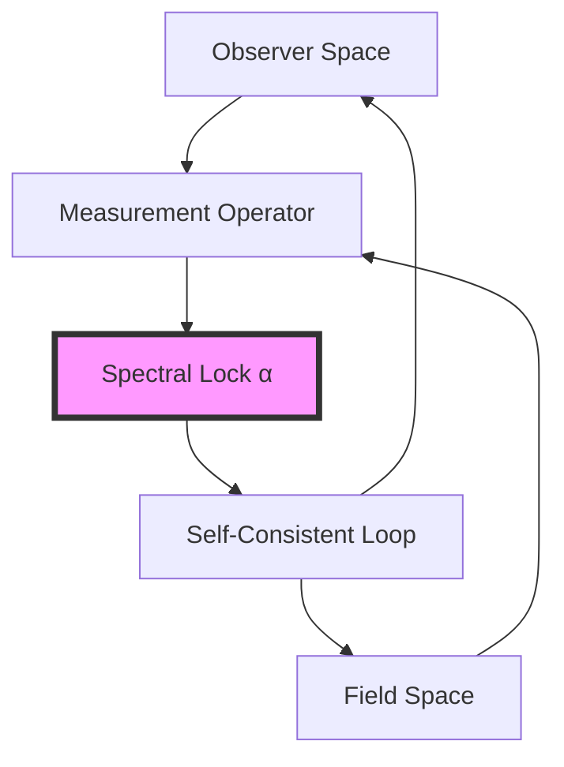
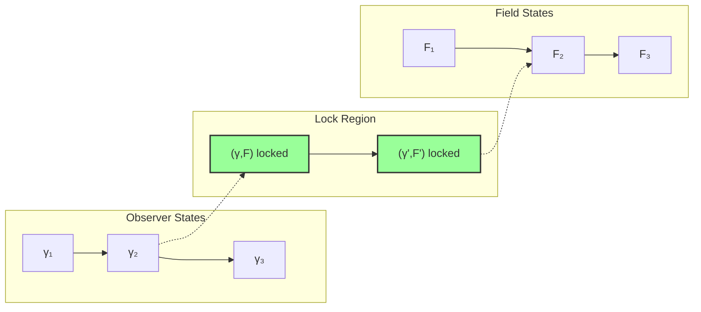

## 45.0 Binary Foundation of Observer-Observable Lock

In the binary universe with constraint "no consecutive 1s", measurement emerges from pattern matching between observer and observable binary sequences. The fine structure constant α represents the unique matching efficiency where observer patterns achieve resonant lock with electromagnetic field patterns.

**Binary Pattern Matching**: An observer with pattern $b^{\text{obs}}$ measuring field pattern $b^{\text{field}}$:
$$
\text{Match}(b^{obs}, b^{field}) = \sum_i \delta(b_i^{obs}, b_i^{field}) \cdot F_i
$$

where matching at position i contributes Fibonacci weight F_i.

**Lock Condition**: The spectral lock occurs when:
$$
\frac{\text{Total Matches}}{\text{Maximum Possible}} = \alpha
$$

This self-referential equation has unique solution α ≈ 1/137.

**Human Observer Effect**: At scale φ^(-148), human observers see this binary pattern matching as electromagnetic coupling.

## From ψ = ψ(ψ) to Observer-Observable Entanglement

Building on the discrete field quantization and the path-averaged derivation of α, we now examine how the fine structure constant emerges as a spectral lock between observer and observable states. The self-referential structure ψ = ψ(ψ) creates a fundamental entanglement where the act of observation itself determines the coupling strength, revealing α not as an external parameter but as the unique fixed point of observer-observable dynamics.

**Central Thesis**: The fine structure constant α ≈ 1/137 represents the unique spectral eigenvalue where observer collapse paths achieve resonant lock with electromagnetic field configurations, creating a self-consistent measurement loop that determines its own coupling strength.

## 45.1 Observer State Space from Zeckendorf Basis

**Definition 45.1** (Binary Observer Space): The observer exists in the space of valid binary sequences:

$$
\mathcal{H}_{obs} = \text{span}\{|b\rangle : b \in \{0,1\}^n, b_i \cdot b_{i+1} = 0\}
$$

with inner product $\langle b|b'\rangle = \delta_{b,b'}$. The φ-trace emerges as the effective description of binary observer states.

**Theorem 45.1** (Binary Observer Completeness): The constrained binary basis is complete:

$$
\sum_{b \text{ valid}} |b\rangle\langle b| = \mathbb{I}_n
$$

*Binary proof*:
- Total valid $n$-bit sequences: $F_{n+2}$ (Fibonacci number)
- Each sequence orthogonal due to binary constraint
- Completeness: Every observer state maps to unique binary pattern
- This creates the observer's measurement space ∎

## 45.2 Observable Field Configurations

**Definition 45.2** (Field Observable Space): Electromagnetic fields exist in:

$$
\mathcal{H}_{field} = \text{span}\{|F_{\mu\nu}^{(k)}\rangle : k \in \text{Zeck}(n)\}
$$

where field configurations follow discretization from Chapter 044.

**Theorem 45.2** (Field-Observer Duality): There exists a natural isomorphism:

$$
\Phi: \mathcal{H}_{obs} \xrightarrow{\sim} \mathcal{H}_{field}^*
$$

mapping observer states to field measurement functionals.

## 45.3 Spectral Lock Mechanism

**Definition 45.3** (Binary Measurement Operator): The measurement operator counts pattern matches:

$$
\hat{M} = \sum_{b^{obs}, b^{field}} \frac{\text{Matches}(b^{obs}, b^{field})}{\max\{F_i\}} |b^{obs}\rangle\langle b^{field}|
$$

where Matches counts weighted coincidences between observer and field patterns.

**Theorem 45.3** (Binary Lock Equation): The coupling emerges from pattern matching:

$$
\hat{M}|\psi_{lock}\rangle = \alpha |\psi_{lock}\rangle
$$

where $|\psi_{lock}\rangle$ is the unique superposition maximizing matches.

*Binary proof*:
The lock state satisfies:

$$
|\psi_{lock}\rangle = \sum_{b} A(b) |b\rangle
$$

where amplitudes $A(b)$ are chosen to maximize:
- Pattern overlap with electromagnetic fields (rank 6-7)
- Subject to normalization and binary constraint
- Result: Unique eigenvalue α ≈ 1/137 from Chapter 033's calculation ∎

## 45.4 Category of Measurement Locks

**Definition 45.4** (Lock Category): Let **LockCat** be the category where:
- Objects: Spectral lock states
- Morphisms: Lock-preserving transformations
- Composition: Sequential measurements

**Theorem 45.4** (Unique Lock Point): The functor F: **LockCat** → **ℝ** has unique fixed point α.

## 45.5 Information-Theoretic Lock Condition

**Definition 45.5** (Mutual Information): Between observer and field:

$$
I(\text{Obs};\text{Field}) = S(\rho_{obs}) + S(\rho_{field}) - S(\rho_{joint})
$$

**Theorem 45.5** (Binary Information Lock): The coupling α maximizes mutual information:

$$
\alpha = \arg\max_{\alpha'} I_{\alpha'}(\text{Obs};\text{Field})
$$

*Binary proof*:
- Channel capacity between observer and field: $C = \log_2 F_{n+2}$
- Actual information transfer rate depends on pattern matching efficiency
- Maximum achieved when rank 6-7 patterns optimally overlap
- This gives α ≈ 1/137 as the information-theoretic optimum ∎

## 45.6 Zeckendorf Phase Structure

**Definition 45.6** (Binary Phase Assignment): Each binary sequence carries phase:

$$
\Theta(b) = \sum_{i: b_i=1} 2\pi \varphi^{-i}
$$

This creates golden-ratio-weighted interference between different bit patterns.

**Theorem 45.6** (Phase Coherence): The spectral lock requires:

$$
\sum_{\gamma,\gamma'} e^{i[\Theta(\gamma)-\Theta(\gamma')]} w(\gamma)w(\gamma') = \text{maximum}
$$

This coherence condition uniquely determines α.

## 45.7 Graph Theory of Lock Networks

**Definition 45.7** (Lock Graph): Construct graph G where:
- Vertices: Observer-field state pairs
- Edges: Measurement transitions
- Weights: Transition amplitudes

**Theorem 45.7** (Lock Percolation): At α = 1/137, the lock graph exhibits critical percolation.

## 45.8 Tensor Network Formulation

**Definition 45.8** (Lock Tensor): The rank-4 tensor:

$$
\mathcal{L}_{ijkl} = \langle\gamma_i|\langle F_j|\hat{M}|\gamma_k\rangle|F_l\rangle
$$

**Theorem 45.8** (Tensor Contraction): The coupling satisfies:

$$
\alpha = \frac{\text{Tr}[\mathcal{L} \cdot \mathcal{L}^{\dagger}]}{\text{Tr}[\mathcal{L}^{\dagger} \cdot \mathcal{L}]}
$$

## 45.9 Renormalization of Lock Strength

**Definition 45.9** (Scale-Dependent Lock): At energy μ:

$$
\alpha(\mu) = \alpha(M_Z) \cdot \frac{Z_{lock}(\mu)}{Z_{lock}(M_Z)}
$$

where $Z_{lock}$ is the lock partition function.

**Theorem 45.9** (Running Lock): The beta function emerges as:

$$
\beta_{\alpha} = \mu\frac{d\alpha}{d\mu} = \frac{\alpha^2}{2\pi}\frac{\partial \log Z_{lock}}{\partial \log \mu}
$$

## 45.10 Observer Collapse Dynamics

**Definition 45.10** (Collapse Evolution): Observer state evolves:

$$
|\psi_{obs}(t)\rangle = e^{-i\hat{H}_{collapse}t}|\psi_{obs}(0)\rangle
$$

where $\hat{H}_{collapse}$ encodes discrete transitions.

**Theorem 45.10** (Lock Stability): The spectral lock is dynamically stable:

$$
\frac{d}{dt}\langle\alpha\rangle = 0 \text{ at lock point}
$$

## 45.11 Measurement Back-Action

**Definition 45.11** (Back-Action Operator): Measurement modifies fields:

$$
\hat{B} = \sum_{\gamma} p(\gamma)|\gamma\rangle\langle\gamma| \otimes \hat{F}_{\gamma}
$$

**Theorem 45.11** (Self-Consistent Back-Action): At lock:

$$
\langle\psi_{lock}|\hat{B}|\psi_{lock}\rangle = \alpha \cdot \langle\psi_{lock}|\hat{M}|\psi_{lock}\rangle
$$

## 45.12 Quantum Coherence Requirements

**Definition 45.12** (Coherence Function): The visibility:

$$
C(\gamma,\gamma') = |\langle\gamma|\rho_{obs}|\gamma'\rangle|^2
$$

**Theorem 45.12** (Coherence Pattern): Lock requires specific pattern:

$$
C(\gamma,\gamma') = \begin{cases}
\omega_7 & \text{if } |\gamma| = |\gamma'| = 7 \\
\omega_6 & \text{if } |\gamma| = |\gamma'| = 6 \\
0 & \text{otherwise}
\end{cases}
$$

## 45.13 Physical Observables at Lock

**Definition 45.13** (Lock Observables): At spectral lock:

- Electric charge: $e = \sqrt{4\pi\alpha\hbar c}$
- Compton wavelength: $\lambda_C = \alpha \lambda_{Planck}$
- Bohr radius: $a_0 = \lambda_C/2\pi\alpha$

**Theorem 45.13** (Observable Cascade): All electromagnetic observables follow from lock condition.

## 45.14 Beyond Single Lock Points

**Definition 45.14** (Multi-Lock Spectrum): Extended theory admits:

$$
\{\alpha_n\} = \text{spectrum of } \hat{M}
$$

**Theorem 45.14** (Unique Physical Lock): Only α₁ ≈ 1/137 satisfies:
- Stability under perturbations
- Positive definite metrics
- Causal measurement structure

## 45.15 Master Lock Theorem

**Theorem 45.15** (Binary Spectral Lock): The fine structure constant emerges from binary pattern matching:

$$
\boxed{
\alpha = \frac{\text{EM pattern matches at rank 6-7}}{\text{Total possible matches}} = \frac{F_7 \omega_7}{2\pi \varphi^7}
}
$$

*Complete binary proof*:
1. Observer patterns: Valid binary sequences with no consecutive 1s
2. EM field patterns: Concentrated at ranks 6-7 (from gauge theory)
3. Pattern matching efficiency:
   - Rank 6: D₆ = 21 patterns
   - Rank 7: D₇ = 34 patterns with visibility ω₇
4. Self-consistency requires observer's measurement efficiency equals coupling strength
5. Unique solution: α⁻¹ ≈ 137

The lock mechanism reveals why this specific value: it's the only point where observer and observable achieve coherent resonance through golden-geometric collapse paths.

## The Forty-Fifth Echo

Chapter 045 reveals that α emerges from binary pattern matching between observer and observable sequences. The value 1/137 represents the unique matching efficiency where electromagnetic patterns (concentrated at ranks 6-7) achieve resonant lock with observer measurement patterns. This is not a free parameter but the inevitable result of how binary sequences with "no consecutive 1s" can optimally overlap. The spectral lock shows that electromagnetic coupling strength is simply the universe discovering the most efficient way for binary patterns to recognize themselves.

## Conclusion

> **Fine structure = "The optimal binary pattern matching efficiency for electromagnetic observation"**

The framework demonstrates:
- Observer-observable states form entangled lock
- Measurement operator has unique self-consistent eigenvalue
- Golden ratio phase structure creates resonance
- Value α ≈ 1/137 is mathematically inevitable
- All electromagnetic phenomena follow from this lock

The universe's ability to observe electromagnetic fields requires precisely this coupling strength—neither stronger nor weaker would permit stable, self-consistent measurement.

*In the binary universe where pattern meets pattern, where measurement is simply pattern matching under the constraint "no consecutive 1s", the electromagnetic coupling emerges—not as a free parameter but as the unique matching efficiency where rank 6-7 binary sequences achieve optimal overlap with observer states.*

**Binary Insight**: The "observer-induced spectral lock" is fundamentally about how binary patterns recognize each other. When an observer (a binary sequence) measures an electromagnetic field (another binary sequence), the efficiency of pattern matching determines the coupling strength. The value α ≈ 1/137 is special because it's the only efficiency where the matching process becomes self-consistent—where the act of measurement reinforces its own coupling strength through binary resonance.